# System Diagnostics & Environment Checks

<cite>
**Referenced Files in This Document**
- [doctor.js](file://lib/core/doctor.js)
- [env.js](file://lib/core/env.js)
- [utils.js](file://lib/core/utils.js)
- [yida.js](file://bin/yida.js)
- [README.md](file://README.md)
- [package.json](file://package.json)
- [doctor.test.js](file://tests/doctor.test.js)
- [env.test.js](file://tests/env.test.js)
</cite>

## Table of Contents
1. [Introduction](#introduction)
2. [Project Structure](#project-structure)
3. [Core Components](#core-components)
4. [Architecture Overview](#architecture-overview)
5. [Detailed Component Analysis](#detailed-component-analysis)
6. [Dependency Analysis](#dependency-analysis)
7. [Performance Considerations](#performance-considerations)
8. [Troubleshooting Guide](#troubleshooting-guide)
9. [Conclusion](#conclusion)
10. [Appendices](#appendices)

## Introduction
This document explains OpenYida’s system diagnostics and environment checking capabilities. It focuses on the DiagnosticEngine architecture with its three-layer checker system (EnvironmentChecker, ApplicationChecker, FixEngine), and covers environment validation (Node.js, Python, Playwright, gh CLI, Skills, login status, network), application-level diagnostics (PRD files, page sources, schema cache, React Hooks), automated repair, and reporting. Practical examples, severity levels, fix types, and troubleshooting workflows are included to help developers quickly diagnose and resolve issues.

## Project Structure
OpenYida exposes a CLI command “doctor” that orchestrates diagnostics. The CLI entry point routes to the doctor module, which composes three layers of checkers and a fix engine. Environment detection utilities assist in determining the active development tool and login status.

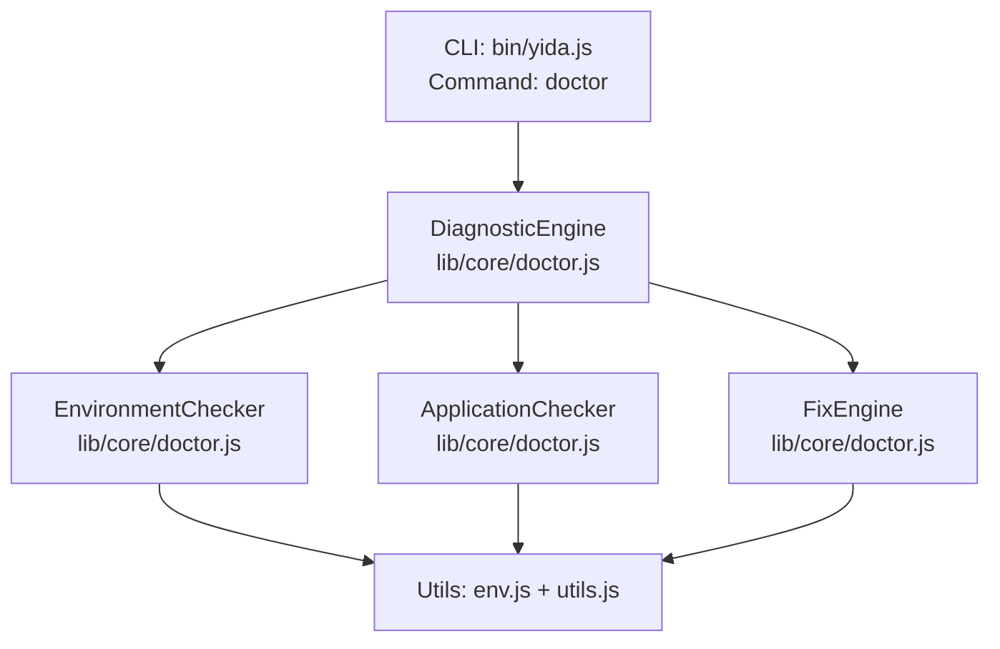

**Diagram sources**
- [yida.js:337-341](file://bin/yida.js#L337-L341)
- [doctor.js:1450-1488](file://lib/core/doctor.js#L1450-L1488)

**Section sources**
- [yida.js:337-341](file://bin/yida.js#L337-L341)
- [doctor.js:1450-1488](file://lib/core/doctor.js#L1450-L1488)

## Core Components
- DiagnosticEngine: Central scheduler that registers checkers, runs them, aggregates results, computes summaries, and formats console output.
- EnvironmentChecker: Validates environment prerequisites and runtime conditions (Node.js, Python, Playwright, gh CLI, config.json, Skills, login status, network).
- ApplicationChecker: Validates application-level assets (PRD files, page sources, schema cache, React Hooks usage).
- FixEngine: Applies automatic fixes for known issues and formats repair output.
- ReportGenerator: Generates JSON, Markdown, or HTML reports from diagnostic results.
- PreChecker: Runs environment and application checks for pre-publish and pre-create workflows.
- HealthMonitor: Periodically runs diagnostics and tracks health trends.
- ProductionErrorCollector: Collects and analyzes online error logs for a given app ID.
- TicketCreator / VOCCreator / SubmissionDecider: Integrates with GitHub Issues to create tickets or VOCs, and decides submission type automatically.

**Section sources**
- [doctor.js:50-129](file://lib/core/doctor.js#L50-L129)
- [doctor.js:137-438](file://lib/core/doctor.js#L137-L438)
- [doctor.js:446-631](file://lib/core/doctor.js#L446-L631)
- [doctor.js:639-733](file://lib/core/doctor.js#L639-L733)
- [doctor.js:741-863](file://lib/core/doctor.js#L741-L863)
- [doctor.js:871-916](file://lib/core/doctor.js#L871-L916)
- [doctor.js:924-1003](file://lib/core/doctor.js#L924-L1003)
- [doctor.js:1011-1074](file://lib/core/doctor.js#L1011-L1074)
- [doctor.js:1082-1138](file://lib/core/doctor.js#L1082-L1138)
- [doctor.js:1146-1228](file://lib/core/doctor.js#L1146-L1228)
- [doctor.js:1236-1305](file://lib/core/doctor.js#L1236-L1305)

## Architecture Overview
The diagnostic pipeline is a layered system:
- Layer 1: EnvironmentChecker validates runtime prerequisites and environment state.
- Layer 2: ApplicationChecker validates project assets and code quality.
- Layer 3: FixEngine applies automatic repairs when possible.
- Reporting and monitoring integrate at the edges for output and continuous health tracking.

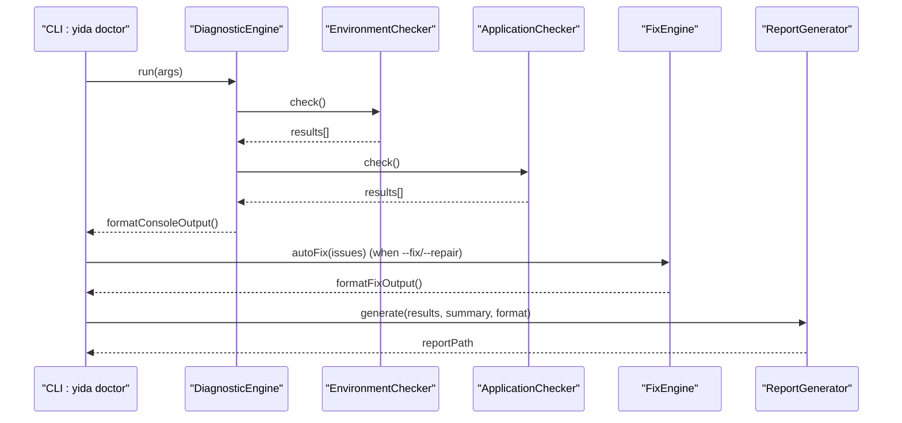

**Diagram sources**
- [yida.js:337-341](file://bin/yida.js#L337-L341)
- [doctor.js:1450-1488](file://lib/core/doctor.js#L1450-L1488)
- [doctor.js:650-733](file://lib/core/doctor.js#L650-L733)
- [doctor.js:753-863](file://lib/core/doctor.js#L753-L863)

## Detailed Component Analysis

### DiagnosticEngine
- Responsibilities:
  - Register checkers.
  - Run all registered checkers and collect results.
  - Compute summary statistics (total, passed, errorCount, warningCount, infoCount, autoFixable).
  - Format console output with icons and messages.
  - Provide filtered lists of auto-fixable issues.
- Key behaviors:
  - Aggregates results from multiple checkers.
  - Filters auto-fixable issues to ERROR severity with AUTO fixType.

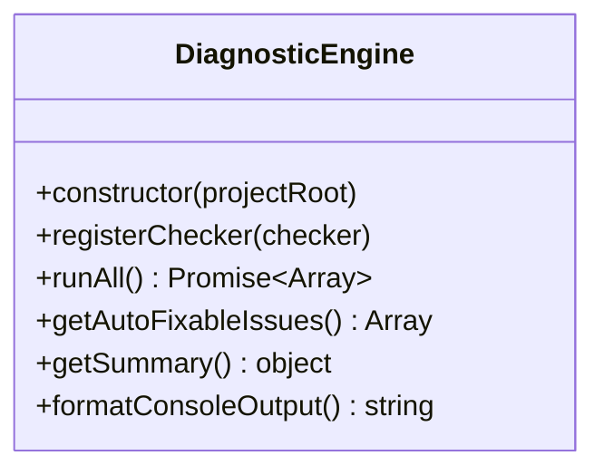

**Diagram sources**
- [doctor.js:50-129](file://lib/core/doctor.js#L50-L129)

**Section sources**
- [doctor.js:50-129](file://lib/core/doctor.js#L50-L129)

### EnvironmentChecker
- Validates:
  - Node.js version (≥ 16).
  - Python version (≥ 3.10).
  - Playwright installation and Chromium availability.
  - GitHub CLI presence and authentication.
  - Presence and validity of config.json.
  - Skills installation under .claude/skills.
  - Login status via cookies.json and CSRF token presence.
  - Network connectivity to aliwork.com.
- Outputs severity levels and fix types:
  - ERROR: requires immediate attention.
  - WARNING: potential issues that may impact functionality.
  - INFO: informational passes.
  - Fix types: AUTO (create-config, delete-invalid-schema), COMMAND (pip install playwright, playwright install chromium, gh auth login, yida login), MANUAL (instructions).

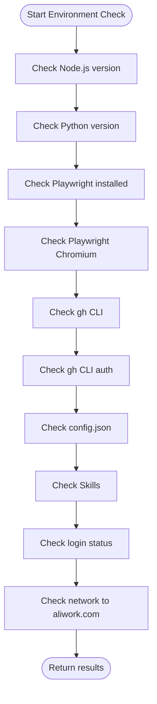

**Diagram sources**
- [doctor.js:146-159](file://lib/core/doctor.js#L146-L159)

**Section sources**
- [doctor.js:137-438](file://lib/core/doctor.js#L137-L438)

### ApplicationChecker
- Validates:
  - PRD directory and markdown files.
  - Pages source directory and files, detecting console.log and empty files.
  - Schema cache integrity (valid JSON files ending with -schema.json).
  - React Hooks usage correctness (no hooks inside conditional blocks).
- Fix types:
  - AUTO: delete-invalid-schema for corrupted schema cache entries.

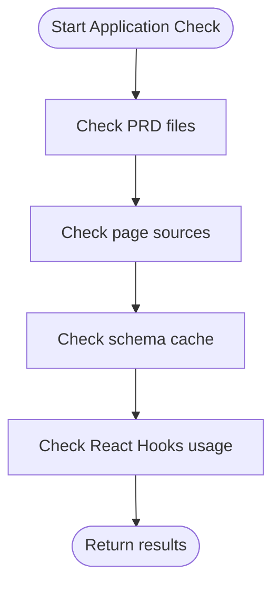

**Diagram sources**
- [doctor.js:456-463](file://lib/core/doctor.js#L456-L463)

**Section sources**
- [doctor.js:446-631](file://lib/core/doctor.js#L446-L631)

### FixEngine
- Applies automatic fixes:
  - create-config: writes a default config.json template.
  - delete-invalid-schema: removes corrupted schema cache files.
- Handles manual and command-type issues by printing actionable messages.

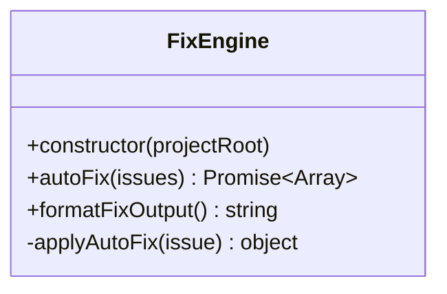

**Diagram sources**
- [doctor.js:639-733](file://lib/core/doctor.js#L639-L733)

**Section sources**
- [doctor.js:639-733](file://lib/core/doctor.js#L639-L733)

### ReportGenerator
- Generates JSON, Markdown, or HTML reports with timestamped filenames under .cache/reports.
- Includes summary table and detailed rows with icons and messages.

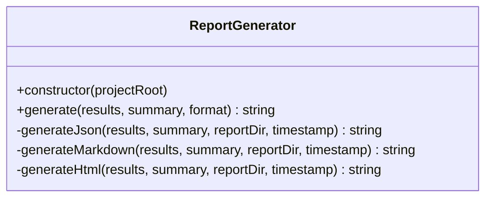

**Diagram sources**
- [doctor.js:741-863](file://lib/core/doctor.js#L741-L863)

**Section sources**
- [doctor.js:741-863](file://lib/core/doctor.js#L741-L863)

### PreChecker
- Runs environment and application checks for pre-publish and pre-create scenarios.
- Filters critical issues (ERROR severity) to determine pass/fail.

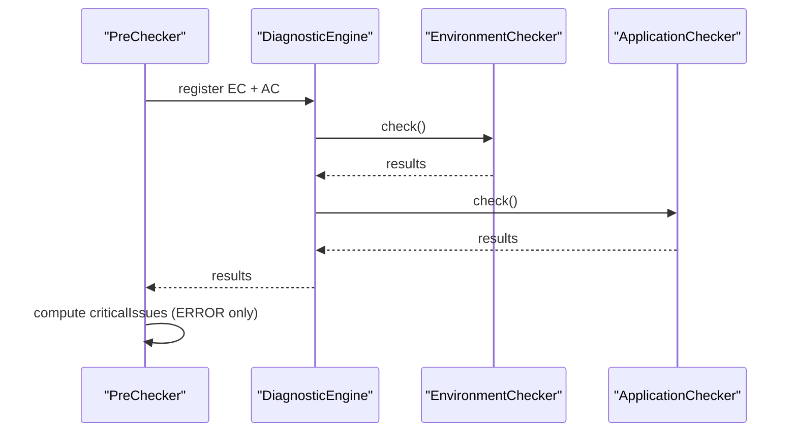

**Diagram sources**
- [doctor.js:880-916](file://lib/core/doctor.js#L880-L916)

**Section sources**
- [doctor.js:871-916](file://lib/core/doctor.js#L871-L916)

### HealthMonitor
- Periodically runs diagnostics and calculates a health score based on pass rate and penalties for errors and warnings.
- Maintains history snapshots and formats periodic output with trend indicators.

```mermaid
classDiagram
class HealthMonitor {
+constructor({projectRoot, intervalMs, onResult})
+start() void
+stop() void
+runOnce() Promise~void~
+calculateHealthScore(summary) number
+formatMonitorOutput(snapshot) string
}
```

**Diagram sources**
- [doctor.js:924-1003](file://lib/core/doctor.js#L924-L1003)

**Section sources**
- [doctor.js:924-1003](file://lib/core/doctor.js#L924-L1003)

### ProductionErrorCollector
- Requires an app ID; collects local error logs under .cache/error-logs/<appId>.json and reports counts or warnings.

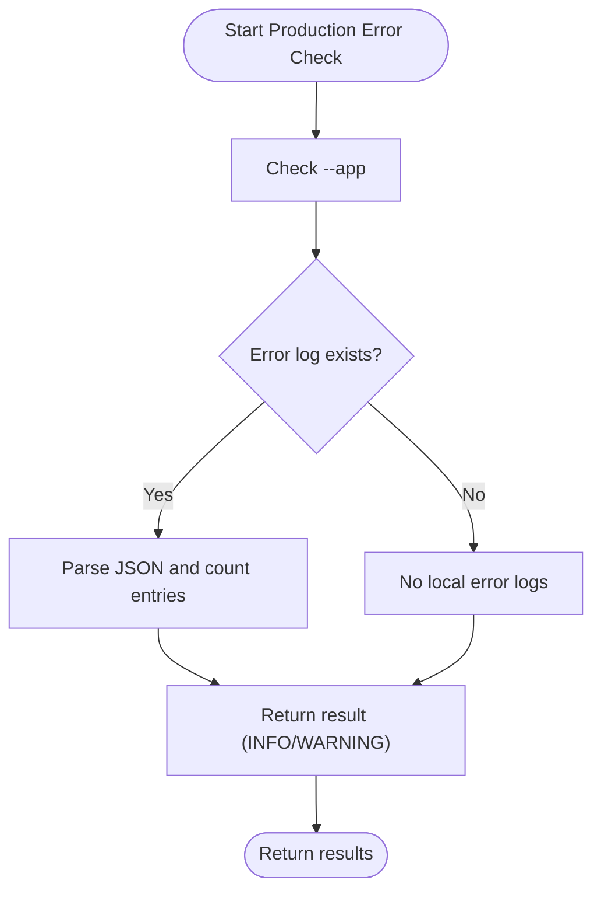

**Diagram sources**
- [doctor.js:1021-1074](file://lib/core/doctor.js#L1021-L1074)

**Section sources**
- [doctor.js:1011-1074](file://lib/core/doctor.js#L1011-L1074)

### TicketCreator, VOCCreator, SubmissionDecider
- TicketCreator: Creates GitHub Issues via gh CLI or saves locally if CLI unavailable.
- VOCCreator: Creates VOC issues with labels and analyzes business value/priority.
- SubmissionDecider: Auto-decides whether to submit a ticket or VOC based on keywords.

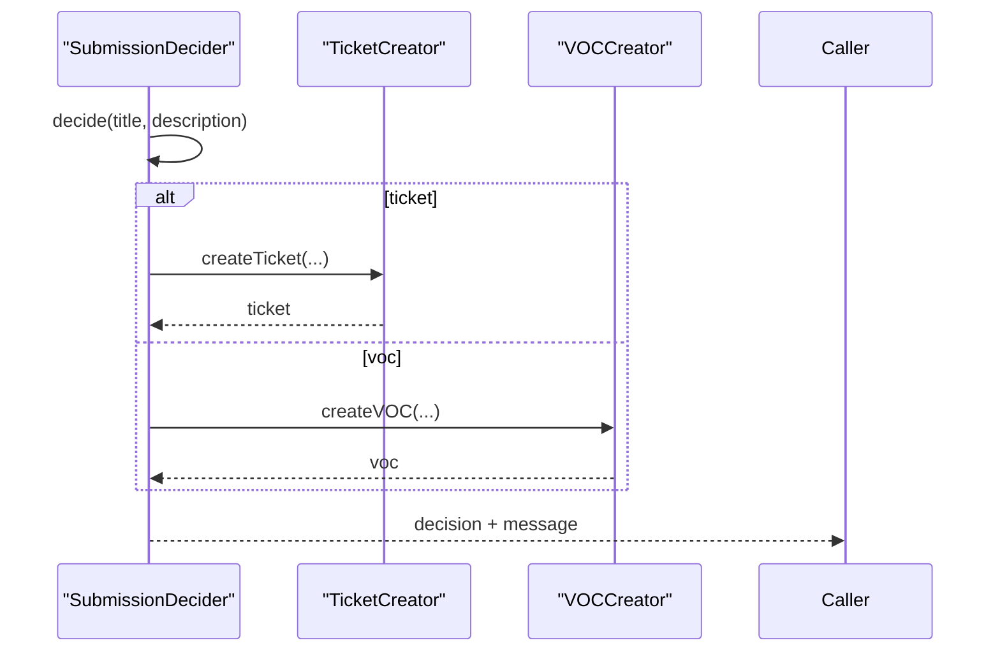

**Diagram sources**
- [doctor.js:1236-1305](file://lib/core/doctor.js#L1236-L1305)
- [doctor.js:1082-1138](file://lib/core/doctor.js#L1082-L1138)
- [doctor.js:1146-1228](file://lib/core/doctor.js#L1146-L1228)

**Section sources**
- [doctor.js:1082-1138](file://lib/core/doctor.js#L1082-L1138)
- [doctor.js:1146-1228](file://lib/core/doctor.js#L1146-L1228)
- [doctor.js:1236-1305](file://lib/core/doctor.js#L1236-L1305)

## Dependency Analysis
- CLI routing: bin/yida.js dispatches to lib/core/doctor.js for the doctor command.
- Doctor module exports all components and the run entrypoint.
- Environment utilities (env.js, utils.js) support environment detection and cookie parsing.
- Tests validate behavior across all components.

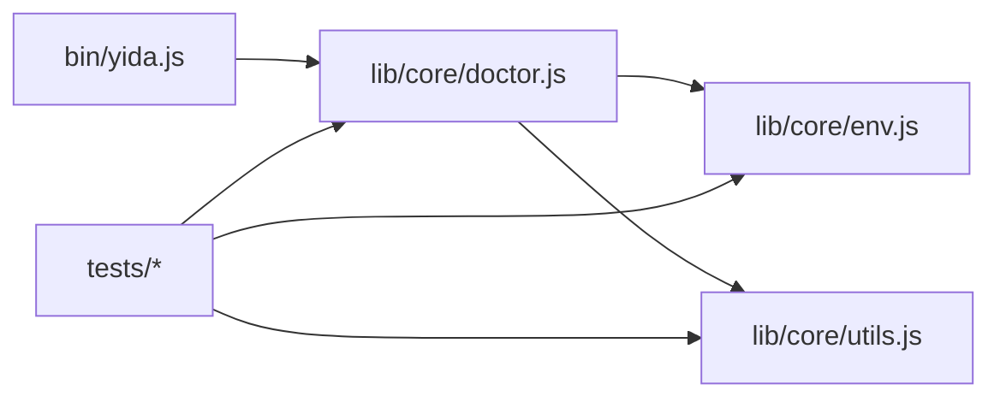

**Diagram sources**
- [yida.js:337-341](file://bin/yida.js#L337-L341)
- [doctor.js:1490-1504](file://lib/core/doctor.js#L1490-L1504)
- [env.js:1-171](file://lib/core/env.js#L1-L171)
- [utils.js:1-463](file://lib/core/utils.js#L1-L463)

**Section sources**
- [yida.js:337-341](file://bin/yida.js#L337-L341)
- [doctor.js:1490-1504](file://lib/core/doctor.js#L1490-L1504)
- [env.js:1-171](file://lib/core/env.js#L1-L171)
- [utils.js:1-463](file://lib/core/utils.js#L1-L463)

## Performance Considerations
- Network checks use timeouts to avoid blocking long-running diagnostics.
- JSON parsing and filesystem checks are lightweight; schema cache validation iterates over cached files.
- HealthMonitor runs periodically with configurable intervals to balance responsiveness and overhead.
- Recommendations:
  - Limit concurrent external commands (Playwright install, gh CLI) to avoid contention.
  - Cache parsed cookie data to reduce repeated disk reads.
  - Consider batching schema cache deletions for large caches.

[No sources needed since this section provides general guidance]

## Troubleshooting Guide

### Severity Levels and Fix Types
- Severity:
  - ERROR: Critical failures requiring immediate attention.
  - WARNING: Potential issues impacting functionality or best practices.
  - INFO: Passes with no action required.
- Fix Types:
  - AUTO: Automatically repaired by FixEngine (e.g., create-config, delete-invalid-schema).
  - COMMAND: Requires manual execution of a shell command (e.g., pip install playwright, playwright install chromium, gh auth login, yida login).
  - MANUAL: Requires manual intervention with instructions.

**Section sources**
- [doctor.js:32-42](file://lib/core/doctor.js#L32-L42)
- [doctor.js:650-733](file://lib/core/doctor.js#L650-L733)

### Environment Validation Checklist
- Node.js: Ensure version ≥ 16 (per tests) or ≥ 18 (per package engines).
- Python: Ensure version ≥ 3.10; otherwise install Python 3.10+.
- Playwright: Install Python package and Chromium browser; run playwright install chromium if needed.
- gh CLI: Install GitHub CLI and authenticate with gh auth login.
- config.json: Create if missing; ensure valid JSON syntax.
- Skills: Install Skills under .claude/skills; run install script if provided.
- Login status: Ensure cookies.json exists and contains CSRF token; run yida login if needed.
- Network: Verify connectivity to aliwork.com; check proxy/firewall.

**Section sources**
- [doctor.js:161-438](file://lib/core/doctor.js#L161-L438)
- [package.json:70-72](file://package.json#L70-L72)

### Application-Level Diagnostics Checklist
- PRD files: Ensure prd/ directory exists and contains markdown files describing requirements.
- Page sources: Ensure pages/src/ exists; remove console.log statements and empty files.
- Schema cache: Ensure .cache/ exists and contains valid -schema.json files; invalid ones will be auto-deleted.
- React Hooks: Avoid placing hooks inside conditional blocks; keep hooks at top level.

**Section sources**
- [doctor.js:465-631](file://lib/core/doctor.js#L465-L631)

### Automated Repair and Manual Intervention
- Automatic fixes:
  - Create missing config.json with defaults.
  - Delete corrupted schema cache entries.
- Manual fixes:
  - Install Python packages and browsers.
  - Authenticate CLI tools.
  - Correct code violations (remove console.log, fix hooks).

**Section sources**
- [doctor.js:680-715](file://lib/core/doctor.js#L680-L715)
- [doctor.js:650-733](file://lib/core/doctor.js#L650-L733)

### Practical Examples of Diagnostic Output Interpretation
- Console output:
  - ✅ indicates passed items.
  - ❌ indicates errors.
  - ⚠️ indicates warnings.
  - Summary line shows totals and counts.
- Example interpretations:
  - All checks passed: “🎉 All checks passed, environment configured.”
  - Mixed results: Review summary and messages for each failing item.
  - Auto-fixable issues: Run yida doctor --fix to apply automatic repairs.

**Section sources**
- [doctor.js:107-128](file://lib/core/doctor.js#L107-L128)
- [doctor.js:1464-1480](file://lib/core/doctor.js#L1464-L1480)

### Common Issues and Fixes
- Node.js version too low:
  - Upgrade to v16+ (tests) or v18+ (engines).
- Python version too low:
  - Install Python 3.10+.
- Playwright not installed:
  - pip install playwright.
  - playwright install chromium.
- gh CLI not installed or unauthenticated:
  - Install gh CLI and run gh auth login.
- Missing config.json:
  - Run yida doctor --fix to create a template.
- Corrupted schema cache:
  - Run yida doctor --fix to delete invalid files.
- Login issues:
  - Run yida login to refresh credentials.
- Network connectivity:
  - Check firewall/proxy; ensure aliwork.com is reachable.

**Section sources**
- [doctor.js:161-438](file://lib/core/doctor.js#L161-L438)
- [doctor.js:680-715](file://lib/core/doctor.js#L680-L715)
- [package.json:70-72](file://package.json#L70-L72)

### Reporting and Monitoring
- Reports:
  - Generate JSON, Markdown, or HTML under .cache/reports with timestamps.
- Health monitoring:
  - Use --monitor to track health score over time; trend indicators show improvements or regressions.

**Section sources**
- [doctor.js:753-863](file://lib/core/doctor.js#L753-L863)
- [doctor.js:936-1002](file://lib/core/doctor.js#L936-L1002)

## Conclusion
OpenYida’s diagnostics system provides a robust, layered approach to environment and application validation. With clear severity levels, actionable fix types, and integrated reporting and monitoring, developers can quickly identify and resolve issues. The three-layer checker architecture (EnvironmentChecker, ApplicationChecker, FixEngine) ensures comprehensive coverage while remaining extensible for future enhancements.

[No sources needed since this section summarizes without analyzing specific files]

## Appendices

### CLI Command Reference for Diagnostics
- openyida doctor [--fix | --repair] [--production --app <appId>] [--monitor] [--report <format>] [--create-ticket | --create-voc | --auto-submit]
- openyida env (environment detection)
- openyida login/logout/auth (login management)

**Section sources**
- [yida.js:30-50](file://bin/yida.js#L30-L50)
- [README.md:77-135](file://README.md#L77-L135)

### Test Coverage Highlights
- DiagnosticEngine registration, runAll, summary, and console output formatting.
- EnvironmentChecker validations for Node.js, Python, Playwright, gh CLI, config.json, Skills, login status, and network.
- ApplicationChecker validations for PRD files, page sources, schema cache, and React Hooks.
- FixEngine auto-fix actions and manual/command prompts.
- ReportGenerator output formats and paths.
- PreChecker pre-publish and pre-create workflows.
- HealthMonitor scoring and output formatting.
- ProductionErrorCollector app ID requirement and error log analysis.
- TicketCreator, VOCCreator, SubmissionDecider integration and decisions.

**Section sources**
- [doctor.test.js:79-186](file://tests/doctor.test.js#L79-L186)
- [doctor.test.js:190-303](file://tests/doctor.test.js#L190-L303)
- [doctor.test.js:305-402](file://tests/doctor.test.js#L305-L402)
- [doctor.test.js:406-475](file://tests/doctor.test.js#L406-L475)
- [doctor.test.js:479-540](file://tests/doctor.test.js#L479-L540)
- [doctor.test.js:544-589](file://tests/doctor.test.js#L544-L589)
- [doctor.test.js:591-665](file://tests/doctor.test.js#L591-L665)
- [doctor.test.js:667-706](file://tests/doctor.test.js#L667-L706)
- [doctor.test.js:708-731](file://tests/doctor.test.js#L708-L731)
- [doctor.test.js:733-753](file://tests/doctor.test.js#L733-L753)
- [doctor.test.js:786-807](file://tests/doctor.test.js#L786-L807)
- [env.test.js:11-65](file://tests/env.test.js#L11-L65)
- [env.test.js:67-163](file://tests/env.test.js#L67-L163)