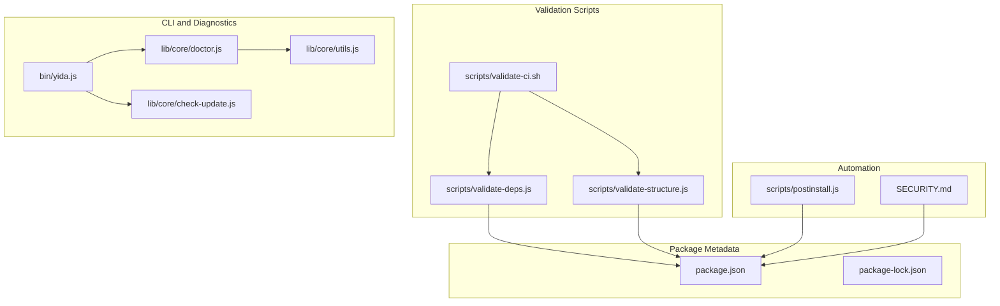
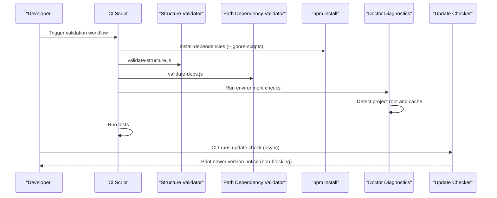
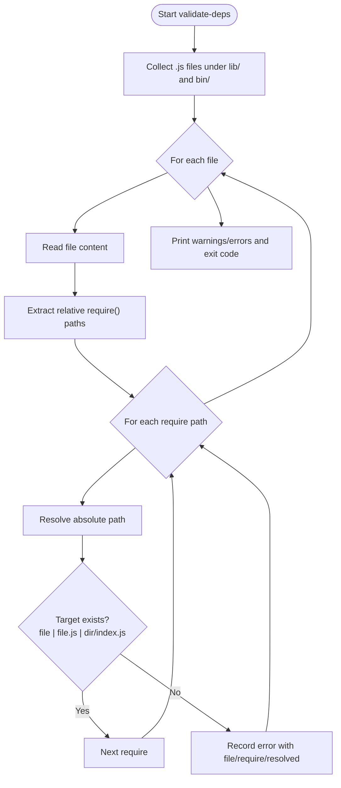
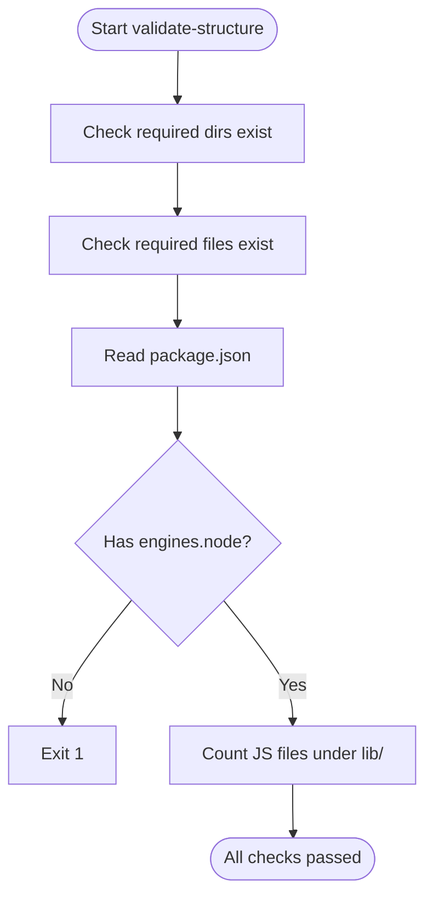
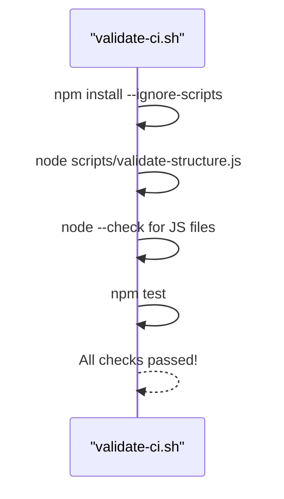
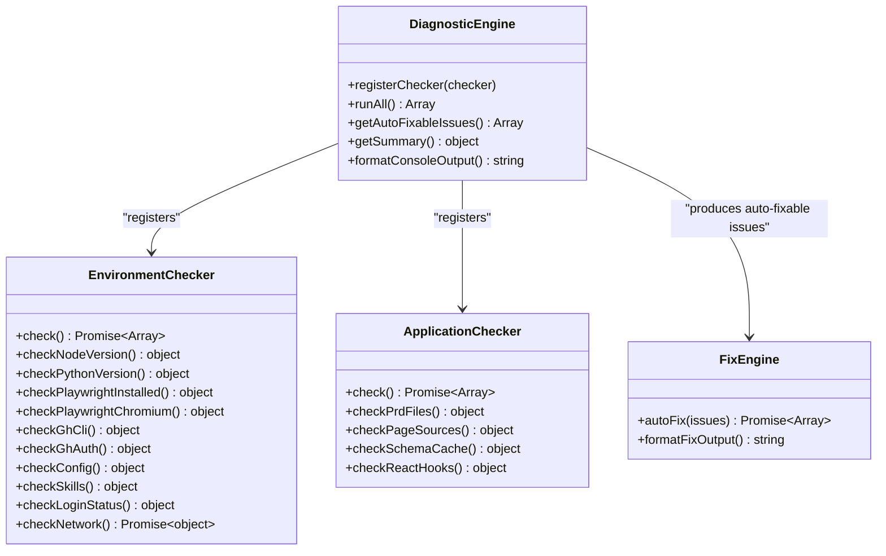
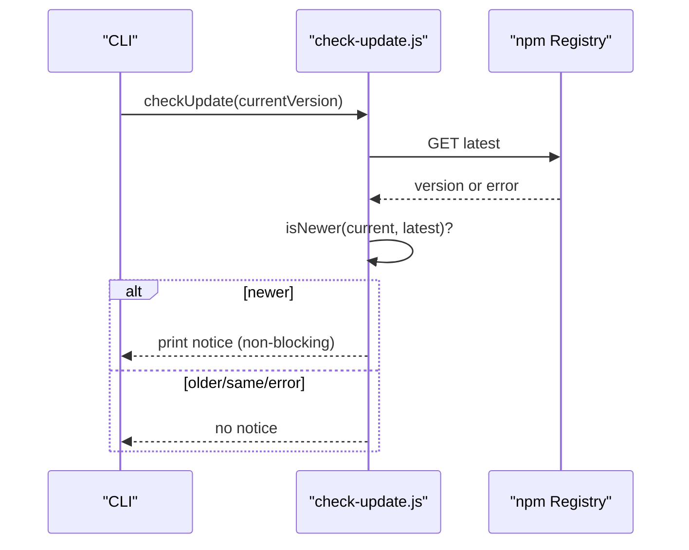
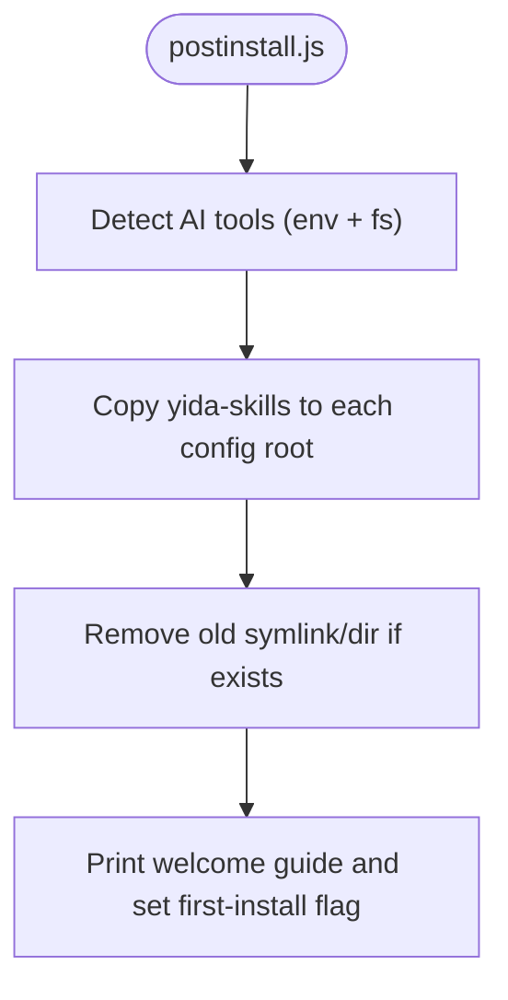
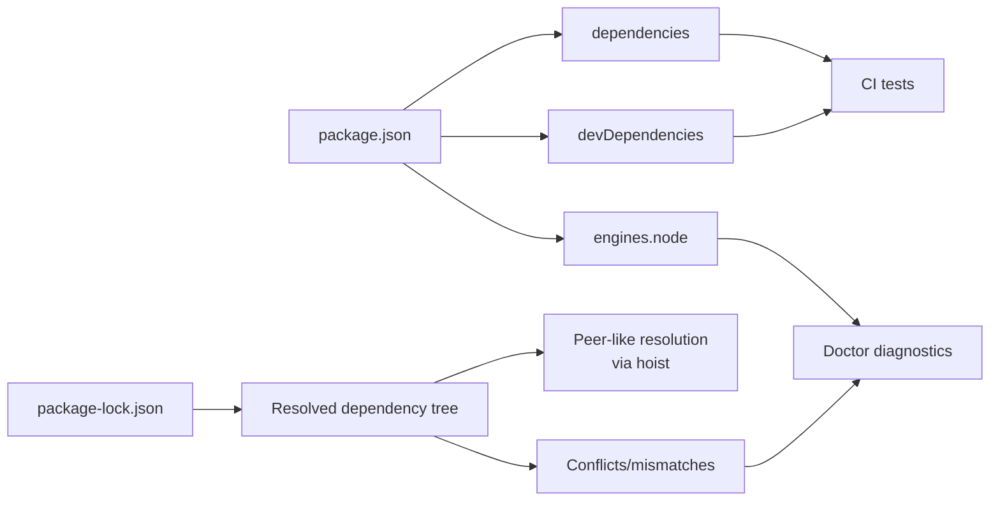

# Dependency Validation

<cite>
**Referenced Files in This Document**
- [validate-deps.js](file://scripts/validate-deps.js)
- [validate-structure.js](file://scripts/validate-structure.js)
- [validate-ci.sh](file://scripts/validate-ci.sh)
- [package.json](file://package.json)
- [package-lock.json](file://package-lock.json)
- [SECURITY.md](file://SECURITY.md)
- [yida.js](file://bin/yida.js)
- [doctor.js](file://lib/core/doctor.js)
- [check-update.js](file://lib/core/check-update.js)
- [utils.js](file://lib/core/utils.js)
- [postinstall.js](file://scripts/postinstall.js)
</cite>

## Table of Contents
1. [Introduction](#introduction)
2. [Project Structure](#project-structure)
3. [Core Components](#core-components)
4. [Architecture Overview](#architecture-overview)
5. [Detailed Component Analysis](#detailed-component-analysis)
6. [Dependency Analysis](#dependency-analysis)
7. [Performance Considerations](#performance-considerations)
8. [Troubleshooting Guide](#troubleshooting-guide)
9. [Conclusion](#conclusion)
10. [Appendices](#appendices)

## Introduction
This document explains OpenYida’s dependency validation system with a focus on ensuring package integrity, validating version compatibility, detecting missing or conflicting packages, and maintaining a healthy dependency tree. It covers:
- Path dependency validation for local modules
- Project structure validation aligned with package metadata
- Node.js engine constraints
- Optional and peer-like usage via lockfile semantics
- Integration with CI and developer workflows
- Automated dependency updates and security scanning recommendations

## Project Structure
OpenYida organizes its validation logic around three primary areas:
- Scripts that validate project structure and local path dependencies
- Package metadata defining production, development, and engine constraints
- Tooling for diagnostics, updates, and post-install automation

**Diagram sources**
- [validate-deps.js:1-172](file://scripts/validate-deps.js#L1-L172)
- [validate-structure.js:1-67](file://scripts/validate-structure.js#L1-L67)
- [validate-ci.sh:1-25](file://scripts/validate-ci.sh#L1-L25)
- [package.json:1-74](file://package.json#L1-L74)
- [package-lock.json:1-800](file://package-lock.json#L1-L800)
- [yida.js:1-521](file://bin/yida.js#L1-L521)
- [doctor.js:1-1504](file://lib/core/doctor.js#L1-L1504)
- [check-update.js:1-71](file://lib/core/check-update.js#L1-L71)
- [utils.js:1-463](file://lib/core/utils.js#L1-L463)
- [postinstall.js:1-215](file://scripts/postinstall.js#L1-L215)
- [SECURITY.md:1-62](file://SECURITY.md#L1-L62)

**Section sources**
- [validate-deps.js:1-172](file://scripts/validate-deps.js#L1-L172)
- [validate-structure.js:1-67](file://scripts/validate-structure.js#L1-L67)
- [validate-ci.sh:1-25](file://scripts/validate-ci.sh#L1-L25)
- [package.json:1-74](file://package.json#L1-L74)
- [package-lock.json:1-800](file://package-lock.json#L1-L800)
- [yida.js:1-521](file://bin/yida.js#L1-L521)
- [doctor.js:1-1504](file://lib/core/doctor.js#L1-L1504)
- [check-update.js:1-71](file://lib/core/check-update.js#L1-L71)
- [utils.js:1-463](file://lib/core/utils.js#L1-L463)
- [postinstall.js:1-215](file://scripts/postinstall.js#L1-L215)
- [SECURITY.md:1-62](file://SECURITY.md#L1-L62)

## Core Components
- Path dependency validator: Scans local modules for invalid relative require paths and reports missing targets.
- Project structure validator: Ensures required directories and files exist and validates Node.js engine constraints.
- CI orchestration: Runs install, structure checks, syntax checks, and tests in sequence.
- Doctor diagnostics: Provides environment and application checks; integrates with project root detection and caching.
- Update checker: Asynchronously compares installed version against the npm registry.
- Post-install automation: Copies skill packs into AI tool config directories and prints a welcome guide.
- Security policy: Encourages regular dependency audits and outlines best practices.

**Section sources**
- [validate-deps.js:1-172](file://scripts/validate-deps.js#L1-L172)
- [validate-structure.js:1-67](file://scripts/validate-structure.js#L1-L67)
- [validate-ci.sh:1-25](file://scripts/validate-ci.sh#L1-L25)
- [doctor.js:1-1504](file://lib/core/doctor.js#L1-L1504)
- [check-update.js:1-71](file://lib/core/check-update.js#L1-L71)
- [postinstall.js:1-215](file://scripts/postinstall.js#L1-L215)
- [SECURITY.md:1-62](file://SECURITY.md#L1-L62)

## Architecture Overview
The dependency validation pipeline combines static checks, runtime diagnostics, and CI orchestration:

**Diagram sources**
- [validate-ci.sh:1-25](file://scripts/validate-ci.sh#L1-L25)
- [validate-structure.js:1-67](file://scripts/validate-structure.js#L1-L67)
- [validate-deps.js:1-172](file://scripts/validate-deps.js#L1-L172)
- [doctor.js:1-1504](file://lib/core/doctor.js#L1-L1504)
- [check-update.js:1-71](file://lib/core/check-update.js#L1-L71)

## Detailed Component Analysis

### Path Dependency Validator
Purpose: Scan local modules for invalid relative require paths and ensure referenced files or directories exist.

Key behaviors:
- Recursively collects .js files under configured directories
- Extracts relative require paths using a pattern supporting single and double quotes
- Resolves paths per Node.js rules (file, .js extension, index.js)
- Reports warnings for unreadable files and errors for missing targets

**Diagram sources**
- [validate-deps.js:1-172](file://scripts/validate-deps.js#L1-L172)

**Section sources**
- [validate-deps.js:1-172](file://scripts/validate-deps.js#L1-L172)

### Project Structure Validator
Purpose: Verify presence of required directories and files, and validate Node.js engine constraints declared in package metadata.

Key behaviors:
- Checks existence of required directories and files
- Reads package.json and asserts engines.node is present
- Counts JS modules under lib/ for quick health check
- Exits with failure if any required item is missing

**Diagram sources**
- [validate-structure.js:1-67](file://scripts/validate-structure.js#L1-L67)
- [package.json:1-74](file://package.json#L1-L74)

**Section sources**
- [validate-structure.js:1-67](file://scripts/validate-structure.js#L1-L67)
- [package.json:1-74](file://package.json#L1-L74)

### CI Orchestration
Purpose: Provide a repeatable validation pipeline across install, structure, syntax, and tests.

Key behaviors:
- Installs dependencies with script hooks ignored
- Runs structure and syntax checks
- Executes tests
- Reports pass/fail

**Diagram sources**
- [validate-ci.sh:1-25](file://scripts/validate-ci.sh#L1-L25)

**Section sources**
- [validate-ci.sh:1-25](file://scripts/validate-ci.sh#L1-L25)

### Doctor Diagnostics and Project Root Detection
Purpose: Provide environment and application checks, including Node/Python/Playwright/network checks, and manage project root and cache locations.

Key behaviors:
- Environment checks include Node version, Python version, Playwright installation and Chromium availability, gh CLI, authentication, config.json presence/format, Skills installation, login status, and network connectivity
- Application checks include PRD files, page sources, schema cache validity, and React Hooks usage
- Project root detection considers active AI tool environment and falls back to current working directory
- Auto-fix actions include creating config.json template and removing invalid schema cache files

**Diagram sources**
- [doctor.js:1-1504](file://lib/core/doctor.js#L1-L1504)
- [utils.js:1-463](file://lib/core/utils.js#L1-L463)

**Section sources**
- [doctor.js:1-1504](file://lib/core/doctor.js#L1-L1504)
- [utils.js:1-463](file://lib/core/utils.js#L1-L463)

### Update Checker
Purpose: Asynchronously compare installed version with the latest published version from the npm registry and notify if newer.

Key behaviors:
- Fetch latest version from registry with timeout
- Compare semantic versions (major/minor/patch)
- Print a friendly message via nextTick if a newer version is detected
- Gracefully handle network errors and malformed responses

**Diagram sources**
- [check-update.js:1-71](file://lib/core/check-update.js#L1-L71)
- [yida.js:54-60](file://bin/yida.js#L54-L60)

**Section sources**
- [check-update.js:1-71](file://lib/core/check-update.js#L1-L71)
- [yida.js:54-60](file://bin/yida.js#L54-L60)

### Post-Install Automation
Purpose: Copy skill packs into AI tool configuration directories and print a welcome guide after global installation.

Key behaviors:
- Detects AI tools via environment variables and filesystem presence
- Copies yida-skills into each tool’s config root
- Removes legacy symlinks and replaces with clean copies
- Prints a welcome guide and first-install flag

**Diagram sources**
- [postinstall.js:1-215](file://scripts/postinstall.js#L1-L215)

**Section sources**
- [postinstall.js:1-215](file://scripts/postinstall.js#L1-L215)

## Dependency Analysis
This section maps how OpenYida defines and validates dependencies across production, development, and optional/peer-like contexts.

- Production dependencies
  - Declared in package.json under dependencies
  - Examples include libraries used at runtime (e.g., CLI tooling and utilities)
  - Validated by CI install and doctor diagnostics for environment readiness

- Development dependencies
  - Declared in package.json under devDependencies
  - Examples include testing and linting tools
  - Validated by CI test runner and structure checks

- Engine constraints
  - Declared in package.json engines.node
  - Validated by structure validator and doctor environment checks

- Lockfile semantics and peer-like behavior
  - package-lock.json encodes the resolved dependency tree and versions
  - Peer dependencies are often satisfied implicitly by hoisting; conflicts surface as mismatched versions or missing transitive dependencies
  - Doctor diagnostics can help detect environment mismatches impacting peer-like resolution

- Optional dependencies
  - Not explicitly declared in package.json; however, doctor checks for optional tooling (e.g., Playwright Chromium) and suggest installation commands

**Diagram sources**
- [package.json:1-74](file://package.json#L1-L74)
- [package-lock.json:1-800](file://package-lock.json#L1-L800)
- [validate-ci.sh:1-25](file://scripts/validate-ci.sh#L1-L25)
- [doctor.js:1-1504](file://lib/core/doctor.js#L1-L1504)

**Section sources**
- [package.json:1-74](file://package.json#L1-L74)
- [package-lock.json:1-800](file://package-lock.json#L1-L800)
- [validate-ci.sh:1-25](file://scripts/validate-ci.sh#L1-L25)
- [doctor.js:1-1504](file://lib/core/doctor.js#L1-L1504)

## Performance Considerations
- Path dependency scanning is linear in the number of .js files and require statements; keep lib/ and bin/ lean to reduce scan time.
- CI install uses --ignore-scripts to avoid unnecessary pre/post scripts during validation.
- Doctor diagnostics include network checks; mock or skip network-dependent checks in CI to reduce flakiness.
- Update checker is fire-and-forget and non-blocking to avoid slowing CLI startup.

## Troubleshooting Guide
Common dependency validation failures and resolutions:

- Missing required directories or files
  - Symptom: validate-structure fails with “Missing directory/file”
  - Resolution: Ensure required directories and files exist as per validation script expectations

- Invalid Node.js version
  - Symptom: Doctor reports Node version below requirement
  - Resolution: Upgrade Node.js to meet engines.node constraint

- Missing or invalid config.json
  - Symptom: Doctor reports missing or malformed config.json
  - Resolution: Doctor can auto-create a template; fix JSON syntax manually if needed

- Skills not installed
  - Symptom: Doctor reports Skills not installed
  - Resolution: Run the recommended installation steps or rely on postinstall automation

- Login state issues
  - Symptom: Doctor reports missing or expired cookies
  - Resolution: Run yida login to refresh credentials

- Path dependency errors
  - Symptom: validate-deps reports unresolved require paths
  - Resolution: Adjust relative paths to match actual file or directory locations; ensure index.js exists for directory imports

- Dependency security concerns
  - Recommendation: Regularly run dependency security scans and follow security best practices

**Section sources**
- [validate-structure.js:1-67](file://scripts/validate-structure.js#L1-L67)
- [doctor.js:1-1504](file://lib/core/doctor.js#L1-L1504)
- [validate-deps.js:1-172](file://scripts/validate-deps.js#L1-L172)
- [SECURITY.md:1-62](file://SECURITY.md#L1-L62)

## Conclusion
OpenYida’s dependency validation system combines static path checks, project structure verification, CI orchestration, and runtime diagnostics to ensure a robust and predictable development and deployment environment. By leveraging package metadata, lockfile semantics, and targeted tooling, teams can detect and resolve dependency issues early, maintain secure and compatible dependency trees, and integrate seamlessly with CI and automated workflows.

## Appendices

### Practical Examples Index
- Dependency validation failures
  - Missing required directories/files: see [validate-structure.js:1-67](file://scripts/validate-structure.js#L1-L67)
  - Invalid Node.js version: see [doctor.js:161-173](file://lib/core/doctor.js#L161-L173)
  - Missing/invalid config.json: see [doctor.js:306-340](file://lib/core/doctor.js#L306-L340)
  - Skills not installed: see [doctor.js:342-364](file://lib/core/doctor.js#L342-L364)
  - Login state issues: see [doctor.js:366-405](file://lib/core/doctor.js#L366-L405)
  - Path dependency errors: see [validate-deps.js:119-127](file://scripts/validate-deps.js#L119-L127)

- Updating dependency versions
  - Use standard npm/yarn commands; CI will validate changes via install, structure, and tests
  - See [validate-ci.sh:1-25](file://scripts/validate-ci.sh#L1-L25)

- Managing peer dependency requirements
  - Doctor diagnostics highlight environment readiness; install optional tooling as suggested
  - See [doctor.js:212-259](file://lib/core/doctor.js#L212-L259)

- Optimizing dependency trees
  - Keep lib/ and bin/ minimal; consolidate shared modules
  - Use doctor to identify redundant or missing optional tooling
  - See [doctor.js:1-1504](file://lib/core/doctor.js#L1-L1504)

- Integrating with npm/yarn workflows
  - Global install triggers postinstall automation
  - See [postinstall.js:1-215](file://scripts/postinstall.js#L1-L215)

- Automated dependency updates
  - CLI asynchronously checks for newer versions
  - See [check-update.js:1-71](file://lib/core/check-update.js#L1-L71)

- Dependency security scanning integration
  - Follow security best practices and run regular audits
  - See [SECURITY.md:1-62](file://SECURITY.md#L1-L62)