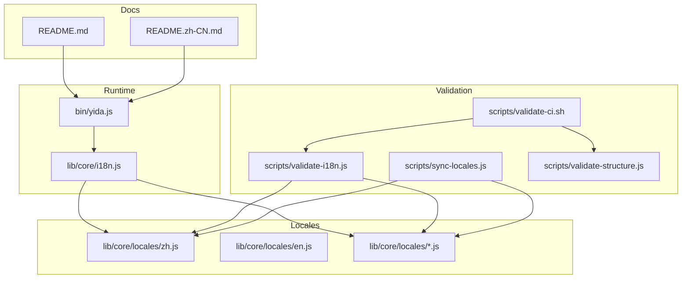
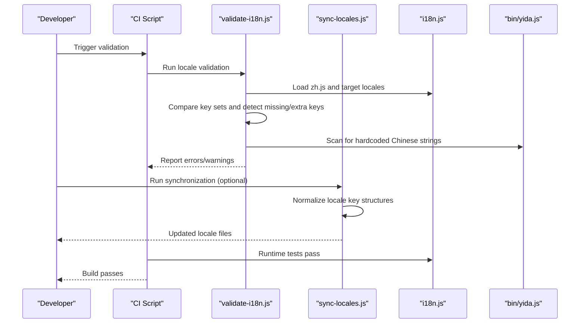
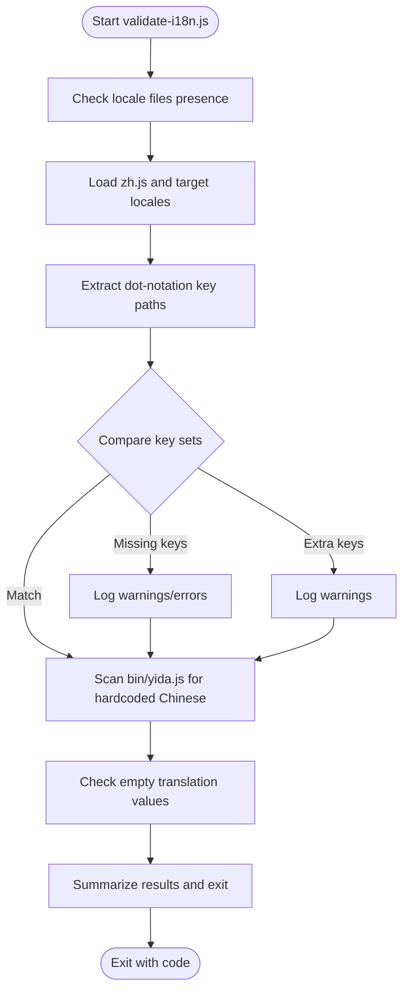
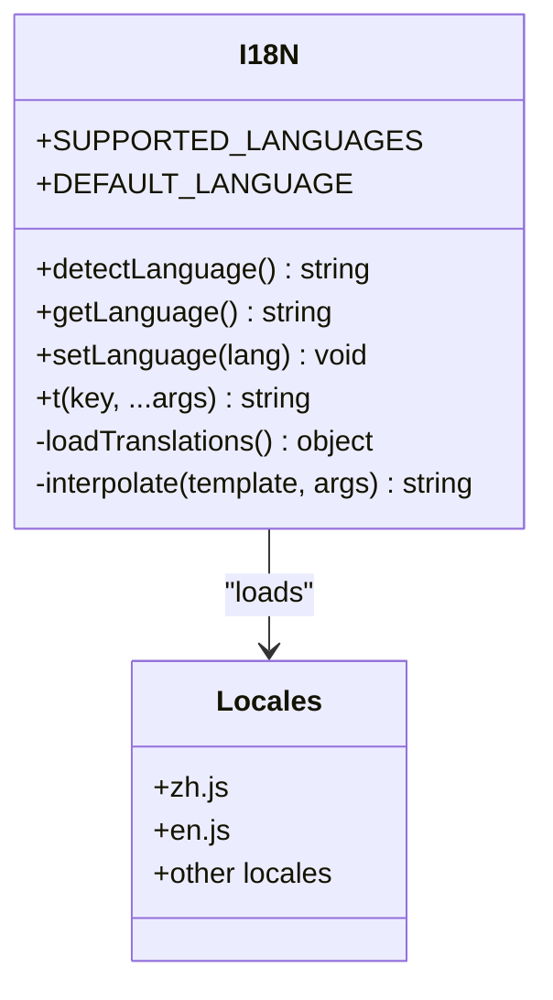
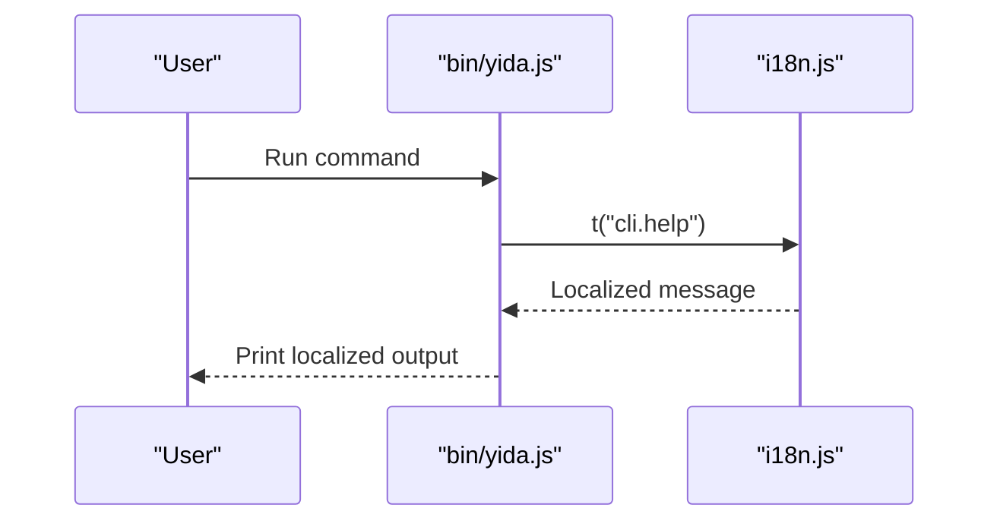
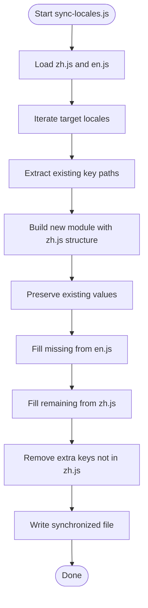
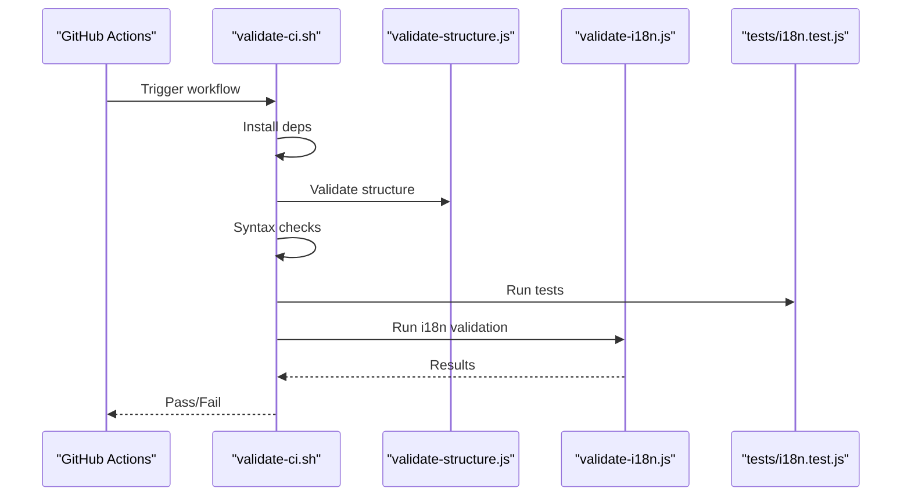
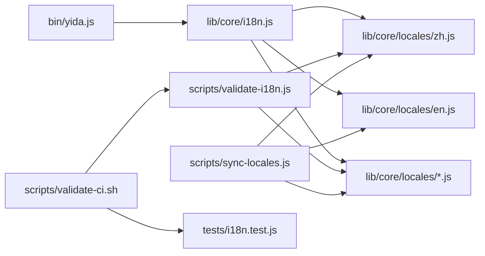

# Internationalization Validation

<cite>
**Referenced Files in This Document**
- [validate-i18n.js](file://scripts/validate-i18n.js)
- [i18n.js](file://lib/core/i18n.js)
- [yida.js](file://bin/yida.js)
- [sync-locales.js](file://scripts/sync-locales.js)
- [validate-structure.js](file://scripts/validate-structure.js)
- [validate-ci.sh](file://scripts/validate-ci.sh)
- [package.json](file://package.json)
- [README.md](file://README.md)
- [README.zh-CN.md](file://README.zh-CN.md)
- [zh.js](file://lib/core/locales/zh.js)
- [en.js](file://lib/core/locales/en.js)
- [i18n.test.js](file://tests/i18n.test.js)
</cite>

## Table of Contents
1. [Introduction](#introduction)
2. [Project Structure](#project-structure)
3. [Core Components](#core-components)
4. [Architecture Overview](#architecture-overview)
5. [Detailed Component Analysis](#detailed-component-analysis)
6. [Dependency Analysis](#dependency-analysis)
7. [Performance Considerations](#performance-considerations)
8. [Troubleshooting Guide](#troubleshooting-guide)
9. [Conclusion](#conclusion)
10. [Appendices](#appendices)

## Introduction
This document describes OpenYida’s internationalization (i18n) validation system. It explains how the project ensures complete translation coverage across supported languages, validates translation key consistency against a baseline, verifies locale file formatting, and checks message interpolation patterns. It also documents the integration with translation workflows, automated validation in CI, and localization quality assurance processes.

## Project Structure
OpenYida organizes i18n assets and validation logic as follows:
- Translation runtime and detection live under lib/core/i18n.js.
- Locale files are stored under lib/core/locales/*.js.
- Validation scripts reside under scripts/, including validate-i18n.js for locale integrity and sync-locales.js for standardizing translation structures.
- README files in multiple languages are provided alongside the CLI entry point bin/yida.js.
- Automated CI validation is orchestrated by scripts/validate-ci.sh and scripts/validate-structure.js.

**Diagram sources**
- [i18n.js:1-174](file://lib/core/i18n.js#L1-L174)
- [yida.js:1-521](file://bin/yida.js#L1-L521)
- [validate-i18n.js:1-247](file://scripts/validate-i18n.js#L1-L247)
- [sync-locales.js:1-289](file://scripts/sync-locales.js#L1-L289)
- [validate-structure.js:1-67](file://scripts/validate-structure.js#L1-L67)
- [validate-ci.sh:1-25](file://scripts/validate-ci.sh#L1-L25)
- [README.md:1-223](file://README.md#L1-L223)
- [README.zh-CN.md:1-183](file://README.zh-CN.md#L1-L183)

**Section sources**
- [i18n.js:1-174](file://lib/core/i18n.js#L1-L174)
- [validate-i18n.js:1-247](file://scripts/validate-i18n.js#L1-L247)
- [sync-locales.js:1-289](file://scripts/sync-locales.js#L1-L289)
- [validate-structure.js:1-67](file://scripts/validate-structure.js#L1-L67)
- [validate-ci.sh:1-25](file://scripts/validate-ci.sh#L1-L25)
- [README.md:1-223](file://README.md#L1-L223)
- [README.zh-CN.md:1-183](file://README.zh-CN.md#L1-L183)

## Core Components
- Translation runtime and language detection: lib/core/i18n.js provides language detection, lazy loading of locale modules, translation lookup with nested dot notation, placeholder interpolation, and fallback to Chinese when translations are missing.
- CLI entry point: bin/yida.js uses the translation function for all user-facing messages, ensuring consistent i18n usage across commands.
- Locale files: lib/core/locales/*.js define translations per language, with zh.js as the baseline for key structure.
- Validation scripts:
  - scripts/validate-i18n.js: Validates locale file presence, key consistency against zh.js, absence of hardcoded Chinese in bin/yida.js, and non-empty translation values.
  - scripts/sync-locales.js: Synchronizes locale key structures to the zh.js baseline, preserving existing translations and filling missing ones from en.js or zh.js.
- CI pipeline: scripts/validate-ci.sh orchestrates installation, structure validation, syntax checks, and tests, integrating i18n validation into the continuous integration workflow.

**Section sources**
- [i18n.js:1-174](file://lib/core/i18n.js#L1-L174)
- [yida.js:54-521](file://bin/yida.js#L54-L521)
- [validate-i18n.js:1-247](file://scripts/validate-i18n.js#L1-L247)
- [sync-locales.js:1-289](file://scripts/sync-locales.js#L1-L289)
- [validate-ci.sh:1-25](file://scripts/validate-ci.sh#L1-L25)

## Architecture Overview
The i18n validation architecture ensures:
- Locale file integrity: All expected locales are present and loadable.
- Key parity: Every locale mirrors the key structure of the baseline (zh.js).
- Runtime correctness: bin/yida.js uses the translation function for all console output.
- Formatting standards: Locale files maintain consistent structure and comments.
- Interpolation safety: Translations use placeholders consistently and safely.

**Diagram sources**
- [validate-i18n.js:1-247](file://scripts/validate-i18n.js#L1-L247)
- [sync-locales.js:1-289](file://scripts/sync-locales.js#L1-L289)
- [i18n.js:1-174](file://lib/core/i18n.js#L1-L174)
- [yida.js:1-521](file://bin/yida.js#L1-L521)
- [validate-ci.sh:1-25](file://scripts/validate-ci.sh#L1-L25)

## Detailed Component Analysis

### Locale File Validation (validate-i18n.js)
The validator performs four checks:
1. Locale file completeness: Ensures all expected locale files exist and can be loaded.
2. Key consistency against baseline: Compares each locale’s key set with zh.js to detect missing or extra keys.
3. Hardcoded Chinese detection: Scans bin/yida.js for console output lines containing Chinese without using the translation function.
4. Non-empty translation values: Flags empty string translations.

**Diagram sources**
- [validate-i18n.js:1-247](file://scripts/validate-i18n.js#L1-L247)

**Section sources**
- [validate-i18n.js:1-247](file://scripts/validate-i18n.js#L1-L247)

### Translation Runtime and Interpolation (i18n.js)
The runtime supports:
- Language detection from environment variables and system locale.
- Lazy loading of locale modules with fallback to zh.js.
- Nested dot-notation key resolution.
- Placeholder interpolation using {0}, {1}, etc.
- Fallback to Chinese when a translation is missing in the current language.

**Diagram sources**
- [i18n.js:1-174](file://lib/core/i18n.js#L1-L174)

**Section sources**
- [i18n.js:1-174](file://lib/core/i18n.js#L1-L174)

### CLI Message Localization (bin/yida.js)
The CLI uses the translation function for all user-facing console output, ensuring consistent i18n across commands. The validator scans this file for hardcoded Chinese strings outside of translation calls.

**Diagram sources**
- [yida.js:54-521](file://bin/yida.js#L54-L521)
- [i18n.js:114-138](file://lib/core/i18n.js#L114-L138)

**Section sources**
- [yida.js:54-521](file://bin/yida.js#L54-L521)
- [i18n.js:114-138](file://lib/core/i18n.js#L114-L138)

### Locale Synchronization (sync-locales.js)
This script synchronizes locale key structures to the zh.js baseline:
- Preserves existing translations when keys match.
- Fills missing keys from en.js if available; otherwise from zh.js.
- Removes keys not present in zh.js.
- Maintains section comments and formatting styles.

**Diagram sources**
- [sync-locales.js:1-289](file://scripts/sync-locales.js#L1-L289)

**Section sources**
- [sync-locales.js:1-289](file://scripts/sync-locales.js#L1-L289)

### CI Integration (validate-ci.sh and validate-structure.js)
The CI pipeline:
- Installs dependencies.
- Validates project structure and required files.
- Performs JavaScript syntax checks.
- Runs tests (including i18n tests).
- Integrates i18n validation as part of the overall quality gate.

**Diagram sources**
- [validate-ci.sh:1-25](file://scripts/validate-ci.sh#L1-L25)
- [validate-structure.js:1-67](file://scripts/validate-structure.js#L1-L67)
- [validate-i18n.js:1-247](file://scripts/validate-i18n.js#L1-L247)
- [i18n.test.js:1-199](file://tests/i18n.test.js#L1-L199)

**Section sources**
- [validate-ci.sh:1-25](file://scripts/validate-ci.sh#L1-L25)
- [validate-structure.js:1-67](file://scripts/validate-structure.js#L1-L67)
- [i18n.test.js:1-199](file://tests/i18n.test.js#L1-L199)

## Dependency Analysis
- bin/yida.js depends on lib/core/i18n.js for all user-facing messages.
- lib/core/i18n.js lazily loads locale modules from lib/core/locales/*.js and falls back to zh.js.
- scripts/validate-i18n.js depends on lib/core/locales/zh.js and other locale modules to compare key structures.
- scripts/sync-locales.js depends on zh.js and en.js to synchronize key structures.
- CI scripts depend on the presence of locale files and the translation runtime.

**Diagram sources**
- [yida.js:54-521](file://bin/yida.js#L54-L521)
- [i18n.js:1-174](file://lib/core/i18n.js#L1-L174)
- [validate-i18n.js:1-247](file://scripts/validate-i18n.js#L1-L247)
- [sync-locales.js:1-289](file://scripts/sync-locales.js#L1-L289)
- [validate-ci.sh:1-25](file://scripts/validate-ci.sh#L1-L25)
- [i18n.test.js:1-199](file://tests/i18n.test.js#L1-L199)

**Section sources**
- [yida.js:54-521](file://bin/yida.js#L54-L521)
- [i18n.js:1-174](file://lib/core/i18n.js#L1-L174)
- [validate-i18n.js:1-247](file://scripts/validate-i18n.js#L1-L247)
- [sync-locales.js:1-289](file://scripts/sync-locales.js#L1-L289)
- [validate-ci.sh:1-25](file://scripts/validate-ci.sh#L1-L25)
- [i18n.test.js:1-199](file://tests/i18n.test.js#L1-L199)

## Performance Considerations
- Lazy loading of locale modules reduces startup overhead until translations are accessed.
- Key extraction and comparison operate on in-memory structures; the number of keys is bounded by the locale file sizes.
- Interpolation is linear in the number of placeholders and the length of the template string.

## Troubleshooting Guide
Common issues and resolutions:
- Missing locale files
  - Symptom: Errors indicating missing locale files during validation.
  - Resolution: Ensure all expected locales exist under lib/core/locales/ and match the SUPPORTED_LANGUAGES list.
  - Section sources
    - [validate-i18n.js:67-98](file://scripts/validate-i18n.js#L67-L98)
    - [i18n.js:31-32](file://lib/core/i18n.js#L31-L32)
- Key mismatch between locales and baseline
  - Symptom: Warnings or errors about missing or extra keys compared to zh.js.
  - Resolution: Run scripts/sync-locales.js to synchronize key structures; review differences and confirm translations.
  - Section sources
    - [validate-i18n.js:104-146](file://scripts/validate-i18n.js#L104-L146)
    - [sync-locales.js:86-169](file://scripts/sync-locales.js#L86-L169)
- Hardcoded Chinese in bin/yida.js
  - Symptom: Warnings about hardcoded Chinese strings in console output.
  - Resolution: Wrap all user-facing strings with the translation function t().
  - Section sources
    - [validate-i18n.js:152-198](file://scripts/validate-i18n.js#L152-L198)
    - [yida.js:54-521](file://bin/yida.js#L54-L521)
- Empty translation values
  - Symptom: Warnings about empty string translations.
  - Resolution: Replace empty strings with meaningful translations or placeholders.
  - Section sources
    - [validate-i18n.js:204-229](file://scripts/validate-i18n.js#L204-L229)
- Language detection not applied
  - Symptom: Unexpected language output.
  - Resolution: Verify environment variables OPENYIDA_LANG, LANG, LC_ALL and ensure SUPPORTED_LANGUAGES mapping.
  - Section sources
    - [i18n.js:63-88](file://lib/core/i18n.js#L63-L88)
    - [i18n.test.js:81-136](file://tests/i18n.test.js#L81-L136)

## Conclusion
OpenYida’s i18n validation system ensures consistent, complete, and correctly formatted translations across supported languages. By combining runtime detection and fallback, automated validation, and structured synchronization, the project maintains high-quality multilingual user experiences and reliable CI workflows.

## Appendices

### Practical Examples

- Running internationalization validation
  - Default mode (key missing = warning): node scripts/validate-i18n.js
  - Strict mode (key missing = error): node scripts/validate-i18n.js --strict
  - Section sources
    - [validate-i18n.js:10-14](file://scripts/validate-i18n.js#L10-L14)

- Identifying incomplete translations
  - Review warnings for missing keys and extra keys reported by validate-i18n.js.
  - Section sources
    - [validate-i18n.js:117-142](file://scripts/validate-i18n.js#L117-L142)

- Fixing missing locale files
  - Ensure all expected locales exist under lib/core/locales/.
  - Confirm SUPPORTED_LANGUAGES includes the intended languages.
  - Section sources
    - [validate-i18n.js:24-26](file://scripts/validate-i18n.js#L24-L26)
    - [i18n.js:31-32](file://lib/core/i18n.js#L31-L32)

- Standardizing translation formats
  - Use scripts/sync-locales.js to normalize key structures and preserve existing translations.
  - Section sources
    - [sync-locales.js:1-289](file://scripts/sync-locales.js#L1-L289)

- Maintaining multilingual content consistency
  - Keep zh.js as the baseline; run sync-locales.js regularly.
  - Validate with validate-i18n.js in CI.
  - Section sources
    - [validate-i18n.js:104-146](file://scripts/validate-i18n.js#L104-L146)
    - [sync-locales.js:86-169](file://scripts/sync-locales.js#L86-L169)

- Integration with translation workflows
  - CI pipeline runs validate-structure.js, syntax checks, tests, and validate-i18n.js.
  - Section sources
    - [validate-ci.sh:1-25](file://scripts/validate-ci.sh#L1-L25)
    - [validate-structure.js:1-67](file://scripts/validate-structure.js#L1-L67)

- Automated translation validation and localization QA
  - i18n tests verify language detection, switching, interpolation, and fallback behavior.
  - Section sources
    - [i18n.test.js:1-199](file://tests/i18n.test.js#L1-L199)

### Validation Criteria Summary
- Locale file validation
  - Presence and loadability of locale files
  - Key parity against zh.js baseline
  - Absence of hardcoded Chinese in bin/yida.js
  - Non-empty translation values
- README.*.md files
  - README.md and README.zh-CN.md provide localized project documentation; ensure links and metadata are consistent across locales.
  - Section sources
    - [README.md:1-223](file://README.md#L1-L223)
    - [README.zh-CN.md:1-183](file://README.zh-CN.md#L1-L183)