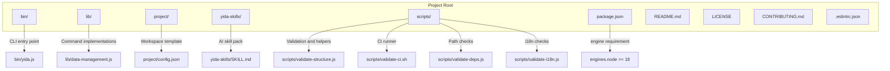
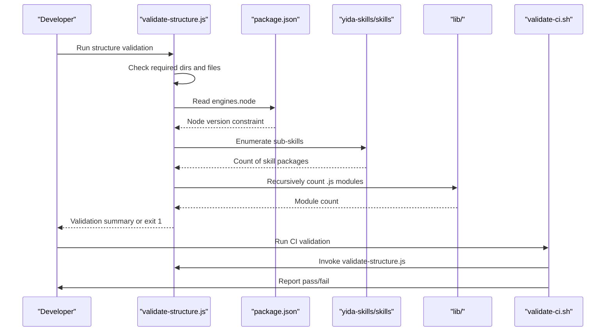
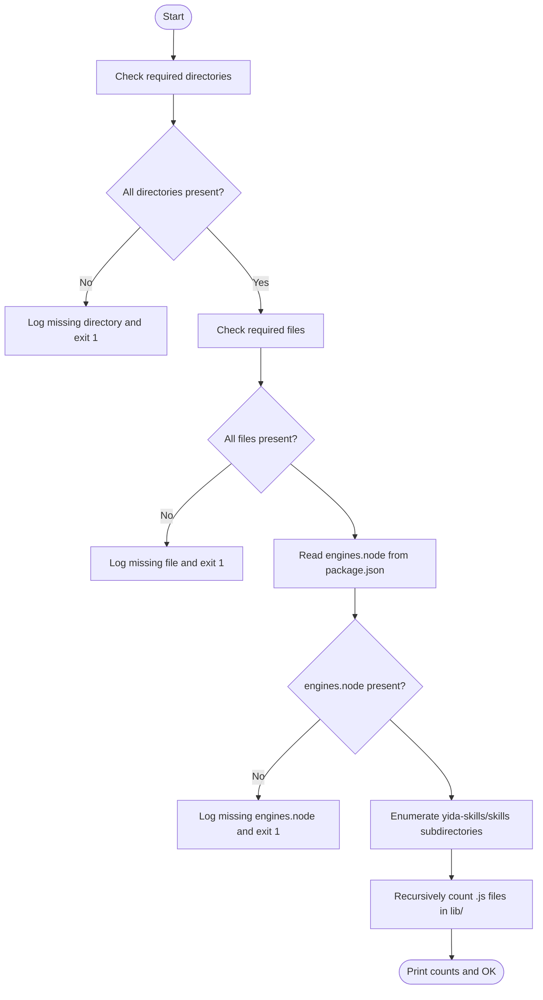
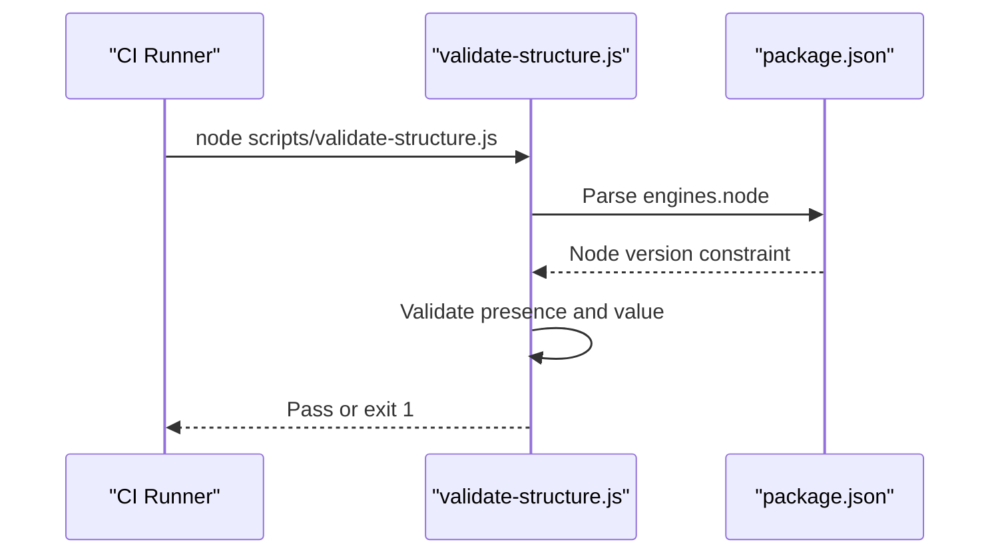
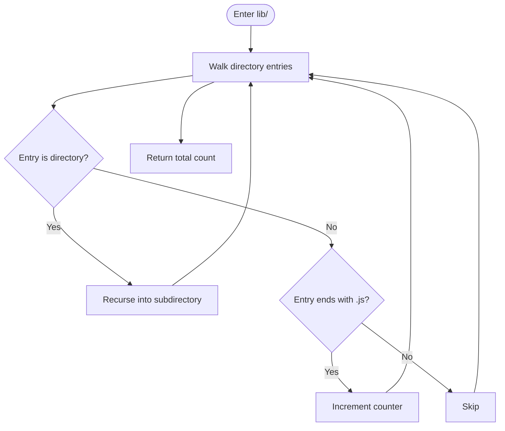
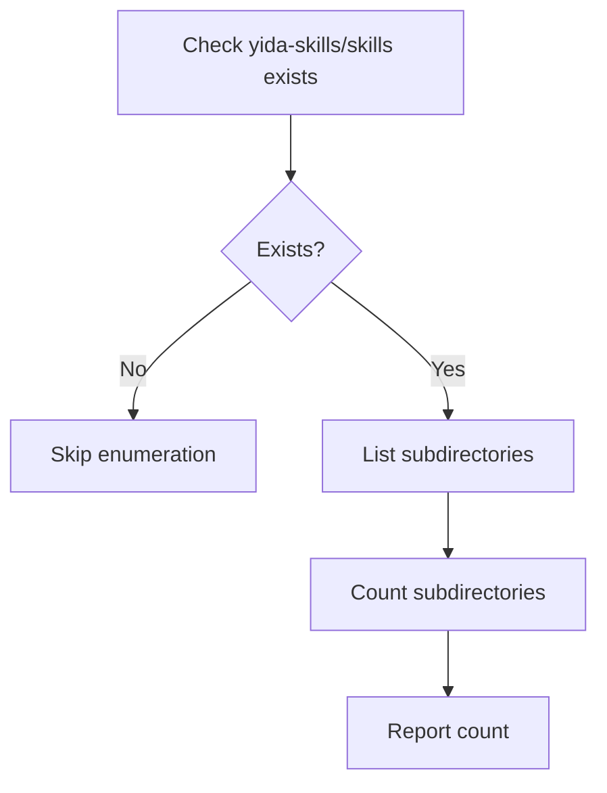
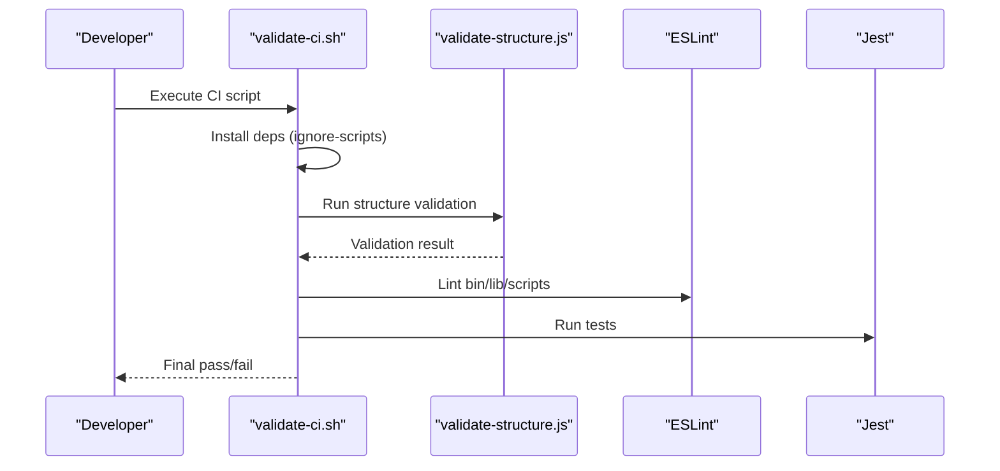
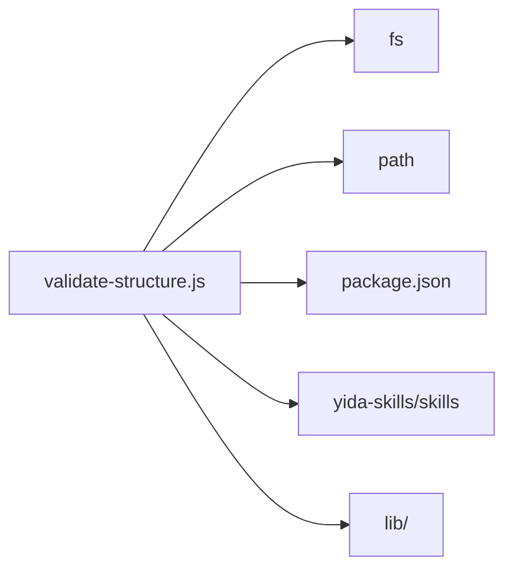

# Structure Validation

<cite>
**Referenced Files in This Document**
- [package.json](file://package.json)
- [README.md](file://README.md)
- [CONTRIBUTING.md](file://CONTRIBUTING.md)
- [LICENSE](file://LICENSE)
- [.eslintrc.json](file://.eslintrc.json)
- [scripts/validate-structure.js](file://scripts/validate-structure.js)
- [scripts/validate-ci.sh](file://scripts/validate-ci.sh)
- [scripts/validate-deps.js](file://scripts/validate-deps.js)
- [scripts/validate-i18n.js](file://scripts/validate-i18n.js)
- [bin/yida.js](file://bin/yida.js)
- [lib/data-management.js](file://lib/data-management.js)
- [project/config.json](file://project/config.json)
- [yida-skills/SKILL.md](file://yida-skills/SKILL.md)
</cite>

## Table of Contents
1. [Introduction](#introduction)
2. [Project Structure](#project-structure)
3. [Core Components](#core-components)
4. [Architecture Overview](#architecture-overview)
5. [Detailed Component Analysis](#detailed-component-analysis)
6. [Dependency Analysis](#dependency-analysis)
7. [Performance Considerations](#performance-considerations)
8. [Troubleshooting Guide](#troubleshooting-guide)
9. [Conclusion](#conclusion)
10. [Appendices](#appendices)

## Introduction
This document describes OpenYida’s structure validation system. It explains the mandatory directories and files required for a valid project layout, documents the validation logic performed by the structure validator, and shows how to integrate validation into local development and CI/CD workflows. It also covers how Node.js engine requirements are enforced via package.json, how JavaScript modules in lib/ are counted, and how AI skill packages are enumerated.

## Project Structure
OpenYida enforces a standardized project layout. The structure validator checks for the presence of required directories and files, verifies Node.js engine requirements, enumerates AI skill packages, and counts JavaScript modules in lib/.

**Diagram sources**
- [scripts/validate-structure.js:1-67](file://scripts/validate-structure.js#L1-L67)
- [package.json:70-72](file://package.json#L70-L72)
- [bin/yida.js:1-521](file://bin/yida.js#L1-L521)
- [lib/data-management.js:1-363](file://lib/data-management.js#L1-L363)
- [project/config.json:1-5](file://project/config.json#L1-L5)
- [yida-skills/SKILL.md:1-250](file://yida-skills/SKILL.md#L1-L250)
- [scripts/validate-ci.sh:1-25](file://scripts/validate-ci.sh#L1-L25)
- [scripts/validate-deps.js:1-172](file://scripts/validate-deps.js#L1-L172)
- [scripts/validate-i18n.js:1-247](file://scripts/validate-i18n.js#L1-L247)

**Section sources**
- [scripts/validate-structure.js:4-13](file://scripts/validate-structure.js#L4-L13)
- [package.json:70-72](file://package.json#L70-L72)
- [scripts/validate-ci.sh:8-9](file://scripts/validate-ci.sh#L8-L9)

## Core Components
- Required directories: bin, lib, project, yida-skills, scripts
- Required files: bin/yida.js, package.json, project/config.json, README.md, LICENSE, CONTRIBUTING.md, .eslintrc.json
- Node.js engine requirement: engines.node must be present and satisfied (>= 18)
- AI skill enumeration: counts subdirectories under yida-skills/skills
- JavaScript module counting: recursively counts .js files under lib/

**Section sources**
- [scripts/validate-structure.js:4-13](file://scripts/validate-structure.js#L4-L13)
- [scripts/validate-structure.js:35-42](file://scripts/validate-structure.js#L35-L42)
- [scripts/validate-structure.js:44-50](file://scripts/validate-structure.js#L44-L50)
- [scripts/validate-structure.js:52-65](file://scripts/validate-structure.js#L52-L65)

## Architecture Overview
The structure validation pipeline integrates with local scripts and CI/CD to ensure consistent project health.

**Diagram sources**
- [scripts/validate-structure.js:17-33](file://scripts/validate-structure.js#L17-L33)
- [scripts/validate-structure.js:35-42](file://scripts/validate-structure.js#L35-L42)
- [scripts/validate-structure.js:44-50](file://scripts/validate-structure.js#L44-L50)
- [scripts/validate-structure.js:52-65](file://scripts/validate-structure.js#L52-L65)
- [scripts/validate-ci.sh:8-21](file://scripts/validate-ci.sh#L8-L21)

## Detailed Component Analysis

### Structure Validator Logic
The validator performs:
- Directory existence checks for bin, lib, project, yida-skills, scripts
- File existence checks for bin/yida.js, package.json, project/config.json, README.md, LICENSE, CONTRIBUTING.md, .eslintrc.json
- Node.js engine verification via engines.node
- Enumeration of AI skill packages under yida-skills/skills
- Recursive counting of JavaScript modules in lib/

**Diagram sources**
- [scripts/validate-structure.js:17-33](file://scripts/validate-structure.js#L17-L33)
- [scripts/validate-structure.js:24-29](file://scripts/validate-structure.js#L24-L29)
- [scripts/validate-structure.js:35-42](file://scripts/validate-structure.js#L35-L42)
- [scripts/validate-structure.js:44-50](file://scripts/validate-structure.js#L44-L50)
- [scripts/validate-structure.js:52-65](file://scripts/validate-structure.js#L52-L65)

**Section sources**
- [scripts/validate-structure.js:17-67](file://scripts/validate-structure.js#L17-L67)

### Node.js Engine Requirement Enforcement
- The validator reads engines.node from package.json and requires it to be present.
- The project README and skill docs emphasize Node.js >= 18 as a requirement.
- CI script runs the structure validator as part of pre-test checks.

**Diagram sources**
- [scripts/validate-structure.js:35-42](file://scripts/validate-structure.js#L35-L42)
- [package.json:70-72](file://package.json#L70-L72)
- [scripts/validate-ci.sh:8-9](file://scripts/validate-ci.sh#L8-L9)

**Section sources**
- [scripts/validate-structure.js:35-42](file://scripts/validate-structure.js#L35-L42)
- [README.md:69-74](file://README.md#L69-L74)
- [yida-skills/SKILL.md:37-42](file://yida-skills/SKILL.md#L37-L42)

### JavaScript Module Counting in lib/
- The validator recursively traverses lib/ and counts all .js files.
- This provides a quick measure of module inventory for auditing and CI reporting.

**Diagram sources**
- [scripts/validate-structure.js:52-65](file://scripts/validate-structure.js#L52-L65)

**Section sources**
- [scripts/validate-structure.js:52-65](file://scripts/validate-structure.js#L52-L65)

### AI Skill Package Enumeration
- The validator checks for the presence of yida-skills/skills and enumerates its subdirectories.
- This enables CI to confirm the number of available AI skills.

**Diagram sources**
- [scripts/validate-structure.js:44-50](file://scripts/validate-structure.js#L44-L50)

**Section sources**
- [scripts/validate-structure.js:44-50](file://scripts/validate-structure.js#L44-L50)

### Integration with Development Workflows
- Local development: run the structure validator after making structural changes.
- CI/CD: the CI script installs dependencies, validates structure, checks JS syntax, and runs tests.

**Diagram sources**
- [scripts/validate-ci.sh:4-21](file://scripts/validate-ci.sh#L4-L21)
- [scripts/validate-structure.js:17-33](file://scripts/validate-structure.js#L17-L33)

**Section sources**
- [scripts/validate-ci.sh:1-25](file://scripts/validate-ci.sh#L1-L25)

## Dependency Analysis
The validator depends on:
- File system checks for directories and files
- Parsing of package.json for engines.node
- Directory traversal for counting modules
- Enumeration of skill directories

**Diagram sources**
- [scripts/validate-structure.js:1-3](file://scripts/validate-structure.js#L1-L3)
- [scripts/validate-structure.js:35-42](file://scripts/validate-structure.js#L35-L42)
- [scripts/validate-structure.js:44-50](file://scripts/validate-structure.js#L44-L50)
- [scripts/validate-structure.js:52-65](file://scripts/validate-structure.js#L52-L65)

**Section sources**
- [scripts/validate-structure.js:1-67](file://scripts/validate-structure.js#L1-L67)

## Performance Considerations
- Directory traversal is linear in the number of files and directories under lib/.
- File existence checks are fast but repeated for each required path.
- The validator is lightweight and suitable for CI pre-checks.

## Troubleshooting Guide
Common issues and resolutions:
- Missing directory or file
  - Symptom: Error message indicating a missing path.
  - Fix: Create the missing directory or file as per the required list.
  - Reference: [scripts/validate-structure.js:17-29](file://scripts/validate-structure.js#L17-L29)
- Missing engines.node in package.json
  - Symptom: Error indicating missing engines field.
  - Fix: Add engines.node with a valid semver range (e.g., >=18).
  - Reference: [scripts/validate-structure.js:35-42](file://scripts/validate-structure.js#L35-L42), [package.json:70-72](file://package.json#L70-L72)
- Low module count in lib/
  - Symptom: Unexpectedly small module count.
  - Fix: Ensure all intended modules are placed under lib/ and named with .js extension.
  - Reference: [scripts/validate-structure.js:52-65](file://scripts/validate-structure.js#L52-L65)
- CI failure during structure validation
  - Symptom: CI exits early with a validation error.
  - Fix: Address missing directories/files and ensure engines.node is present.
  - Reference: [scripts/validate-ci.sh:8-9](file://scripts/validate-ci.sh#L8-L9), [scripts/validate-structure.js:31-33](file://scripts/validate-structure.js#L31-L33)

**Section sources**
- [scripts/validate-structure.js:17-42](file://scripts/validate-structure.js#L17-L42)
- [scripts/validate-structure.js:52-65](file://scripts/validate-structure.js#L52-L65)
- [scripts/validate-ci.sh:8-9](file://scripts/validate-ci.sh#L8-L9)

## Conclusion
OpenYida’s structure validation system ensures a consistent project layout, enforces Node.js version requirements, enumerates AI skills, and counts JavaScript modules. Integrating the validator into local scripts and CI/CD provides reliable quality gates for contributors and automated pipelines.

## Appendices

### Practical Examples

- Running the structure validator locally
  - Execute: node scripts/validate-structure.js
  - Expected outcome: prints counts and “Project structure OK” if all checks pass.
  - Reference: [scripts/validate-structure.js:31-33](file://scripts/validate-structure.js#L31-L33), [scripts/validate-structure.js:66-67](file://scripts/validate-structure.js#L66-L67)

- Interpreting validation errors
  - Missing directory: see “Missing directory” messages.
  - Missing file: see “Missing file” messages.
  - Missing engines.node: see “missing engines.node field”.
  - References:
    - [scripts/validate-structure.js:17-29](file://scripts/validate-structure.js#L17-L29)
    - [scripts/validate-structure.js:35-42](file://scripts/validate-structure.js#L35-L42)

- Fixing missing directories and files
  - Create the missing directories: bin, lib, project, yida-skills, scripts.
  - Create the missing files: bin/yida.js, package.json, project/config.json, README.md, LICENSE, CONTRIBUTING.md, .eslintrc.json.
  - References:
    - [scripts/validate-structure.js:4-13](file://scripts/validate-structure.js#L4-L13)
    - [bin/yida.js:1-521](file://bin/yida.js#L1-L521)
    - [project/config.json:1-5](file://project/config.json#L1-L5)
    - [README.md:1-223](file://README.md#L1-L223)
    - [LICENSE:1-21](file://LICENSE#L1-L21)
    - [CONTRIBUTING.md:1-110](file://CONTRIBUTING.md#L1-L110)
    - [.eslintrc.json:1-45](file://.eslintrc.json#L1-L45)

- Configuring Node.js engine versions
  - Ensure engines.node is present in package.json with a valid semver range (e.g., >=18).
  - References:
    - [scripts/validate-structure.js:35-42](file://scripts/validate-structure.js#L35-L42)
    - [package.json:70-72](file://package.json#L70-L72)
    - [README.md:69-74](file://README.md#L69-L74)
    - [yida-skills/SKILL.md:37-42](file://yida-skills/SKILL.md#L37-L42)

- Organizing project structure according to validation standards
  - Place CLI entry under bin/yida.js.
  - Place command implementations under lib/.
  - Place workspace template under project/ with config.json.
  - Place AI skills under yida-skills/.
  - Place validation and helper scripts under scripts/.
  - References:
    - [scripts/validate-structure.js:4-13](file://scripts/validate-structure.js#L4-L13)
    - [bin/yida.js:1-521](file://bin/yida.js#L1-L521)
    - [lib/data-management.js:1-363](file://lib/data-management.js#L1-L363)
    - [project/config.json:1-5](file://project/config.json#L1-L5)
    - [yida-skills/SKILL.md:1-250](file://yida-skills/SKILL.md#L1-L250)

- Integrating with development workflows and CI/CD
  - Run CI script to validate structure, lint, and test automatically.
  - References:
    - [scripts/validate-ci.sh:1-25](file://scripts/validate-ci.sh#L1-L25)
    - [scripts/validate-deps.js:1-172](file://scripts/validate-deps.js#L1-L172)
    - [scripts/validate-i18n.js:1-247](file://scripts/validate-i18n.js#L1-L247)