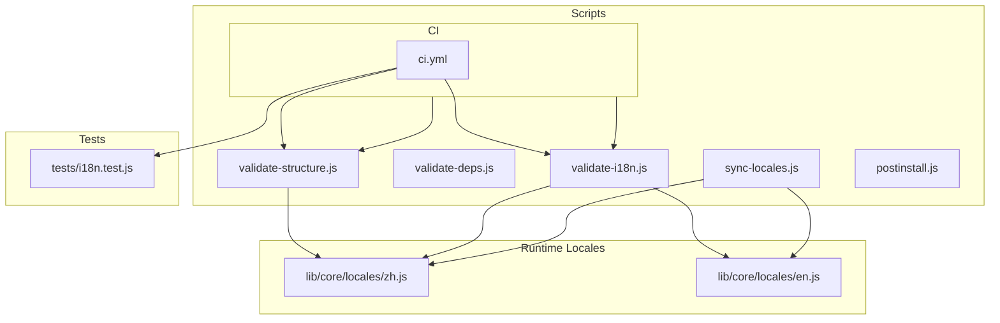
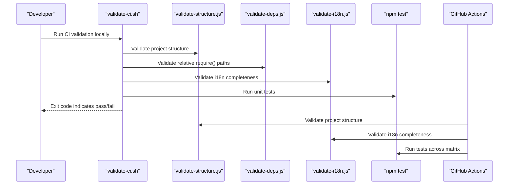
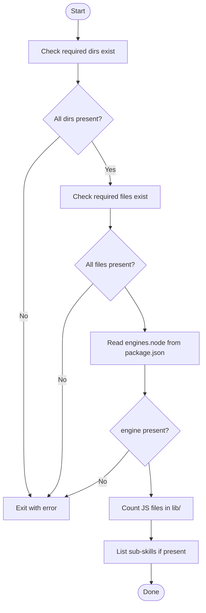
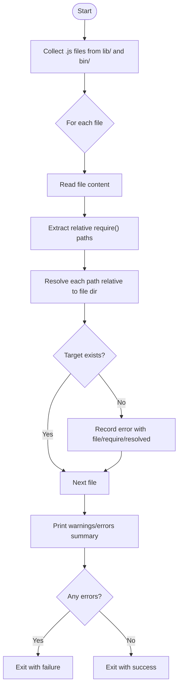
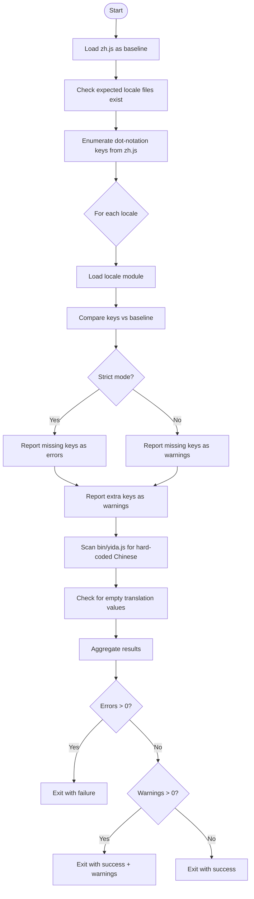
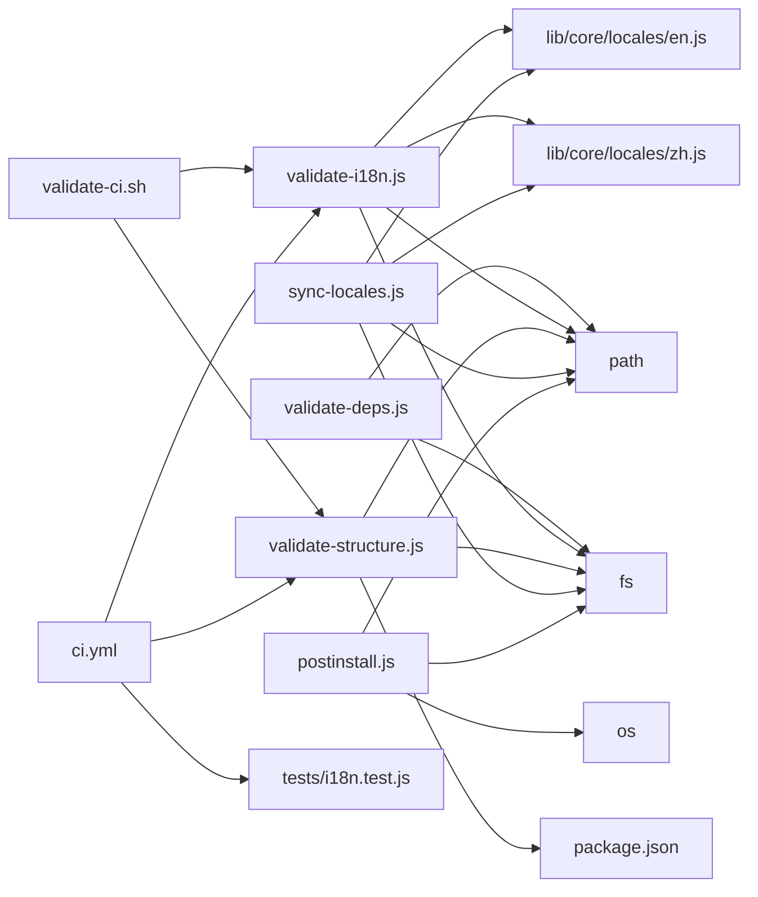

# Validation Framework & Quality Assurance

<cite>
**Referenced Files in This Document**
- [validate-structure.js](file://scripts/validate-structure.js)
- [validate-deps.js](file://scripts/validate-deps.js)
- [validate-i18n.js](file://scripts/validate-i18n.js)
- [validate-ci.sh](file://scripts/validate-ci.sh)
- [ci.yml](file://.github/workflows/ci.yml)
- [package.json](file://package.json)
- [postinstall.js](file://scripts/postinstall.js)
- [sync-locales.js](file://scripts/sync-locales.js)
- [en.js](file://lib/core/locales/en.js)
- [zh.js](file://lib/core/locales/zh.js)
- [i18n.test.js](file://tests/i18n.test.js)
- [.eslintrc.json](file://.eslintrc.json)
</cite>

## Table of Contents
1. [Introduction](#introduction)
2. [Project Structure](#project-structure)
3. [Core Components](#core-components)
4. [Architecture Overview](#architecture-overview)
5. [Detailed Component Analysis](#detailed-component-analysis)
6. [Dependency Analysis](#dependency-analysis)
7. [Performance Considerations](#performance-considerations)
8. [Troubleshooting Guide](#troubleshooting-guide)
9. [Conclusion](#conclusion)
10. [Appendices](#appendices)

## Introduction
This document describes OpenYida’s validation framework and quality assurance scripts. It explains how the project enforces:
- Structural integrity (directories, files, and engine requirements)
- Dependency correctness (relative require() path resolution)
- Internationalization completeness (locale file coverage, key parity, and translation value validation)
- Integration into development workflows and CI/CD pipelines
- Practical guidance for running validations, interpreting results, fixing issues, and optimizing performance for large projects

## Project Structure
OpenYida organizes validation logic under scripts/ and integrates checks into CI via GitHub Actions. The project also includes comprehensive tests for i18n behavior and ESLint rules for static analysis.

**Diagram sources**
- [validate-structure.js:1-67](file://scripts/validate-structure.js#L1-L67)
- [validate-deps.js:1-172](file://scripts/validate-deps.js#L1-L172)
- [validate-i18n.js:1-247](file://scripts/validate-i18n.js#L1-L247)
- [validate-ci.sh:1-25](file://scripts/validate-ci.sh#L1-L25)
- [ci.yml:1-83](file://.github/workflows/ci.yml#L1-L83)
- [sync-locales.js:1-289](file://scripts/sync-locales.js#L1-L289)
- [postinstall.js:1-215](file://scripts/postinstall.js#L1-L215)
- [zh.js:1-785](file://lib/core/locales/zh.js#L1-L785)
- [en.js:1-874](file://lib/core/locales/en.js#L1-L874)
- [i18n.test.js:1-199](file://tests/i18n.test.js#L1-L199)

**Section sources**
- [validate-structure.js:1-67](file://scripts/validate-structure.js#L1-L67)
- [validate-deps.js:1-172](file://scripts/validate-deps.js#L1-L172)
- [validate-i18n.js:1-247](file://scripts/validate-i18n.js#L1-L247)
- [validate-ci.sh:1-25](file://scripts/validate-ci.sh#L1-L25)
- [ci.yml:1-83](file://.github/workflows/ci.yml#L1-L83)
- [package.json:1-74](file://package.json#L1-L74)

## Core Components
- Project structure validator: Ensures required directories and files exist, validates Node engine requirement, counts JS modules, and enumerates sub-skills.
- Dependency validator: Scans lib/ and bin/ for relative require() statements and verifies that referenced targets exist per Node resolution rules.
- Internationalization validator: Confirms locale file presence, key parity against a baseline (zh.js), absence of hard-coded Chinese in the CLI entry, and non-empty translation values.
- CI orchestration script: Installs dependencies, validates structure, checks syntax, runs tests, and reports pass/fail.
- CI workflow: Runs lint, structure, i18n, and syntax checks on multiple OS and Node.js versions; then runs tests.
- Locale synchronization tool: Aligns target locales to the baseline (zh.js) using en.js as a fallback and preserves comments and structure.
- Post-installation integration: Copies skills packs into AI tool configs and prints a friendly welcome message.

**Section sources**
- [validate-structure.js:1-67](file://scripts/validate-structure.js#L1-L67)
- [validate-deps.js:1-172](file://scripts/validate-deps.js#L1-L172)
- [validate-i18n.js:1-247](file://scripts/validate-i18n.js#L1-L247)
- [validate-ci.sh:1-25](file://scripts/validate-ci.sh#L1-L25)
- [ci.yml:1-83](file://.github/workflows/ci.yml#L1-L83)
- [sync-locales.js:1-289](file://scripts/sync-locales.js#L1-L289)
- [postinstall.js:1-215](file://scripts/postinstall.js#L1-L215)

## Architecture Overview
The validation framework is composed of discrete Node.js scripts that are invoked by shell scripts and CI workflows. The i18n pipeline relies on locale modules loaded at runtime for comparison and synchronization.

**Diagram sources**
- [validate-ci.sh:1-25](file://scripts/validate-ci.sh#L1-L25)
- [validate-structure.js:1-67](file://scripts/validate-structure.js#L1-L67)
- [validate-deps.js:1-172](file://scripts/validate-deps.js#L1-L172)
- [validate-i18n.js:1-247](file://scripts/validate-i18n.js#L1-L247)
- [ci.yml:1-83](file://.github/workflows/ci.yml#L1-L83)

## Detailed Component Analysis

### Project Structure Validator
Purpose:
- Enforce required directories and files.
- Verify Node engine requirement in package.json.
- Count JS modules under lib/.
- Enumerate sub-skills under yida-skills/skills/.

Processing logic:
- Iterates over requiredDirs and requiredFiles, reporting missing items and exiting with failure if any are absent.
- Parses package.json to read engines.node and logs it; exits if missing.
- Recursively traverses lib/ to count .js files.
- Reads yida-skills/skills/ if present and logs the number of subdirectories.

**Diagram sources**
- [validate-structure.js:1-67](file://scripts/validate-structure.js#L1-L67)
- [package.json:70-72](file://package.json#L70-L72)

**Section sources**
- [validate-structure.js:1-67](file://scripts/validate-structure.js#L1-L67)
- [package.json:1-74](file://package.json#L1-L74)

### Dependency Validator
Purpose:
- Detect broken relative require() paths in lib/ and bin/.

Processing logic:
- Recursively collects .js files from lib/ and bin/.
- Extracts relative require() expressions using a regular expression supporting single/double quotes.
- Resolves each path relative to the file’s directory and checks existence using Node.js resolution semantics (file, .js extension, or index.js inside directories).
- Aggregates errors with file, require path, and resolved location; prints warnings for unreadable files; exits with failure if any invalid paths are found.

**Diagram sources**
- [validate-deps.js:1-172](file://scripts/validate-deps.js#L1-L172)

**Section sources**
- [validate-deps.js:1-172](file://scripts/validate-deps.js#L1-L172)

### Internationalization Validator
Purpose:
- Ensure locale completeness and consistency:
  - Locale files exist for the supported set.
  - Keys in each locale match the baseline (zh.js).
  - No hard-coded Chinese in the CLI entry (bin/yida.js).
  - No empty translation values.

Processing logic:
- Define expected locales and strictness via CLI argument.
- Load zh.js as the baseline and enumerate all dot-notation keys.
- For each expected locale:
  - Verify file exists and can be required; track missing/unexpected files.
  - Compare keys against baseline; in strict mode, missing keys are errors; otherwise warnings.
  - Report extra keys as warnings.
- Scan bin/yida.js for console output lines containing Chinese without t() wrapper; warn if found.
- Iterate all leaf values in each locale and warn for empty strings.

**Diagram sources**
- [validate-i18n.js:1-247](file://scripts/validate-i18n.js#L1-L247)
- [zh.js:1-785](file://lib/core/locales/zh.js#L1-L785)
- [en.js:1-874](file://lib/core/locales/en.js#L1-L874)

**Section sources**
- [validate-i18n.js:1-247](file://scripts/validate-i18n.js#L1-L247)
- [zh.js:1-785](file://lib/core/locales/zh.js#L1-L785)
- [en.js:1-874](file://lib/core/locales/en.js#L1-L874)

### CI Orchestration Script
Purpose:
- Provide a single-command CI run that installs dependencies, validates structure, checks syntax, and executes tests.

Processing logic:
- Install dependencies with ignore-scripts.
- Run validate-structure.js.
- Run node --check on bin/yida.js and all lib/*.js files.
- Run npm test.

**Section sources**
- [validate-ci.sh:1-25](file://scripts/validate-ci.sh#L1-L25)

### CI Workflow Integration
Purpose:
- Automate quality gates across platforms and Node.js versions.

Processing logic:
- On push and pull_request to main:
  - Cancel in-progress runs in the same workflow.
  - Lint job:
    - Setup Node.js
    - Install dependencies
    - Validate structure
    - Validate i18n
    - Run lint (including unresolved path detection)
    - Check JS syntax across bin/ and lib/
  - Test job:
    - Matrix across OS and Node.js versions
    - Install dependencies
    - Run tests

**Section sources**
- [ci.yml:1-83](file://.github/workflows/ci.yml#L1-L83)

### Locale Synchronization Tool
Purpose:
- Keep target locales aligned with the baseline (zh.js), using en.js as a fallback, and preserve structure/comments.

Processing logic:
- Load zh.js and en.js as reference.
- For each target locale:
  - Build a new object preserving zh.js key order.
  - Prefer existing values; otherwise fill from en.js; finally fall back to zh.js.
  - Remove keys not present in zh.js.
  - Optionally write back to disk (or dry-run preview).
  - Preserve file header and section comments.

**Section sources**
- [sync-locales.js:1-289](file://scripts/sync-locales.js#L1-L289)
- [zh.js:1-785](file://lib/core/locales/zh.js#L1-L785)
- [en.js:1-874](file://lib/core/locales/en.js#L1-L874)

### Post-Installation Integration
Purpose:
- Copy yida-skills into AI tool configuration directories and print a welcome message.

Processing logic:
- Determine home directory and package root.
- Attempt to copy yida-skills into known AI tool config roots.
- Clean up old symlinks/directories before copying.
- Print a colored, structured welcome message on first install/update.

**Section sources**
- [postinstall.js:1-215](file://scripts/postinstall.js#L1-L215)

## Dependency Analysis
The validation scripts depend on:
- Node.js built-ins (fs, path, child_process).
- Locale modules loaded dynamically (zh.js, en.js).
- CI environment variables and matrix settings.
- ESLint configuration for import/no-unresolved enforcement.

**Diagram sources**
- [validate-deps.js:1-172](file://scripts/validate-deps.js#L1-L172)
- [validate-i18n.js:1-247](file://scripts/validate-i18n.js#L1-L247)
- [validate-structure.js:1-67](file://scripts/validate-structure.js#L1-L67)
- [sync-locales.js:1-289](file://scripts/sync-locales.js#L1-L289)
- [postinstall.js:1-215](file://scripts/postinstall.js#L1-L215)
- [validate-ci.sh:1-25](file://scripts/validate-ci.sh#L1-L25)
- [ci.yml:1-83](file://.github/workflows/ci.yml#L1-L83)
- [i18n.test.js:1-199](file://tests/i18n.test.js#L1-L199)
- [package.json:1-74](file://package.json#L1-L74)

**Section sources**
- [validate-deps.js:1-172](file://scripts/validate-deps.js#L1-L172)
- [validate-i18n.js:1-247](file://scripts/validate-i18n.js#L1-L247)
- [validate-structure.js:1-67](file://scripts/validate-structure.js#L1-L67)
- [sync-locales.js:1-289](file://scripts/sync-locales.js#L1-L289)
- [postinstall.js:1-215](file://scripts/postinstall.js#L1-L215)
- [validate-ci.sh:1-25](file://scripts/validate-ci.sh#L1-L25)
- [ci.yml:1-83](file://.github/workflows/ci.yml#L1-L83)
- [i18n.test.js:1-199](file://tests/i18n.test.js#L1-L199)
- [package.json:1-74](file://package.json#L1-L74)

## Performance Considerations
- validate-structure.js
  - Directory and file existence checks are O(n) over required sets.
  - JS counting is O(n) over files; recursion depth equals directory nesting.
  - Recommendation: Keep requiredDirs/requiredFiles minimal and avoid deep nesting for large projects.

- validate-deps.js
  - Scans all .js files under lib/ and bin/ and extracts require() patterns.
  - Complexity proportional to total file count and combined content length.
  - Recommendation: Exclude large generated directories from scan; cache results if running frequently.

- validate-i18n.js
  - Loads multiple locale modules and recursively enumerates keys.
  - Complexity proportional to number of locales × average key depth.
  - Recommendation: Limit locale set to SUPPORTED_LANGUAGES; avoid loading locales unnecessarily outside CI.

- CI orchestration
  - validate-ci.sh runs node --check on all lib/*.js; consider batching or parallelizing if the number of files grows.
  - ci.yml runs tests across a matrix; keep matrix sizes reasonable to avoid long queues.

[No sources needed since this section provides general guidance]

## Troubleshooting Guide
Common issues and resolutions:

- Missing required directories or files
  - Symptom: validate-structure.js reports missing items and exits.
  - Resolution: Create missing directories/files; ensure package.json includes engines.node.

- Broken relative require() paths
  - Symptom: validate-deps.js lists invalid require() targets.
  - Resolution: Adjust relative paths to match actual file/directory locations; ensure index.js exists for directories.

- Locale file gaps or mismatched keys
  - Symptom: validate-i18n.js reports missing or extra keys; warnings for empty values.
  - Resolution: Use sync-locales.js to align target locales to zh.js; review missing keys and add translations.

- Hard-coded Chinese in CLI entry
  - Symptom: validate-i18n.js warns about console output lines with Chinese.
  - Resolution: Wrap strings with translation keys and use the i18n function.

- CI failures
  - Symptom: CI jobs fail during lint, structure, i18n, or syntax checks.
  - Resolution: Run validate-ci.sh locally to reproduce; fix reported issues; ensure Node.js versions satisfy engines.node.

- ESLint unresolved import errors
  - Symptom: Lint fails with import/no-unresolved.
  - Resolution: Ensure modules exist; adjust resolver settings if using custom extensions.

**Section sources**
- [validate-structure.js:1-67](file://scripts/validate-structure.js#L1-L67)
- [validate-deps.js:1-172](file://scripts/validate-deps.js#L1-L172)
- [validate-i18n.js:1-247](file://scripts/validate-i18n.js#L1-L247)
- [validate-ci.sh:1-25](file://scripts/validate-ci.sh#L1-L25)
- [ci.yml:1-83](file://.github/workflows/ci.yml#L1-L83)
- [.eslintrc.json:1-45](file://.eslintrc.json#L1-L45)

## Conclusion
OpenYida’s validation framework provides robust checks for project structure, dependency integrity, and internationalization consistency. By integrating these checks into local scripts and CI workflows, teams can maintain high-quality standards, automate quality gates, and scale validations efficiently across large codebases.

[No sources needed since this section summarizes without analyzing specific files]

## Appendices

### Practical Examples

- Running validations locally
  - Run the CI orchestration script to validate structure, syntax, and tests:
    - [validate-ci.sh:1-25](file://scripts/validate-ci.sh#L1-L25)

- Interpreting validation results
  - Structure validation:
    - Missing directories or files cause immediate failure.
    - Engines field missing in package.json causes failure.
    - JS module counts and sub-skills enumeration are informational.
    - [validate-structure.js:1-67](file://scripts/validate-structure.js#L1-L67)
  - Dependency validation:
    - Errors indicate broken require() paths; warnings indicate unreadable files.
    - [validate-deps.js:1-172](file://scripts/validate-deps.js#L1-L172)
  - Internationalization validation:
    - Missing locale files, key mismatches, hard-coded Chinese, and empty values are reported.
    - [validate-i18n.js:1-247](file://scripts/validate-i18n.js#L1-L247)

- Fixing common structural issues
  - Ensure required directories and files exist; define engines.node in package.json.
  - [validate-structure.js:1-67](file://scripts/validate-structure.js#L1-L67)
  - [package.json:70-72](file://package.json#L70-L72)

- Resolving dependency conflicts
  - Correct relative require() paths; ensure referenced files or index.js exist.
  - [validate-deps.js:1-172](file://scripts/validate-deps.js#L1-L172)

- Maintaining translation accuracy
  - Use sync-locales.js to align target locales to zh.js with en.js fallback.
  - [sync-locales.js:1-289](file://scripts/sync-locales.js#L1-L289)
  - Validate i18n completeness regularly.
  - [validate-i18n.js:1-247](file://scripts/validate-i18n.js#L1-L247)

- Integrating into workflows and CI/CD
  - Use validate-ci.sh for local CI-like runs.
  - [validate-ci.sh:1-25](file://scripts/validate-ci.sh#L1-L25)
  - GitHub Actions workflow runs lint, structure, i18n, syntax checks, and tests.
  - [ci.yml:1-83](file://.github/workflows/ci.yml#L1-L83)

- Validation rule customization
  - Modify required directories/files and engines.node expectations in structure validator.
  - [validate-structure.js:1-67](file://scripts/validate-structure.js#L1-L67)
  - Adjust SUPPORTED_LANGUAGES and strictness in i18n validator.
  - [validate-i18n.js:1-247](file://scripts/validate-i18n.js#L1-L247)
  - Tune ESLint rules for import/no-unresolved and other static analysis preferences.
  - [.eslintrc.json:1-45](file://.eslintrc.json#L1-L45)

- Exception handling and performance optimization
  - validate-deps.js handles unreadable files with warnings and continues.
  - validate-i18n.js loads modules safely and reports load failures.
  - For large projects, limit locale sets, avoid scanning generated directories, and consider caching results.
  - [validate-deps.js:1-172](file://scripts/validate-deps.js#L1-L172)
  - [validate-i18n.js:1-247](file://scripts/validate-i18n.js#L1-L247)