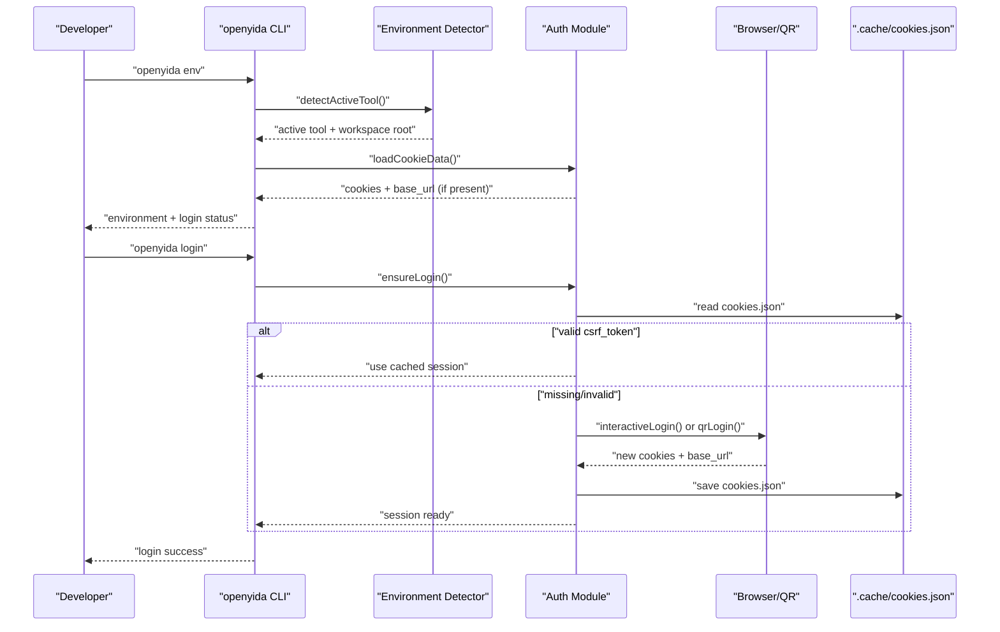
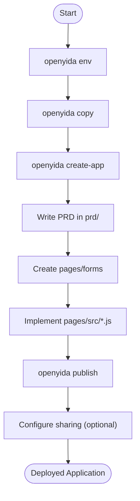

# Getting Started

<cite>
**Referenced Files in This Document**
- [package.json](file://package.json)
- [README.md](file://README.md)
- [bin/yida.js](file://bin/yida.js)
- [lib/core/env.js](file://lib/core/env.js)
- [lib/core/copy.js](file://lib/core/copy.js)
- [lib/core/utils.js](file://lib/core/utils.js)
- [lib/auth/login.js](file://lib/auth/login.js)
- [lib/auth/qr-login.js](file://lib/auth/qr-login.js)
- [lib/auth/auth.js](file://lib/auth/auth.js)
- [lib/auth/org.js](file://lib/auth/org.js)
- [lib/app/create-app.js](file://lib/app/create-app.js)
- [yida-skills/SKILL.md](file://yida-skills/SKILL.md)
- [yida-skills/skills/yida-login/SKILL.md](file://yida-skills/skills/yida-login/SKILL.md)
- [yida-skills/skills/yida-create-app/SKILL.md](file://yida-skills/skills/yida-create-app/SKILL.md)
- [project/config.json](file://project/config.json)
</cite>

## Table of Contents
1. [Introduction](#introduction)
2. [Installation and System Requirements](#installation-and-system-requirements)
3. [Zero-Configuration Out-of-the-Box Experience](#zero-configuration-out-of-the-box-experience)
4. [Supported AI Coding Platforms](#supported-ai-coding-platforms)
5. [Initial Setup Workflow](#initial-setup-workflow)
6. [Authentication and Session Management](#authentication-and-session-management)
7. [Basic Workflow: From Requirements to Deployed Application](#basic-workflow-from-requirements-to-deployed-application)
8. [Common First Commands](#common-first-commands)
9. [Troubleshooting Guide](#troubleshooting-guide)
10. [Next Steps](#next-steps)

## Introduction
OpenYida is a CLI-powered low-code development toolkit that enables building Yida applications with AI. It emphasizes zero configuration and immediate productivity: install once, integrate with your preferred AI coding tool, and start generating applications from natural language requirements. This guide focuses on rapid onboarding, covering installation, environment verification, authentication, and the first steps to create and deploy a Yida application.

## Installation and System Requirements
- Install globally via npm:
  - Command: npm install -g openyida
- System requirement:
  - Node.js version ≥ 18 (enforced by engines field)

Verification:
- Confirm installation and version:
  - Command: openyida --version
- Confirm supported AI tools are detected:
  - Command: openyida env

**Section sources**
- [package.json:69-71](file://package.json#L69-L71)
- [README.md:28-31](file://README.md#L28-L31)
- [README.md:69-75](file://README.md#L69-L75)

## Zero-Configuration Out-of-the-Box Experience
OpenYida is designed to work immediately after installation:
- AI coding tools (e.g., Claude Code, Aone Copilot, OpenCode, Cursor, VS Code, Qoder, Wukong) can directly invoke OpenYida commands.
- The CLI automatically detects your active AI tool environment and project workspace.
- Initial project scaffolding and skills installation are handled by the copy command.

Key behaviors:
- Automatic environment detection and project root resolution.
- Seamless integration with AI agents without manual configuration.

**Section sources**
- [README.md:26-40](file://README.md#L26-L40)
- [yida-skills/SKILL.md:33](file://yida-skills/SKILL.md#L33)
- [lib/core/env.js:47-76](file://lib/core/env.js#L47-L76)

## Supported AI Coding Platforms
OpenYida supports the following AI coding tools:
- Claude Code
- Aone Copilot
- OpenCode
- Cursor
- Visual Studio Code
- Qoder
- Wukong

These platforms are recognized by environment variables and configuration directories. The CLI’s environment detector identifies the active tool and sets the appropriate workspace root.

**Section sources**
- [README.md:42-53](file://README.md#L42-L53)
- [lib/core/env.js:32-109](file://lib/core/env.js#L32-L109)

## Initial Setup Workflow
Follow these steps to prepare your environment and initialize a project:

1. Install the CLI globally:
   - Command: npm install -g openyida
2. Verify Node.js version and AI tool detection:
   - Command: openyida env
3. Initialize the project workspace and skills:
   - Command: openyida copy
   - Notes:
     - For Wukong, project is placed under ~/.real/workspace/project.
     - For other tools, project is placed under the current working directory.
4. Confirm the presence of project/ and skills:
   - Run: openyida env again to see “project ready” indicators.

**Section sources**
- [README.md:28-31](file://README.md#L28-L31)
- [lib/core/env.js:47-76](file://lib/core/env.js#L47-L76)
- [lib/core/copy.js:255-355](file://lib/core/copy.js#L255-L355)

## Authentication and Session Management
OpenYida manages login sessions automatically. It reads from and writes to a local cookie cache (.cache/cookies.json) and supports two login modes:

- Standard mode (Playwright):
  - Uses a headed browser to display the login page and wait for QR scan or DingTalk login.
  - On success, saves cookies and base_url to .cache/cookies.json.
- Terminal QR mode:
  - Generates a terminal QR code and handles scanning and organization selection.

Automatic flows:
- If a valid cookie cache exists, OpenYida extracts csrf_token, corp_id, and user_id without prompting.
- If missing or invalid, it triggers login automatically.
- Organization switching is supported without re-authentication.

Important commands:
- openyida login (standard or QR mode)
- openyida auth status (inspect current login state)
- openyida auth refresh (refresh CSRF token from cache)
- openyida logout (clear local cookie cache)

**Diagram sources**
- [lib/core/env.js:47-76](file://lib/core/env.js#L47-L76)
- [lib/auth/login.js:134-155](file://lib/auth/login.js#L134-L155)
- [lib/auth/qr-login.js:499-614](file://lib/auth/qr-login.js#L499-L614)

**Section sources**
- [yida-skills/SKILL.md:33-34](file://yida-skills/SKILL.md#L33-L34)
- [lib/auth/login.js:61-93](file://lib/auth/login.js#L61-L93)
- [lib/auth/login.js:134-155](file://lib/auth/login.js#L134-L155)
- [lib/auth/qr-login.js:499-614](file://lib/auth/qr-login.js#L499-L614)
- [lib/auth/auth.js:61-127](file://lib/auth/auth.js#L61-L127)
- [lib/auth/auth.js:137-160](file://lib/auth/auth.js#L137-L160)
- [lib/auth/auth.js:168-210](file://lib/auth/auth.js#L168-L210)
- [lib/auth/auth.js:217-229](file://lib/auth/auth.js#L217-L229)

## Basic Workflow: From Requirements to Deployed Application
The recommended end-to-end workflow:

1. Detect environment and login:
   - Command: openyida env
2. Initialize project and skills:
   - Command: openyida copy
3. Create an application:
   - Command: openyida create-app "<AppName>"
   - Output includes appType and admin URL
4. Write requirements in PRD:
   - Create or update prd/<project>.md with detailed requirements
5. Create pages and forms:
   - Use create-page and create-form to define UI and data models
6. Develop custom pages:
   - Implement pages/src/<project>.js per guidelines
7. Publish:
   - Command: openyida publish <source> <appType> <formUuid>
8. Share:
   - Configure public access or organization sharing as needed

**Diagram sources**
- [yida-skills/SKILL.md:99-121](file://yida-skills/SKILL.md#L99-L121)
- [lib/app/create-app.js:81-192](file://lib/app/create-app.js#L81-L192)

**Section sources**
- [yida-skills/SKILL.md:99-121](file://yida-skills/SKILL.md#L99-L121)
- [yida-skills/skills/yida-create-app/SKILL.md:31-81](file://yida-skills/skills/yida-create-app/SKILL.md#L31-L81)
- [lib/app/create-app.js:81-192](file://lib/app/create-app.js#L81-L192)

## Common First Commands
- Environment and authentication:
  - openyida env
  - openyida login
  - openyida auth status
  - openyida auth refresh
  - openyida logout
- Project initialization:
  - openyida copy
- Application lifecycle:
  - openyida create-app "<Name>"
  - openyida create-page <appType> "<PageName>"
  - openyida create-form create <appType> "<FormName>" <fields>
  - openyida publish <source> <appType> <formUuid>
  - openyida export <appType> [output]
  - openyida import <file> [name]

Notes:
- Commands are designed to be invoked directly from AI coding tools.
- Many commands automatically trigger login if needed.

**Section sources**
- [README.md:77-135](file://README.md#L77-L135)
- [bin/yida.js:152-512](file://bin/yida.js#L152-L512)

## Troubleshooting Guide
Common issues and resolutions:

- Node.js version mismatch:
  - Symptom: Engine requirement not met.
  - Resolution: Upgrade Node.js to version ≥ 18.
  - Reference: engines field in package.json.

- AI tool environment not detected:
  - Symptom: “No active tool” or “project not ready.”
  - Resolution: Ensure you are inside a project directory recognized by the active AI tool, or run openyida copy to scaffold project/ and skills.

- Login failures or expired sessions:
  - Symptom: Requests indicate login expired or CSRF token invalid.
  - Resolution:
    - Run openyida login to re-authenticate.
    - Use openyida auth refresh to refresh CSRF token from cache.
    - Use openyida logout to clear stale cookies and retry.

- Organization mismatch:
  - Symptom: CorpId mismatch errors.
  - Resolution: Use openyida org switch --corp-id <corpId> to switch without re-login.

- Network connectivity:
  - Symptom: Cannot reach aliwork.com.
  - Resolution: Check network access and firewall settings.

- Skills or project missing:
  - Symptom: Skills not found or project directory missing.
  - Resolution: Run openyida copy to install skills and scaffold project/.

**Section sources**
- [package.json:69-71](file://package.json#L69-L71)
- [lib/core/env.js:95-168](file://lib/core/env.js#L95-L168)
- [lib/auth/login.js:61-93](file://lib/auth/login.js#L61-L93)
- [lib/auth/auth.js:168-210](file://lib/auth/auth.js#L168-L210)
- [lib/auth/org.js:190-313](file://lib/auth/org.js#L190-L313)
- [lib/core/copy.js:255-355](file://lib/core/copy.js#L255-L355)

## Next Steps
- Explore AI prompts and examples:
  - Refer to the Common Prompts section in the repository README.
- Dive deeper into skills:
  - Review yida-skills/SKILL.md and individual skill docs (e.g., yida-login, yida-create-app).
- Advanced topics:
  - Connectors, reports, permissions, and publishing workflows are documented in the CLI help and skill references.

**Section sources**
- [README.md:167-178](file://README.md#L167-L178)
- [yida-skills/SKILL.md:124-146](file://yida-skills/SKILL.md#L124-L146)