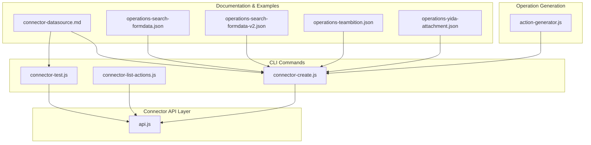
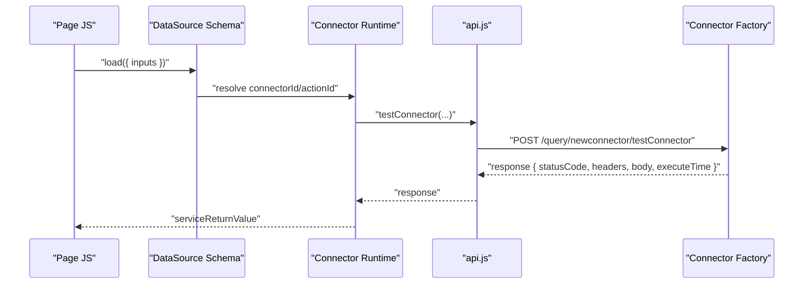
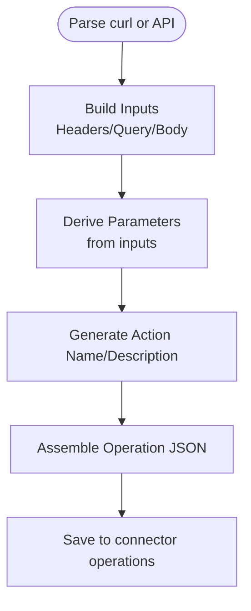
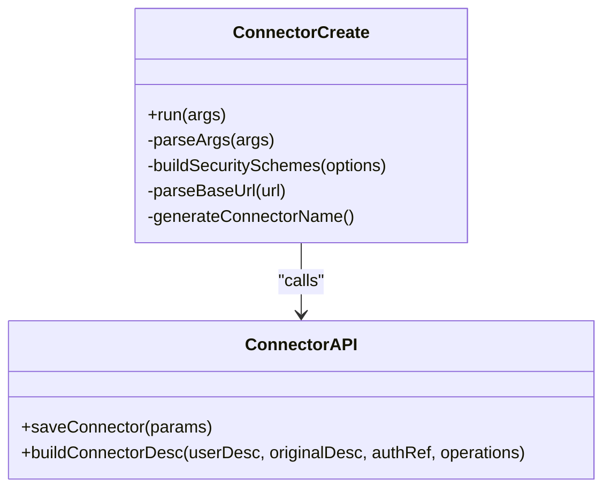
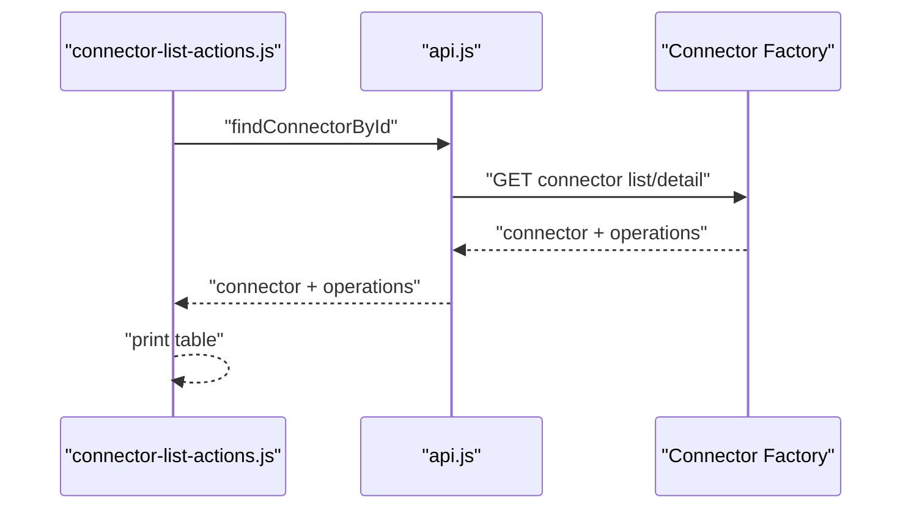
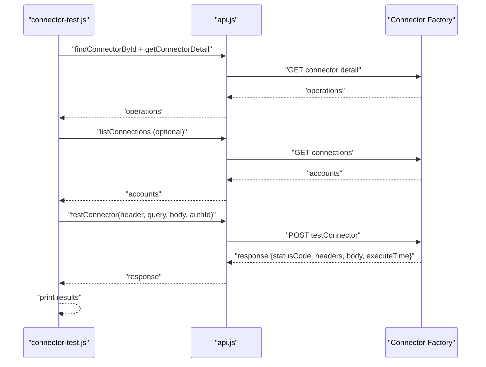
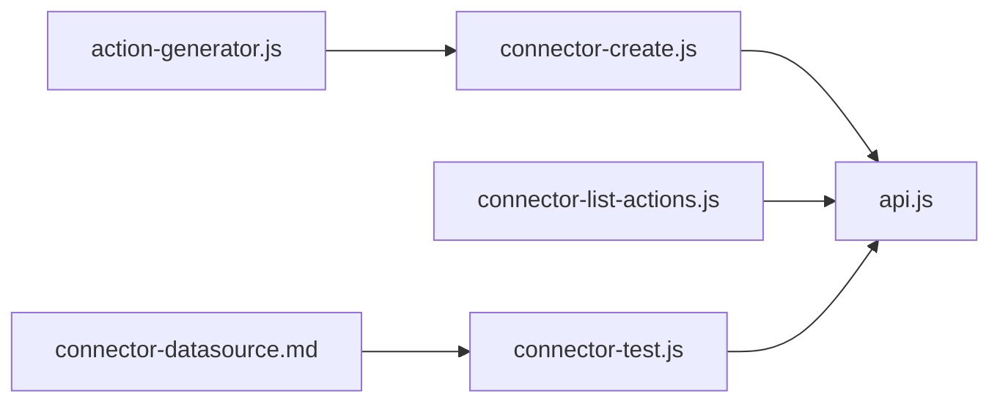

# Connector Actions & Operation Management

<cite>
**Referenced Files in This Document**
- [connector-datasource.md](file://yida-skills/reference/connector-datasource.md)
- [SKILL.md](file://yida-skills/skills/yida-connector/SKILL.md)
- [action-generator.js](file://lib/connector/action-generator.js)
- [api.js](file://lib/connector/api.js)
- [connector-create.js](file://lib/connector/connector-create.js)
- [connector-list-actions.js](file://lib/connector/connector-list-actions.js)
- [connector-test.js](file://lib/connector/connector-test.js)
- [operations-search-formdata.json](file://yida-skills/skills/yida-connector/examples/operations-search-formdata.json)
- [operations-search-formdata-v2.json](file://yida-skills/skills/yida-connector/examples/operations-search-formdata-v2.json)
- [operations-teambition.json](file://yida-skills/skills/yida-connector/examples/operations-teambition.json)
- [operations-yida-attachment.json](file://yida-skills/skills/yida-connector/examples/operations-yida-attachment.json)
</cite>

## Table of Contents
1. [Introduction](#introduction)
2. [Project Structure](#project-structure)
3. [Core Components](#core-components)
4. [Architecture Overview](#architecture-overview)
5. [Detailed Component Analysis](#detailed-component-analysis)
6. [Dependency Analysis](#dependency-analysis)
7. [Performance Considerations](#performance-considerations)
8. [Troubleshooting Guide](#troubleshooting-guide)
9. [Conclusion](#conclusion)
10. [Appendices](#appendices)

## Introduction
This document explains how OpenYida’s HTTP connector system defines, manages, and executes connector actions (operations). It covers operation structure and configuration (HTTP methods, endpoint paths, request/response transformations, parameter mappings), how to define custom operations for complex API interactions, execution contexts and variable substitution, dynamic parameter handling, advanced features (conditional logic, error handling, retries, timeouts), testing and validation, integration with business processes, and performance optimization for high-volume and batch scenarios. Practical examples are included for search filters, bulk operations, and webhook handling.

## Project Structure
OpenYida’s connector subsystem consists of:
- CLI commands for creating/updating connectors, listing actions, and testing operations
- Utilities for building connector descriptions, authenticating requests, and invoking platform APIs
- Operation templates and examples under the skills reference for common integrations



**Diagram sources**
- [connector-create.js:1-328](file://lib/connector/connector-create.js#L1-L328)
- [connector-list-actions.js:1-75](file://lib/connector/connector-list-actions.js#L1-L75)
- [connector-test.js:1-225](file://lib/connector/connector-test.js#L1-L225)
- [api.js:1-379](file://lib/connector/api.js#L1-L379)
- [action-generator.js:1-253](file://lib/connector/action-generator.js#L1-L253)
- [connector-datasource.md:1-388](file://yida-skills/reference/connector-datasource.md#L1-L388)
- [operations-search-formdata.json](file://yida-skills/skills/yida-connector/examples/operations-search-formdata.json)
- [operations-search-formdata-v2.json](file://yida-skills/skills/yida-connector/examples/operations-search-formdata-v2.json)
- [operations-teambition.json](file://yida-skills/skills/yida-connector/examples/operations-teambition.json)
- [operations-yida-attachment.json](file://yida-skills/skills/yida-connector/examples/operations-yida-attachment.json)

**Section sources**
- [connector-create.js:1-328](file://lib/connector/connector-create.js#L1-L328)
- [connector-list-actions.js:1-75](file://lib/connector/connector-list-actions.js#L1-L75)
- [connector-test.js:1-225](file://lib/connector/connector-test.js#L1-L225)
- [api.js:1-379](file://lib/connector/api.js#L1-L379)
- [action-generator.js:1-253](file://lib/connector/action-generator.js#L1-L253)
- [connector-datasource.md:1-388](file://yida-skills/reference/connector-datasource.md#L1-L388)

## Core Components
- Operation definition schema: Each operation includes identifiers, HTTP method, URL/path, inputs (Headers, Query, Body), parameters, responses, and outputs. The generator builds these from curl or API docs.
- Connector creation and update: CLI supports creating HTTP connectors with embedded operations and updating existing connectors’ metadata/description.
- Listing and testing actions: CLI lists operations per connector and tests them with built-in parameter scaffolding.
- Execution context in pages: Data sources in form/page schemas bind connectorId/actionId and pass inputs; runtime resolves serviceReturnValue automatically.

Key capabilities:
- Parameter mapping: Inputs map to Path/Query/Header/Body; parameters default values are derived from operation definitions.
- Authentication schemes: Supports basic auth, API key, DingTalk, Aliyun API Gateway, DingTrust, and none.
- Testing pipeline: CLI fetches connector detail, selects operation, optionally lists connections, builds test payload, invokes test endpoint, prints status/body/execution time.

**Section sources**
- [action-generator.js:103-247](file://lib/connector/action-generator.js#L103-L247)
- [connector-create.js:210-325](file://lib/connector/connector-create.js#L210-L325)
- [connector-list-actions.js:20-72](file://lib/connector/connector-list-actions.js#L20-L72)
- [connector-test.js:98-222](file://lib/connector/connector-test.js#L98-L222)
- [connector-datasource.md:106-161](file://yida-skills/reference/connector-datasource.md#L106-L161)

## Architecture Overview
The connector system orchestrates CLI-driven creation/testing against the platform’s connector factory and connection endpoints. Operations are stored on the connector and later executed via page data sources.

```mermaid
sequenceDiagram
participant Dev as "Developer CLI"
participant Create as "connector-create.js"
participant API as "api.js"
participant Platform as "Connector Factory"
Dev->>Create : "create/update connector with operations"
Create->>API : "saveConnector(params)"
API->>Platform : "POST /query/newconnector/createOrUpdateConnector"
Platform-->>API : "result with connectorId"
API-->>Create : "connectorId"
Create-->>Dev : "success + detail URL"
```

**Diagram sources**
- [connector-create.js:210-325](file://lib/connector/connector-create.js#L210-L325)
- [api.js:247-284](file://lib/connector/api.js#L247-L284)



**Diagram sources**
- [connector-datasource.md:141-161](file://yida-skills/reference/connector-datasource.md#L141-L161)
- [connector-test.js:174-181](file://lib/connector/connector-test.js#L174-L181)
- [api.js:343-362](file://lib/connector/api.js#L343-L362)

## Detailed Component Analysis

### Operation Definition and Generation
- Operation fields include identifiers, method, URL, inputs (Headers, Query, Body), parameters, responses, and outputs. The generator derives meaningful names/descriptions from URL segments and HTTP method, and auto-populates inputs from curl body/query/header.
- Parameters are derived from inputs to support default values and test scaffolding.



**Diagram sources**
- [action-generator.js:103-247](file://lib/connector/action-generator.js#L103-L247)

**Section sources**
- [action-generator.js:11-95](file://lib/connector/action-generator.js#L11-L95)
- [action-generator.js:103-247](file://lib/connector/action-generator.js#L103-L247)

### Connector Creation and Metadata
- CLI supports creating HTTP connectors with embedded operations and optional authentication schemes. Security schemes are serialized and attached to the connector.
- Description metadata includes creation/update timestamps and authorship, auto-generated from operations or user-provided text.



**Diagram sources**
- [connector-create.js:74-152](file://lib/connector/connector-create.js#L74-L152)
- [connector-create.js:210-325](file://lib/connector/connector-create.js#L210-L325)
- [api.js:99-135](file://lib/connector/api.js#L99-L135)
- [api.js:247-284](file://lib/connector/api.js#L247-L284)

**Section sources**
- [connector-create.js:74-152](file://lib/connector/connector-create.js#L74-L152)
- [connector-create.js:210-325](file://lib/connector/connector-create.js#L210-L325)
- [api.js:99-135](file://lib/connector/api.js#L99-L135)
- [api.js:247-284](file://lib/connector/api.js#L247-L284)

### Listing and Testing Operations
- Listing actions prints a table of operationId, summary, method, and URL.
- Testing loads the connector detail, finds the target operation, optionally lists connections, builds test parameters (headers/query/body) from defaults and user overrides, and posts to the test endpoint. Results include status, headers, body, and execution time.



**Diagram sources**
- [connector-list-actions.js:20-72](file://lib/connector/connector-list-actions.js#L20-L72)
- [api.js:180-207](file://lib/connector/api.js#L180-L207)
- [api.js:228-237](file://lib/connector/api.js#L228-L237)



**Diagram sources**
- [connector-test.js:98-222](file://lib/connector/connector-test.js#L98-L222)
- [api.js:114-135](file://lib/connector/api.js#L114-L135)
- [api.js:294-303](file://lib/connector/api.js#L294-L303)
- [api.js:343-362](file://lib/connector/api.js#L343-L362)

**Section sources**
- [connector-list-actions.js:20-72](file://lib/connector/connector-list-actions.js#L20-L72)
- [connector-test.js:98-222](file://lib/connector/connector-test.js#L98-L222)
- [api.js:114-135](file://lib/connector/api.js#L114-L135)
- [api.js:294-303](file://lib/connector/api.js#L294-L303)
- [api.js:343-362](file://lib/connector/api.js#L343-L362)

### Execution Context and Variable Substitution
- In page/form schemas, data sources specify connectorId, actionId, and requestConfig.inputs (JSON string). The runtime resolves serviceReturnValue automatically.
- Inputs are mapped to Path/Query/Header/Body; default values come from operation.parameters.

Practical guidance:
- Use requestConfig.inputs to pass dynamic values from page context.
- For variable substitution, embed placeholders in inputs and replace them before calling load.

**Section sources**
- [connector-datasource.md:106-161](file://yida-skills/reference/connector-datasource.md#L106-L161)

### Advanced Operation Features
- Conditional logic: Define multiple operations per connector and route execution based on runtime conditions in page JS.
- Error handling: Test results surface hasError and errorMsg; handle in page promises and display user-friendly messages.
- Retries: Implement client-side retry loops around load() with exponential backoff in page JS.
- Timeouts: Include a timeout parameter in Query/Body where supported by the target API; monitor executeTime in test results.

**Section sources**
- [connector-test.js:186-219](file://lib/connector/connector-test.js#L186-L219)

### Operation Testing and Validation
- Use the CLI to validate operations end-to-end: select connector, choose action, optionally pick connection, supply params, and inspect response.
- Validate response shape using outputs in operation definitions; adjust operations to normalize response structures.

**Section sources**
- [connector-test.js:98-222](file://lib/connector/connector-test.js#L98-L222)
- [action-generator.js:237-244](file://lib/connector/action-generator.js#L237-L244)

### Business Process Integration
- Data sources in page schemas bind connectorId/actionId and inputs; results are unwrapped serviceReturnValue for convenience.
- Map connector outputs to form fields or workflow variables; use didFetch/onError hooks in page JS for side effects.

**Section sources**
- [connector-datasource.md:141-161](file://yida-skills/reference/connector-datasource.md#L141-L161)

### Practical Operation Patterns
- Search filters: Define Query inputs for filter keys; populate from form controls; use list/search operations.
- Bulk operations: Use Body inputs to send arrays; design operations to accept batch payloads; validate response per-item outcomes.
- Webhook handling: Design a dedicated endpoint operation with Body containing webhook payload; parse and transform into business events.

Examples in repository:
- Search forms and attachments: See operation examples under skills.

**Section sources**
- [operations-search-formdata.json](file://yida-skills/skills/yida-connector/examples/operations-search-formdata.json)
- [operations-search-formdata-v2.json](file://yida-skills/skills/yida-connector/examples/operations-search-formdata-v2.json)
- [operations-teambition.json](file://yida-skills/skills/yida-connector/examples/operations-teambition.json)
- [operations-yida-attachment.json](file://yida-skills/skills/yida-connector/examples/operations-yida-attachment.json)

## Dependency Analysis
- CLI commands depend on the connector API layer for authentication, HTTP transport, and platform interactions.
- Operation generation depends on curl parsing and heuristic mapping of URL/method to human-readable names.
- Page execution depends on connector metadata and operation definitions stored on the platform.



**Diagram sources**
- [action-generator.js:103-247](file://lib/connector/action-generator.js#L103-L247)
- [connector-create.js:210-325](file://lib/connector/connector-create.js#L210-L325)
- [connector-list-actions.js:20-72](file://lib/connector/connector-list-actions.js#L20-L72)
- [connector-test.js:98-222](file://lib/connector/connector-test.js#L98-L222)
- [api.js:114-135](file://lib/connector/api.js#L114-L135)
- [connector-datasource.md:141-161](file://yida-skills/reference/connector-datasource.md#L141-L161)

**Section sources**
- [action-generator.js:103-247](file://lib/connector/action-generator.js#L103-L247)
- [connector-create.js:210-325](file://lib/connector/connector-create.js#L210-L325)
- [connector-list-actions.js:20-72](file://lib/connector/connector-list-actions.js#L20-L72)
- [connector-test.js:98-222](file://lib/connector/connector-test.js#L98-L222)
- [api.js:114-135](file://lib/connector/api.js#L114-L135)
- [connector-datasource.md:141-161](file://yida-skills/reference/connector-datasource.md#L141-L161)

## Performance Considerations
- Minimize round-trips: Combine related operations into a single connector where feasible; leverage batch endpoints when available.
- Normalize responses: Use operation outputs to standardize shapes across heterogeneous APIs.
- Caching: For read-heavy operations, cache results at the page level and invalidate on write.
- Concurrency control: Limit concurrent executions in page JS; queue or throttle to avoid overload.
- Timeout tuning: Set appropriate timeouts in Query/Body and monitor executeTime; fail fast on slow endpoints.

## Troubleshooting Guide
Common issues and resolutions:
- Authentication errors: Verify connector auth mode and credentials; confirm connectionId selection when required.
- Missing actionId: List actions for the connector and ensure operationId matches.
- Parsing failures: Validate JSON in inputs/body; ensure requestConfig.inputs is a valid JSON string.
- Slow responses: Inspect executeTime; consider retries and timeouts; optimize endpoint usage.

**Section sources**
- [connector-test.js:186-219](file://lib/connector/connector-test.js#L186-L219)
- [connector-list-actions.js:49-54](file://lib/connector/connector-list-actions.js#L49-L54)
- [connector-datasource.md:261-268](file://yida-skills/reference/connector-datasource.md#L261-L268)

## Conclusion
OpenYida’s connector system provides a robust framework for defining, managing, and executing HTTP operations. By structuring operations with clear inputs/parameters, leveraging CLI tooling for creation/testing, and integrating operations into page data sources, teams can build reliable integrations. Advanced features like retries, timeouts, and response normalization enable resilient, high-performance workflows.

## Appendices
- Authentication schemes supported during connector creation
  - None, Basic, API Key, DingTalk, Aliyun API Gateway, DingTrust
- Example operation sets for common integrations
  - Search forms, Teambition, Yida attachment

**Section sources**
- [connector-create.js:65-72](file://lib/connector/connector-create.js#L65-L72)
- [operations-search-formdata.json](file://yida-skills/skills/yida-connector/examples/operations-search-formdata.json)
- [operations-search-formdata-v2.json](file://yida-skills/skills/yida-connector/examples/operations-search-formdata-v2.json)
- [operations-teambition.json](file://yida-skills/skills/yida-connector/examples/operations-teambition.json)
- [operations-yida-attachment.json](file://yida-skills/skills/yida-connector/examples/operations-yida-attachment.json)