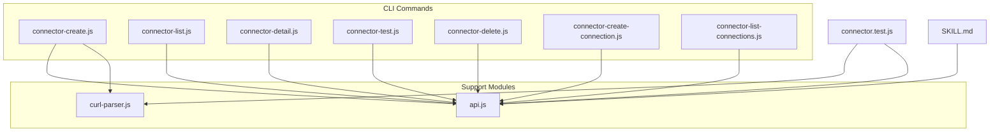
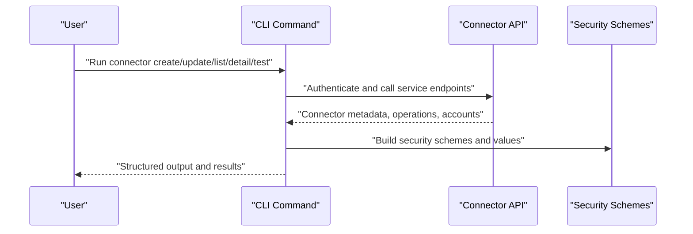
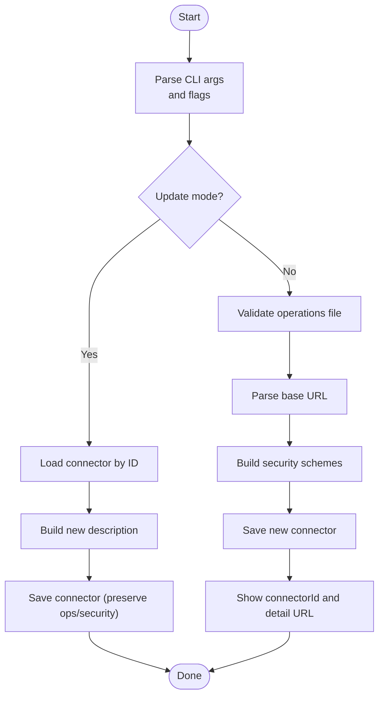
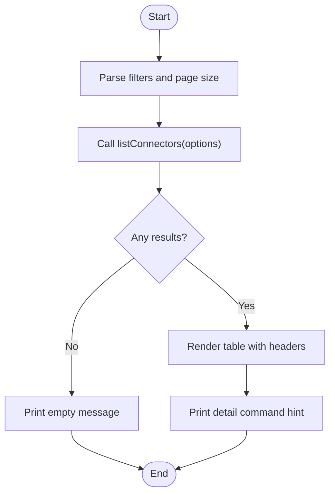
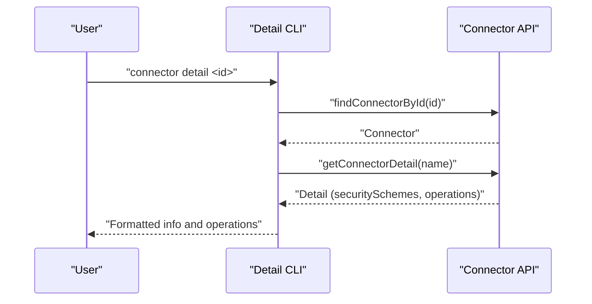
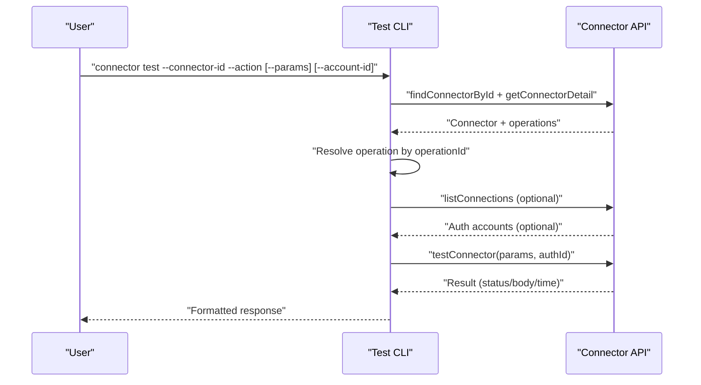
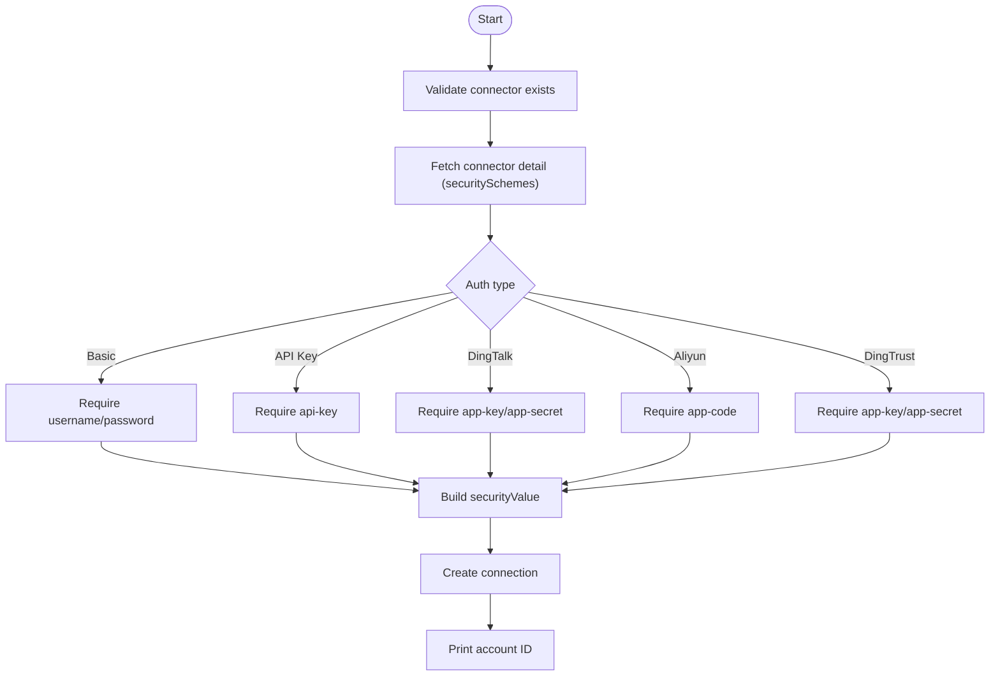
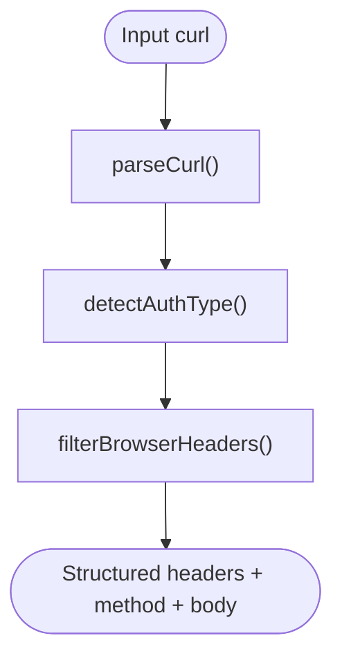
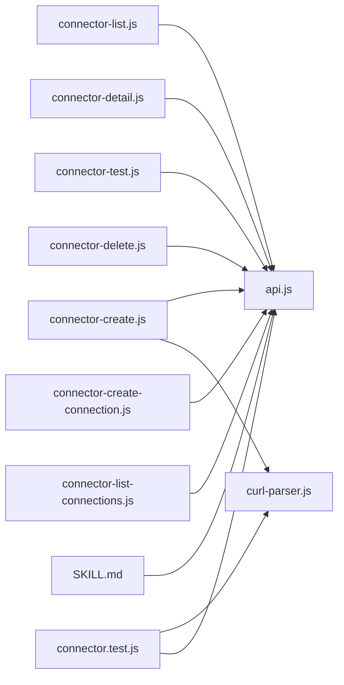

# Connector Management & Configuration

<cite>
**Referenced Files in This Document**
- [connector-create.js](file://lib/connector/connector-create.js)
- [connector-list.js](file://lib/connector/connector-list.js)
- [connector-detail.js](file://lib/connector/connector-detail.js)
- [connector-test.js](file://lib/connector/connector-test.js)
- [connector-delete.js](file://lib/connector/connector-delete.js)
- [connector-create-connection.js](file://lib/connector/connector-create-connection.js)
- [connector-list-connections.js](file://lib/connector/connector-list-connections.js)
- [curl-parser.js](file://lib/connector/curl-parser.js)
- [api.js](file://lib/connector/api.js)
- [connector.test.js](file://tests/connector.test.js)
- [SKILL.md](file://yida-skills/skills/yida-connector/SKILL.md)
</cite>

## Table of Contents
1. [Introduction](#introduction)
2. [Project Structure](#project-structure)
3. [Core Components](#core-components)
4. [Architecture Overview](#architecture-overview)
5. [Detailed Component Analysis](#detailed-component-analysis)
6. [Dependency Analysis](#dependency-analysis)
7. [Performance Considerations](#performance-considerations)
8. [Troubleshooting Guide](#troubleshooting-guide)
9. [Conclusion](#conclusion)
10. [Appendices](#appendices)

## Introduction
This document explains how to manage HTTP connectors in OpenYida’s connector system. It covers the complete lifecycle: creating connectors with authentication and actions, updating connector descriptions, listing and filtering connectors, retrieving detailed metadata, testing operations end-to-end, and managing authentication accounts. Practical examples and troubleshooting guidance are included for common scenarios such as basic auth, API key, DingTalk OAuth, Aliyun API Gateway, and DingTrust gateway.

## Project Structure
OpenYida organizes connector management under the connector library with dedicated CLI commands for each lifecycle stage. Supporting modules handle parsing, generation, and API interactions.

**Diagram sources**
- [connector-create.js:1-328](file://lib/connector/connector-create.js#L1-L328)
- [connector-list.js:1-112](file://lib/connector/connector-list.js#L1-L112)
- [connector-detail.js:1-90](file://lib/connector/connector-detail.js#L1-L90)
- [connector-test.js:1-225](file://lib/connector/connector-test.js#L1-L225)
- [connector-delete.js:1-61](file://lib/connector/connector-delete.js#L1-L61)
- [connector-create-connection.js:1-174](file://lib/connector/connector-create-connection.js#L1-L174)
- [connector-list-connections.js:1-67](file://lib/connector/connector-list-connections.js#L1-L67)
- [curl-parser.js:1-123](file://lib/connector/curl-parser.js#L1-L123)
- [api.js:277-320](file://lib/connector/api.js#L277-L320)
- [connector.test.js:1-456](file://tests/connector.test.js#L1-L456)
- [SKILL.md:451-497](file://yida-skills/skills/yida-connector/SKILL.md#L451-L497)

**Section sources**
- [connector-create.js:1-328](file://lib/connector/connector-create.js#L1-L328)
- [connector-list.js:1-112](file://lib/connector/connector-list.js#L1-L112)
- [connector-detail.js:1-90](file://lib/connector/connector-detail.js#L1-L90)
- [connector-test.js:1-225](file://lib/connector/connector-test.js#L1-L225)
- [connector-delete.js:1-61](file://lib/connector/connector-delete.js#L1-L61)
- [connector-create-connection.js:1-174](file://lib/connector/connector-create-connection.js#L1-L174)
- [connector-list-connections.js:1-67](file://lib/connector/connector-list-connections.js#L1-L67)
- [curl-parser.js:1-123](file://lib/connector/curl-parser.js#L1-L123)
- [api.js:277-320](file://lib/connector/api.js#L277-L320)
- [connector.test.js:1-456](file://tests/connector.test.js#L1-L456)
- [SKILL.md:451-497](file://yida-skills/skills/yida-connector/SKILL.md#L451-L497)

## Core Components
- Connector creation and update: Builds security schemes, parses base URL, validates operations file, and persists connector metadata.
- Listing connectors: Filters by keyword/type/date range with pagination support.
- Retrieving details: Prints security schemes, operations, and metadata for inspection.
- Testing operations: Resolves action parameters, optionally selects an auth account, and executes requests.
- Managing authentication accounts: Creates and lists connector-specific auth accounts per auth type.
- Parsing and detection: Detects auth types from headers and filters browser-added headers.

**Section sources**
- [connector-create.js:65-328](file://lib/connector/connector-create.js#L65-L328)
- [connector-list.js:16-112](file://lib/connector/connector-list.js#L16-L112)
- [connector-detail.js:20-90](file://lib/connector/connector-detail.js#L20-L90)
- [connector-test.js:34-225](file://lib/connector/connector-test.js#L34-L225)
- [connector-create-connection.js:24-174](file://lib/connector/connector-create-connection.js#L24-L174)
- [connector-list-connections.js:20-67](file://lib/connector/connector-list-connections.js#L20-L67)
- [curl-parser.js:10-123](file://lib/connector/curl-parser.js#L10-L123)

## Architecture Overview
The connector management workflow integrates CLI commands with a backend API via an authentication reference. Creation and updates rely on building security schemes and operations; listing and details fetch metadata; testing resolves parameters and optional auth accounts; and connection management handles per-connector credentials.

**Diagram sources**
- [connector-create.js:210-328](file://lib/connector/connector-create.js#L210-L328)
- [connector-list.js:72-112](file://lib/connector/connector-list.js#L72-L112)
- [connector-detail.js:20-90](file://lib/connector/connector-detail.js#L20-L90)
- [connector-test.js:98-225](file://lib/connector/connector-test.js#L98-L225)
- [connector-create-connection.js:126-174](file://lib/connector/connector-create-connection.js#L126-L174)
- [api.js:277-320](file://lib/connector/api.js#L277-L320)

## Detailed Component Analysis

### Connector Creation and Update
- Creation parameters:
  - Name and base URL
  - Authentication type selection (none, basic, API key, DingTalk, Aliyun API Gateway, DingTrust)
  - Icon configuration
  - Operations file (required for creation)
- Update mode:
  - Modifies description while preserving existing operations and security schemes
- Security schemes builder:
  - Maps human-friendly auth types to internal scheme codes
  - Validates required fields per auth type
- Base URL parser:
  - Normalizes scheme/host/basePath
- Save pipeline:
  - Persists connector metadata and returns connectorId when created

**Diagram sources**
- [connector-create.js:74-328](file://lib/connector/connector-create.js#L74-L328)

**Section sources**
- [connector-create.js:65-328](file://lib/connector/connector-create.js#L65-L328)
- [SKILL.md:451-484](file://yida-skills/skills/yida-connector/SKILL.md#L451-L484)

### Connector Listing
- Filtering and pagination:
  - Keyword filter on display name
  - Type filter (mine vs all)
  - Date range filters
  - Page size control
- Output:
  - Tabular display of ID, display name, connector name, short description, creator
  - Guidance to inspect details

**Diagram sources**
- [connector-list.js:35-112](file://lib/connector/connector-list.js#L35-L112)

**Section sources**
- [connector-list.js:16-112](file://lib/connector/connector-list.js#L16-L112)

### Connector Details Retrieval
- Fetches connector and detailed metadata
- Displays basic info (display name, connector name, description, host, base path, scheme, auth type)
- Lists operations with summaries, methods, paths, and parameter schemas

**Diagram sources**
- [connector-detail.js:20-90](file://lib/connector/connector-detail.js#L20-L90)
- [api.js:277-320](file://lib/connector/api.js#L277-L320)

**Section sources**
- [connector-detail.js:20-90](file://lib/connector/connector-detail.js#L20-L90)

### Connector Testing
- Resolves target action by operationId
- Builds test parameters from defaults and optional user-provided JSON
- Optionally lists and requires an auth account when needed
- Executes test and prints status, headers, body, and execution time

**Diagram sources**
- [connector-test.js:98-225](file://lib/connector/connector-test.js#L98-L225)
- [api.js:277-320](file://lib/connector/api.js#L277-L320)

**Section sources**
- [connector-test.js:34-225](file://lib/connector/connector-test.js#L34-L225)

### Authentication Account Management
- Creating accounts:
  - Validates required secrets per auth type
  - Builds securityValue payload and creates connection
- Listing accounts:
  - Retrieves and prints account list with status and timestamps
  - Guides selecting an account during testing

**Diagram sources**
- [connector-create-connection.js:57-174](file://lib/connector/connector-create-connection.js#L57-L174)
- [connector-list-connections.js:20-67](file://lib/connector/connector-list-connections.js#L20-L67)

**Section sources**
- [connector-create-connection.js:24-174](file://lib/connector/connector-create-connection.js#L24-L174)
- [connector-list-connections.js:20-67](file://lib/connector/connector-list-connections.js#L20-L67)

### Parsing and Detection Utilities
- Parses curl commands into structured request data
- Detects auth type from headers (Bearer, Basic, DingTalk token, API key variants)
- Filters browser-added headers for cleaner configurations

**Diagram sources**
- [curl-parser.js:10-123](file://lib/connector/curl-parser.js#L10-L123)

**Section sources**
- [curl-parser.js:10-123](file://lib/connector/curl-parser.js#L10-L123)
- [connector.test.js:12-139](file://tests/connector.test.js#L12-L139)

## Dependency Analysis
- CLI commands depend on the connector API module for authentication, listing, fetching, saving, and testing.
- Creation and connection creation depend on security scheme and value mappings.
- Testing depends on operations resolution and optional auth accounts.

**Diagram sources**
- [connector-create.js:25-32](file://lib/connector/connector-create.js#L25-L32)
- [connector-list.js:14-14](file://lib/connector/connector-list.js#L14-L14)
- [connector-detail.js:9-9](file://lib/connector/connector-detail.js#L9-L9)
- [connector-test.js:9-15](file://lib/connector/connector-test.js#L9-L15)
- [connector-delete.js:9-9](file://lib/connector/connector-delete.js#L9-L9)
- [connector-create-connection.js:17-22](file://lib/connector/connector-create-connection.js#L17-L22)
- [connector-list-connections.js:9-9](file://lib/connector/connector-list-connections.js#L9-L9)
- [curl-parser.js:1-123](file://lib/connector/curl-parser.js#L1-L123)
- [api.js:277-320](file://lib/connector/api.js#L277-L320)
- [connector.test.js:1-7](file://tests/connector.test.js#L1-L7)
- [SKILL.md:451-497](file://yida-skills/skills/yida-connector/SKILL.md#L451-L497)

**Section sources**
- [connector-create.js:25-32](file://lib/connector/connector-create.js#L25-L32)
- [connector-list.js:14-14](file://lib/connector/connector-list.js#L14-L14)
- [connector-detail.js:9-9](file://lib/connector/connector-detail.js#L9-L9)
- [connector-test.js:9-15](file://lib/connector/connector-test.js#L9-L15)
- [connector-delete.js:9-9](file://lib/connector/connector-delete.js#L9-L9)
- [connector-create-connection.js:17-22](file://lib/connector/connector-create-connection.js#L17-L22)
- [connector-list-connections.js:9-9](file://lib/connector/connector-list-connections.js#L9-L9)
- [curl-parser.js:1-123](file://lib/connector/curl-parser.js#L1-L123)
- [api.js:277-320](file://lib/connector/api.js#L277-L320)
- [connector.test.js:1-7](file://tests/connector.test.js#L1-L7)
- [SKILL.md:451-497](file://yida-skills/skills/yida-connector/SKILL.md#L451-L497)

## Performance Considerations
- Prefer filtering by keyword/type/date range when listing to reduce payload sizes.
- Limit page size to balance responsiveness and completeness.
- When testing, avoid unnecessary retries and supply minimal required parameters to reduce latency.
- Keep operations files concise and accurate to minimize parsing overhead.

## Troubleshooting Guide
Common issues and resolutions:
- Missing operations file during creation:
  - Ensure the operations JSON file is present and not empty.
- Invalid auth type or missing credentials:
  - Verify required flags for the chosen auth type (e.g., username/password, API key, DingTalk app keys, Aliyun app code).
- Connector not found:
  - Confirm the connector ID is correct and accessible with current credentials.
- No auth accounts available:
  - Create an auth account for the connector before testing if the connector requires authentication.
- Test failures:
  - Review returned HTTP status, headers, and body; adjust parameters or auth account as needed.
- Deleting connectors:
  - Direct deletion via API is not supported; use the platform management interface.

**Section sources**
- [connector-create.js:266-284](file://lib/connector/connector-create.js#L266-L284)
- [connector-create-connection.js:57-92](file://lib/connector/connector-create-connection.js#L57-L92)
- [connector-test.js:106-160](file://lib/connector/connector-test.js#L106-L160)
- [connector-delete.js:45-58](file://lib/connector/connector-delete.js#L45-L58)

## Conclusion
OpenYida’s connector management provides a robust CLI-driven workflow for creating, updating, listing, detailing, and testing HTTP connectors, along with secure authentication account management. By leveraging security scheme mappings, parameter builders, and detailed diagnostics, teams can efficiently onboard APIs and maintain reliable integrations.

## Appendices

### Authentication Configuration Reference
- Security schemes and values mapping:
  - None: {}
  - Basic: BasicAuth with username/password
  - API Key: ApiKeyAuth with label/name/location
  - DingTalk: DingAuth
  - Aliyun API Gateway: AliyunApiGateway
  - DingTrust: DingTrustGW
- Auth type codes:
  - None: 0
  - Basic: 2
  - API Key: 3
  - DingTalk: 4
  - Aliyun: 6
  - DingTrust: 7

**Section sources**
- [SKILL.md:451-497](file://yida-skills/skills/yida-connector/SKILL.md#L451-L497)

### Practical Examples

- Basic authentication
  - Create a connector with basic auth and a set of operations, then create a corresponding auth account.
  - Example commands:
    - Create connector: openyida connector create "<Name>" "<baseUrl>" --auth "基本身份验证" --username "<user>" --password "<pass>" --operations ./ops.json
    - List connectors: openyida connector list
    - Create auth account: openyida connector create-connection <connector-id> "<Account Name>" --username "<user>" --password "<pass>"
    - Test operation: openyida connector test --connector-id <connector-id> --action <operationId> --account-id <account-id>

- API key authentication
  - Create a connector with API key auth and a custom header name/location, then create an auth account with the API key value.
  - Example commands:
    - Create connector: openyida connector create "<Name>" "<baseUrl>" --auth "API密钥" --api-key-label "Authorization" --api-key-name "X-API-Key" --operations ./ops.json
    - Create auth account: openyida connector create-connection <connector-id> "<Account Name>" --api-key "<key>"
    - Test operation: openyida connector test --connector-id <connector-id> --action <operationId> --account-id <account-id>

- DingTalk OAuth
  - Create a connector with DingTalk auth and provide app key/secret; create an auth account accordingly.
  - Example commands:
    - Create connector: openyida connector create "<Name>" "<baseUrl>" --auth "钉钉开放平台验证" --app-key "<key>" --app-secret "<secret>" --operations ./ops.json
    - Create auth account: openyida connector create-connection <connector-id> "<Account Name>" --app-key "<key>" --app-secret "<secret>"
    - Test operation: openyida connector test --connector-id <connector-id> --action <operationId> --account-id <account-id>

- Aliyun API Gateway
  - Create a connector with Aliyun auth and provide app code; create an auth account with the app code.
  - Example commands:
    - Create connector: openyida connector create "<Name>" "<baseUrl>" --auth "阿里云API网关" --operations ./ops.json
    - Create auth account: openyida connector create-connection <connector-id> "<Account Name>" --app-code "<appCode>"
    - Test operation: openyida connector test --connector-id <connector-id> --action <operationId> --account-id <account-id>

- DingTrust gateway
  - Create a connector with DingTrust auth and provide app key/secret; create an auth account accordingly.
  - Example commands:
    - Create connector: openyida connector create "<Name>" "<baseUrl>" --auth "钉钉零信任网关" --app-key "<key>" --app-secret "<secret>" --operations ./ops.json
    - Create auth account: openyida connector create-connection <connector-id> "<Account Name>" --app-key "<key>" --app-secret "<secret>"
    - Test operation: openyida connector test --connector-id <connector-id> --action <operationId> --account-id <account-id>

Best practices:
- Always validate operations before creation.
- Use distinct auth accounts per environment (dev/staging/prod).
- Keep descriptions informative and concise for easier listing and discovery.
- Use filtering and pagination when listing connectors to manage large sets effectively.

**Section sources**
- [connector-create.js:34-63](file://lib/connector/connector-create.js#L34-L63)
- [connector-create-connection.js:24-46](file://lib/connector/connector-create-connection.js#L24-L46)
- [connector-test.js:17-32](file://lib/connector/connector-test.js#L17-L32)
- [connector-list.js:16-33](file://lib/connector/connector-list.js#L16-L33)
- [SKILL.md:451-497](file://yida-skills/skills/yida-connector/SKILL.md#L451-L497)