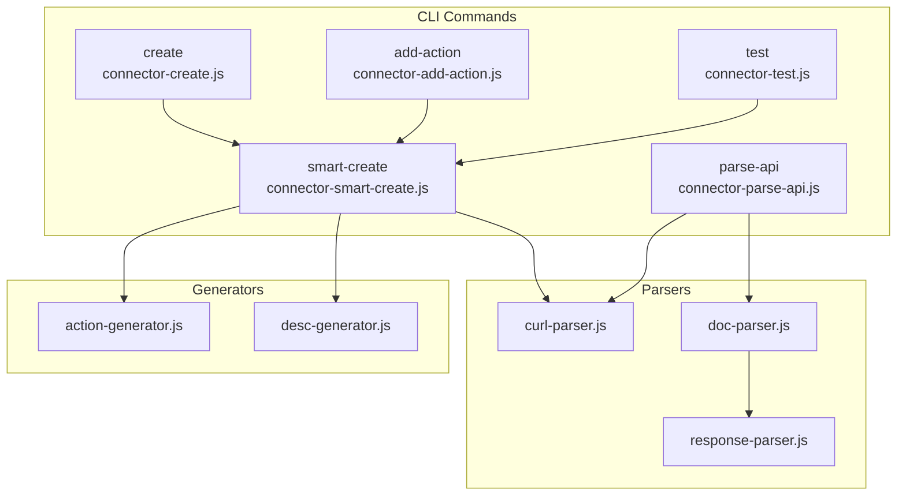
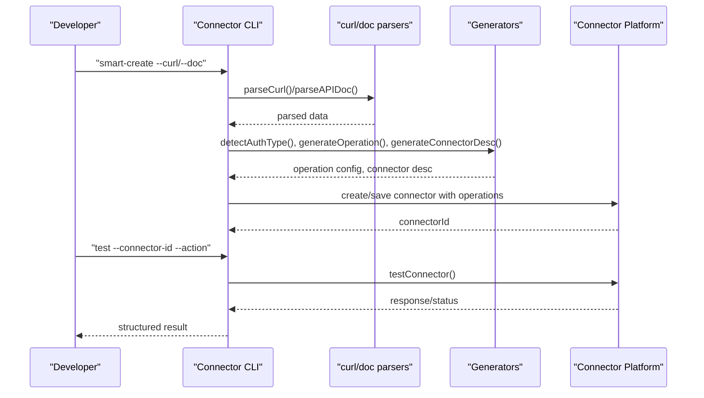
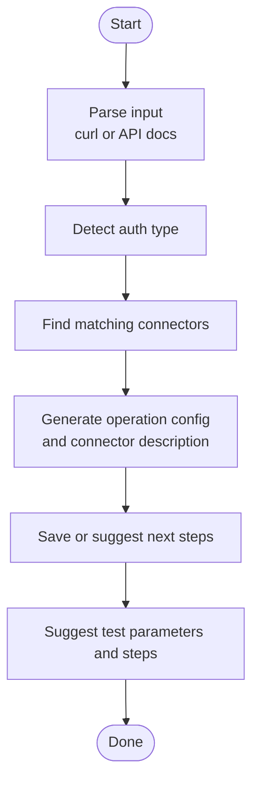
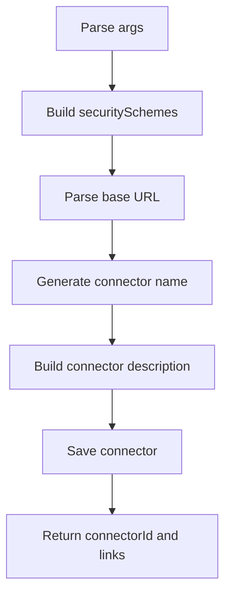
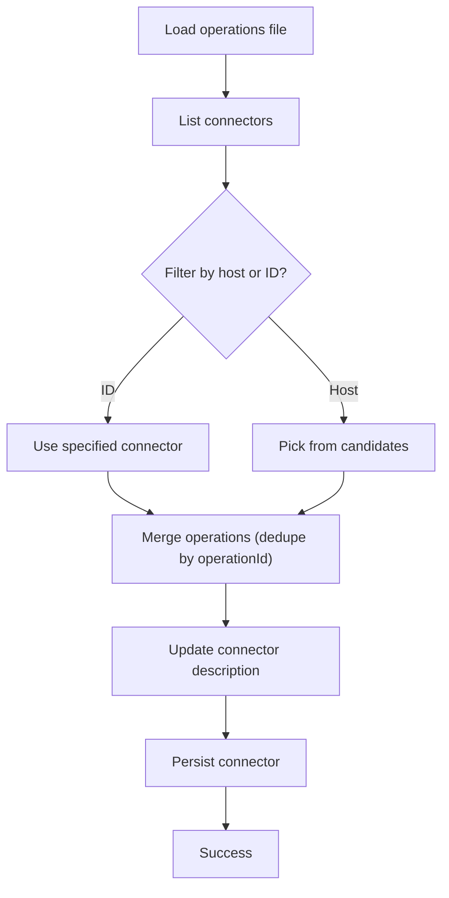
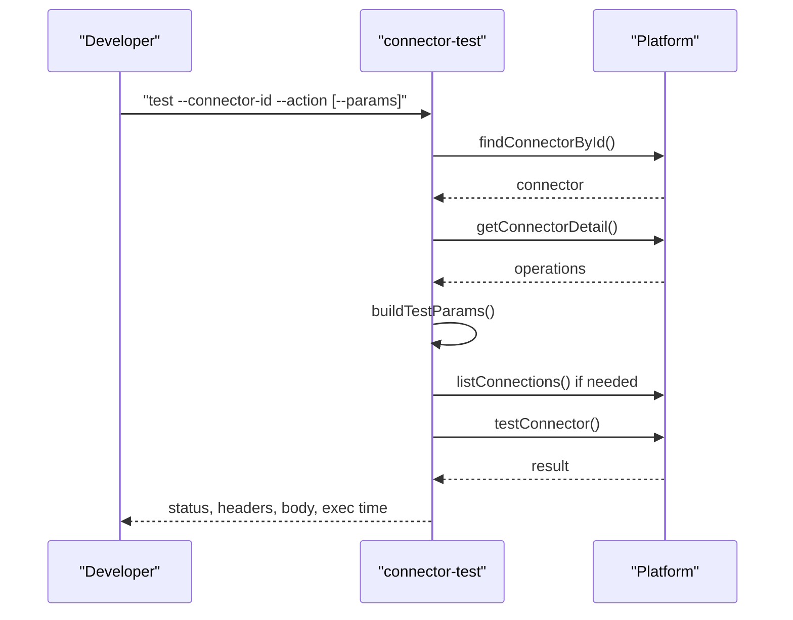
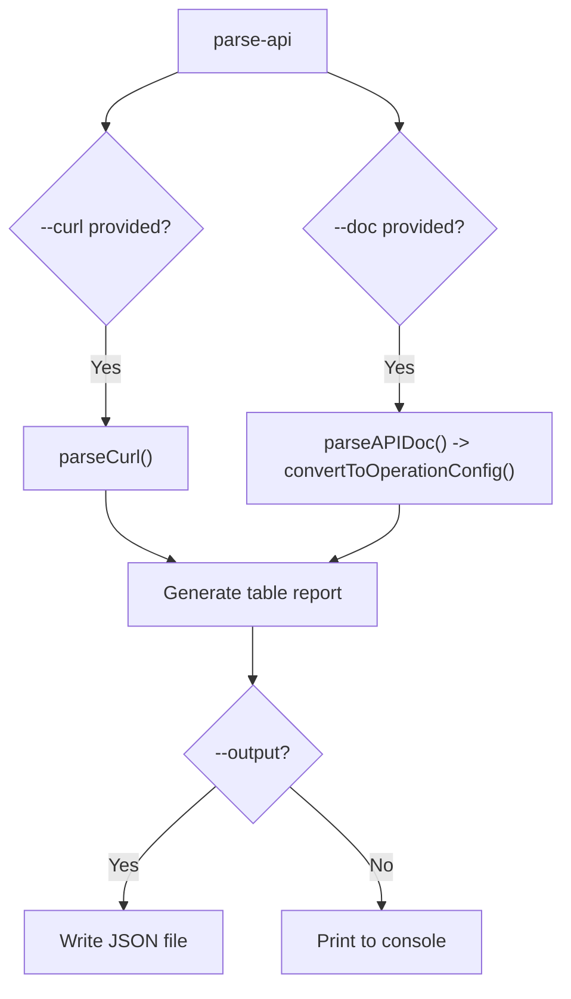
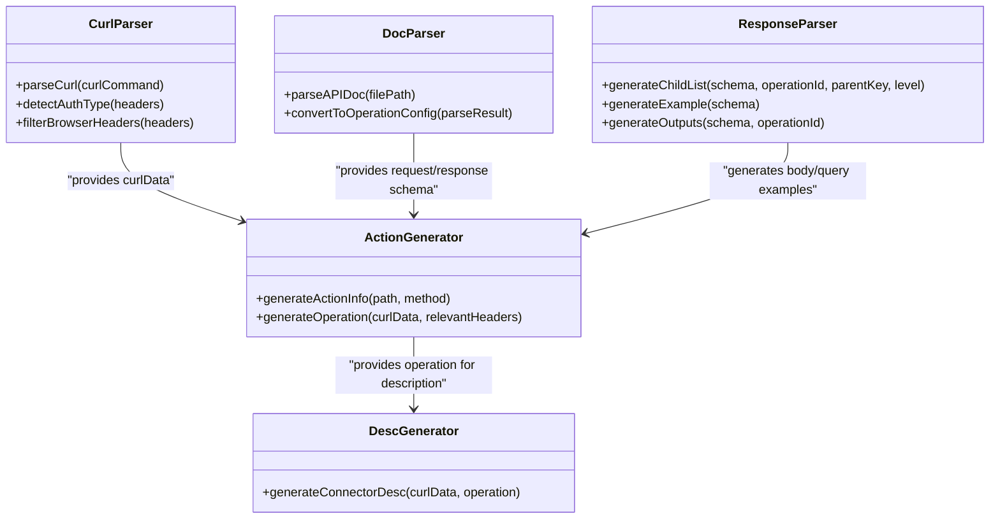
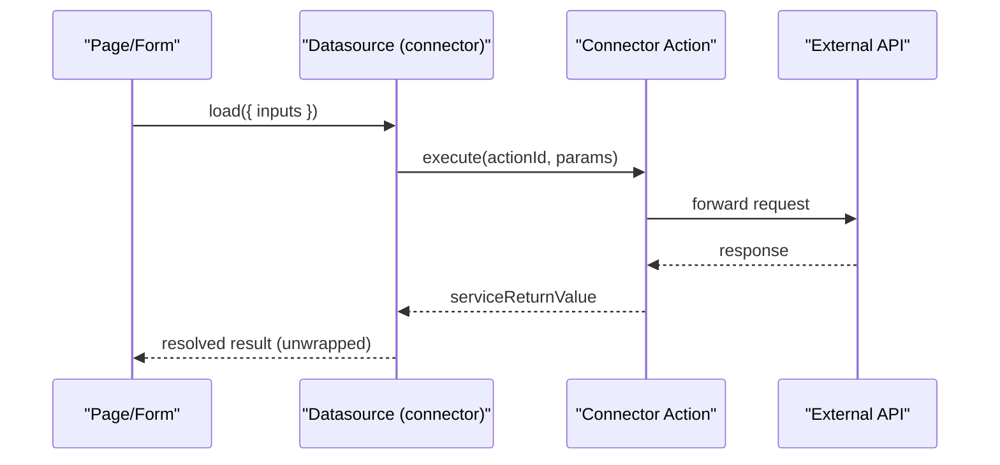
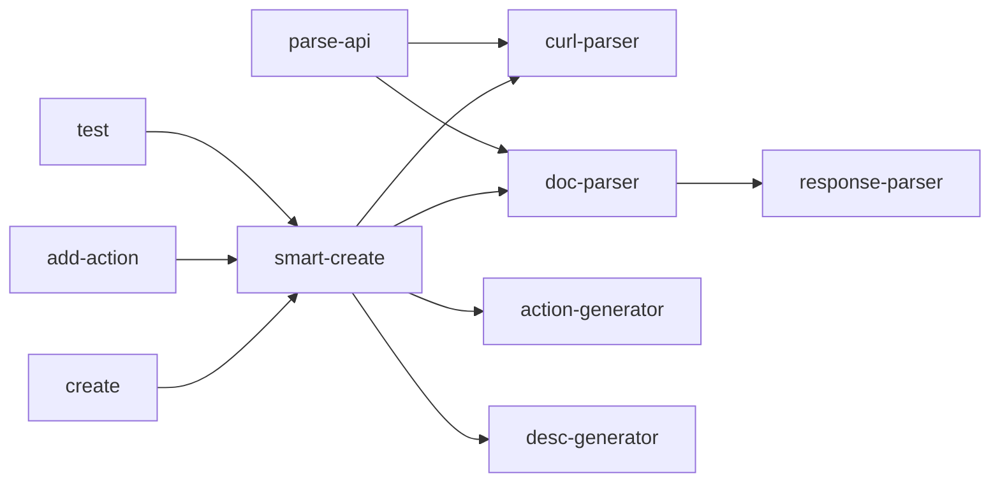

# HTTP Connector System

<cite>
**Referenced Files in This Document**
- [connector-smart-create.js](file://lib/connector/connector-smart-create.js)
- [connector-create.js](file://lib/connector/connector-create.js)
- [connector-test.js](file://lib/connector/connector-test.js)
- [connector-parse-api.js](file://lib/connector/connector-parse-api.js)
- [curl-parser.js](file://lib/connector/curl-parser.js)
- [action-generator.js](file://lib/connector/action-generator.js)
- [desc-generator.js](file://lib/connector/desc-generator.js)
- [doc-parser.js](file://lib/connector/doc-parser.js)
- [response-parser.js](file://lib/connector/response-parser.js)
- [connector-add-action.js](file://lib/connector/connector-add-action.js)
- [connector-datasource.md](file://yida-skills/reference/connector-datasource.md)
</cite>

## Table of Contents
1. [Introduction](#introduction)
2. [Project Structure](#project-structure)
3. [Core Components](#core-components)
4. [Architecture Overview](#architecture-overview)
5. [Detailed Component Analysis](#detailed-component-analysis)
6. [Dependency Analysis](#dependency-analysis)
7. [Performance Considerations](#performance-considerations)
8. [Troubleshooting Guide](#troubleshooting-guide)
9. [Conclusion](#conclusion)
10. [Appendices](#appendices)

## Introduction
This document explains OpenYida’s HTTP connector system for external API integration. It covers how to create connectors, configure authentication and actions, test and debug requests, and integrate with business processes. It also documents advanced topics such as request/response transformation, batch processing patterns, templates, and best practices. Practical examples demonstrate integration with CRM systems, payment processors, and external databases.

## Project Structure
The connector system is implemented as a set of command-line utilities under lib/connector, plus reference documentation in yida-skills/reference. The CLI orchestrates parsing, generation, creation, and testing of connectors.

**Diagram sources**
- [connector-smart-create.js:1-222](file://lib/connector/connector-smart-create.js#L1-L222)
- [connector-create.js:1-328](file://lib/connector/connector-create.js#L1-L328)
- [connector-add-action.js:1-215](file://lib/connector/connector-add-action.js#L1-L215)
- [connector-test.js:1-225](file://lib/connector/connector-test.js#L1-L225)
- [connector-parse-api.js:1-223](file://lib/connector/connector-parse-api.js#L1-L223)
- [curl-parser.js:1-123](file://lib/connector/curl-parser.js#L1-L123)
- [doc-parser.js:1-520](file://lib/connector/doc-parser.js#L1-L520)
- [response-parser.js:1-139](file://lib/connector/response-parser.js#L1-L139)
- [action-generator.js:1-253](file://lib/connector/action-generator.js#L1-L253)
- [desc-generator.js:1-38](file://lib/connector/desc-generator.js#L1-L38)

**Section sources**
- [connector-smart-create.js:1-222](file://lib/connector/connector-smart-create.js#L1-L222)
- [connector-create.js:1-328](file://lib/connector/connector-create.js#L1-L328)
- [connector-test.js:1-225](file://lib/connector/connector-test.js#L1-L225)
- [connector-parse-api.js:1-223](file://lib/connector/connector-parse-api.js#L1-L223)
- [curl-parser.js:1-123](file://lib/connector/curl-parser.js#L1-L123)
- [action-generator.js:1-253](file://lib/connector/action-generator.js#L1-L253)
- [desc-generator.js:1-38](file://lib/connector/desc-generator.js#L1-L38)
- [doc-parser.js:1-520](file://lib/connector/doc-parser.js#L1-L520)
- [response-parser.js:1-139](file://lib/connector/response-parser.js#L1-L139)
- [connector-add-action.js:1-215](file://lib/connector/connector-add-action.js#L1-L215)

## Core Components
- Smart connector creation: Parses curl or API docs, detects auth, generates action configs, and suggests next steps.
- Manual connector creation: Builds connector metadata, security schemes, and saves to platform.
- Add action to existing connector: Merges new operations into an existing connector.
- Test connector actions: Validates parameters, executes test, and prints structured results.
- Parsing and generation: Extracts server info, auth, headers, query/body, and converts to operation configs.

**Section sources**
- [connector-smart-create.js:61-204](file://lib/connector/connector-smart-create.js#L61-L204)
- [connector-create.js:210-325](file://lib/connector/connector-create.js#L210-L325)
- [connector-add-action.js:76-212](file://lib/connector/connector-add-action.js#L76-L212)
- [connector-test.js:98-222](file://lib/connector/connector-test.js#L98-L222)
- [connector-parse-api.js:166-220](file://lib/connector/connector-parse-api.js#L166-L220)

## Architecture Overview
The system follows a pipeline: input (curl or API docs) -> parse -> detect auth -> generate operation/action -> save/update connector -> test -> integrate via datasource.

**Diagram sources**
- [connector-smart-create.js:64-218](file://lib/connector/connector-smart-create.js#L64-L218)
- [connector-test.js:98-181](file://lib/connector/connector-test.js#L98-L181)
- [curl-parser.js:10-90](file://lib/connector/curl-parser.js#L10-L90)
- [doc-parser.js:375-512](file://lib/connector/doc-parser.js#L375-L512)
- [action-generator.js:103-247](file://lib/connector/action-generator.js#L103-L247)
- [desc-generator.js:11-32](file://lib/connector/desc-generator.js#L11-L32)

## Detailed Component Analysis

### Smart Connector Creation Workflow
End-to-end flow from curl or API docs to actionable connector.

**Diagram sources**
- [connector-smart-create.js:64-204](file://lib/connector/connector-smart-create.js#L64-L204)
- [curl-parser.js:63-90](file://lib/connector/curl-parser.js#L63-L90)
- [action-generator.js:103-247](file://lib/connector/action-generator.js#L103-L247)
- [desc-generator.js:11-32](file://lib/connector/desc-generator.js#L11-L32)

**Section sources**
- [connector-smart-create.js:64-204](file://lib/connector/connector-smart-create.js#L64-L204)

### Manual Connector Creation and Authentication
Builds connector metadata, security schemes, and persists to platform.

**Diagram sources**
- [connector-create.js:74-305](file://lib/connector/connector-create.js#L74-L305)

**Section sources**
- [connector-create.js:74-305](file://lib/connector/connector-create.js#L74-L305)

### Adding Actions to Existing Connectors
Merges new operations into an existing connector, handling duplicates and updating descriptions.

**Diagram sources**
- [connector-add-action.js:76-212](file://lib/connector/connector-add-action.js#L76-L212)

**Section sources**
- [connector-add-action.js:76-212](file://lib/connector/connector-add-action.js#L76-L212)

### Testing Connector Actions
Validates parameters, lists auth accounts when needed, and executes tests.

**Diagram sources**
- [connector-test.js:98-181](file://lib/connector/connector-test.js#L98-L181)

**Section sources**
- [connector-test.js:98-181](file://lib/connector/connector-test.js#L98-L181)

### Parsing API Inputs
Supports curl commands and Markdown docs; outputs human-readable reports or JSON.

**Diagram sources**
- [connector-parse-api.js:166-220](file://lib/connector/connector-parse-api.js#L166-L220)
- [curl-parser.js:10-56](file://lib/connector/curl-parser.js#L10-L56)
- [doc-parser.js:375-512](file://lib/connector/doc-parser.js#L375-L512)

**Section sources**
- [connector-parse-api.js:166-220](file://lib/connector/connector-parse-api.js#L166-L220)

### Request/Response Transformation and Templates
- Action generation infers meaningful operationId, summary, and parameters from URL/method/body/query.
- Response schema inference generates nested inputs and example bodies for UI-driven configuration.
- Connector descriptions are auto-generated based on host and method.

**Diagram sources**
- [curl-parser.js:10-123](file://lib/connector/curl-parser.js#L10-L123)
- [doc-parser.js:375-512](file://lib/connector/doc-parser.js#L375-L512)
- [response-parser.js:26-131](file://lib/connector/response-parser.js#L26-L131)
- [action-generator.js:103-247](file://lib/connector/action-generator.js#L103-L247)
- [desc-generator.js:11-32](file://lib/connector/desc-generator.js#L11-L32)

**Section sources**
- [action-generator.js:103-247](file://lib/connector/action-generator.js#L103-L247)
- [response-parser.js:26-131](file://lib/connector/response-parser.js#L26-L131)
- [desc-generator.js:11-32](file://lib/connector/desc-generator.js#L11-L32)

### Integration with Business Processes and Data Mapping
- Datasource injection supports multiple connectors per page/form.
- Parameters are passed via inputs with structured Path/Query/Header/Body.
- Platform automatically unwraps serviceReturnValue for convenient consumption in UI logic.

**Diagram sources**
- [connector-datasource.md:141-161](file://yida-skills/reference/connector-datasource.md#L141-L161)

**Section sources**
- [connector-datasource.md:106-161](file://yida-skills/reference/connector-datasource.md#L106-L161)

## Dependency Analysis
- CLI commands depend on parsers and generators.
- Action generation depends on curl/doc parsing and response schema inference.
- Connector creation depends on platform APIs (via auth ref) and security scheme builders.
- Testing depends on connector metadata and auth account discovery.

**Diagram sources**
- [connector-smart-create.js:14-18](file://lib/connector/connector-smart-create.js#L14-L18)
- [connector-parse-api.js:15-17](file://lib/connector/connector-parse-api.js#L15-L17)
- [connector-create.js:25-32](file://lib/connector/connector-create.js#L25-L32)
- [connector-add-action.js:15-24](file://lib/connector/connector-add-action.js#L15-L24)
- [connector-test.js:9-15](file://lib/connector/connector-test.js#L9-L15)
- [curl-parser.js:10-123](file://lib/connector/curl-parser.js#L10-L123)
- [doc-parser.js:375-512](file://lib/connector/doc-parser.js#L375-L512)
- [response-parser.js:77-131](file://lib/connector/response-parser.js#L77-L131)
- [action-generator.js:103-247](file://lib/connector/action-generator.js#L103-L247)
- [desc-generator.js:11-32](file://lib/connector/desc-generator.js#L11-L32)

**Section sources**
- [connector-smart-create.js:14-18](file://lib/connector/connector-smart-create.js#L14-L18)
- [connector-parse-api.js:15-17](file://lib/connector/connector-parse-api.js#L15-L17)
- [connector-create.js:25-32](file://lib/connector/connector-create.js#L25-L32)
- [connector-add-action.js:15-24](file://lib/connector/connector-add-action.js#L15-L24)
- [connector-test.js:9-15](file://lib/connector/connector-test.js#L9-L15)

## Performance Considerations
- Minimize repeated parsing: cache parsed operation configs when iterating on similar endpoints.
- Batch updates: use add-action to merge multiple operations into a single connector to reduce management overhead.
- Parameter defaults: prefill common headers/query/body examples to reduce runtime computation.
- Rate limiting: apply backoff and retry strategies in UI logic when invoking connector actions frequently.
- Network optimization: reuse connections via platform-level keep-alive and avoid unnecessary transformations.

## Troubleshooting Guide
Common issues and resolutions:
- Authentication failures
  - Verify connector’s security scheme matches the target API.
  - Ensure the correct connectionId is selected for connectors requiring credentials.
  - Confirm tokens/system keys are valid and not expired.
- Missing or incorrect parameters
  - Use connector-test to inspect default parameter values and required fields.
  - Adjust inputs in datasource or during runtime invocation.
- API compatibility problems
  - Validate endpoint URLs and methods inferred from curl/docs.
  - Check response schema expectations and adjust UI mapping accordingly.
- Testing and debugging
  - Prefer automatic CLI testing over manual platform testing for reproducibility.
  - Capture and log response headers/body and execution time for diagnostics.

**Section sources**
- [connector-test.js:151-221](file://lib/connector/connector-test.js#L151-L221)
- [connector-datasource.md:261-268](file://yida-skills/reference/connector-datasource.md#L261-L268)

## Conclusion
OpenYida’s HTTP connector system streamlines external API integration through automation, robust parsing, and structured action configuration. By leveraging smart creation, testing, and datasource integration, teams can rapidly onboard APIs, maintain connectors efficiently, and embed reliable integrations into business processes.

## Appendices

### Practical Integration Examples
- CRM systems
  - Use smart-create with curl from CRM API docs to generate actions for querying records, creating/updating leads, and syncing data.
- Payment processors
  - Parse checkout or webhook endpoints, define secure API key or bearer token auth, and test transaction flows with minimal setup.
- External databases
  - Model CRUD actions from database endpoints, map response schemas to UI fields, and batch updates via add-action.

### Security Considerations
- Prefer platform-managed credentials for sensitive endpoints.
- Avoid embedding secrets in public repos; use managed connection accounts.
- Limit exposed headers and only include necessary parameters in UI-driven inputs.

### Best Practices
- Reuse existing connectors before creating new ones; search by name and host.
- Keep operationId stable across updates to minimize UI configuration churn.
- Use datasource injection to centralize configuration and enable easy reuse across pages/forms.
- Document API endpoints with clear Markdown specs to improve parsing accuracy.