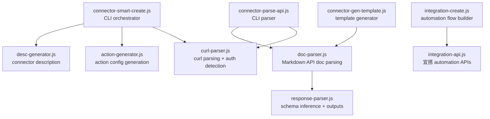
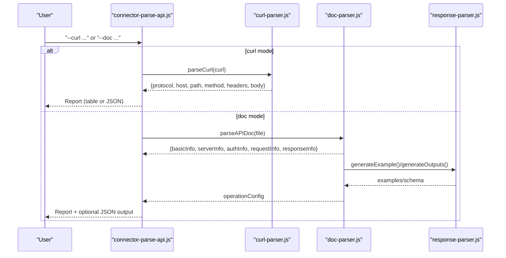
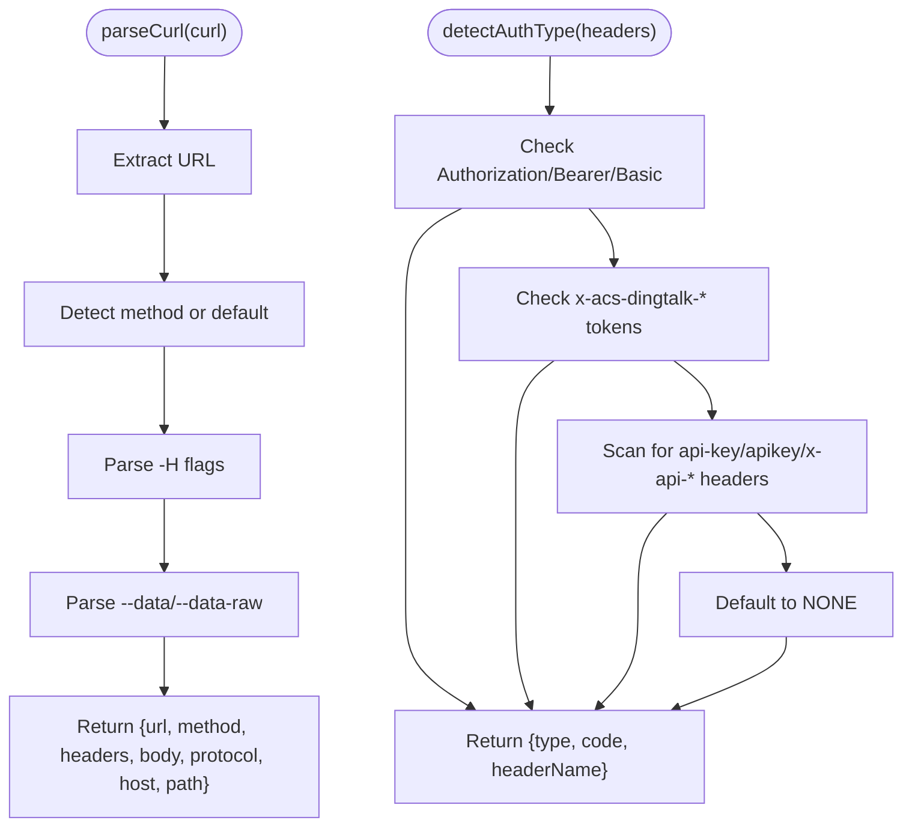
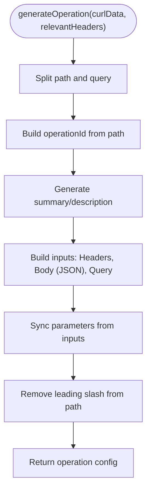
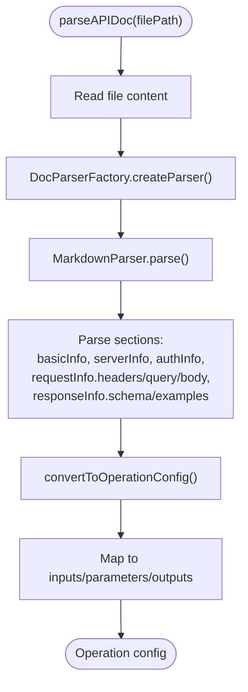
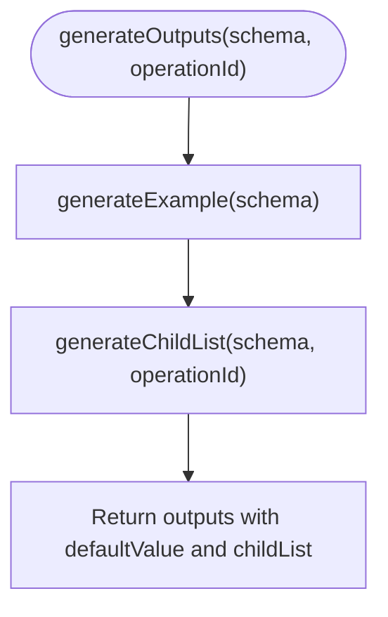
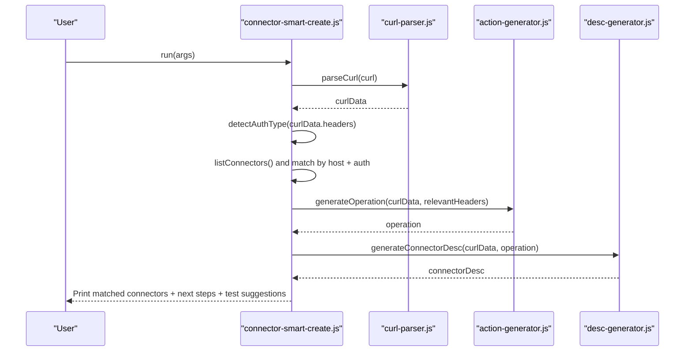
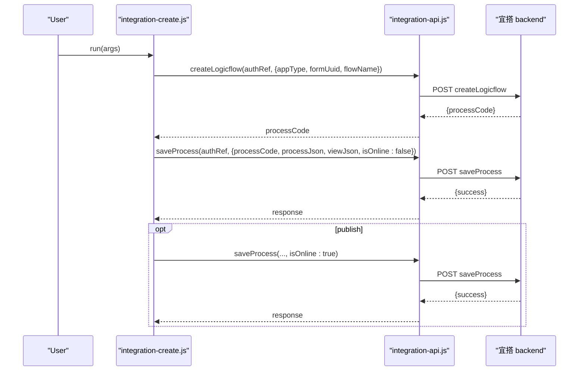
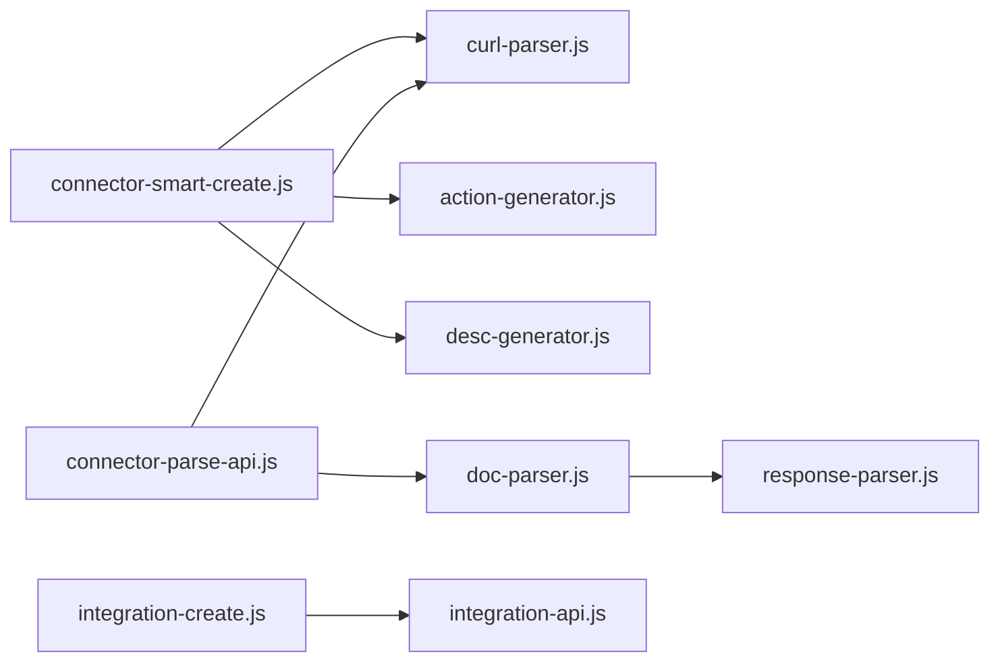

# Smart Connector Creation & API Integration

<cite>
**Referenced Files in This Document**
- [connector-smart-create.js](file://lib/connector/connector-smart-create.js)
- [connector-parse-api.js](file://lib/connector/connector-parse-api.js)
- [curl-parser.js](file://lib/connector/curl-parser.js)
- [action-generator.js](file://lib/connector/action-generator.js)
- [desc-generator.js](file://lib/connector/desc-generator.js)
- [doc-parser.js](file://lib/connector/doc-parser.js)
- [response-parser.js](file://lib/connector/response-parser.js)
- [connector-gen-template.js](file://lib/connector/connector-gen-template.js)
- [integration-api.js](file://lib/integration/integration-api.js)
- [integration-create.js](file://lib/integration/integration-create.js)
</cite>

## Table of Contents
1. [Introduction](#introduction)
2. [Project Structure](#project-structure)
3. [Core Components](#core-components)
4. [Architecture Overview](#architecture-overview)
5. [Detailed Component Analysis](#detailed-component-analysis)
6. [Dependency Analysis](#dependency-analysis)
7. [Performance Considerations](#performance-considerations)
8. [Troubleshooting Guide](#troubleshooting-guide)
9. [Conclusion](#conclusion)
10. [Appendices](#appendices)

## Introduction
This document explains OpenYida’s smart connector creation system and API integration capabilities. It covers how curl commands and API documentation are parsed to automatically generate connector configurations, how API endpoints are analyzed to produce actions, and how authentication is mapped. It also documents template generation for API documentation, integration with宜搭 automation via dedicated APIs, and practical guidance for batch operations, parameter validation, response transformation, and troubleshooting.

## Project Structure
The connector subsystem resides under lib/connector and integrates with lib/integration for automation-related operations. Key modules include:
- Command-line orchestration for smart creation and API parsing
- Curl parsing and authentication detection
- Action generation from URLs and request bodies
- Markdown-based API documentation parsing
- Response schema inference and output generation
- Template generation for authoring API docs
- Integration APIs for automation flows

**Diagram sources**
- [connector-smart-create.js:1-222](file://lib/connector/connector-smart-create.js#L1-L222)
- [connector-parse-api.js:1-223](file://lib/connector/connector-parse-api.js#L1-L223)
- [curl-parser.js:1-123](file://lib/connector/curl-parser.js#L1-L123)
- [action-generator.js:1-253](file://lib/connector/action-generator.js#L1-L253)
- [desc-generator.js:1-38](file://lib/connector/desc-generator.js#L1-L38)
- [doc-parser.js:1-520](file://lib/connector/doc-parser.js#L1-L520)
- [response-parser.js:1-139](file://lib/connector/response-parser.js#L1-L139)
- [connector-gen-template.js:1-174](file://lib/connector/connector-gen-template.js#L1-L174)
- [integration-create.js:1-394](file://lib/integration/integration-create.js#L1-L394)
- [integration-api.js:1-240](file://lib/integration/integration-api.js#L1-L240)

**Section sources**
- [connector-smart-create.js:1-222](file://lib/connector/connector-smart-create.js#L1-L222)
- [connector-parse-api.js:1-223](file://lib/connector/connector-parse-api.js#L1-L223)
- [doc-parser.js:1-520](file://lib/connector/doc-parser.js#L1-L520)

## Core Components
- Smart creation CLI: Orchestrates curl parsing, authentication detection, matching existing connectors, action generation, and emits next steps for creating/updating connectors and testing.
- API parsing CLI: Accepts either curl or Markdown documentation and prints a structured report or JSON, optionally saving operation configs.
- Curl parser: Extracts protocol/host/path/method/headers/body and detects auth scheme.
- Action generator: Builds meaningful operationId, summary, description, inputs, and parameters from curl data.
- Description generator: Produces connector-level descriptions based on host and action semantics.
- Markdown doc parser: Parses basic info, server info, auth info, request headers/query/body, and response schema; converts to operation config.
- Response parser: Infers JSON schema from examples, generates example payloads, and builds outputs with nested child lists.
- Template generator: Writes a Markdown template to guide authoring API documentation.
- Integration APIs: Encapsulate宜搭 automation endpoints for logic flow creation, publishing, listing, and toggling.

**Section sources**
- [connector-smart-create.js:61-222](file://lib/connector/connector-smart-create.js#L61-L222)
- [connector-parse-api.js:166-223](file://lib/connector/connector-parse-api.js#L166-L223)
- [curl-parser.js:10-123](file://lib/connector/curl-parser.js#L10-L123)
- [action-generator.js:103-253](file://lib/connector/action-generator.js#L103-L253)
- [desc-generator.js:11-38](file://lib/connector/desc-generator.js#L11-L38)
- [doc-parser.js:375-520](file://lib/connector/doc-parser.js#L375-L520)
- [response-parser.js:26-139](file://lib/connector/response-parser.js#L26-L139)
- [connector-gen-template.js:22-174](file://lib/connector/connector-gen-template.js#L22-L174)
- [integration-api.js:26-240](file://lib/integration/integration-api.js#L26-L240)

## Architecture Overview
The system supports two primary ingestion paths:
- Curl-driven: Parse curl, detect auth, generate action config, and suggest next steps.
- Documentation-driven: Parse Markdown docs, infer schemas, and produce operation configs.

**Diagram sources**
- [connector-parse-api.js:166-223](file://lib/connector/connector-parse-api.js#L166-L223)
- [curl-parser.js:10-56](file://lib/connector/curl-parser.js#L10-L56)
- [doc-parser.js:375-520](file://lib/connector/doc-parser.js#L375-L520)
- [response-parser.js:77-131](file://lib/connector/response-parser.js#L77-L131)

## Detailed Component Analysis

### Curl Parsing and Authentication Detection
- Extracts URL, method, headers, and body from a curl command.
- Detects auth type from Authorization header, DingTalk-specific headers, or API key-like headers.
- Filters browser-added headers to keep only relevant ones.

**Diagram sources**
- [curl-parser.js:10-90](file://lib/connector/curl-parser.js#L10-L90)

**Section sources**
- [curl-parser.js:10-123](file://lib/connector/curl-parser.js#L10-L123)

### Action Generation from Curl Data
- Generates operationId from path segments.
- Infers human-friendly summary/description from path keywords.
- Builds inputs for Headers, Body (if JSON), and Query parameters.
- Synchronizes parameters with inputs for connector runtime.

**Diagram sources**
- [action-generator.js:103-247](file://lib/connector/action-generator.js#L103-L247)

**Section sources**
- [action-generator.js:103-253](file://lib/connector/action-generator.js#L103-L253)

### Markdown API Documentation Parsing
- Supports Markdown documents authored in a standardized structure.
- Extracts basic info, server info (protocol/host/basePath/path/method), auth info, request headers, query params, request body (JSON example and inferred schema), and response schema/examples.
- Converts parsed results into operation configuration with inputs, parameters, and outputs.

**Diagram sources**
- [doc-parser.js:375-520](file://lib/connector/doc-parser.js#L375-L520)

**Section sources**
- [doc-parser.js:375-520](file://lib/connector/doc-parser.js#L375-L520)

### Response Schema Inference and Outputs
- Infers JSON schema from example payloads.
- Recursively generates nested child lists for complex objects and arrays.
- Produces example payloads and top-level outputs for connector UI.

**Diagram sources**
- [response-parser.js:119-131](file://lib/connector/response-parser.js#L119-L131)

**Section sources**
- [response-parser.js:26-139](file://lib/connector/response-parser.js#L26-L139)

### Connector Description Generation
- Creates a concise connector description based on host domain and action semantics.

**Section sources**
- [desc-generator.js:11-38](file://lib/connector/desc-generator.js#L11-L38)

### Smart Connector Creation Workflow
- Parses curl, detects auth, matches existing connectors by host and auth scheme, generates action config, and prints next steps for adding to existing connector or creating a new one. Also suggests testing steps.

**Diagram sources**
- [connector-smart-create.js:64-204](file://lib/connector/connector-smart-create.js#L64-L204)
- [curl-parser.js:63-90](file://lib/connector/curl-parser.js#L63-L90)
- [action-generator.js:103-247](file://lib/connector/action-generator.js#L103-L247)
- [desc-generator.js:11-33](file://lib/connector/desc-generator.js#L11-L33)

**Section sources**
- [connector-smart-create.js:64-204](file://lib/connector/connector-smart-create.js#L64-L204)

### Integration with宜搭 Automation
- Provides helpers to create and manage automation flows bound to forms, including:
  - Creating logic flows and obtaining process codes
  - Saving drafts or publishing flows
  - Listing and toggling flows
  - Retrieving form schemas for downstream nodes

**Diagram sources**
- [integration-create.js:217-391](file://lib/integration/integration-create.js#L217-L391)
- [integration-api.js:106-237](file://lib/integration/integration-api.js#L106-L237)

**Section sources**
- [integration-create.js:1-394](file://lib/integration/integration-create.js#L1-394)
- [integration-api.js:1-240](file://lib/integration/integration-api.js#L1-L240)

## Dependency Analysis
- connector-smart-create depends on curl-parser, action-generator, desc-generator, and connector API utilities to list connectors and print tables.
- connector-parse-api depends on curl-parser and doc-parser; doc-parser depends on response-parser for schema inference.
- integration-create depends on integration-api and builders to construct process/view JSON and persist automation flows.

**Diagram sources**
- [connector-smart-create.js:14-18](file://lib/connector/connector-smart-create.js#L14-L18)
- [connector-parse-api.js:15-17](file://lib/connector/connector-parse-api.js#L15-L17)
- [doc-parser.js:6-8](file://lib/connector/doc-parser.js#L6-L8)
- [integration-create.js:15-19](file://lib/integration/integration-create.js#L15-L19)

**Section sources**
- [connector-smart-create.js:14-222](file://lib/connector/connector-smart-create.js#L14-L222)
- [connector-parse-api.js:15-223](file://lib/connector/connector-parse-api.js#L15-L223)
- [doc-parser.js:6-520](file://lib/connector/doc-parser.js#L6-L520)
- [integration-create.js:15-394](file://lib/integration/integration-create.js#L15-L394)

## Performance Considerations
- Parsing complexity is linear in document length for Markdown parsing and constant-time for curl extraction.
- Schema inference and example generation are proportional to the number of fields in request/response bodies.
- Recommendations:
  - Prefer compact Markdown templates to reduce parsing overhead.
  - Keep curl commands minimal to avoid unnecessary header processing.
  - For large response schemas, consider pre-validating examples to speed up inference.

## Troubleshooting Guide
Common issues and resolutions:
- Curl parsing failures
  - Ensure the curl command is complete and properly quoted.
  - Verify presence of URL and method; missing method defaults to GET.
  - Check for malformed headers or body flags.
  - See [curl-parser.js:10-56](file://lib/connector/curl-parser.js#L10-L56).

- Authentication detection mismatches
  - Confirm Authorization header format (Bearer/Basic) or DingTalk-specific headers.
  - API key-like headers are detected by partial matches; ensure correct naming.
  - See [curl-parser.js:63-90](file://lib/connector/curl-parser.js#L63-L90).

- Markdown parsing errors
  - Ensure sections like “Headers”, “Query Parameters”, “Body”, and “Response” are clearly labeled.
  - Provide JSON fenced blocks for request/response examples.
  - See [doc-parser.js:40-199](file://lib/connector/doc-parser.js#L40-L199).

- Operation config generation issues
  - For body parameters, ensure JSON is valid; invalid JSON will be ignored.
  - For response schema, provide a clear example or explicit field types.
  - See [doc-parser.js:120-199](file://lib/connector/doc-parser.js#L120-L199).

- Connector matching ambiguity
  - If multiple connectors match host and auth, choose the most appropriate one and pass its ID to add-action.
  - See [connector-smart-create.js:88-129](file://lib/connector/connector-smart-create.js#L88-L129).

- Automation flow creation/publishing
  - Ensure valid appType, formUuid, and flowName.
  - Confirm login state and CSRF token availability.
  - Review warnings when publishing fails; flow may be saved as draft.
  - See [integration-create.js:209-391](file://lib/integration/integration-create.js#L209-L391).

**Section sources**
- [curl-parser.js:10-90](file://lib/connector/curl-parser.js#L10-L90)
- [doc-parser.js:40-199](file://lib/connector/doc-parser.js#L40-L199)
- [connector-smart-create.js:88-129](file://lib/connector/connector-smart-create.js#L88-L129)
- [integration-create.js:209-391](file://lib/integration/integration-create.js#L209-L391)

## Conclusion
OpenYida’s smart connector system automates connector creation from curl commands and Markdown API docs. It parses endpoints, infers schemas, generates actions, and maps authentication schemes to宜搭 connector configurations. The integration module further enables automation flow creation and management. By following the documented workflows and best practices, teams can rapidly onboard APIs and integrate them into宜搭 processes.

## Appendices

### Supported API Formats and Limitations
- Curl commands: Full support for URL, method, headers, and body extraction.
- API documentation: Markdown (.md/.markdown/.txt) with standardized sections; Word/PDF require additional dependencies.
- Authentication: Bearer, Basic, DingTalk, and generic API key headers are recognized.
- Limitations:
  - PDF/Word parsing requires extra dependencies; use Markdown or text content.
  - Complex nested schemas rely on examples; ambiguous descriptions may yield conservative schemas.

**Section sources**
- [doc-parser.js:349-368](file://lib/connector/doc-parser.js#L349-L368)
- [curl-parser.js:63-90](file://lib/connector/curl-parser.js#L63-L90)

### Best Practices for Generated Connectors
- Author clear Markdown templates with explicit field types and examples.
- Include representative request/response examples to improve schema inference.
- Keep curl commands minimal and remove browser-added headers.
- Validate parameters and outputs in宜搭 before publishing automation flows.
- Use the template generator to maintain consistent documentation standards.

**Section sources**
- [connector-gen-template.js:22-174](file://lib/connector/connector-gen-template.js#L22-L174)
- [doc-parser.js:390-512](file://lib/connector/doc-parser.js#L390-L512)

### Step-by-Step Example: Converting a Curl Command to a Working Connector
- Prepare a curl command with URL, method, headers, and body.
- Run the API parsing CLI to inspect extracted metadata and suggested operation config.
- Save the operation config to a JSON file if desired.
- Choose to:
  - Add the action to an existing connector by ID, or
  - Create a new connector with the generated action and authentication scheme.
- Test the connector using the suggested commands or in宜搭.

**Section sources**
- [connector-parse-api.js:166-223](file://lib/connector/connector-parse-api.js#L166-L223)
- [connector-smart-create.js:155-204](file://lib/connector/connector-smart-create.js#L155-L204)