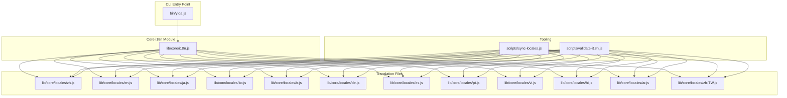
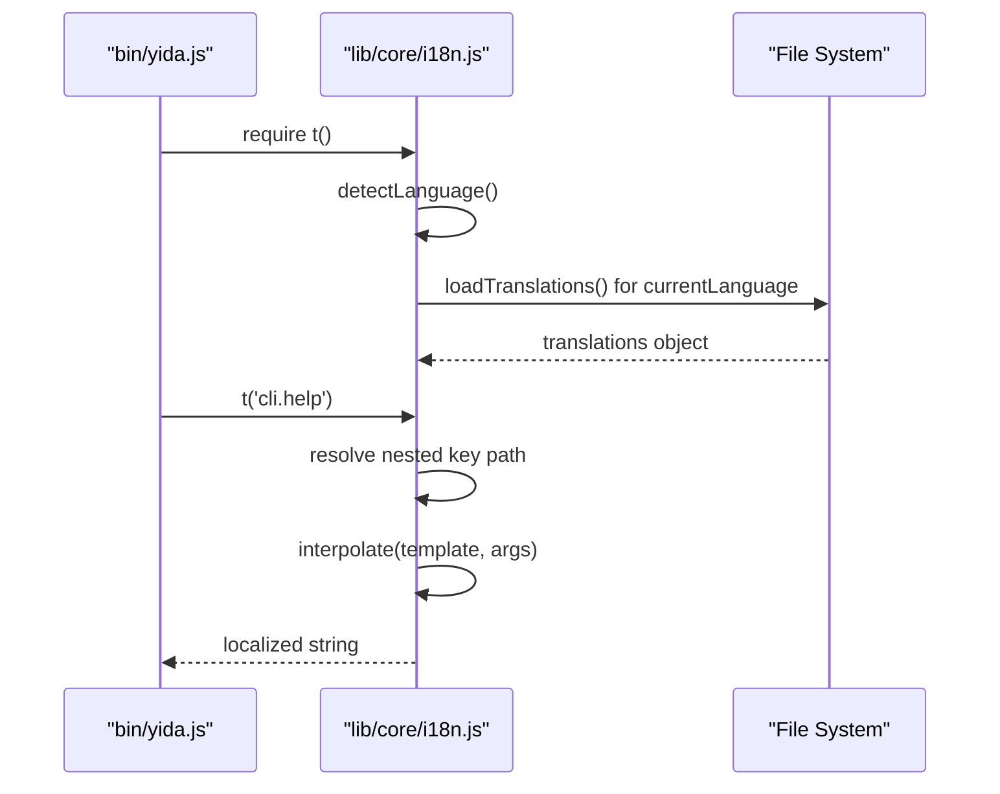
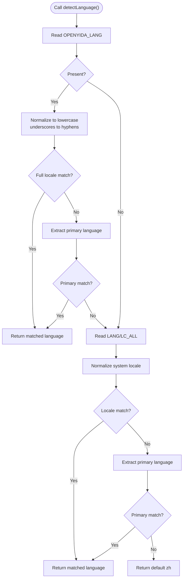
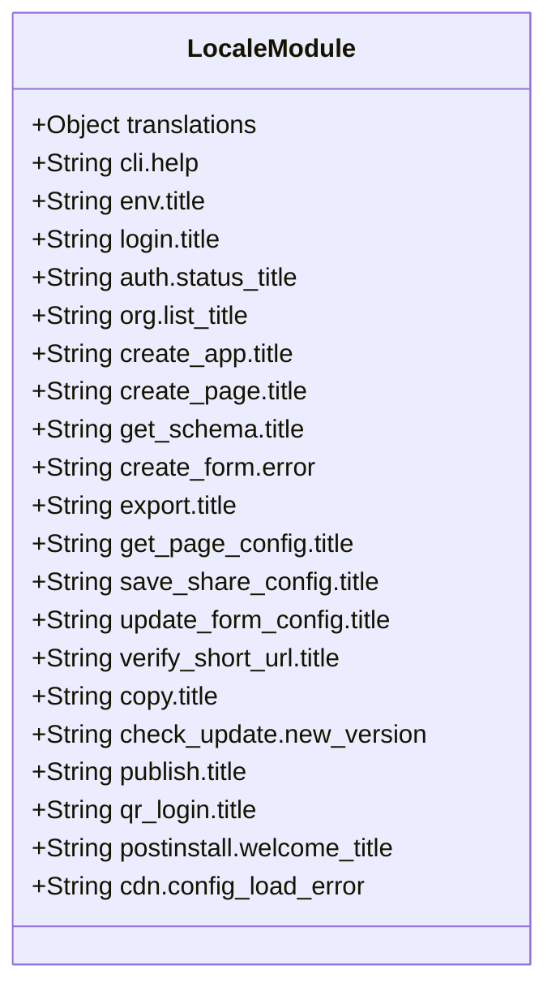
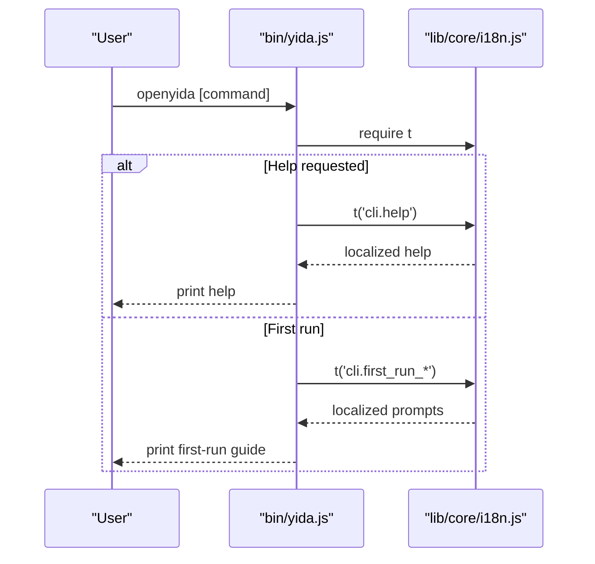
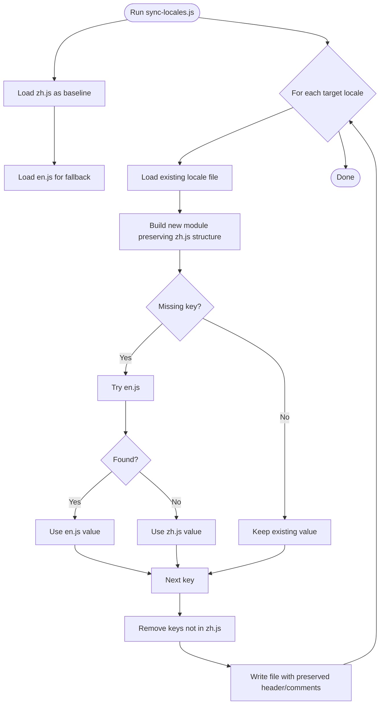
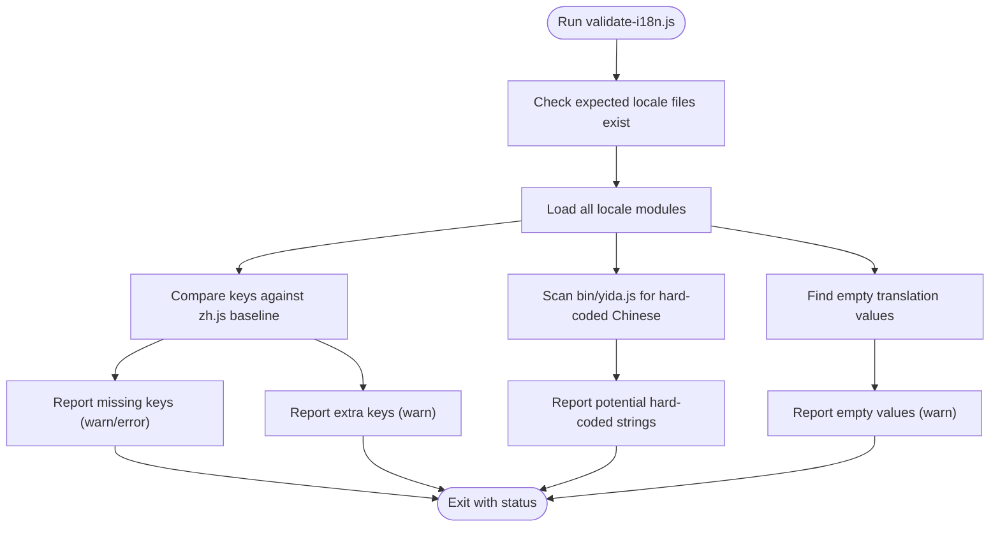
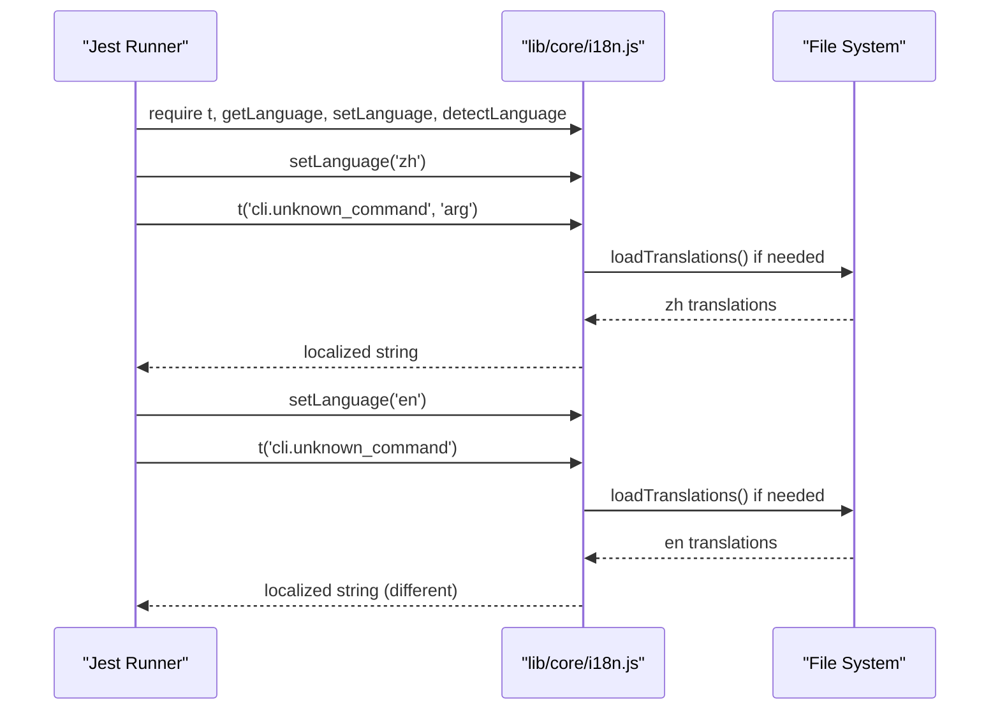
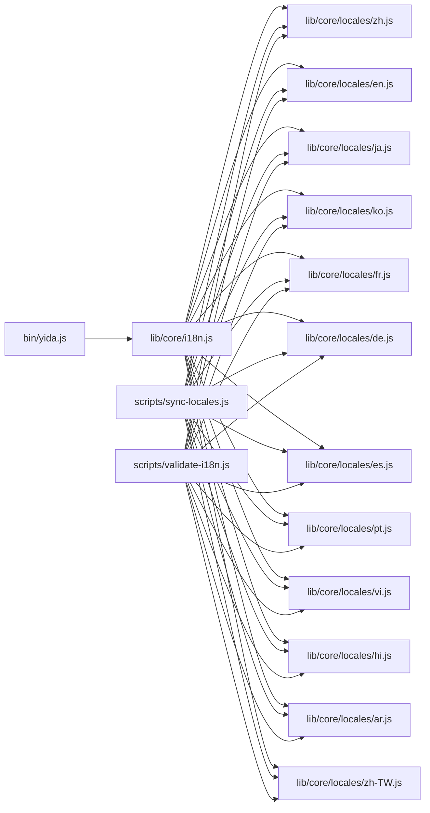

# Internationalization & Localization

<cite>
**Referenced Files in This Document**
- [package.json](file://package.json)
- [bin/yida.js](file://bin/yida.js)
- [lib/core/i18n.js](file://lib/core/i18n.js)
- [lib/core/locales/zh.js](file://lib/core/locales/zh.js)
- [lib/core/locales/en.js](file://lib/core/locales/en.js)
- [lib/core/locales/ar.js](file://lib/core/locales/ar.js)
- [lib/core/locales/zh-TW.js](file://lib/core/locales/zh-TW.js)
- [scripts/sync-locales.js](file://scripts/sync-locales.js)
- [scripts/validate-i18n.js](file://scripts/validate-i18n.js)
- [tests/i18n.test.js](file://tests/i18n.test.js)
</cite>

## Table of Contents
1. [Introduction](#introduction)
2. [Project Structure](#project-structure)
3. [Core Components](#core-components)
4. [Architecture Overview](#architecture-overview)
5. [Detailed Component Analysis](#detailed-component-analysis)
6. [Dependency Analysis](#dependency-analysis)
7. [Performance Considerations](#performance-considerations)
8. [Troubleshooting Guide](#troubleshooting-guide)
9. [Conclusion](#conclusion)
10. [Appendices](#appendices)

## Introduction
This document explains OpenYida’s internationalization (i18n) and localization (l10n) system. It covers the architecture, supported languages, locale management, translation workflows, dynamic loading, and integration points with the CLI and AI skill system. It also provides practical guidance for adding new languages, maintaining translation consistency, testing localization, and addressing common issues.

## Project Structure
OpenYida organizes i18n resources under a dedicated core module with per-language translation files and supporting scripts for synchronization and validation. The CLI entry point integrates translation via the i18n module.

**Diagram sources**
- [bin/yida.js:56](file://bin/yida.js#L56)
- [lib/core/i18n.js:31](file://lib/core/i18n.js#L31)
- [scripts/sync-locales.js:20](file://scripts/sync-locales.js#L20)
- [scripts/validate-i18n.js:24](file://scripts/validate-i18n.js#L24)

**Section sources**
- [package.json:1-74](file://package.json#L1-L74)
- [bin/yida.js:52-66](file://bin/yida.js#L52-L66)
- [lib/core/i18n.js:1-57](file://lib/core/i18n.js#L1-L57)

## Core Components
- i18n module: Provides translation lookup, interpolation, language detection, and runtime switching.
- Translation files: Per-language JSON-like modules grouped by functional areas.
- Synchronization script: Ensures consistent key structures across locales.
- Validation script: Enforces completeness and detects hard-coded strings.
- Tests: Verify language detection, switching, interpolation, and fallback behavior.

**Section sources**
- [lib/core/i18n.js:31](file://lib/core/i18n.js#L31)
- [lib/core/locales/zh.js:1-20](file://lib/core/locales/zh.js#L1-L20)
- [lib/core/locales/en.js:1-20](file://lib/core/locales/en.js#L1-L20)
- [scripts/sync-locales.js:20](file://scripts/sync-locales.js#L20)
- [scripts/validate-i18n.js:24](file://scripts/validate-i18n.js#L24)
- [tests/i18n.test.js:37-46](file://tests/i18n.test.js#L37-L46)

## Architecture Overview
OpenYida’s i18n architecture centers on a single module that lazily loads the active locale, resolves nested translation keys, interpolates placeholders, and falls back to Chinese when translations are missing. The CLI integrates translations for help, prompts, and error messages.

**Diagram sources**
- [bin/yida.js:56](file://bin/yida.js#L56)
- [lib/core/i18n.js:63-88](file://lib/core/i18n.js#L63-L88)
- [lib/core/i18n.js:97-106](file://lib/core/i18n.js#L97-L106)
- [lib/core/i18n.js:114-138](file://lib/core/i18n.js#L114-L138)

## Detailed Component Analysis

### i18n Module
- Supported languages: zh, zh-TW, en, ja, ko, fr, de, es, pt, vi, hi, ar.
- Language detection order: OPENYIDA_LANG (full or primary), LANG/LC_ALL (with normalization), otherwise zh.
- Lazy-loading: Translations are loaded once per language and cached.
- Fallback: If a translation is missing, the module attempts Chinese; otherwise returns the key itself.
- Interpolation: Supports positional placeholders like {0}, {1}.

**Diagram sources**
- [lib/core/i18n.js:63-88](file://lib/core/i18n.js#L63-L88)

**Section sources**
- [lib/core/i18n.js:31](file://lib/core/i18n.js#L31)
- [lib/core/i18n.js:39-57](file://lib/core/i18n.js#L39-L57)
- [lib/core/i18n.js:63-88](file://lib/core/i18n.js#L63-L88)
- [lib/core/i18n.js:97-106](file://lib/core/i18n.js#L97-L106)
- [lib/core/i18n.js:114-138](file://lib/core/i18n.js#L114-L138)
- [lib/core/i18n.js:146-152](file://lib/core/i18n.js#L146-L152)
- [lib/core/i18n.js:158-171](file://lib/core/i18n.js#L158-L171)

### Translation Files
- Structure: Hierarchical objects grouped by functional areas (e.g., cli, env, login, auth, org, create_app, create_page, get_schema, create_form, export, import, get_page_config, save_share_config, update_form_config, verify_short_url, copy, check_update, publish, qr_login, postinstall, cdn).
- Keys: Dot-delimited paths (e.g., cli.help, env.title).
- Placeholders: Strings include positional placeholders for dynamic values.
- Regional variants: zh-TW mirrors zh with localized terms.

**Diagram sources**
- [lib/core/locales/zh.js:6-20](file://lib/core/locales/zh.js#L6-L20)
- [lib/core/locales/en.js:7-20](file://lib/core/locales/en.js#L7-L20)
- [lib/core/locales/zh-TW.js:4-20](file://lib/core/locales/zh-TW.js#L4-L20)

**Section sources**
- [lib/core/locales/zh.js:6-20](file://lib/core/locales/zh.js#L6-L20)
- [lib/core/locales/en.js:7-20](file://lib/core/locales/en.js#L7-L20)
- [lib/core/locales/zh-TW.js:4-20](file://lib/core/locales/zh-TW.js#L4-L20)

### CLI Integration
- The CLI requires the i18n module and uses t() for help text, prompts, and messages.
- First-run guide and command usage are localized.

**Diagram sources**
- [bin/yida.js:56](file://bin/yida.js#L56)
- [bin/yida.js:106-138](file://bin/yida.js#L106-L138)

**Section sources**
- [bin/yida.js:56](file://bin/yida.js#L56)
- [bin/yida.js:106-138](file://bin/yida.js#L106-L138)

### Synchronization Script (sync-locales.js)
- Purpose: Keep all locales aligned with the baseline (zh.js).
- Behavior:
  - Preserve existing translations when keys match.
  - Fill missing keys from en.js, then zh.js if still missing.
  - Remove keys not present in zh.js.
  - Maintain comments and formatting styles.
- Targets: en, ja, ko, fr, de, es, pt, vi, hi, ar, zh-TW.

**Diagram sources**
- [scripts/sync-locales.js:78-169](file://scripts/sync-locales.js#L78-L169)

**Section sources**
- [scripts/sync-locales.js:20](file://scripts/sync-locales.js#L20)
- [scripts/sync-locales.js:78-169](file://scripts/sync-locales.js#L78-L169)

### Validation Script (validate-i18n.js)
- Ensures:
  - All expected locale files exist and are loadable.
  - Keys match the baseline (zh.js) across locales.
  - No hard-coded Chinese in the CLI entry point.
  - No empty translation values.
- Modes: Default (warnings for missing keys), strict (--strict treats missing keys as errors).

**Diagram sources**
- [scripts/validate-i18n.js:64-147](file://scripts/validate-i18n.js#L64-L147)
- [scripts/validate-i18n.js:152-199](file://scripts/validate-i18n.js#L152-L199)
- [scripts/validate-i18n.js:204-229](file://scripts/validate-i18n.js#L204-L229)

**Section sources**
- [scripts/validate-i18n.js:24](file://scripts/validate-i18n.js#L24)
- [scripts/validate-i18n.js:64-147](file://scripts/validate-i18n.js#L64-L147)
- [scripts/validate-i18n.js:152-199](file://scripts/validate-i18n.js#L152-L199)
- [scripts/validate-i18n.js:204-229](file://scripts/validate-i18n.js#L204-L229)

### Tests (tests/i18n.test.js)
- Verifies:
  - Supported languages list.
  - Language detection precedence and normalization.
  - Manual language switching and persistence.
  - Translation interpolation and fallback behavior.
  - Nested key resolution.

**Diagram sources**
- [tests/i18n.test.js:3-33](file://tests/i18n.test.js#L3-L33)
- [tests/i18n.test.js:50-77](file://tests/i18n.test.js#L50-L77)
- [tests/i18n.test.js:81-136](file://tests/i18n.test.js#L81-L136)
- [tests/i18n.test.js:140-198](file://tests/i18n.test.js#L140-L198)

**Section sources**
- [tests/i18n.test.js:3-33](file://tests/i18n.test.js#L3-L33)
- [tests/i18n.test.js:37-46](file://tests/i18n.test.js#L37-L46)
- [tests/i18n.test.js:50-77](file://tests/i18n.test.js#L50-L77)
- [tests/i18n.test.js:81-136](file://tests/i18n.test.js#L81-L136)
- [tests/i18n.test.js:140-198](file://tests/i18n.test.js#L140-L198)

## Dependency Analysis
- CLI depends on i18n for all user-facing strings.
- i18n depends on locale modules for translations.
- Synchronization and validation scripts depend on locale modules for consistency checks.
- Tests depend on i18n to assert behavior.

**Diagram sources**
- [bin/yida.js:56](file://bin/yida.js#L56)
- [lib/core/i18n.js:31](file://lib/core/i18n.js#L31)
- [scripts/sync-locales.js:20](file://scripts/sync-locales.js#L20)
- [scripts/validate-i18n.js:24](file://scripts/validate-i18n.js#L24)

**Section sources**
- [bin/yida.js:56](file://bin/yida.js#L56)
- [lib/core/i18n.js:31](file://lib/core/i18n.js#L31)
- [scripts/sync-locales.js:20](file://scripts/sync-locales.js#L20)
- [scripts/validate-i18n.js:24](file://scripts/validate-i18n.js#L24)

## Performance Considerations
- Lazy loading: Translations are loaded once per language and cached to avoid repeated I/O.
- Interpolation: Simple placeholder replacement avoids heavy regex overhead.
- File size: Keeping translations aligned reduces duplication and minimizes maintenance overhead.

[No sources needed since this section provides general guidance]

## Troubleshooting Guide
Common issues and resolutions:
- Missing translations:
  - Symptom: Key returned instead of localized string.
  - Resolution: Run synchronization to align keys, then validation to confirm.
- Empty translations:
  - Symptom: Empty string printed.
  - Resolution: Fix in locale files; validation will warn about empty values.
- Hard-coded strings:
  - Symptom: Console output contains raw Chinese.
  - Resolution: Wrap strings with t() and rerun validation.
- Language not applied:
  - Symptom: No change after setLanguage().
  - Resolution: Ensure language is supported; clear cache by setting a new language; verify environment variables.
- Regional variant mismatches:
  - Symptom: zh-HK/zh-MO not localized.
  - Resolution: zh-HK/zh-MO map to zh-TW; update zh-TW translations accordingly.

**Section sources**
- [scripts/sync-locales.js:78-169](file://scripts/sync-locales.js#L78-L169)
- [scripts/validate-i18n.js:64-147](file://scripts/validate-i18n.js#L64-L147)
- [scripts/validate-i18n.js:204-229](file://scripts/validate-i18n.js#L204-L229)
- [lib/core/i18n.js:158-171](file://lib/core/i18n.js#L158-L171)

## Conclusion
OpenYida’s i18n system provides robust, maintainable multi-language support for CLI output and user prompts. With centralized detection, lazy-loaded translations, and automated synchronization/validation, teams can confidently expand language coverage and ensure consistency across markets.

[No sources needed since this section summarizes without analyzing specific files]

## Appendices

### Supported Languages
- zh (Simplified Chinese, default)
- zh-TW (Traditional Chinese, Taiwan/Hong Kong/Macau)
- en (English)
- ja (Japanese)
- ko (Korean)
- fr (French)
- de (German)
- es (Spanish)
- pt (Portuguese)
- vi (Vietnamese)
- hi (Hindi)
- ar (Arabic)

**Section sources**
- [lib/core/i18n.js:31](file://lib/core/i18n.js#L31)
- [lib/core/i18n.js:40-57](file://lib/core/i18n.js#L40-L57)
- [tests/i18n.test.js:38-41](file://tests/i18n.test.js#L38-L41)

### Adding a New Language
Steps:
1. Create a new locale file under lib/core/locales/<lang-code>.js mirroring the structure of zh.js.
2. Populate translations for all keys from zh.js.
3. Add the language code to the expected list in the validation script and synchronization targets.
4. Run synchronization to align keys and validation to ensure completeness.
5. Add tests verifying language detection and basic translation coverage.

**Section sources**
- [scripts/sync-locales.js:20](file://scripts/sync-locales.js#L20)
- [scripts/validate-i18n.js:24](file://scripts/validate-i18n.js#L24)
- [tests/i18n.test.js:37-46](file://tests/i18n.test.js#L37-L46)

### Managing Translation Updates
- Use synchronization to propagate changes from zh.js to other locales, prioritizing en.js for missing keys.
- Validate after updates to catch missing or extra keys and empty values.
- Avoid hard-coded strings in source files; wrap all user-facing strings with t().

**Section sources**
- [scripts/sync-locales.js:78-169](file://scripts/sync-locales.js#L78-L169)
- [scripts/validate-i18n.js:64-147](file://scripts/validate-i18n.js#L64-L147)
- [bin/yida.js:64-66](file://bin/yida.js#L64-L66)

### Testing Localization Features
- Unit tests cover language detection, switching, interpolation, and fallback behavior.
- Integration tests rely on environment variables to simulate different locales.

**Section sources**
- [tests/i18n.test.js:3-33](file://tests/i18n.test.js#L3-L33)
- [tests/i18n.test.js:50-77](file://tests/i18n.test.js#L50-L77)
- [tests/i18n.test.js:81-136](file://tests/i18n.test.js#L81-L136)
- [tests/i18n.test.js:140-198](file://tests/i18n.test.js#L140-L198)

### Right-to-Left Language Support
- Arabic (ar) is supported. While the CLI prints right-to-left text, ensure terminal and console support rendering. For web UI components, apply appropriate directionality and layout adjustments outside this CLI module.

**Section sources**
- [lib/core/locales/ar.js:1-20](file://lib/core/locales/ar.js#L1-L20)
- [lib/core/i18n.js:31](file://lib/core/i18n.js#L31)

### Date/Time and Number Formatting
- The i18n module does not provide locale-specific date/time or number formatting. Use Node.js Intl APIs or external libraries for locale-aware formatting in UI components.

[No sources needed since this section provides general guidance]

### Cultural Considerations and Compliance
- Respect cultural nuances in terminology and messaging.
- Avoid idioms that do not translate directly; favor clarity and precision.
- Ensure compliance with regional regulations (e.g., data privacy) when localizing content.

[No sources needed since this section provides general guidance]

### Integration with AI Skill System
- The CLI integrates with AI tools and skill systems through environment detection and messaging. Localization applies to CLI prompts and help text; AI skill content is managed separately under yida-skills.

**Section sources**
- [bin/yida.js:54-66](file://bin/yida.js#L54-L66)