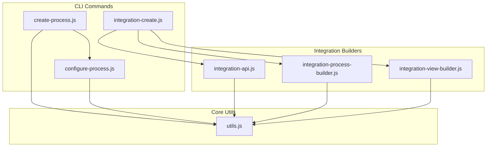
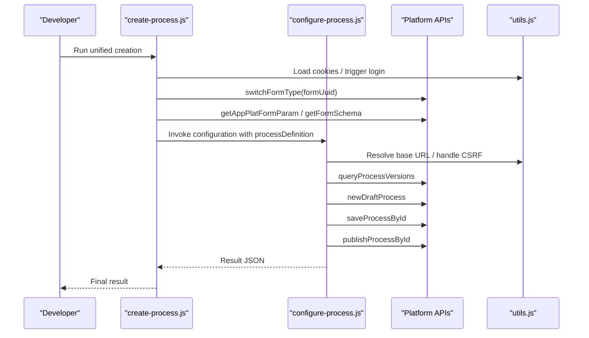
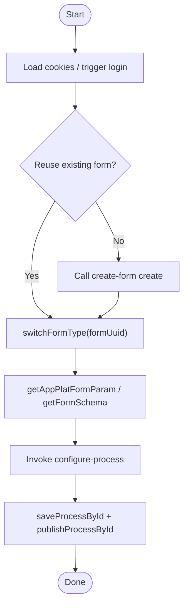
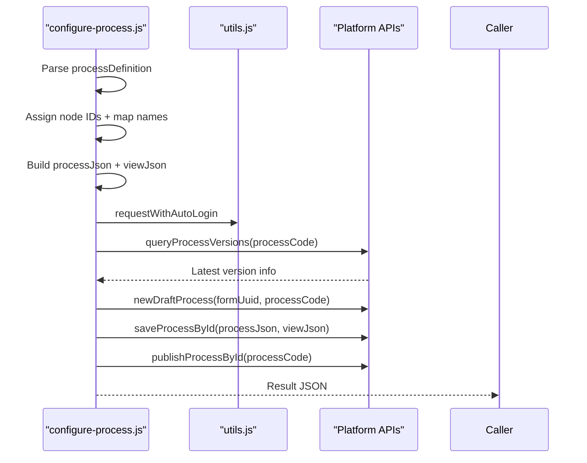
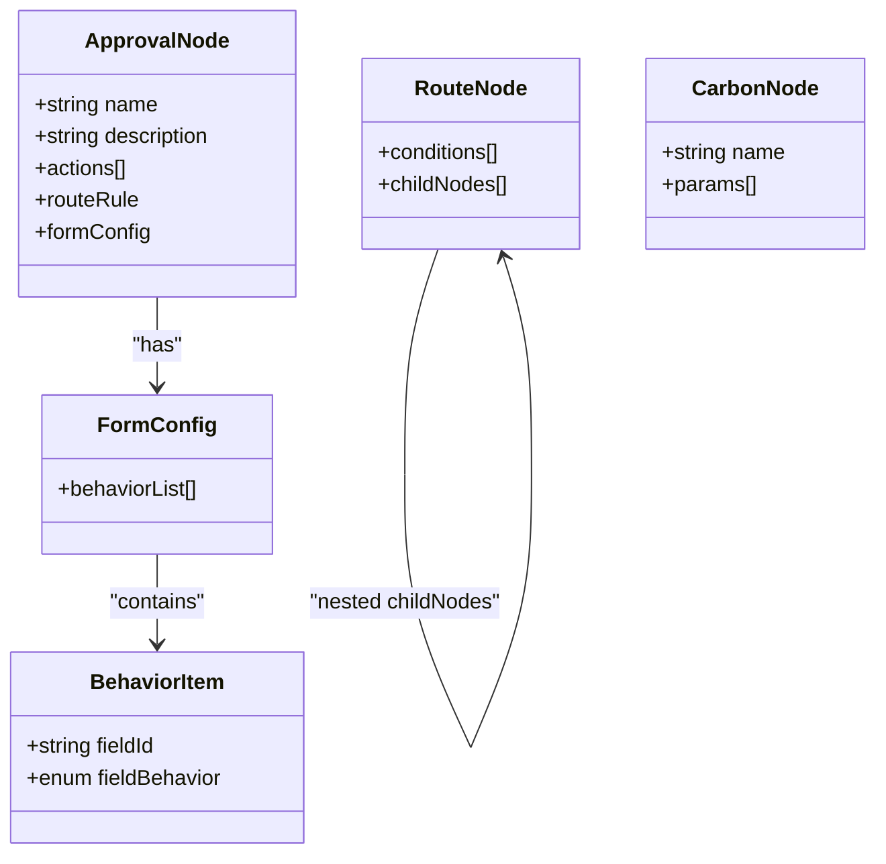
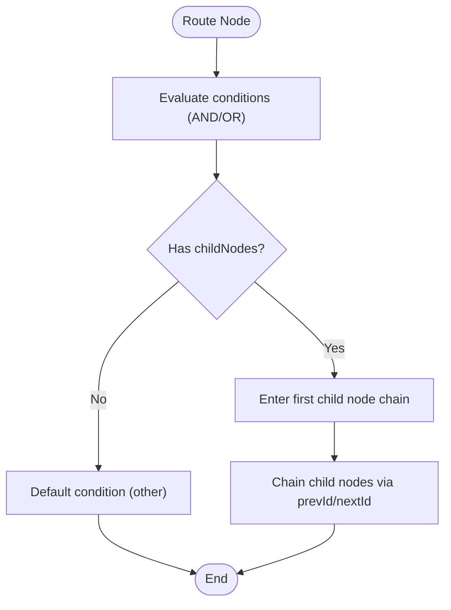
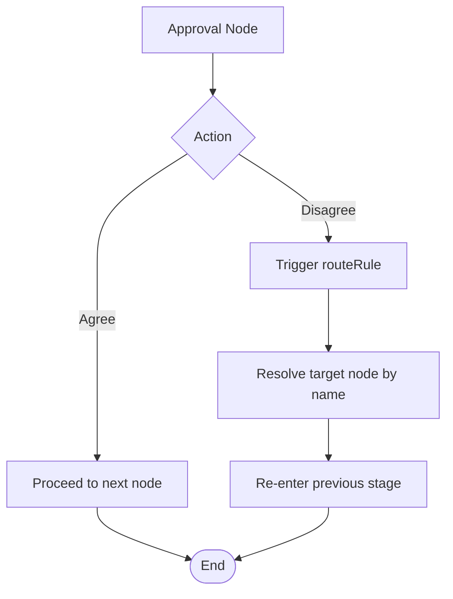
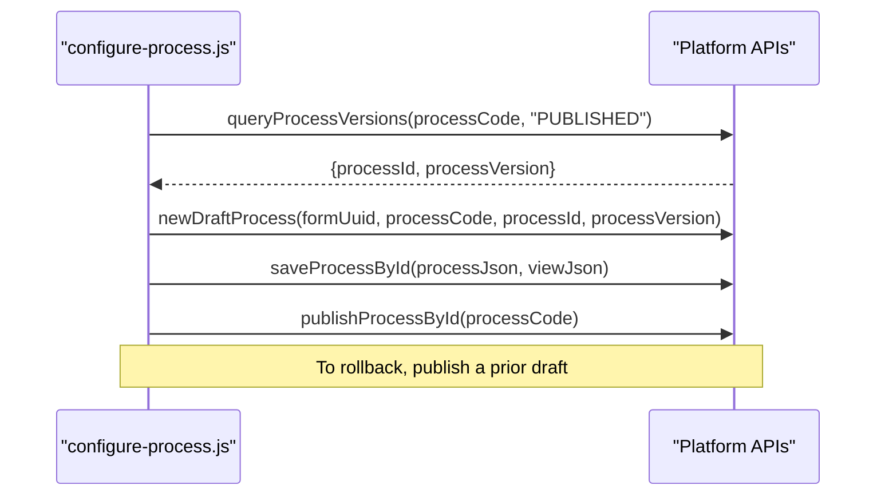
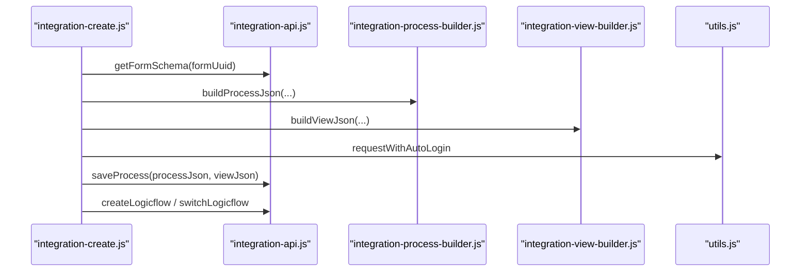
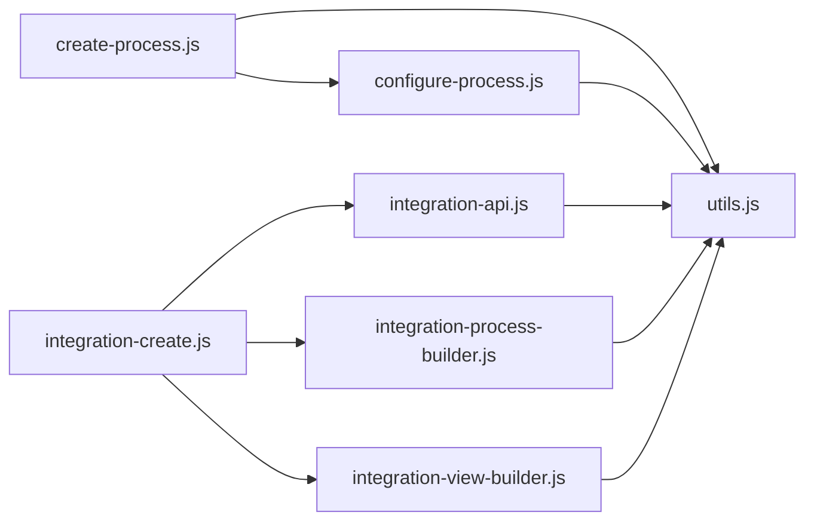

# Process Workflows & Business Logic

<cite>
**Referenced Files in This Document**
- [create-process.js](file://lib/process/create-process.js)
- [configure-process.js](file://lib/process/configure-process.js)
- [integration-create.js](file://lib/integration/integration-create.js)
- [integration-api.js](file://lib/integration/integration-api.js)
- [integration-process-builder.js](file://lib/integration/integration-process-builder.js)
- [integration-view-builder.js](file://lib/integration/integration-view-builder.js)
- [utils.js](file://lib/core/utils.js)
- [yida-create-process SKILL.md](file://yida-skills/skills/yida-create-process/SKILL.md)
- [yida-process-rule SKILL.md](file://yida-skills/skills/yida-process-rule/SKILL.md)
</cite>

## Table of Contents
1. [Introduction](#introduction)
2. [Project Structure](#project-structure)
3. [Core Components](#core-components)
4. [Architecture Overview](#architecture-overview)
5. [Detailed Component Analysis](#detailed-component-analysis)
6. [Dependency Analysis](#dependency-analysis)
7. [Performance Considerations](#performance-considerations)
8. [Troubleshooting Guide](#troubleshooting-guide)
9. [Conclusion](#conclusion)
10. [Appendices](#appendices)

## Introduction
This document explains OpenYida’s business process configuration system with a focus on process creation, approval routing, validation rules, conditional branching, publishing, versioning, and integration with external systems. It also covers advanced capabilities such as dynamic process branching, field permissions, jump rules, and automation flows. Practical examples illustrate common business patterns (approval workflows, expense claims, project management), and guidance is provided for monitoring, performance tuning, and troubleshooting.

## Project Structure
The process configuration system is implemented as a set of CLI commands and shared utilities:
- Process creation and configuration:
  - Unified creation command orchestrates form creation, conversion to a process form, process code retrieval, and process configuration/publishing.
  - Dedicated configuration command builds process/view JSON and invokes platform APIs to save and publish the workflow.
- Integration and automation:
  - Utilities and builders support logic flows triggered by form events, including data retrieval, data creation, and messaging notifications.
- Shared infrastructure:
  - Authentication, CSRF handling, and HTTP utilities underpin all integrations.

**Diagram sources**
- [create-process.js:131-298](file://lib/process/create-process.js#L131-L298)
- [configure-process.js:589-720](file://lib/process/configure-process.js#L589-L720)
- [integration-create.js:1-35](file://lib/integration/integration-create.js#L1-L35)
- [integration-process-builder.js:1-292](file://lib/integration/integration-process-builder.js#L1-L292)
- [integration-view-builder.js:1-312](file://lib/integration/integration-view-builder.js#L1-L312)
- [integration-api.js:1-239](file://lib/integration/integration-api.js#L1-L239)
- [utils.js:1-463](file://lib/core/utils.js#L1-L463)

**Section sources**
- [create-process.js:1-301](file://lib/process/create-process.js#L1-L301)
- [configure-process.js:1-1035](file://lib/process/configure-process.js#L1-L1035)
- [integration-create.js:1-35](file://lib/integration/integration-create.js#L1-L35)
- [integration-process-builder.js:1-292](file://lib/integration/integration-process-builder.js#L1-L292)
- [integration-view-builder.js:1-312](file://lib/integration/integration-view-builder.js#L1-L312)
- [integration-api.js:1-239](file://lib/integration/integration-api.js#L1-L239)
- [utils.js:1-463](file://lib/core/utils.js#L1-L463)

## Core Components
- Unified process creation:
  - Orchestrates form creation (or reuse), form type switching to process, process code extraction, and delegates to the configuration command.
- Process configuration:
  - Converts a human-readable process definition into platform-compatible processJson and viewJson, supports approvals, routes, carbon copies, field permissions, and jump rules.
- Integration automation:
  - Builds logic flows from form events, optionally adding data retrieval, data creation, and message notifications.
- Shared utilities:
  - Handles authentication, CSRF token refresh, HTTP requests, and auto-relogin.

**Section sources**
- [create-process.js:131-298](file://lib/process/create-process.js#L131-L298)
- [configure-process.js:589-720](file://lib/process/configure-process.js#L589-L720)
- [integration-create.js:1-35](file://lib/integration/integration-create.js#L1-L35)
- [integration-process-builder.js:99-284](file://lib/integration/integration-process-builder.js#L99-L284)
- [integration-view-builder.js:65-309](file://lib/integration/integration-view-builder.js#L65-L309)
- [utils.js:266-447](file://lib/core/utils.js#L266-L447)

## Architecture Overview
The system follows a layered architecture:
- CLI layer: exposes commands for unified creation and configuration.
- Builder layer: transforms user-defined process definitions into engine-ready JSON.
- Integration layer: wraps platform APIs for saving and publishing processes, and for managing logic flows.
- Utility layer: manages authentication, CSRF, and HTTP communication.

**Diagram sources**
- [create-process.js:131-298](file://lib/process/create-process.js#L131-L298)
- [configure-process.js:722-800](file://lib/process/configure-process.js#L722-L800)
- [utils.js:266-447](file://lib/core/utils.js#L266-L447)

## Detailed Component Analysis

### Unified Process Creation Workflow
The unified creation command streamlines four steps:
- Optional form creation (or reuse of an existing form)
- Conversion of the form to a process form
- Extraction of the process code via platform APIs
- Delegation to the configuration command to save and publish the process

**Diagram sources**
- [create-process.js:131-298](file://lib/process/create-process.js#L131-L298)

**Section sources**
- [create-process.js:131-298](file://lib/process/create-process.js#L131-L298)
- [yida-create-process SKILL.md:89-107](file://yida-skills/skills/yida-create-process/SKILL.md#L89-L107)

### Process Configuration and Publishing
The configuration command:
- Parses and validates the process definition
- Assigns internal IDs and resolves node names to IDs
- Builds processJson and viewJson for approvals, routes, and carbon copies
- Supports field permissions per node and jump rules
- Queries versions, creates a draft, saves, and publishes

**Diagram sources**
- [configure-process.js:589-720](file://lib/process/configure-process.js#L589-L720)
- [configure-process.js:722-800](file://lib/process/configure-process.js#L722-L800)
- [utils.js:423-447](file://lib/core/utils.js#L423-L447)

**Section sources**
- [configure-process.js:589-720](file://lib/process/configure-process.js#L589-L720)
- [configure-process.js:722-800](file://lib/process/configure-process.js#L722-L800)
- [yida-process-rule SKILL.md:488-511](file://yida-skills/skills/yida-process-rule/SKILL.md#L488-L511)

### Approval Nodes, Routes, and Field Permissions
- Approval nodes define actions (approve, disagree, forward, append, return, save) and optional field permissions per node.
- Route nodes define conditions with logical operators and nested child nodes.
- Carbon copy nodes notify recipients based on configurable parameters.

**Diagram sources**
- [configure-process.js:298-380](file://lib/process/configure-process.js#L298-L380)
- [configure-process.js:429-585](file://lib/process/configure-process.js#L429-L585)
- [configure-process.js:382-427](file://lib/process/configure-process.js#L382-L427)

**Section sources**
- [configure-process.js:298-380](file://lib/process/configure-process.js#L298-L380)
- [configure-process.js:429-585](file://lib/process/configure-process.js#L429-L585)
- [configure-process.js:382-427](file://lib/process/configure-process.js#L382-L427)
- [yida-process-rule SKILL.md:74-166](file://yida-skills/skills/yida-process-rule/SKILL.md#L74-L166)

### Conditional Logic and Dynamic Branching
- Conditions support multiple operators and component-specific rule types.
- Numeric fields generate formulas for server-side evaluation.
- Nested branches allow multi-level routing based on form values.

**Diagram sources**
- [configure-process.js:431-585](file://lib/process/configure-process.js#L431-L585)
- [configure-process.js:106-154](file://lib/process/configure-process.js#L106-L154)

**Section sources**
- [configure-process.js:106-154](file://lib/process/configure-process.js#L106-L154)
- [configure-process.js:431-585](file://lib/process/configure-process.js#L431-L585)
- [yida-process-rule SKILL.md:93-135](file://yida-skills/skills/yida-process-rule/SKILL.md#L93-L135)

### Jump Rules and Backward/Looping Scenarios
- Jump rules allow returning to previous nodes upon disagreement or based on field values.
- The builder maps node names to internal IDs and constructs condition groups for triggers.

**Diagram sources**
- [configure-process.js:158-244](file://lib/process/configure-process.js#L158-L244)

**Section sources**
- [configure-process.js:158-244](file://lib/process/configure-process.js#L158-L244)
- [yida-process-rule SKILL.md:155-166](file://yida-skills/skills/yida-process-rule/SKILL.md#L155-L166)

### Version Management and Rollback
- The configuration command queries published versions and creates a new draft based on the latest processId/version.
- Publishing replaces the current published version; rollback can be achieved by publishing a previously saved draft.

**Diagram sources**
- [configure-process.js:925-930](file://lib/process/configure-process.js#L925-L930)
- [configure-process.js:791-800](file://lib/process/configure-process.js#L791-L800)

**Section sources**
- [configure-process.js:925-930](file://lib/process/configure-process.js#L925-L930)
- [configure-process.js:791-800](file://lib/process/configure-process.js#L791-L800)

### Integration Automation Flows
Automation flows are constructed from form events and can:
- Trigger on insert/update/delete/comment
- Optionally add data to another form
- Retrieve single records based on conditions
- Send messages to users

**Diagram sources**
- [integration-create.js:1-35](file://lib/integration/integration-create.js#L1-L35)
- [integration-api.js:1-239](file://lib/integration/integration-api.js#L1-L239)
- [integration-process-builder.js:99-284](file://lib/integration/integration-process-builder.js#L99-L284)
- [integration-view-builder.js:65-309](file://lib/integration/integration-view-builder.js#L65-L309)
- [utils.js:423-447](file://lib/core/utils.js#L423-L447)

**Section sources**
- [integration-create.js:1-35](file://lib/integration/integration-create.js#L1-L35)
- [integration-api.js:1-239](file://lib/integration/integration-api.js#L1-L239)
- [integration-process-builder.js:99-284](file://lib/integration/integration-process-builder.js#L99-L284)
- [integration-view-builder.js:65-309](file://lib/integration/integration-view-builder.js#L65-L309)

### Practical Examples

#### Approval Workflow Pattern
- Single approval node with optional field permissions and a jump rule to return on disagreement.

**Section sources**
- [yida-process-rule SKILL.md:321-338](file://yida-skills/skills/yida-process-rule/SKILL.md#L321-L338)

#### Expense Claims Pattern
- Route based on amount threshold, with finance approval and optional notification.

**Section sources**
- [yida-process-rule SKILL.md:339-370](file://yida-skills/skills/yida-process-rule/SKILL.md#L339-L370)

#### Project Management Pattern
- Multi-stage approval with nested branching (e.g., quality check → stock availability → delivery or procurement).

**Section sources**
- [yida-process-rule SKILL.md:371-444](file://yida-skills/skills/yida-process-rule/SKILL.md#L371-L444)

#### Automation Pattern (Form Event → Notification)
- On insert/update, optionally add data to another form and send a work notification.

**Section sources**
- [integration-create.js:1-35](file://lib/integration/integration-create.js#L1-L35)
- [integration-process-builder.js:99-284](file://lib/integration/integration-process-builder.js#L99-L284)
- [integration-view-builder.js:65-309](file://lib/integration/integration-view-builder.js#L65-L309)

## Dependency Analysis
- CLI commands depend on shared utilities for authentication and HTTP.
- Process configuration depends on builders to produce engine-ready JSON.
- Integration flows depend on form schema retrieval and logic flow APIs.

**Diagram sources**
- [create-process.js:131-298](file://lib/process/create-process.js#L131-L298)
- [configure-process.js:589-720](file://lib/process/configure-process.js#L589-L720)
- [integration-create.js:1-35](file://lib/integration/integration-create.js#L1-L35)
- [integration-api.js:1-239](file://lib/integration/integration-api.js#L1-L239)
- [integration-process-builder.js:1-292](file://lib/integration/integration-process-builder.js#L1-L292)
- [integration-view-builder.js:1-312](file://lib/integration/integration-view-builder.js#L1-L312)
- [utils.js:1-463](file://lib/core/utils.js#L1-L463)

**Section sources**
- [create-process.js:131-298](file://lib/process/create-process.js#L131-L298)
- [configure-process.js:589-720](file://lib/process/configure-process.js#L589-L720)
- [integration-create.js:1-35](file://lib/integration/integration-create.js#L1-L35)
- [integration-api.js:1-239](file://lib/integration/integration-api.js#L1-L239)
- [integration-process-builder.js:1-292](file://lib/integration/integration-process-builder.js#L1-L292)
- [integration-view-builder.js:1-312](file://lib/integration/integration-view-builder.js#L1-L312)
- [utils.js:1-463](file://lib/core/utils.js#L1-L463)

## Performance Considerations
- Minimize repeated API calls by caching process code and reusing form schemas where appropriate.
- Batch operations: combine data retrieval and creation steps in automation flows to reduce round trips.
- Optimize condition complexity: prefer simpler AND/OR logic and avoid deeply nested branches when possible.
- Use field permissions to limit rendering overhead on client-side views.

## Troubleshooting Guide
Common issues and resolutions:
- Login or CSRF errors:
  - The utilities automatically refresh CSRF tokens and re-prompt login when needed.
- Process code not found:
  - Try alternate extraction methods (platform param vs. schema parsing).
- Node name mismatch for jump rules:
  - Ensure node names in route rules match exactly with approval node names.
- Field permissions missing:
  - Generate behavior lists automatically when the skill detects sufficient fields and approvals.
- Automation flow not triggering:
  - Verify form event types and that the logic flow is enabled.

**Section sources**
- [utils.js:225-251](file://lib/core/utils.js#L225-L251)
- [utils.js:423-447](file://lib/core/utils.js#L423-L447)
- [configure-process.js:158-244](file://lib/process/configure-process.js#L158-L244)
- [yida-process-rule SKILL.md:167-318](file://yida-skills/skills/yida-process-rule/SKILL.md#L167-L318)
- [integration-api.js:200-237](file://lib/integration/integration-api.js#L200-L237)

## Conclusion
OpenYida’s process configuration system provides a robust, scriptable pipeline for designing approvals, routing, validations, and automation. By leveraging unified creation, structured definitions, and builders that translate human-readable rules into engine-ready JSON, teams can rapidly implement and iterate on business processes while maintaining strong integration hygiene and operational controls.

## Appendices

### API Endpoints Used
- Process lifecycle:
  - Query versions
  - New draft
  - Save by ID
  - Publish by ID
- Form and integration:
  - Switch form type
  - Get form schema
  - Create logic flow
  - List logic flows
  - Switch logic flow

**Section sources**
- [configure-process.js:722-800](file://lib/process/configure-process.js#L722-L800)
- [integration-api.js:1-239](file://lib/integration/integration-api.js#L1-L239)