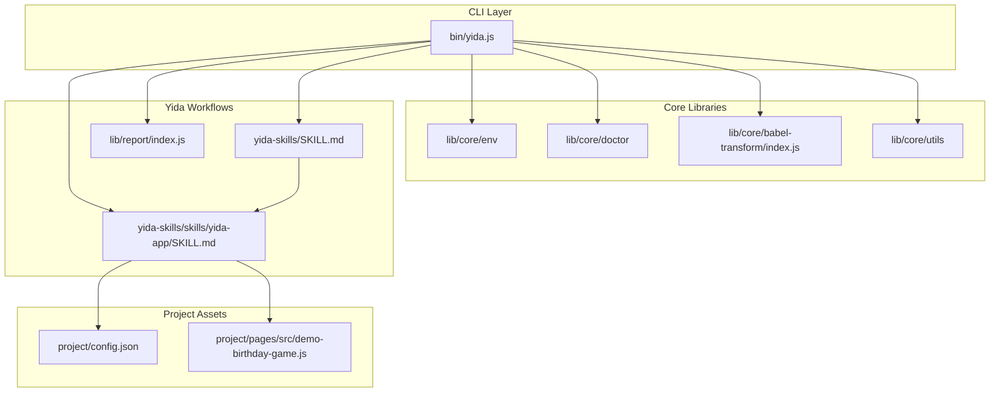
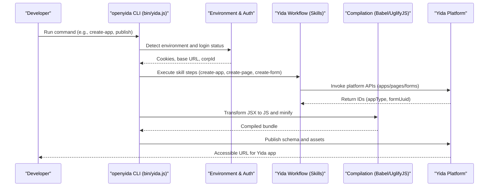
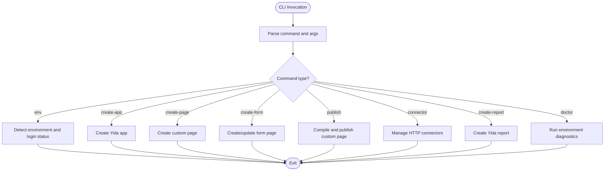
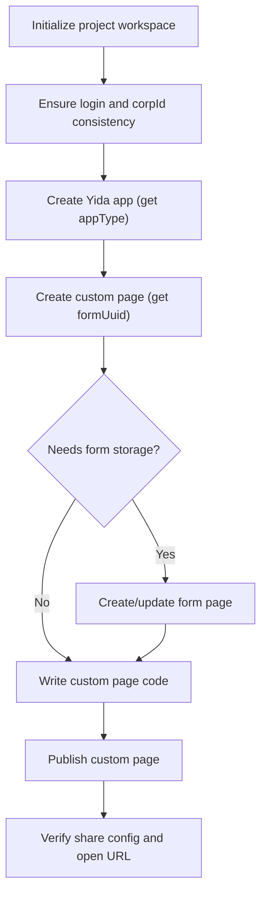
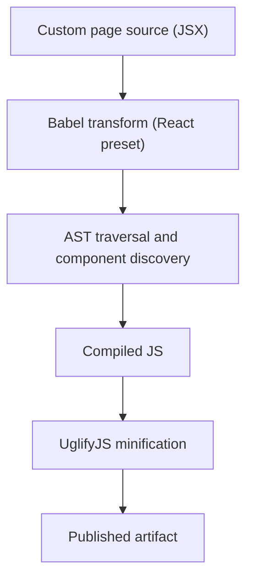
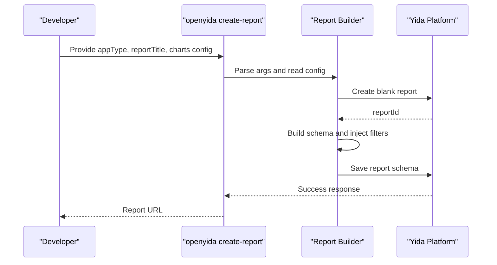
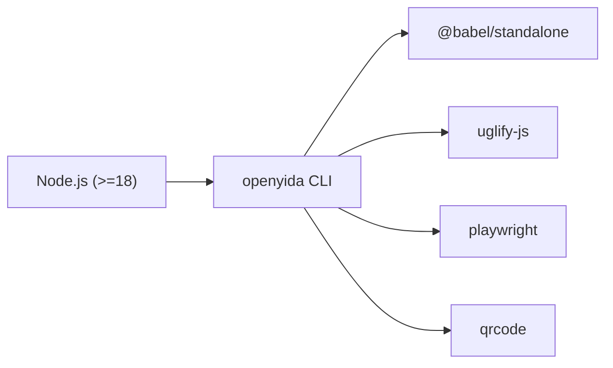

# Project Overview

<cite>
**Referenced Files in This Document**
- [README.md](file://README.md)
- [package.json](file://package.json)
- [bin/yida.js](file://bin/yida.js)
- [yida-skills/SKILL.md](file://yida-skills/SKILL.md)
- [yida-skills/skills/yida-app/SKILL.md](file://yida-skills/skills/yida-app/SKILL.md)
- [lib/core/babel-transform/index.js](file://lib/core/babel-transform/index.js)
- [lib/report/index.js](file://lib/report/index.js)
- [project/config.json](file://project/config.json)
- [project/pages/src/demo-birthday-game.js](file://project/pages/src/demo-birthday-game.js)
</cite>

## Table of Contents
1. [Introduction](#introduction)
2. [Project Structure](#project-structure)
3. [Core Components](#core-components)
4. [Architecture Overview](#architecture-overview)
5. [Detailed Component Analysis](#detailed-component-analysis)
6. [Dependency Analysis](#dependency-analysis)
7. [Performance Considerations](#performance-considerations)
8. [Troubleshooting Guide](#troubleshooting-guide)
9. [Conclusion](#conclusion)

## Introduction
OpenYida is an AI-powered CLI tool designed to accelerate development on the Alibaba Yida low-code platform. It enables developers to build complex business systems by turning natural language prompts into Yida app artifacts with minimal configuration. The project emphasizes:
- Zero-configuration, instant-deploy workflows
- Conversational AI integration with enterprise-grade low-code capabilities
- Seamless bridging between AI skill integration and Yida’s platform APIs
- Developer-focused tooling that preserves full editability and extensibility of generated Yida apps

OpenYida supports multiple AI coding environments and provides a unified CLI surface to orchestrate the entire lifecycle of Yida app development, from environment detection and authentication, to app creation, page and form scaffolding, custom page authoring, and publishing.

## Project Structure
At a high level, the repository is organized around:
- CLI entrypoint and command routing
- Core libraries for environment detection, compilation, and platform integration
- Skill-based workflows for Yida app development
- Example projects and demos showcasing low-code capabilities
- Configuration and metadata for platform connectivity

**Diagram sources**
- [bin/yida.js:140-521](file://bin/yida.js#L140-L521)
- [yida-skills/SKILL.md:1-235](file://yida-skills/SKILL.md#L1-L235)
- [yida-skills/skills/yida-app/SKILL.md:1-395](file://yida-skills/skills/yida-app/SKILL.md#L1-L395)
- [lib/core/babel-transform/index.js:1-244](file://lib/core/babel-transform/index.js#L1-L244)
- [lib/report/index.js:1-282](file://lib/report/index.js#L1-L282)
- [project/config.json:1-5](file://project/config.json#L1-L5)
- [project/pages/src/demo-birthday-game.js:1-834](file://project/pages/src/demo-birthday-game.js#L1-L834)

**Section sources**
- [README.md:1-223](file://README.md#L1-L223)
- [package.json:1-73](file://package.json#L1-L73)
- [bin/yida.js:140-521](file://bin/yida.js#L140-L521)

## Core Components
- CLI entrypoint and command routing: The CLI parses user commands and dispatches to appropriate modules for environment detection, authentication, app creation, page/form management, publishing, reporting, and integrations.
- Authentication and environment helpers: Provide seamless login, organization switching, and environment diagnostics.
- Compilation pipeline: Babel-based JSX-to-JS transformation and UglifyJS minification for custom page publishing.
- Yida skill workflows: Structured guidance for building Yida apps end-to-end, including app creation, page/form scaffolding, schema retrieval, and publishing.
- Reporting toolkit: Automated creation and configuration of Yida reports with filters and chart linkage.
- Example assets: Demonstrations of custom page development and low-code capabilities.

**Section sources**
- [bin/yida.js:140-521](file://bin/yida.js#L140-L521)
- [yida-skills/SKILL.md:1-235](file://yida-skills/SKILL.md#L1-L235)
- [yida-skills/skills/yida-app/SKILL.md:1-395](file://yida-skills/skills/yida-app/SKILL.md#L1-L395)
- [lib/core/babel-transform/index.js:1-244](file://lib/core/babel-transform/index.js#L1-L244)
- [lib/report/index.js:1-282](file://lib/report/index.js#L1-L282)
- [project/pages/src/demo-birthday-game.js:1-834](file://project/pages/src/demo-birthday-game.js#L1-L834)

## Architecture Overview
OpenYida’s architecture centers on a CLI-driven workflow that orchestrates AI skill integration with Yida platform APIs. The CLI routes commands to domain-specific modules, which in turn interact with Yida services for authentication, app/page/form management, and publishing. The compilation pipeline transforms custom page code into a format compatible with Yida’s rendering engine.

**Diagram sources**
- [bin/yida.js:140-521](file://bin/yida.js#L140-L521)
- [yida-skills/SKILL.md:1-235](file://yida-skills/SKILL.md#L1-L235)
- [yida-skills/skills/yida-app/SKILL.md:1-395](file://yida-skills/skills/yida-app/SKILL.md#L1-L395)
- [lib/core/babel-transform/index.js:1-244](file://lib/core/babel-transform/index.js#L1-L244)
- [lib/report/index.js:1-282](file://lib/report/index.js#L1-L282)

## Detailed Component Analysis

### CLI Command Routing and Developer Experience
The CLI serves as the central interface for all developer actions. It supports environment detection, authentication, organization switching, app and page creation, form management, publishing, data operations, permissions, connectors, reporting, and CDN tasks. On first run, it prints a guided walkthrough and examples to onboard users quickly.

**Diagram sources**
- [bin/yida.js:140-521](file://bin/yida.js#L140-L521)

**Section sources**
- [bin/yida.js:140-521](file://bin/yida.js#L140-L521)
- [README.md:77-136](file://README.md#L77-L136)

### Yida Skill Integration and Low-Code Capabilities
OpenYida’s skill system defines structured workflows for building Yida apps. It covers environment checks, initialization of the project workspace, app creation, page/form scaffolding, schema retrieval, custom page authoring, and publishing. The skill documents emphasize:
- Using the CLI to execute each step
- Storing business semantics in PRD docs and schema IDs in cache files
- Automatic login and organization consistency checks
- Publishing URLs and navigation options

**Diagram sources**
- [yida-skills/SKILL.md:99-122](file://yida-skills/SKILL.md#L99-L122)
- [yida-skills/skills/yida-app/SKILL.md:46-61](file://yida-skills/skills/yida-app/SKILL.md#L46-L61)

**Section sources**
- [yida-skills/SKILL.md:1-235](file://yida-skills/SKILL.md#L1-L235)
- [yida-skills/skills/yida-app/SKILL.md:1-395](file://yida-skills/skills/yida-app/SKILL.md#L1-L395)

### Compilation Pipeline for Custom Pages
Custom pages authored in JSX are compiled and minified before publishing. The pipeline:
- Transforms JSX to ES5-compatible JavaScript using Babel
- Extracts component references and manages bindings
- Minifies the code for deployment
- Produces a compiled artifact suitable for Yida’s rendering engine

**Diagram sources**
- [lib/core/babel-transform/index.js:89-244](file://lib/core/babel-transform/index.js#L89-L244)

**Section sources**
- [lib/core/babel-transform/index.js:1-244](file://lib/core/babel-transform/index.js#L1-L244)

### Reporting Toolkit for Yida Reports
The reporting module automates creation and configuration of Yida reports:
- Reads report configuration (charts and optional filters)
- Creates a blank report and builds its schema
- Injects filters and establishes linkage to charts
- Saves the schema and prints the accessible URL

**Diagram sources**
- [lib/report/index.js:96-282](file://lib/report/index.js#L96-L282)

**Section sources**
- [lib/report/index.js:1-282](file://lib/report/index.js#L1-L282)

### Practical Examples and Use Cases
Common scenarios enabled by OpenYida include:
- Building IPD systems to manage chip production workflows
- Creating CRM applications tailored to business needs
- Developing utility tools such as personal salary calculators
- Generating landing pages and engaging campaigns

These use cases demonstrate how natural language prompts can drive end-to-end Yida app generation, leveraging the CLI and skill workflows to deliver editable, publishable Yida apps.

**Section sources**
- [README.md:139-164](file://README.md#L139-L164)

## Dependency Analysis
OpenYida’s runtime and development dependencies include:
- Node.js runtime (≥18) for CLI execution
- Babel standalone for JSX transformation
- Playwright for browser automation
- UglifyJS for code minification
- QR code generation for login flows

**Diagram sources**
- [package.json:49-72](file://package.json#L49-L72)

**Section sources**
- [package.json:1-73](file://package.json#L1-L73)

## Performance Considerations
- Compilation: Babel and UglifyJS introduce overhead during publishing. Keep custom page code modular and avoid unnecessary dependencies to minimize build times.
- Network requests: Authentication and publishing rely on platform APIs. Ensure stable network connectivity and consider caching cookies to reduce repeated login flows.
- Report generation: Large chart configurations and filter linkages can increase schema complexity. Prefer concise configurations and targeted linkage to charts.

## Troubleshooting Guide
- First-run guidance: On initial execution, the CLI prints a guided walkthrough and example prompts to help developers get started quickly.
- Environment detection: Use environment detection and doctor commands to diagnose login status, organization access, and platform connectivity.
- Login issues: If publishing fails due to invalid sessions, clear cached cookies and re-run the publish command to trigger automatic login.
- CorpId mismatch: When creating pages or forms, ensure the organization matches the PRD configuration; otherwise, choose to re-login to the correct organization or create a new app in the current organization.

**Section sources**
- [bin/yida.js:73-138](file://bin/yida.js#L73-L138)
- [yida-skills/SKILL.md:211-235](file://yida-skills/SKILL.md#L211-L235)
- [yida-skills/skills/yida-app/SKILL.md:355-374](file://yida-skills/skills/yida-app/SKILL.md#L355-L374)

## Conclusion
OpenYida delivers a zero-configuration, AI-assisted pathway to build Yida low-code applications. By unifying environment detection, authentication, skill-driven workflows, and a robust compilation pipeline, it lowers the barrier to creating complex business systems while preserving full control and editability of generated Yida apps. Whether building IPD systems, CRM applications, or utility tools, developers can leverage natural language prompts and the CLI to iterate rapidly and deploy instantly.