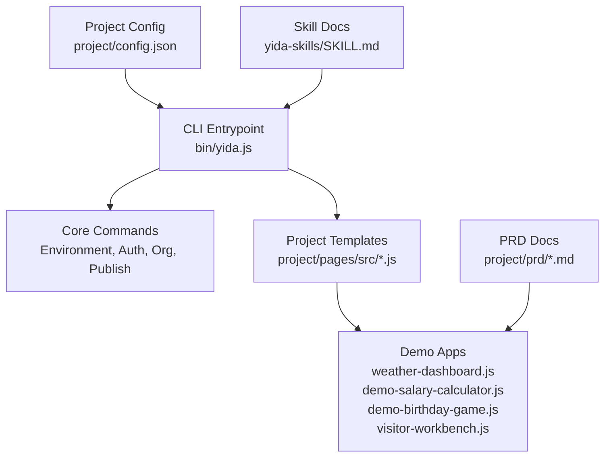
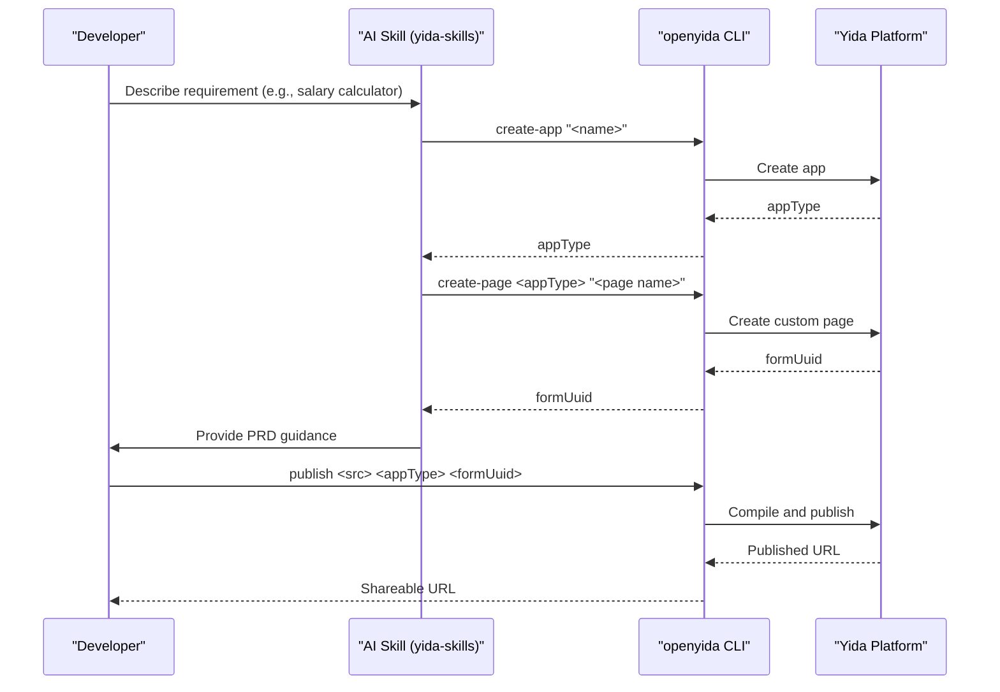
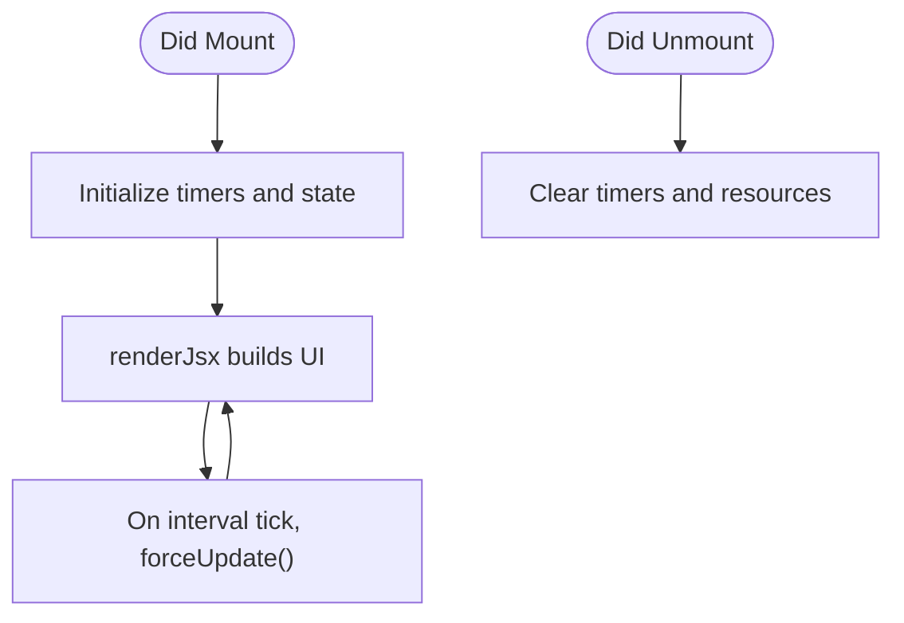
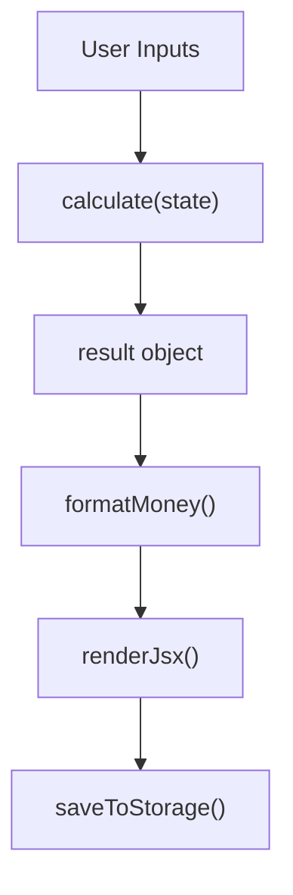
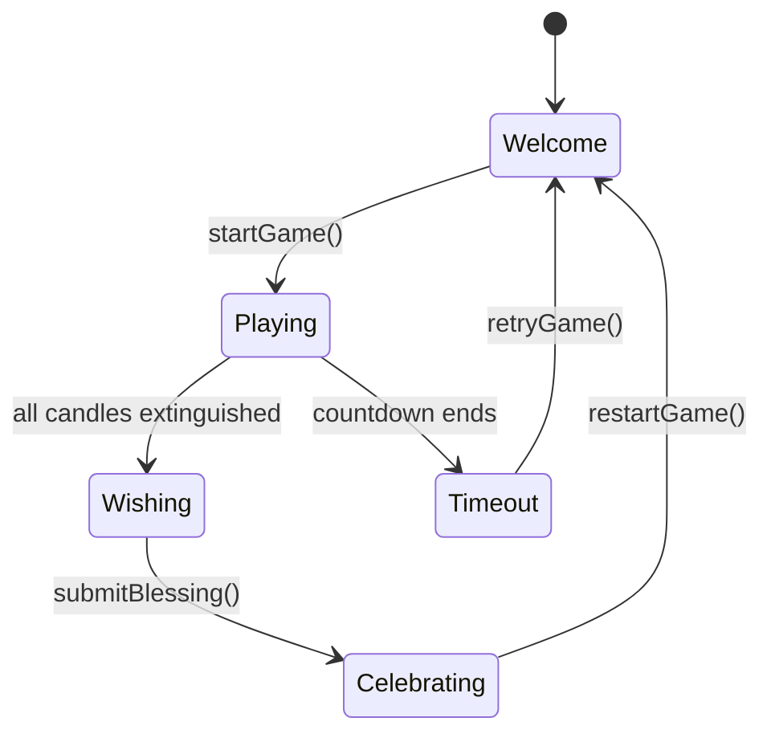
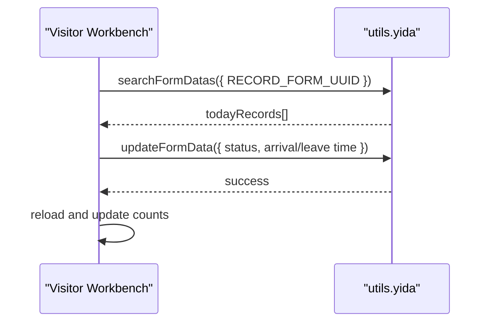
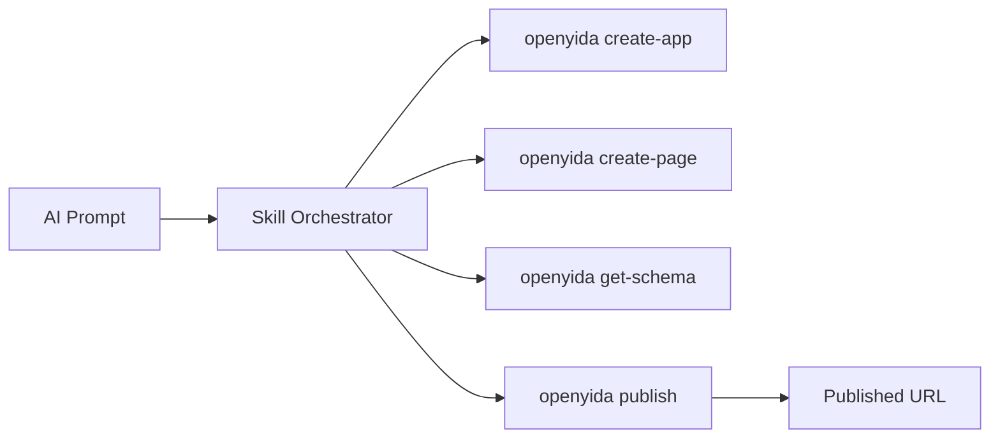
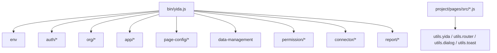

# Project Templates & Examples

<cite>
**Referenced Files in This Document**
- [README.md](file://README.md)
- [package.json](file://package.json)
- [bin/yida.js](file://bin/yida.js)
- [project/config.json](file://project/config.json)
- [project/pages/src/demo-birthday-game.js](file://project/pages/src/demo-birthday-game.js)
- [project/pages/src/weather-dashboard.js](file://project/pages/src/weather-dashboard.js)
- [project/pages/src/demo-salary-calculator.js](file://project/pages/src/demo-salary-calculator.js)
- [project/pages/src/visitor-workbench.js](file://project/pages/src/visitor-workbench.js)
- [project/prd/demo-birthday-game.md](file://project/prd/demo-birthday-game.md)
- [project/prd/demo-salary-calculator.md](file://project/prd/demo-salary-calculator.md)
- [project/prd/visitor-system.md](file://project/prd/visitor-system.md)
- [yida-skills/SKILL.md](file://yida-skills/SKILL.md)
</cite>

## Table of Contents
1. [Introduction](#introduction)
2. [Project Structure](#project-structure)
3. [Core Components](#core-components)
4. [Architecture Overview](#architecture-overview)
5. [Detailed Component Analysis](#detailed-component-analysis)
6. [Dependency Analysis](#dependency-analysis)
7. [Performance Considerations](#performance-considerations)
8. [Troubleshooting Guide](#troubleshooting-guide)
9. [Conclusion](#conclusion)
10. [Appendices](#appendices)

## Introduction
This document explains OpenYida’s project templates and demonstration applications. It covers the CLI-driven development workflow, the template system for building custom pages, and the included demo apps (birthday game, weather dashboard, salary calculator, visitor workbench). It also documents configuration, AI skill integration for automated code generation, customization patterns, and best practices for maintaining templates across projects.

## Project Structure
OpenYida organizes templates and demos under the project directory, with a CLI entrypoint and skill-based automation for AI-assisted development.

**Diagram sources**
- [bin/yida.js:1-521](file://bin/yida.js#L1-L521)
- [project/config.json:1-5](file://project/config.json#L1-L5)
- [yida-skills/SKILL.md:1-235](file://yida-skills/SKILL.md#L1-L235)

**Section sources**
- [README.md:1-223](file://README.md#L1-L223)
- [package.json:1-74](file://package.json#L1-L74)
- [bin/yida.js:1-521](file://bin/yida.js#L1-L521)
- [project/config.json:1-5](file://project/config.json#L1-L5)
- [yida-skills/SKILL.md:1-235](file://yida-skills/SKILL.md#L1-L235)

## Core Components
- CLI commands: Environment detection, authentication, organization switching, app creation, page creation, publishing, data management, permissions, connectors, reports, and more.
- Template pages: Ready-to-use demo pages under project/pages/src, each implementing a custom page with lifecycle hooks, state management, and rendering logic.
- PRD docs: Requirement specs per demo, guiding schema and feature coverage.
- Skill docs: AI skill guide for automated development, including environment checks, initialization, and end-to-end workflow.

Key template files:
- Weather dashboard: [project/pages/src/weather-dashboard.js](file://project/pages/src/weather-dashboard.js)
- Salary calculator: [project/pages/src/demo-salary-calculator.js](file://project/pages/src/demo-salary-calculator.js)
- Birthday game: [project/pages/src/demo-birthday-game.js](file://project/pages/src/demo-birthday-game.js)
- Visitor workbench: [project/pages/src/visitor-workbench.js](file://project/pages/src/visitor-workbench.js)

**Section sources**
- [bin/yida.js:140-521](file://bin/yida.js#L140-L521)
- [project/pages/src/weather-dashboard.js:1-374](file://project/pages/src/weather-dashboard.js#L1-L374)
- [project/pages/src/demo-salary-calculator.js:1-905](file://project/pages/src/demo-salary-calculator.js#L1-L905)
- [project/pages/src/demo-birthday-game.js:1-834](file://project/pages/src/demo-birthday-game.js#L1-L834)
- [project/pages/src/visitor-workbench.js:1-741](file://project/pages/src/visitor-workbench.js#L1-L741)

## Architecture Overview
OpenYida’s development flow integrates AI skills with CLI commands and project templates. The AI skill orchestrates steps from app creation to publishing, while the CLI executes actions against the Yida platform.

**Diagram sources**
- [yida-skills/SKILL.md:99-122](file://yida-skills/SKILL.md#L99-L122)
- [bin/yida.js:243-280](file://bin/yida.js#L243-L280)

**Section sources**
- [yida-skills/SKILL.md:1-235](file://yida-skills/SKILL.md#L1-L235)
- [bin/yida.js:140-521](file://bin/yida.js#L140-L521)

## Detailed Component Analysis

### Weather Dashboard Template
A data visualization dashboard with metrics, charts, and live clock. It demonstrates:
- State lifecycle (didMount/didUnmount)
- Timer-based re-rendering
- SVG-based charts and responsive layout
- External form link injection

**Diagram sources**
- [project/pages/src/weather-dashboard.js:103-124](file://project/pages/src/weather-dashboard.js#L103-L124)
- [project/pages/src/weather-dashboard.js:126-374](file://project/pages/src/weather-dashboard.js#L126-L374)

**Section sources**
- [project/pages/src/weather-dashboard.js:1-374](file://project/pages/src/weather-dashboard.js#L1-L374)

### Salary Calculator Template
A financial calculator with:
- State-driven computation engine
- Local storage persistence
- Real-time calculation triggers
- Copy-to-clipboard result sharing

**Diagram sources**
- [project/pages/src/demo-salary-calculator.js:66-144](file://project/pages/src/demo-salary-calculator.js#L66-L144)
- [project/pages/src/demo-salary-calculator.js:198-225](file://project/pages/src/demo-salary-calculator.js#L198-L225)
- [project/pages/src/demo-salary-calculator.js:273-800](file://project/pages/src/demo-salary-calculator.js#L273-L800)

**Section sources**
- [project/pages/src/demo-salary-calculator.js:1-905](file://project/pages/src/demo-salary-calculator.js#L1-L905)

### Birthday Game Template
Interactive game with:
- Audio input via Web Audio API
- State machine for game stages
- DOM-managed animations and timers
- Conditional overlays and celebrations

**Diagram sources**
- [project/pages/src/demo-birthday-game.js:98-130](file://project/pages/src/demo-birthday-game.js#L98-L130)
- [project/pages/src/demo-birthday-game.js:200-211](file://project/pages/src/demo-birthday-game.js#L200-L211)
- [project/pages/src/demo-birthday-game.js:300-346](file://project/pages/src/demo-birthday-game.js#L300-L346)

**Section sources**
- [project/pages/src/demo-birthday-game.js:1-834](file://project/pages/src/demo-birthday-game.js#L1-L834)

### Visitor Workbench Template
A front-desk management interface with:
- Data fetching from Yida forms
- Status transitions (check-in/check-out)
- Modal forms for quick entries
- Search and filtering

**Diagram sources**
- [project/pages/src/visitor-workbench.js:76-121](file://project/pages/src/visitor-workbench.js#L76-L121)
- [project/pages/src/visitor-workbench.js:124-187](file://project/pages/src/visitor-workbench.js#L124-L187)
- [project/pages/src/visitor-workbench.js:190-235](file://project/pages/src/visitor-workbench.js#L190-L235)

**Section sources**
- [project/pages/src/visitor-workbench.js:1-741](file://project/pages/src/visitor-workbench.js#L1-L741)

### AI Skill Integration and Automated Code Generation
The AI skill automates the end-to-end development workflow:
- Environment detection and login
- App and page creation
- Schema retrieval and field mapping
- Publishing and sharing configuration

**Diagram sources**
- [yida-skills/SKILL.md:99-122](file://yida-skills/SKILL.md#L99-L122)
- [bin/yida.js:243-280](file://bin/yida.js#L243-L280)

**Section sources**
- [yida-skills/SKILL.md:1-235](file://yida-skills/SKILL.md#L1-L235)
- [bin/yida.js:140-521](file://bin/yida.js#L140-L521)

## Dependency Analysis
- CLI entrypoint routes commands to modular handlers.
- Project templates depend on Yida runtime APIs exposed via utils (e.g., data queries, routing, dialogs).
- Skill docs define the recommended order and parameters for each step.

**Diagram sources**
- [bin/yida.js:152-512](file://bin/yida.js#L152-L512)

**Section sources**
- [bin/yida.js:140-521](file://bin/yida.js#L140-L521)

## Performance Considerations
- Prefer lightweight state updates and minimal re-renders in templates.
- Debounce heavy computations (e.g., real-time calculators) to reduce CPU usage.
- Use lazy initialization and cleanup in lifecycle hooks to avoid memory leaks.
- For dashboards, throttle timers and avoid unnecessary DOM updates.

## Troubleshooting Guide
Common issues and resolutions:
- Login/session errors: Re-run environment detection and login.
  - Reference: [yida-skills/SKILL.md:211-216](file://yida-skills/SKILL.md#L211-L216)
- CorpId mismatch: Switch organization or log in again to the correct account.
  - Reference: [yida-skills/SKILL.md:222-228](file://yida-skills/SKILL.md#L222-L228)
- Publishing failures: Confirm appType/formUuid and re-run publish.
  - Reference: [bin/yida.js:268-280](file://bin/yida.js#L268-L280)
- Data fetch errors: Validate form UUIDs and network connectivity.
  - Reference: [project/pages/src/visitor-workbench.js:115-120](file://project/pages/src/visitor-workbench.js#L115-L120)

**Section sources**
- [yida-skills/SKILL.md:211-235](file://yida-skills/SKILL.md#L211-L235)
- [bin/yida.js:268-280](file://bin/yida.js#L268-L280)
- [project/pages/src/visitor-workbench.js:115-120](file://project/pages/src/visitor-workbench.js#L115-L120)

## Conclusion
OpenYida’s template system and demo applications provide a practical foundation for building Yida-powered pages. Combined with the AI skill integration and CLI automation, teams can rapidly prototype, iterate, and publish functional applications. Templates demonstrate best practices for state management, lifecycle handling, and UI composition, while the skill docs ensure consistent workflows and reliable publishing.

## Appendices

### Development Guidelines and Best Practices
- Use PRD docs to capture semantic field names and business rules; keep IDs in cache files.
  - Reference: [yida-skills/SKILL.md:161-168](file://yida-skills/SKILL.md#L161-L168)
- Keep templates modular and reusable; expose lifecycle hooks and state getters/setters.
  - References: [project/pages/src/weather-dashboard.js:85-101](file://project/pages/src/weather-dashboard.js#L85-L101), [project/pages/src/demo-salary-calculator.js:155-170](file://project/pages/src/demo-salary-calculator.js#L155-L170)
- Validate inputs and provide user feedback via toast/dialog utilities.
  - References: [project/pages/src/visitor-workbench.js:128-153](file://project/pages/src/visitor-workbench.js#L128-L153), [project/pages/src/demo-birthday-game.js:105-108](file://project/pages/src/demo-birthday-game.js#L105-L108)

### Template Usage and Modification Workflow
- Start from PRD: define fields and flows in markdown.
  - References: [project/prd/demo-birthday-game.md:1-39](file://project/prd/demo-birthday-game.md#L1-L39), [project/prd/demo-salary-calculator.md:1-101](file://project/prd/demo-salary-calculator.md#L1-L101), [project/prd/visitor-system.md:1-99](file://project/prd/visitor-system.md#L1-L99)
- Create app and page via CLI; publish and share.
  - References: [yida-skills/SKILL.md:99-122](file://yida-skills/SKILL.md#L99-L122), [bin/yida.js:243-280](file://bin/yida.js#L243-L280)

### AI Skill Integration Notes
- The skill automates environment checks, schema retrieval, and publishing.
- Always read the specific skill docs before invoking sub-commands.
  - Reference: [yida-skills/SKILL.md:124-145](file://yida-skills/SKILL.md#L124-L145)