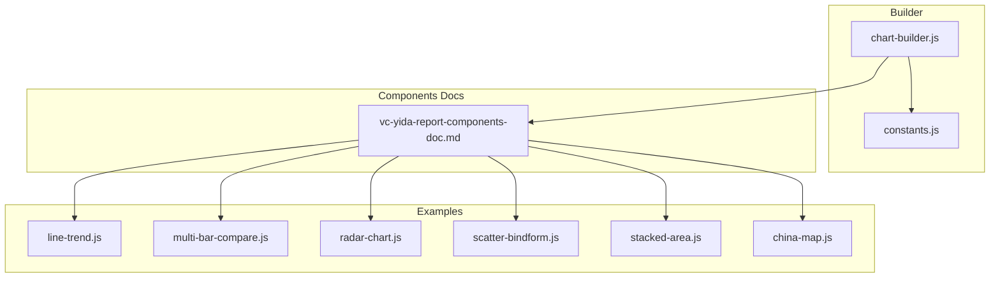
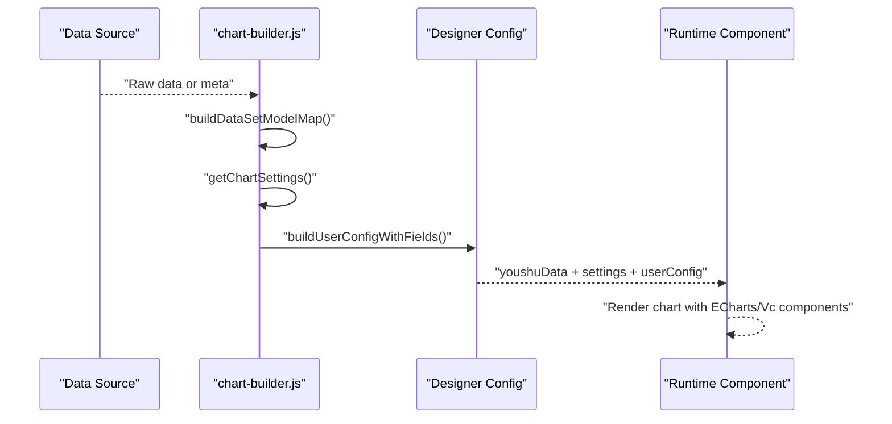
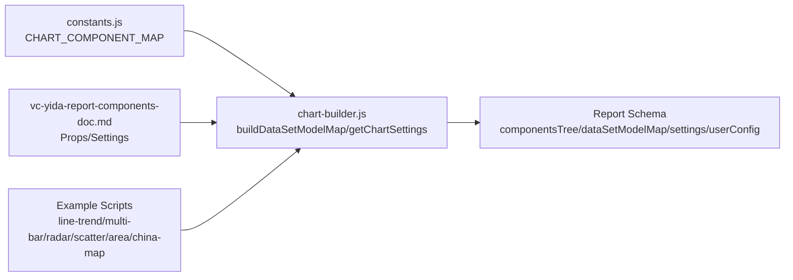

# Chart Types & Configuration

<cite>
**Referenced Files in This Document**
- [chart-builder.js](file://lib/report/chart-builder.js)
- [constants.js](file://lib/report/constants.js)
- [vc-yida-report-components-doc.md](file://yida-skills/reference/vc-yida-report-components-doc.md)
- [line-trend.js](file://yida-skills/skills/yida-chart/examples/line-trend.js)
- [multi-bar-compare.js](file://yida-skills/skills/yida-chart/examples/multi-bar-compare.js)
- [radar-chart.js](file://yida-skills/skills/yida-chart/examples/radar-chart.js)
- [scatter-bindform.js](file://yida-skills/skills/yida-chart/examples/scatter-bindform.js)
- [stacked-area.js](file://yida-skills/skills/yida-chart/examples/stacked-area.js)
- [china-map.js](file://yida-skills/skills/yida-chart/examples/china-map.js)
</cite>

## Table of Contents
1. [Introduction](#introduction)
2. [Project Structure](#project-structure)
3. [Core Components](#core-components)
4. [Architecture Overview](#architecture-overview)
5. [Detailed Component Analysis](#detailed-component-analysis)
6. [Dependency Analysis](#dependency-analysis)
7. [Performance Considerations](#performance-considerations)
8. [Troubleshooting Guide](#troubleshooting-guide)
9. [Conclusion](#conclusion)
10. [Appendices](#appendices)

## Introduction
This document explains the chart types and configuration options available in OpenYida’s reporting system. It covers how charts are defined, rendered, styled, and integrated with data sources. It also documents real-world configuration patterns from example scripts and the underlying schema builder used by the platform.

## Project Structure
OpenYida organizes chart configuration and rendering across:
- Report schema builder: constructs chart datasets, settings, and designer-compatible userConfig
- Component reference: describes supported chart components and their props/settings
- Example scripts: demonstrate end-to-end data fetching, parsing, and rendering for typical chart types

**Diagram sources**
- [chart-builder.js:1196-1418](file://lib/report/chart-builder.js#L1196-L1418)
- [constants.js:5-15](file://lib/report/constants.js#L5-L15)
- [vc-yida-report-components-doc.md:1-616](file://yida-skills/reference/vc-yida-report-components-doc.md#L1-L616)
- [line-trend.js:1-392](file://yida-skills/skills/yida-chart/examples/line-trend.js#L1-L392)
- [multi-bar-compare.js:1-332](file://yida-skills/skills/yida-chart/examples/multi-bar-compare.js#L1-L332)
- [radar-chart.js:1-431](file://yida-skills/skills/yida-chart/examples/radar-chart.js#L1-L431)
- [scatter-bindform.js:1-401](file://yida-skills/skills/yida-chart/examples/scatter-bindform.js#L1-L401)
- [stacked-area.js:1-358](file://yida-skills/skills/yida-chart/examples/stacked-area.js#L1-L358)
- [china-map.js:1-458](file://yida-skills/skills/yida-chart/examples/china-map.js#L1-L458)

**Section sources**
- [chart-builder.js:1196-1418](file://lib/report/chart-builder.js#L1196-L1418)
- [constants.js:5-15](file://lib/report/constants.js#L5-L15)
- [vc-yida-report-components-doc.md:1-616](file://yida-skills/reference/vc-yida-report-components-doc.md#L1-L616)

## Core Components
- Chart type mapping: The builder maps logical chart types (bar, line, pie, funnel, gauge, combo, table, indicator, pivot) to concrete component names used at runtime.
- Settings factory: Each chart type has a dedicated settings builder that defines defaults for axes, legends, tooltips, colors, and layout.
- DataSet model: The builder generates dataset models per chart, assigning roles (xField, yField, groupField, leftYFields, rightYFields, etc.) and field metadata.
- Designer integration: userConfig arrays define how the visual report designer exposes fields and tabs for each chart type.

Key builder functions and roles:
- Type mapping: [CHART_COMPONENT_MAP:5-15](file://lib/report/constants.js#L5-L15)
- Settings getters: [getChartSettings:827-844](file://lib/report/chart-builder.js#L827-L844)
- DataSet model builders: [buildDataSetModelMap:191-515](file://lib/report/chart-builder.js#L191-L515)
- Field definition helpers: [buildFieldObj:68-105](file://lib/report/chart-builder.js#L68-L105), [buildDataViewQueryModel:116-186](file://lib/report/chart-builder.js#L116-L186)
- Mock data builders: [buildMockData:1019-1189](file://lib/report/chart-builder.js#L1019-L1189)

**Section sources**
- [constants.js:5-15](file://lib/report/constants.js#L5-L15)
- [chart-builder.js:68-105](file://lib/report/chart-builder.js#L68-L105)
- [chart-builder.js:116-186](file://lib/report/chart-builder.js#L116-L186)
- [chart-builder.js:191-515](file://lib/report/chart-builder.js#L191-L515)
- [chart-builder.js:827-844](file://lib/report/chart-builder.js#L827-L844)
- [chart-builder.js:1019-1189](file://lib/report/chart-builder.js#L1019-L1189)

## Architecture Overview
The reporting pipeline connects data sources to chart components via a schema builder and designer-friendly configuration.

**Diagram sources**
- [chart-builder.js:1196-1418](file://lib/report/chart-builder.js#L1196-L1418)
- [chart-builder.js:827-844](file://lib/report/chart-builder.js#L827-L844)
- [chart-builder.js:912-1015](file://lib/report/chart-builder.js#L912-L1015)

## Detailed Component Analysis

### Line Trend Charts
Purpose: Compare multiple series over time or categories.

Configuration highlights:
- Roles: xField (time/category), yField (metrics), optional groupField for grouping
- Settings: smooth curves, point markers, area fill, legend, tooltip, slider
- Rendering pattern: series array built from parsed table data; ECharts option set with title, tooltip, legend, axes, grid, and optional dataZoom

Real-world example references:
- Data fetch and parse: [_fetchReportData:140-178](file://yida-skills/skills/yida-chart/examples/line-trend.js#L140-L178), [_parseTableData:183-207](file://yida-skills/skills/yida-chart/examples/line-trend.js#L183-L207)
- Render: [renderTrendChart:246-327](file://yida-skills/skills/yida-chart/examples/line-trend.js#L246-L327)

Builder integration:
- Fields: [buildDataViewQueryModel:116-186](file://lib/report/chart-builder.js#L116-L186)
- Settings: [buildLineChartSettings:565-602](file://lib/report/chart-builder.js#L565-L602)
- UserConfig: [buildUserConfigWithFields:940-957](file://lib/report/chart-builder.js#L940-L957)

Validation rules:
- Ensure xField is categorical/time-like; yField numeric; groupField optional
- Meta inference: dimension vs measure detection via [_parseTableData:183-207](file://yida-skills/skills/yida-chart/examples/line-trend.js#L183-L207)

Practical example scenario:
- Two series: Status distribution and Priority distribution over categories
- Toggle smoothness and area fill via settings

**Section sources**
- [line-trend.js:140-327](file://yida-skills/skills/yida-chart/examples/line-trend.js#L140-L327)
- [chart-builder.js:565-602](file://lib/report/chart-builder.js#L565-L602)
- [chart-builder.js:940-957](file://lib/report/chart-builder.js#L940-L957)

### Multi-Bar Comparison Charts
Purpose: Grouped or stacked bar comparisons across categories.

Configuration highlights:
- Modes: grouped vs stacked (via settings or toggled state)
- Roles: xField (main categories), yField (values), groupField (sub-categories)
- Rendering pattern: series per sub-category; bar widths and emphasis styles configured

Real-world example references:
- Data aggregation: [buildMultiBarData:149-171](file://yida-skills/skills/yida-chart/examples/multi-bar-compare.js#L149-L171)
- Render: [renderMultiBarChart:185-241](file://yida-skills/skills/yida-chart/examples/multi-bar-compare.js#L185-L241)
- Mode toggle: [toggleStackMode:243-247](file://yida-skills/skills/yida-chart/examples/multi-bar-compare.js#L243-L247)

Builder integration:
- Settings: [buildBarChartSettings:519-563](file://lib/report/chart-builder.js#L519-L563)
- UserConfig: [buildUserConfigWithFields:940-957](file://lib/report/chart-builder.js#L940-L957)

Validation rules:
- Ensure main categories on x-axis and numeric values on y-axis
- Sub-category mapping to series colors and stacking behavior

Practical example scenario:
- Compare counts across Status and Priority groups; switch between grouped and stacked modes

**Section sources**
- [multi-bar-compare.js:149-247](file://yida-skills/skills/yida-chart/examples/multi-bar-compare.js#L149-L247)
- [chart-builder.js:519-563](file://lib/report/chart-builder.js#L519-L563)
- [chart-builder.js:940-957](file://lib/report/chart-builder.js#L940-L957)

### Radar Charts
Purpose: Multi-dimensional comparative scoring.

Configuration highlights:
- Roles: xField (dimensions), yField (scores), optional groupField (series)
- Settings: smooth lines, area fill, legend, tooltip
- Rendering pattern: indicator list built from status and priority labels; series values merged from parsed data

Real-world example references:
- Data parsing: [_parseTableData:150-174](file://yida-skills/skills/yida-chart/examples/radar-chart.js#L150-L174)
- Indicator construction: [buildRadarData:247-269](file://yida-skills/skills/yida-chart/examples/radar-chart.js#L247-L269)
- Render: [renderRadarChart:283-366](file://yida-skills/skills/yida-chart/examples/radar-chart.js#L283-L366)

Builder integration:
- Settings: [buildRadarChartSettings:671-683](file://lib/report/chart-builder.js#L671-L683)
- UserConfig: [buildUserConfigWithFields:940-957](file://lib/report/chart-builder.js#L940-L957)

Validation rules:
- Ensure dimension labels align with radar indicators
- Values normalized to comparable scales

Practical example scenario:
- Compare Status and Priority distributions across labeled dimensions

**Section sources**
- [radar-chart.js:150-366](file://yida-skills/skills/yida-chart/examples/radar-chart.js#L150-L366)
- [chart-builder.js:671-683](file://lib/report/chart-builder.js#L671-L683)
- [chart-builder.js:940-957](file://lib/report/chart-builder.js#L940-L957)

### Scatter Plots
Purpose: Correlation analysis between two numeric dimensions; optionally color by category and size by value.

Configuration highlights:
- Roles: xField (X-axis), yField (Y-axis), optional groupField (color)
- Settings: point size, shape, legend, tooltip
- Rendering pattern: series per category; symbolSize derived from third dimension

Real-world example references:
- Data parsing: [_parseTableData:149-173](file://yida-skills/skills/yida-chart/examples/scatter-bindform.js#L149-L173)
- Series construction: [buildScatterData:196-231](file://yida-skills/skills/yida-chart/examples/scatter-bindform.js#L196-L231)
- Render: [renderScatterChart:245-315](file://yida-skills/skills/yida-chart/examples/scatter-bindform.js#L245-L315)

Builder integration:
- Settings: [buildScatterChartSettings:627-650](file://lib/report/chart-builder.js#L627-L650)
- UserConfig: [buildUserConfigWithFields:940-957](file://lib/report/chart-builder.js#L940-L957)

Validation rules:
- Ensure numeric fields for X/Y; optional third dimension for bubble size
- Tooltip formatter includes all relevant values

Practical example scenario:
- Budget vs actual spending correlation; color by category; bubble size by volume

**Section sources**
- [scatter-bindform.js:149-315](file://yida-skills/skills/yida-chart/examples/scatter-bindform.js#L149-L315)
- [chart-builder.js:627-650](file://lib/report/chart-builder.js#L627-L650)
- [chart-builder.js:940-957](file://lib/report/chart-builder.js#L940-L957)

### Stacked Area Charts
Purpose: Structural change over time; shows contribution of categories to totals.

Configuration highlights:
- Roles: xField (time), yField (values), groupField (categories)
- Settings: smooth lines, area fill, legend, tooltip, dataZoom for long timelines
- Rendering pattern: series per category; areaStyle configured per series

Real-world example references:
- Data parsing: [_parseTableData:148-172](file://yida-skills/skills/yida-chart/examples/stacked-area.js#L148-L172)
- Series construction: [buildAreaData:199-224](file://yida-skills/skills/yida-chart/examples/stacked-area.js#L199-L224)
- Render: [renderAreaChart:238-293](file://yida-skills/skills/yida-chart/examples/stacked-area.js#L238-L293)

Builder integration:
- Settings: [buildAreaChartSettings:652-656](file://lib/report/chart-builder.js#L652-L656)
- UserConfig: [buildUserConfigWithFields:940-957](file://lib/report/chart-builder.js#L940-L957)

Validation rules:
- Ensure monotonic time ordering on x-axis; numeric values on y-axis
- Long timelines benefit from dataZoom

Practical example scenario:
- Monthly contributions by Status and Priority to total work items

**Section sources**
- [stacked-area.js:148-293](file://yida-skills/skills/yida-chart/examples/stacked-area.js#L148-L293)
- [chart-builder.js:652-656](file://lib/report/chart-builder.js#L652-L656)
- [chart-builder.js:940-957](file://lib/report/chart-builder.js#L940-L957)

### China Map Visualizations
Purpose: Geographic heat maps by province; supports drill-down and tooltip.

Configuration highlights:
- Roles: region name (standardized to GeoJSON names), value (metric)
- Settings: visualMap thresholds, map roam/zoom, label visibility, tooltip formatter
- Rendering pattern: register map, load GeoJSON, normalize province names, set visualMap and series

Real-world example references:
- GeoJSON registration: [loadChinaGeoJson:185-200](file://yida-skills/skills/yida-chart/examples/china-map.js#L185-L200)
- Province normalization: [normalizeProvinceName:252-272](file://yida-skills/skills/yida-chart/examples/china-map.js#L252-L272)
- Render: [renderChinaMap:286-348](file://yida-skills/skills/yida-chart/examples/china-map.js#L286-L348)

Builder integration:
- Component mapping: [CHART_COMPONENT_MAP:5-15](file://lib/report/constants.js#L5-L15) includes map component
- Designer props: [vc-yida-report-components-doc.md:421-442](file://yida-skills/reference/vc-yida-report-components-doc.md#L421-L442)

Validation rules:
- Region names must match GeoJSON keys; handle missing values gracefully in tooltip
- Adjust visualMap min/max dynamically based on data

Practical example scenario:
- Sales by province; hover to see values; zoom to focus regions

**Section sources**
- [china-map.js:185-348](file://yida-skills/skills/yida-chart/examples/china-map.js#L185-L348)
- [constants.js:5-15](file://lib/report/constants.js#L5-L15)
- [vc-yida-report-components-doc.md:421-442](file://yida-skills/reference/vc-yida-report-components-doc.md#L421-L442)

## Dependency Analysis
The builder orchestrates chart configuration and integrates with component docs and example scripts.

**Diagram sources**
- [constants.js:5-15](file://lib/report/constants.js#L5-L15)
- [chart-builder.js:191-515](file://lib/report/chart-builder.js#L191-L515)
- [chart-builder.js:827-844](file://lib/report/chart-builder.js#L827-L844)
- [vc-yida-report-components-doc.md:1-616](file://yida-skills/reference/vc-yida-report-components-doc.md#L1-L616)
- [line-trend.js:1-392](file://yida-skills/skills/yida-chart/examples/line-trend.js#L1-L392)
- [multi-bar-compare.js:1-332](file://yida-skills/skills/yida-chart/examples/multi-bar-compare.js#L1-L332)
- [radar-chart.js:1-431](file://yida-skills/skills/yida-chart/examples/radar-chart.js#L1-L431)
- [scatter-bindform.js:1-401](file://yida-skills/skills/yida-chart/examples/scatter-bindform.js#L1-L401)
- [stacked-area.js:1-358](file://yida-skills/skills/yida-chart/examples/stacked-area.js#L1-L358)
- [china-map.js:1-458](file://yida-skills/skills/yida-chart/examples/china-map.js#L1-L458)

**Section sources**
- [constants.js:5-15](file://lib/report/constants.js#L5-L15)
- [chart-builder.js:191-515](file://lib/report/chart-builder.js#L191-L515)
- [chart-builder.js:827-844](file://lib/report/chart-builder.js#L827-L844)
- [vc-yida-report-components-doc.md:1-616](file://yida-skills/reference/vc-yida-report-components-doc.md#L1-L616)

## Performance Considerations
- Large datasets
  - Use dataZoom for time-series charts to reduce rendering load
  - Paginate or cap series count; avoid excessive categories on x-axis
- Rendering efficiency
  - Reuse chart instances; dispose before reinitialization
  - Debounce resize handlers; only resize when needed
- Memory management
  - Clear or dispose chart instances on unmount
  - Avoid accumulating closures or event listeners
- Real-time updates
  - Implement periodic refresh intervals via settings
  - Use caching flags to control backend cache behavior
- Responsive design
  - Dynamically adjust font sizes and label rotations based on device
  - Hide labels or legends on small screens; enable scrollable legend

[No sources needed since this section provides general guidance]

## Troubleshooting Guide
Common issues and resolutions:
- Data formatting problems
  - Ensure dimension vs measure inference matches expectations; verify meta parsing
  - Normalize region names for maps to match GeoJSON keys
- Styling conflicts
  - Align color palettes with settings.customColor; avoid overly bright colors on small screens
  - Adjust label rotations and grid visibility to prevent overlap
- Rendering errors
  - Verify ECharts initialization and container existence before rendering
  - Check that chart types are mapped to supported components
- Interactivity
  - Enable tooltips and legends appropriately; confirm click handlers and drill-down settings
  - For maps, ensure GeoJSON is loaded before rendering

**Section sources**
- [line-trend.js:183-207](file://yida-skills/skills/yida-chart/examples/line-trend.js#L183-L207)
- [china-map.js:252-272](file://yida-skills/skills/yida-chart/examples/china-map.js#L252-L272)
- [chart-builder.js:519-563](file://lib/report/chart-builder.js#L519-L563)

## Conclusion
OpenYida’s reporting system provides a robust, schema-driven approach to building charts. The builder maps logical chart types to runtime components, generates dataset models and settings, and integrates with designer-friendly userConfig. Examples demonstrate practical configurations for line trends, bar comparisons, radar charts, scatter plots, stacked areas, and China maps. Following the validation rules and performance guidelines ensures reliable, responsive visualizations.

[No sources needed since this section summarizes without analyzing specific files]

## Appendices

### Chart Schema Structure and Property Definitions
- Logical chart types and component mapping:
  - [CHART_COMPONENT_MAP:5-15](file://lib/report/constants.js#L5-L15)
- Settings per chart type:
  - [getChartSettings:827-844](file://lib/report/chart-builder.js#L827-L844)
  - Bar: [buildBarChartSettings:519-563](file://lib/report/chart-builder.js#L519-L563)
  - Line: [buildLineChartSettings:565-602](file://lib/report/chart-builder.js#L565-L602)
  - Area: [buildAreaChartSettings:652-656](file://lib/report/chart-builder.js#L652-L656)
  - Pie: [buildPieChartSettings:604-625](file://lib/report/chart-builder.js#L604-L625)
  - Scatter: [buildScatterChartSettings:627-650](file://lib/report/chart-builder.js#L627-L650)
  - Funnel: [buildFunnelChartSettings:658-669](file://lib/report/chart-builder.js#L658-L669)
  - Radar: [buildRadarChartSettings:671-683](file://lib/report/chart-builder.js#L671-L683)
  - Gauge: [buildGaugeChartSettings:685-693](file://lib/report/chart-builder.js#L685-L693)
  - Combo: [buildComboChartSettings:715-769](file://lib/report/chart-builder.js#L715-L769)
  - Table: [buildTableSettings:695-713](file://lib/report/chart-builder.js#L695-L713)
  - Indicator: [buildIndicatorSettings:771-784](file://lib/report/chart-builder.js#L771-L784)
  - Pivot: [buildPivotSettings:786-814](file://lib/report/chart-builder.js#L786-L814)
- Dataset model generation:
  - [buildDataSetModelMap:191-515](file://lib/report/chart-builder.js#L191-L515)
  - [buildDataViewQueryModel:116-186](file://lib/report/chart-builder.js#L116-L186)
  - [buildFieldObj:68-105](file://lib/report/chart-builder.js#L68-L105)
- Designer integration:
  - [buildUserConfigWithFields:912-1015](file://lib/report/chart-builder.js#L912-L1015)
  - [buildMockData:1019-1189](file://lib/report/chart-builder.js#L1019-L1189)

**Section sources**
- [constants.js:5-15](file://lib/report/constants.js#L5-L15)
- [chart-builder.js:519-563](file://lib/report/chart-builder.js#L519-L563)
- [chart-builder.js:565-602](file://lib/report/chart-builder.js#L565-L602)
- [chart-builder.js:604-625](file://lib/report/chart-builder.js#L604-L625)
- [chart-builder.js:627-650](file://lib/report/chart-builder.js#L627-L650)
- [chart-builder.js:652-656](file://lib/report/chart-builder.js#L652-L656)
- [chart-builder.js:658-669](file://lib/report/chart-builder.js#L658-L669)
- [chart-builder.js:671-683](file://lib/report/chart-builder.js#L671-L683)
- [chart-builder.js:685-693](file://lib/report/chart-builder.js#L685-L693)
- [chart-builder.js:715-769](file://lib/report/chart-builder.js#L715-L769)
- [chart-builder.js:786-814](file://lib/report/chart-builder.js#L786-L814)
- [chart-builder.js:912-1015](file://lib/report/chart-builder.js#L912-L1015)
- [chart-builder.js:1019-1189](file://lib/report/chart-builder.js#L1019-L1189)

### Best Practices for Chart Selection
- Choose line charts for time trends and multi-series comparisons
- Use stacked bars for part-to-whole comparisons across categories
- Apply radar charts for multi-dimensional scoring and balanced assessments
- Use scatter plots for correlation analysis with categorical coloring
- Employ area charts for structural changes and cumulative contributions
- Use maps for geographic distributions and regional insights

[No sources needed since this section provides general guidance]