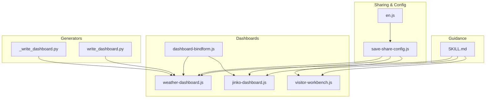
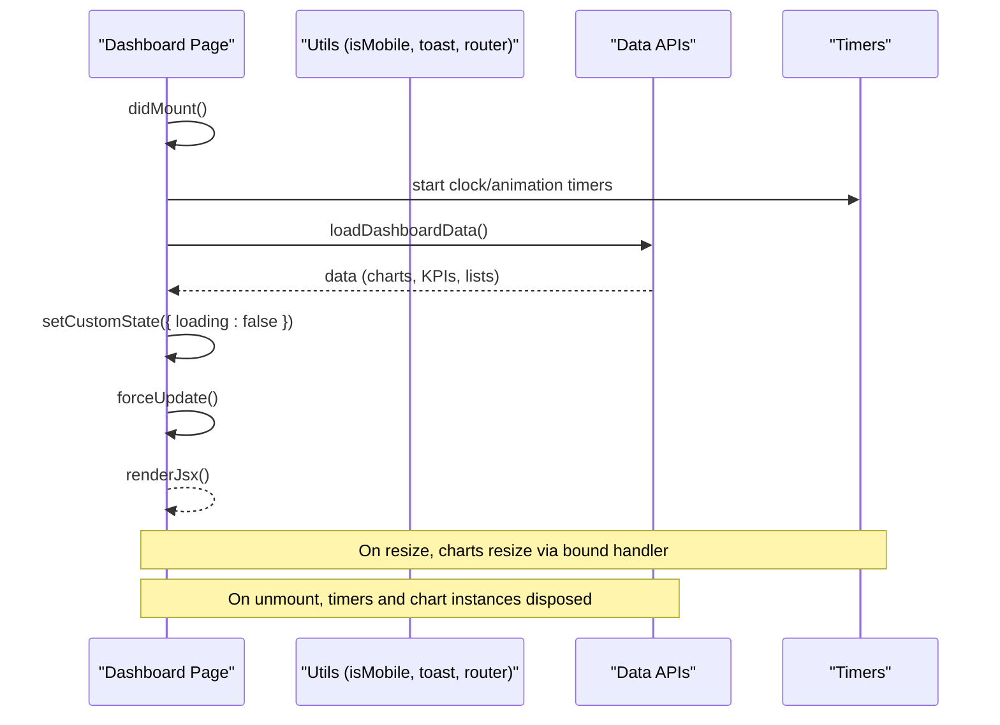
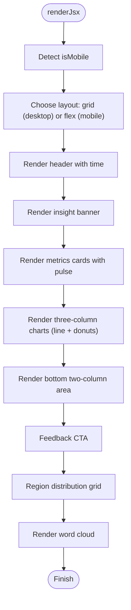
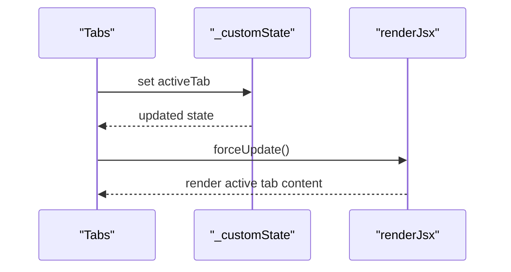
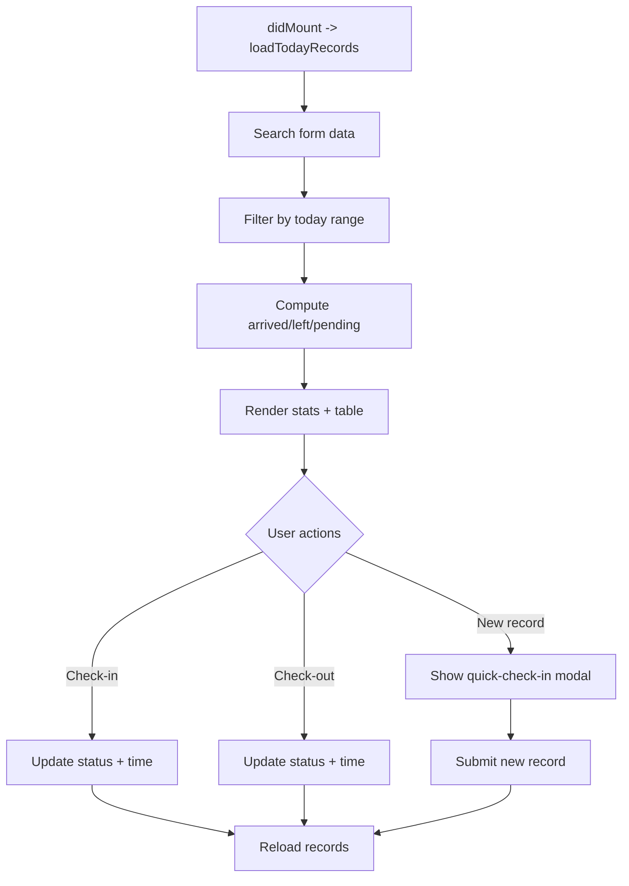
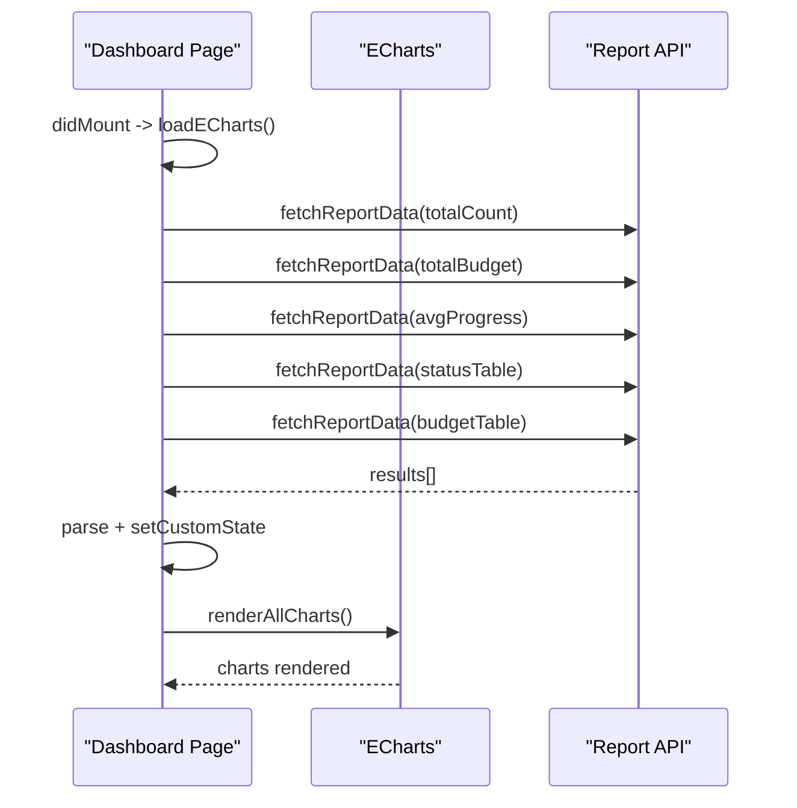
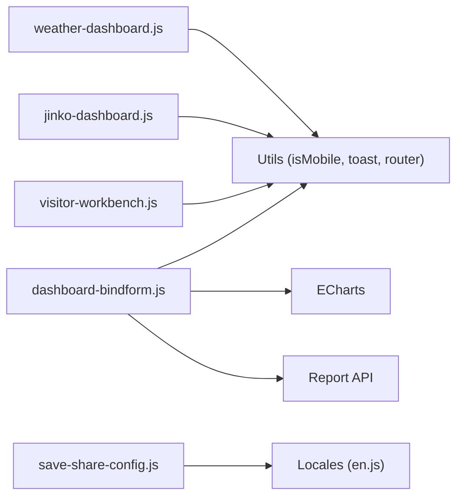

# Dashboard Composition & Layout

<cite>
**Referenced Files in This Document**
- [weather-dashboard.js](file://project/pages/src/weather-dashboard.js)
- [jinko-dashboard.js](file://project/pages/src/jinko-dashboard.js)
- [visitor-workbench.js](file://project/pages/src/visitor-workbench.js)
- [dashboard-bindform.js](file://yida-skills/skills/yida-chart/examples/dashboard-bindform.js)
- [_write_dashboard.py](file://project/pages/src/_write_dashboard.py)
- [write_dashboard.py](file://scripts/write_dashboard.py)
- [save-share-config.js](file://lib/page-config/save-share-config.js)
- [en.js](file://lib/core/locales/en.js)
- [SKILL.md](file://yida-skills/skills/yida-density/SKILL.md)
</cite>

## Table of Contents
1. [Introduction](#introduction)
2. [Project Structure](#project-structure)
3. [Core Components](#core-components)
4. [Architecture Overview](#architecture-overview)
5. [Detailed Component Analysis](#detailed-component-analysis)
6. [Dependency Analysis](#dependency-analysis)
7. [Performance Considerations](#performance-considerations)
8. [Troubleshooting Guide](#troubleshooting-guide)
9. [Conclusion](#conclusion)
10. [Appendices](#appendices)

## Introduction
This document explains how to compose and manage dashboards in OpenYida. It covers dashboard creation workflows, component arrangement strategies, responsive design principles, and layout customization. It also documents how to bind charts to forms and business logic, configure sharing and access control, and optimize performance for complex dashboards with multiple real-time data sources. Practical patterns for executive summaries, operational monitoring, and analytical workspaces are included, along with accessibility and cross-platform guidance.

## Project Structure
OpenYida provides several ready-to-use dashboard examples and supporting utilities:
- Example dashboards: weather-dashboard.js, jinko-dashboard.js, visitor-workbench.js
- Chart dashboard binding example: dashboard-bindform.js
- Python helpers for dashboard generation: _write_dashboard.py, write_dashboard.py
- Sharing and access control utilities: save-share-config.js
- Density and responsive design guidance: SKILL.md
- Localization for sharing configuration: en.js

**Diagram sources**
- [weather-dashboard.js:1-374](file://project/pages/src/weather-dashboard.js#L1-L374)
- [jinko-dashboard.js:1-661](file://project/pages/src/jinko-dashboard.js#L1-L661)
- [visitor-workbench.js:1-741](file://project/pages/src/visitor-workbench.js#L1-L741)
- [dashboard-bindform.js:1-525](file://yida-skills/skills/yida-chart/examples/dashboard-bindform.js#L1-L525)
- [_write_dashboard.py:1-381](file://project/pages/src/_write_dashboard.py#L1-L381)
- [write_dashboard.py:1-499](file://scripts/write_dashboard.py#L1-L499)
- [save-share-config.js:35-254](file://lib/page-config/save-share-config.js#L35-L254)
- [en.js:489-518](file://lib/core/locales/en.js#L489-L518)
- [SKILL.md:266-307](file://yida-skills/skills/yida-density/SKILL.md#L266-L307)

**Section sources**
- [weather-dashboard.js:1-374](file://project/pages/src/weather-dashboard.js#L1-L374)
- [jinko-dashboard.js:1-661](file://project/pages/src/jinko-dashboard.js#L1-L661)
- [visitor-workbench.js:1-741](file://project/pages/src/visitor-workbench.js#L1-L741)
- [dashboard-bindform.js:1-525](file://yida-skills/skills/yida-chart/examples/dashboard-bindform.js#L1-L525)
- [_write_dashboard.py:1-381](file://project/pages/src/_write_dashboard.py#L1-L381)
- [write_dashboard.py:1-499](file://scripts/write_dashboard.py#L1-L499)
- [save-share-config.js:35-254](file://lib/page-config/save-share-config.js#L35-L254)
- [en.js:489-518](file://lib/core/locales/en.js#L489-L518)
- [SKILL.md:266-307](file://yida-skills/skills/yida-density/SKILL.md#L266-L307)

## Core Components
- Dashboard lifecycle and state management
  - Exported lifecycle hooks: getCustomState, setCustomState, forceUpdate, didMount, didUnmount
  - State stores custom state and triggers re-render via forceUpdate
- Rendering pipeline
  - renderJsx returns JSX elements composed from styled containers, cards, charts, and interactive controls
- Responsive behavior
  - Uses device detection to switch between grid and flex layouts, adjust spacing, and scale typography
- Binding to forms and reports
  - Data fetching via form APIs and report endpoints
  - Real-time updates through timers and state changes

**Section sources**
- [weather-dashboard.js:94-124](file://project/pages/src/weather-dashboard.js#L94-L124)
- [jinko-dashboard.js:1-661](file://project/pages/src/jinko-dashboard.js#L1-L661)
- [visitor-workbench.js:56-74](file://project/pages/src/visitor-workbench.js#L56-L74)
- [dashboard-bindform.js:60-106](file://yida-skills/skills/yida-chart/examples/dashboard-bindform.js#L60-L106)

## Architecture Overview
The dashboards follow a consistent pattern:
- Lifecycle management: didMount initializes timers and loads data; didUnmount cleans up timers and chart instances
- State management: _customState holds UI state and data; setCustomState updates state and forces re-render
- Rendering: renderJsx composes a responsive layout with grid/flexbox, cards, and charts
- Data binding: fetch data from forms or reports; bind to charts or indicators

**Diagram sources**
- [dashboard-bindform.js:90-141](file://yida-skills/skills/yida-chart/examples/dashboard-bindform.js#L90-L141)
- [weather-dashboard.js:103-124](file://project/pages/src/weather-dashboard.js#L103-L124)
- [jinko-dashboard.js:25-40](file://project/pages/src/jinko-dashboard.js#L25-L40)

## Detailed Component Analysis

### Weather Dashboard (Data Visualization Screen)
- Purpose: Executive summary and public feedback insights with animated metrics and charts
- Layout strategy:
  - Top header with gradient and time display
  - Insight banner with rotating messages
  - Metrics cards with pulsing accents
  - Grid-based three-column chart area (desktop) or flex column (mobile)
  - Bottom two-column area with channel bar chart and feedback/region panels
  - Word cloud section
- Responsive design:
  - Uses isMobile to toggle grid vs flex, wrap metrics, and adjust chart sizes
- Animation and interactivity:
  - Clock timer updates time
  - Animation timer cycles insight text and subtle pulses on metrics
- Chart primitives:
  - SVG-based line trend chart
  - Pure function to build donut slices
  - Bar chart for channels

**Diagram sources**
- [weather-dashboard.js:126-373](file://project/pages/src/weather-dashboard.js#L126-L373)

**Section sources**
- [weather-dashboard.js:1-374](file://project/pages/src/weather-dashboard.js#L1-L374)
- [_write_dashboard.py:1-381](file://project/pages/src/_write_dashboard.py#L1-L381)
- [write_dashboard.py:1-499](file://scripts/write_dashboard.py#L1-L499)

### Jinko Dashboard (Operational Monitoring)
- Purpose: Corporate operations dashboard with tabs for overview, storage, technology roadmap, competition, and strategy
- Layout strategy:
  - Tabbed interface with active state management
  - Grid-based KPI cards, bar charts, donut charts, progress bars, and timelines
  - Dedicated sections for market share, product mix, and project portfolio
- Interactions:
  - Tab switching updates activeTab and re-renders content
  - Time display via mounted timer
- Chart primitives:
  - Conic gradient donut charts
  - Progress bars
  - Timeline with milestones

**Diagram sources**
- [jinko-dashboard.js:548-660](file://project/pages/src/jinko-dashboard.js#L548-L660)

**Section sources**
- [jinko-dashboard.js:1-661](file://project/pages/src/jinko-dashboard.js#L1-L661)

### Visitor Workbench (Operational Monitoring)
- Purpose: Front-desk workbench for visitor check-in/out and daily statistics
- Layout strategy:
  - Header with actions and date/weekday
  - Stats cards for arrivals, pending, and departures
  - Filterable table of today’s visitors with action buttons
  - Modal dialog for quick check-in
- Data binding:
  - Loads form data for today’s records
  - Updates form fields for check-in/check-out
  - Navigates to apply form and reports
- Interactions:
  - Search by name/phone/host
  - Confirm dialogs before state changes
  - Loading states and empty-state messaging

**Diagram sources**
- [visitor-workbench.js:69-121](file://project/pages/src/visitor-workbench.js#L69-L121)

**Section sources**
- [visitor-workbench.js:1-741](file://project/pages/src/visitor-workbench.js#L1-L741)

### Chart Dashboard Binding (Analytics Workspace)
- Purpose: Multi-chart dashboard backed by report components and filters
- Data binding:
  - Parallel fetch of indicator cards and table data
  - Parsing of report content into chart-friendly arrays
  - ECharts initialization and resizing on window events
- Layout strategy:
  - Stats row with four KPI cards
  - Charts row with bar, pie, and full-width line charts
  - Responsive sizing and wrapping
- Interactions:
  - Refresh button to reload data
  - Mobile-aware axis labels and legends

**Diagram sources**
- [dashboard-bindform.js:90-141](file://yida-skills/skills/yida-chart/examples/dashboard-bindform.js#L90-L141)
- [dashboard-bindform.js:233-263](file://yida-skills/skills/yida-chart/examples/dashboard-bindform.js#L233-L263)
- [dashboard-bindform.js:269-375](file://yida-skills/skills/yida-chart/examples/dashboard-bindform.js#L269-L375)

**Section sources**
- [dashboard-bindform.js:1-525](file://yida-skills/skills/yida-chart/examples/dashboard-bindform.js#L1-L525)

## Dependency Analysis
- Dashboard lifecycle depends on:
  - Utils.isMobile for responsive decisions
  - Utils.toast/utils.dialog for user feedback
  - Utils.yida APIs for form data CRUD and search
  - Utils.router for navigation to forms/reports
- Chart dashboards depend on:
  - ECharts CDN loaded dynamically
  - Resize handlers to maintain chart aspect ratios
  - Report APIs for multi-component datasets
- Sharing and access control:
  - save-share-config validates and persists sharing configuration
  - Localization provides error and usage messages

**Diagram sources**
- [weather-dashboard.js:128-130](file://project/pages/src/weather-dashboard.js#L128-L130)
- [jinko-dashboard.js:557-558](file://project/pages/src/jinko-dashboard.js#L557-L558)
- [visitor-workbench.js:238-245](file://project/pages/src/visitor-workbench.js#L238-L245)
- [dashboard-bindform.js:112-141](file://yida-skills/skills/yida-chart/examples/dashboard-bindform.js#L112-L141)
- [save-share-config.js:35-56](file://lib/page-config/save-share-config.js#L35-L56)
- [en.js:489-518](file://lib/core/locales/en.js#L489-L518)

**Section sources**
- [weather-dashboard.js:126-130](file://project/pages/src/weather-dashboard.js#L126-L130)
- [jinko-dashboard.js:548-558](file://project/pages/src/jinko-dashboard.js#L548-L558)
- [visitor-workbench.js:238-245](file://project/pages/src/visitor-workbench.js#L238-L245)
- [dashboard-bindform.js:112-141](file://yida-skills/skills/yida-chart/examples/dashboard-bindform.js#L112-L141)
- [save-share-config.js:35-56](file://lib/page-config/save-share-config.js#L35-L56)
- [en.js:489-518](file://lib/core/locales/en.js#L489-L518)

## Performance Considerations
- Minimize re-renders
  - Keep state granular; only update fields that change visuals
  - Use forceUpdate sparingly; batch updates when possible
- Optimize chart rendering
  - Dispose chart instances on unmount to prevent memory leaks
  - Debounce resize handlers or bind a single listener
- Reduce network overhead
  - Fetch multiple components concurrently
  - Paginate large datasets; load incrementally
- Animation and timers
  - Throttle timers; avoid frequent setState in tight loops
  - Use requestAnimationFrame for smoother animations
- Large screens and mobile
  - Prefer grid for desktop; fallback to flex for mobile
  - Avoid deep nesting; flatten layout containers where feasible

[No sources needed since this section provides general guidance]

## Troubleshooting Guide
- Layout rendering issues
  - Verify responsive toggles: ensure isMobile switches layout modes
  - Check gridTemplateColumns and flex gaps; confirm minimum widths for small screens
- Component conflicts
  - Ensure unique DOM IDs for charts; dispose instances before re-initialization
  - Avoid overlapping click handlers; consolidate event listeners
- Performance bottlenecks
  - Monitor timers and intervals; clear them in didUnmount
  - Limit concurrent data fetches; cache where appropriate
- Sharing and access control
  - Validate parameters: isOpen, openAuth, openUrl format
  - Confirm CSRF token handling and retry logic for expired tokens
  - Use localization messages to diagnose failures

**Section sources**
- [dashboard-bindform.js:94-106](file://yida-skills/skills/yida-chart/examples/dashboard-bindform.js#L94-L106)
- [save-share-config.js:35-56](file://lib/page-config/save-share-config.js#L35-L56)
- [en.js:489-518](file://lib/core/locales/en.js#L489-L518)

## Conclusion
OpenYida’s dashboards demonstrate robust composition patterns: responsive layouts, modular components, and strong data binding. By leveraging lifecycle hooks, state management, and utility functions, developers can assemble executive summaries, operational monitors, and analytical workspaces. Proper sharing configuration and performance tuning ensure reliable, scalable dashboards across devices and environments.

[No sources needed since this section summarizes without analyzing specific files]

## Appendices

### Layout Customization Options
- Column arrangements
  - Use gridTemplateColumns for fixed column counts on desktop; switch to flex direction for mobile
- Row spanning and sizing
  - Control component flex basis and min-width to preserve readability on small screens
- Spacing and density
  - Apply consistent gaps and paddings; refer to density guidance for compact/comfortable/spacious modes

**Section sources**
- [weather-dashboard.js:244-245](file://project/pages/src/weather-dashboard.js#L244-L245)
- [jinko-dashboard.js:216-217](file://project/pages/src/jinko-dashboard.js#L216-L217)
- [SKILL.md:38-84](file://yida-skills/skills/yida-density/SKILL.md#L38-L84)

### Dashboard Patterns
- Executive summaries
  - Combine header, insight banner, metrics cards, and concise charts
- Operational monitoring
  - Tabs for distinct views; tables with actionable buttons; live counters
- Analytical workspaces
  - Multi-chart layouts with filters; parallel data loading; refresh controls

**Section sources**
- [weather-dashboard.js:196-373](file://project/pages/src/weather-dashboard.js#L196-L373)
- [jinko-dashboard.js:548-660](file://project/pages/src/jinko-dashboard.js#L548-L660)
- [dashboard-bindform.js:479-524](file://yida-skills/skills/yida-chart/examples/dashboard-bindform.js#L479-L524)

### Accessibility and Cross-Platform Compatibility
- Accessibility
  - Provide sufficient color contrast; avoid motion-sensitive effects for sensitive users
  - Ensure keyboard navigable controls and readable font sizes
- Cross-platform
  - Test on desktop, tablet, and mobile; validate touch targets and tap zones
  - Confirm chart readability from distance for large-screen presentations

[No sources needed since this section provides general guidance]