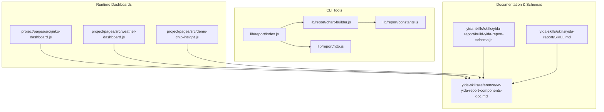
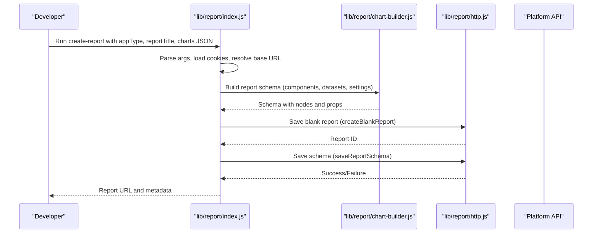
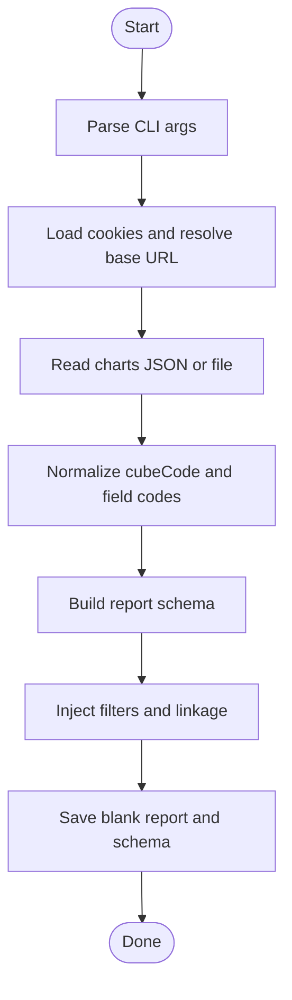
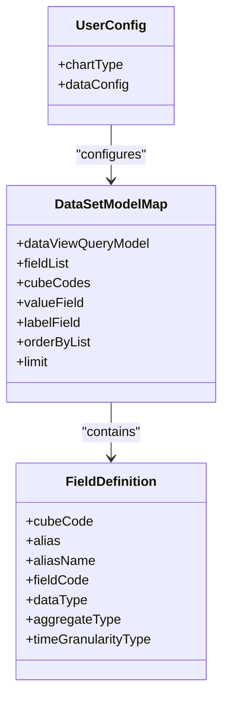
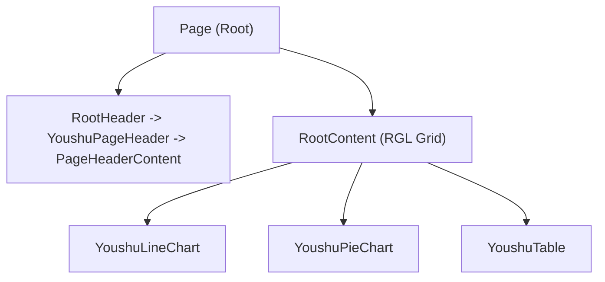
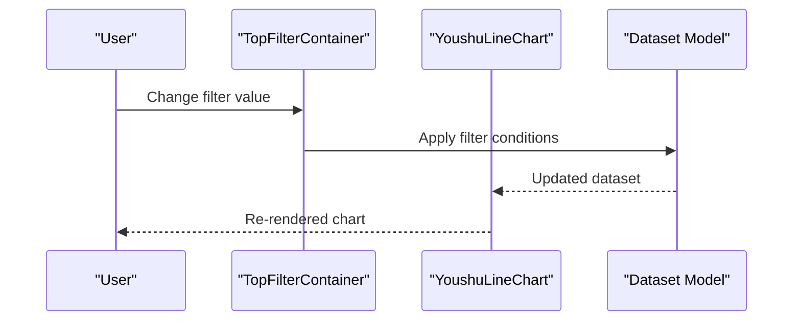
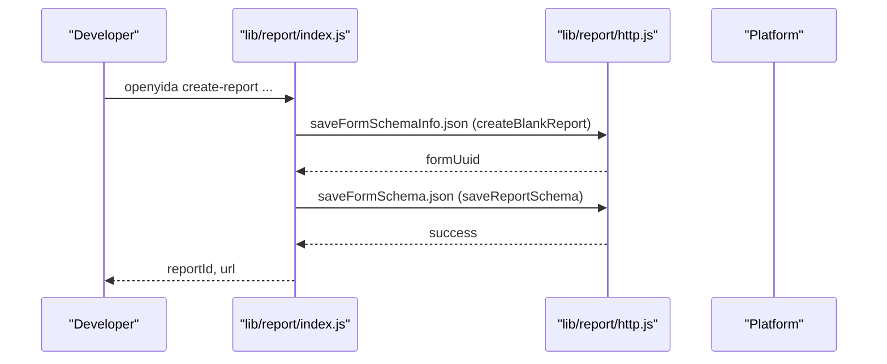
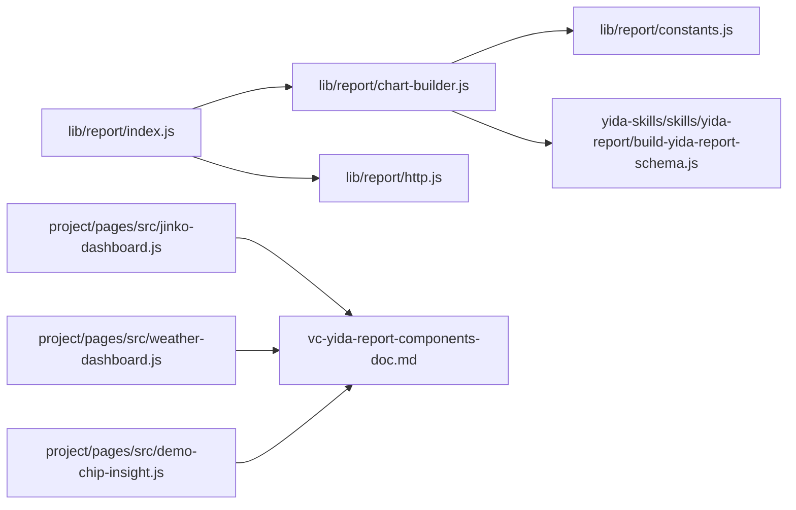

# Report & Dashboard System

<cite>
**Referenced Files in This Document**
- [index.js](file://lib/report/index.js)
- [chart-builder.js](file://lib/report/chart-builder.js)
- [constants.js](file://lib/report/constants.js)
- [http.js](file://lib/report/http.js)
- [create-report.js](file://lib/report/create-report.js)
- [build-yida-report-schema.js](file://yida-skills/skills/yida-report/build-yida-report-schema.js)
- [vc-yida-report-components-doc.md](file://yida-skills/reference/vc-yida-report-components-doc.md)
- [SKILL.md](file://yida-skills/skills/yida-report/SKILL.md)
- [jinko-dashboard.js](file://project/pages/src/jinko-dashboard.js)
- [weather-dashboard.js](file://project/pages/src/weather-dashboard.js)
- [demo-chip-insight.js](file://project/pages/src/demo-chip-insight.js)
</cite>

## Table of Contents
1. [Introduction](#introduction)
2. [Project Structure](#project-structure)
3. [Core Components](#core-components)
4. [Architecture Overview](#architecture-overview)
5. [Detailed Component Analysis](#detailed-component-analysis)
6. [Dependency Analysis](#dependency-analysis)
7. [Performance Considerations](#performance-considerations)
8. [Troubleshooting Guide](#troubleshooting-guide)
9. [Conclusion](#conclusion)
10. [Appendices](#appendices)

## Introduction
This document describes OpenYida’s visualization and analytics system with a focus on report creation workflows, chart configuration, data binding, dashboard composition, and advanced features such as drill-down, filters, and real-time updates. It also covers publishing, sharing, and access control, and provides practical examples for sales dashboards, operational metrics, and business intelligence views. Guidance on performance optimization and troubleshooting is included.

## Project Structure
OpenYida provides:
- A CLI-driven report creation pipeline that builds a schema for the vc-yida-report component library.
- A runtime dashboard framework supporting both native vc-yida-report components and custom ECharts-based dashboards.
- Example dashboards demonstrating responsive layouts, filters, and real-time updates.

**Diagram sources**
- [index.js:1-282](file://lib/report/index.js#L1-L282)
- [chart-builder.js:1-1743](file://lib/report/chart-builder.js#L1-L1743)
- [constants.js:1-138](file://lib/report/constants.js#L1-L138)
- [http.js:1-36](file://lib/report/http.js#L1-L36)
- [jinko-dashboard.js:1-661](file://project/pages/src/jinko-dashboard.js#L1-L661)
- [weather-dashboard.js:1-374](file://project/pages/src/weather-dashboard.js#L1-L374)
- [demo-chip-insight.js:1-982](file://project/pages/src/demo-chip-insight.js#L1-L982)
- [build-yida-report-schema.js:1-1285](file://yida-skills/skills/yida-report/build-yida-report-schema.js#L1-L1285)
- [vc-yida-report-components-doc.md:1-616](file://yida-skills/reference/vc-yida-report-components-doc.md#L1-L616)
- [SKILL.md:1-775](file://yida-skills/skills/yida-report/SKILL.md#L1-L775)

**Section sources**
- [index.js:1-282](file://lib/report/index.js#L1-L282)
- [chart-builder.js:1-1743](file://lib/report/chart-builder.js#L1-L1743)
- [constants.js:1-138](file://lib/report/constants.js#L1-L138)
- [http.js:1-36](file://lib/report/http.js#L1-L36)
- [build-yida-report-schema.js:1-1285](file://yida-skills/skills/yida-report/build-yida-report-schema.js#L1-L1285)
- [vc-yida-report-components-doc.md:1-616](file://yida-skills/reference/vc-yida-report-components-doc.md#L1-L616)
- [SKILL.md:1-775](file://yida-skills/skills/yida-report/SKILL.md#L1-L775)
- [jinko-dashboard.js:1-661](file://project/pages/src/jinko-dashboard.js#L1-L661)
- [weather-dashboard.js:1-374](file://project/pages/src/weather-dashboard.js#L1-L374)
- [demo-chip-insight.js:1-982](file://project/pages/src/demo-chip-insight.js#L1-L982)

## Core Components
- Report creation CLI: Parses arguments, loads credentials, reads chart definitions, builds a schema, injects filters, and saves the schema to the platform.
- Chart builder: Translates chart definitions into vc-yida-report schema nodes, sets dataset models, user configs, and settings.
- Constants: Provides component mappings, ID generators, and helper inference functions.
- HTTP utilities: Encapsulate save and schema operations against the platform APIs.
- Runtime dashboards: Demonstrate native vc-yida-report components and hybrid ECharts-based dashboards.

Key responsibilities:
- Schema generation for vc-yida-report components (line charts, bar charts, pie charts, radar charts, heatmaps, calendars, combo charts, word clouds, maps, pivot tables, indicators).
- Data binding via dataset models and field definitions.
- Filter linkage and drill-down configuration.
- Publishing and saving of report schemas.

**Section sources**
- [index.js:24-282](file://lib/report/index.js#L24-L282)
- [chart-builder.js:1196-1418](file://lib/report/chart-builder.js#L1196-L1418)
- [constants.js:5-138](file://lib/report/constants.js#L5-L138)
- [http.js:9-35](file://lib/report/http.js#L9-L35)
- [build-yida-report-schema.js:151-800](file://yida-skills/skills/yida-report/build-yida-report-schema.js#L151-L800)
- [vc-yida-report-components-doc.md:9-616](file://yida-skills/reference/vc-yida-report-components-doc.md#L9-L616)

## Architecture Overview
The system follows a two-stage architecture:
- Design-time: CLI constructs a report schema with vc-yida-report components and dataset models.
- Runtime: Pages render either native vc-yida-report components or hybrid ECharts dashboards bound to form data.

**Diagram sources**
- [index.js:96-271](file://lib/report/index.js#L96-L271)
- [chart-builder.js:1196-1418](file://lib/report/chart-builder.js#L1196-L1418)
- [http.js:9-35](file://lib/report/http.js#L9-L35)

**Section sources**
- [index.js:96-271](file://lib/report/index.js#L96-L271)
- [chart-builder.js:1196-1418](file://lib/report/chart-builder.js#L1196-L1418)
- [http.js:9-35](file://lib/report/http.js#L9-L35)

## Detailed Component Analysis

### Report Creation Workflow
- Arguments parsing and validation.
- Credential loading and base URL resolution.
- Reading and normalizing chart definitions (supports arrays and filter-enhanced objects).
- Building a schema with page header, content grid, and component nodes.
- Injecting filters and linkage to charts.
- Saving the schema to the platform.

**Diagram sources**
- [index.js:24-234](file://lib/report/index.js#L24-L234)
- [chart-builder.js:1196-1418](file://lib/report/chart-builder.js#L1196-L1418)
- [constants.js:17-20](file://lib/report/constants.js#L17-L20)

**Section sources**
- [index.js:24-234](file://lib/report/index.js#L24-L234)
- [constants.js:17-20](file://lib/report/constants.js#L17-L20)

### Chart Configuration Options
- Line trend: smoothing, stacking, percent stacking, labels, tooltips, legends, axes.
- Bar comparisons: grouping, stacking, percent stacking, labels, colors.
- Radar charts: max scale, opacity, area fill.
- Scatter plots: point size, shape, axes.
- Pie charts: ring mode, inner radius, start/end angles, labels.
- Combo charts: left/right Y axes, bar/line mixing.
- Heatmaps, calendars, word clouds, maps, pivot tables, indicators: titles, heights, colors, limits, drill-down toggles.

These are configured via component settings and dataset models that define fields, aggregations, and sort orders.

**Section sources**
- [chart-builder.js:519-844](file://lib/report/chart-builder.js#L519-L844)
- [build-yida-report-schema.js:236-759](file://yida-skills/skills/yida-report/build-yida-report-schema.js#L236-L759)
- [vc-yida-report-components-doc.md:313-616](file://yida-skills/reference/vc-yida-report-components-doc.md#L313-L616)

### Data Binding Processes
- Dataset models map to vc-yida-report components via dataSetModelMap.
- Field definitions specify aliases, data types, aggregation types, and time granularity.
- User configs define setters for configuring fields per component type.
- Mock data is generated for preview and testing.

**Diagram sources**
- [chart-builder.js:191-515](file://lib/report/chart-builder.js#L191-L515)
- [build-yida-report-schema.js:124-145](file://yida-skills/skills/yida-report/build-yida-report-schema.js#L124-L145)

**Section sources**
- [chart-builder.js:191-515](file://lib/report/chart-builder.js#L191-L515)
- [build-yida-report-schema.js:124-145](file://yida-skills/skills/yida-report/build-yida-report-schema.js#L124-L145)

### Dashboard Composition and Layout
- Native vc-yida-report pages: structured with RootHeader, PageHeader, RootContent, and a grid layout (RGL) for components.
- Hybrid ECharts dashboards: load ECharts, initialize charts on tab change, and resize on window events.
- Responsive design: CSS-based grid and media-aware rendering; mobile-friendly layouts in examples.

**Diagram sources**
- [chart-builder.js:1326-1418](file://lib/report/chart-builder.js#L1326-L1418)

**Section sources**
- [chart-builder.js:1326-1418](file://lib/report/chart-builder.js#L1326-L1418)
- [jinko-dashboard.js:548-661](file://project/pages/src/jinko-dashboard.js#L548-L661)
- [weather-dashboard.js:126-374](file://project/pages/src/weather-dashboard.js#L126-L374)
- [demo-chip-insight.js:589-793](file://project/pages/src/demo-chip-insight.js#L589-L793)

### Advanced Features
- Drill-down: Enabled per component via settings; triggers navigation to lower-level data.
- Interactive filters: Top filter container with selectable filters linked to datasets; supports single/multiple selection modes.
- Real-time updates: Components expose refresh controls and cache toggles; ECharts dashboards support manual refresh buttons.

**Diagram sources**
- [vc-yida-report-components-doc.md:445-550](file://yida-skills/reference/vc-yida-report-components-doc.md#L445-L550)
- [chart-builder.js:1420-1599](file://lib/report/chart-builder.js#L1420-L1599)

**Section sources**
- [vc-yida-report-components-doc.md:445-550](file://yida-skills/reference/vc-yida-report-components-doc.md#L445-L550)
- [chart-builder.js:1420-1599](file://lib/report/chart-builder.js#L1420-L1599)

### Report Publishing, Sharing, and Access Control
- Publishing: The CLI saves a blank report and then saves the constructed schema to the platform.
- Sharing and access control: The schema includes component props for export permissions and refresh toggles; access is governed by platform-level permissions associated with the appType and formUuid.

**Diagram sources**
- [index.js:139-254](file://lib/report/index.js#L139-L254)
- [http.js:9-35](file://lib/report/http.js#L9-L35)

**Section sources**
- [index.js:139-254](file://lib/report/index.js#L139-L254)
- [http.js:9-35](file://lib/report/http.js#L9-L35)

### Relationship Between Reports, Data Sources, and Business Metrics
- Reports are composed of vc-yida-report components bound to dataset models.
- Dataset models define fields, aggregations, and sort orders aligned to business metrics (e.g., sales, counts, ratios).
- Filters and drill-down refine the dataset to specific dimensions (time, region, category).

**Section sources**
- [chart-builder.js:119-186](file://lib/report/chart-builder.js#L119-L186)
- [build-yida-report-schema.js:22-86](file://yida-skills/skills/yida-report/build-yida-report-schema.js#L22-L86)

### Practical Examples
- Sales dashboards: Indicator cards, line trends, bar comparisons, and pivot tables for KPIs and regional breakdowns.
- Operational metrics: Calendar heatmaps for event density, radar charts for capability scoring, and ECharts bar charts for resource utilization.
- Business intelligence views: Word clouds for keyword frequency, maps for geographic distribution, and combo charts for dual-axis insights.

**Section sources**
- [jinko-dashboard.js:51-147](file://project/pages/src/jinko-dashboard.js#L51-L147)
- [weather-dashboard.js:8-68](file://project/pages/src/weather-dashboard.js#L8-L68)
- [demo-chip-insight.js:14-13](file://project/pages/src/demo-chip-insight.js#L14-L13)
- [vc-yida-report-components-doc.md:1-616](file://yida-skills/reference/vc-yida-report-components-doc.md#L1-L616)

## Dependency Analysis
- CLI depends on chart-builder and constants for schema construction and ID generation.
- chart-builder depends on constants for component mappings and helpers.
- HTTP utilities encapsulate platform API calls.
- Runtime dashboards depend on vc-yida-report component docs and schema builders for configuration.

**Diagram sources**
- [index.js:1-282](file://lib/report/index.js#L1-L282)
- [chart-builder.js:1-1743](file://lib/report/chart-builder.js#L1-L1743)
- [constants.js:1-138](file://lib/report/constants.js#L1-L138)
- [http.js:1-36](file://lib/report/http.js#L1-L36)
- [build-yida-report-schema.js:1-1285](file://yida-skills/skills/yida-report/build-yida-report-schema.js#L1-L1285)
- [vc-yida-report-components-doc.md:1-616](file://yida-skills/reference/vc-yida-report-components-doc.md#L1-L616)
- [jinko-dashboard.js:1-661](file://project/pages/src/jinko-dashboard.js#L1-L661)
- [weather-dashboard.js:1-374](file://project/pages/src/weather-dashboard.js#L1-L374)
- [demo-chip-insight.js:1-982](file://project/pages/src/demo-chip-insight.js#L1-L982)

**Section sources**
- [index.js:1-282](file://lib/report/index.js#L1-L282)
- [chart-builder.js:1-1743](file://lib/report/chart-builder.js#L1-L1743)
- [constants.js:1-138](file://lib/report/constants.js#L1-L138)
- [http.js:1-36](file://lib/report/http.js#L1-L36)
- [build-yida-report-schema.js:1-1285](file://yida-skills/skills/yida-report/build-yida-report-schema.js#L1-L1285)
- [vc-yida-report-components-doc.md:1-616](file://yida-skills/reference/vc-yida-report-components-doc.md#L1-L616)
- [jinko-dashboard.js:1-661](file://project/pages/src/jinko-dashboard.js#L1-L661)
- [weather-dashboard.js:1-374](file://project/pages/src/weather-dashboard.js#L1-L374)
- [demo-chip-insight.js:1-982](file://project/pages/src/demo-chip-insight.js#L1-L982)

## Performance Considerations
- Prefer service-side aggregation via vc-yida-report components to avoid frontend pagination and reduce payload sizes.
- Use component-level limits and drill-down to constrain datasets.
- Enable caching for components where appropriate.
- For ECharts dashboards, dispose charts on unmount and reinitialize on tab change to manage memory.
- Use responsive grid layouts and avoid heavy animations on low-powered devices.

[No sources needed since this section provides general guidance]

## Troubleshooting Guide
Common issues and resolutions:
- Empty or incorrect data: Verify prdId, cid, className, and dataSetKey; ensure field types match aggregation expectations (e.g., NumberField for SUM/AVG).
- API path errors: Use the correct endpoint for getDataAsync and avoid searchFormDatas HTTP calls.
- Cookie format: Ensure cookies array format is used and properly joined for requests.
- Frontend fallback pitfalls: Avoid falling back to searchFormDatas for large datasets; rely on server-side aggregation.
- Chart rendering failures: Confirm ECharts CDN load and initialization timing; delay init until DOM is ready.

**Section sources**
- [SKILL.md:155-389](file://yida-skills/skills/yida-report/SKILL.md#L155-L389)
- [vc-yida-report-components-doc.md:589-616](file://yida-skills/reference/vc-yida-report-components-doc.md#L589-L616)

## Conclusion
OpenYida’s visualization system combines a powerful CLI-driven report creation pipeline with flexible vc-yida-report components and hybrid ECharts dashboards. By leveraging dataset models, filters, and drill-down, teams can build robust, interactive dashboards for sales, operations, and business intelligence. Following the best practices outlined here ensures reliable data binding, efficient rendering, and scalable performance.

[No sources needed since this section summarizes without analyzing specific files]

## Appendices

### API Definitions
- Report creation endpoint: POST /alibaba/web/{appType}/visual/visualizationDataRpc/getDataAsync.json
- Request body includes pageName, prdId, cid, cname, className, dataSetKey.
- Response includes content.data and content.meta for downstream parsing.

**Section sources**
- [SKILL.md:29-94](file://yida-skills/skills/yida-report/SKILL.md#L29-L94)

### Configuration Options Reference
- Component settings: titleConfig, height, smooth, isStack, isPercent, innerRadius, startAngle, endAngle, drillDown, limit, colorType, customColor, labelConfig, etc.
- Dataset models: fieldDefinitionList, fieldList, orderByList, filterList, cubeCodes, valueField, labelField.

**Section sources**
- [chart-builder.js:519-844](file://lib/report/chart-builder.js#L519-L844)
- [build-yida-report-schema.js:236-759](file://yida-skills/skills/yida-report/build-yida-report-schema.js#L236-L759)