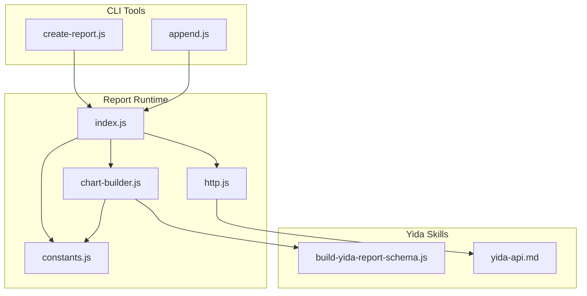
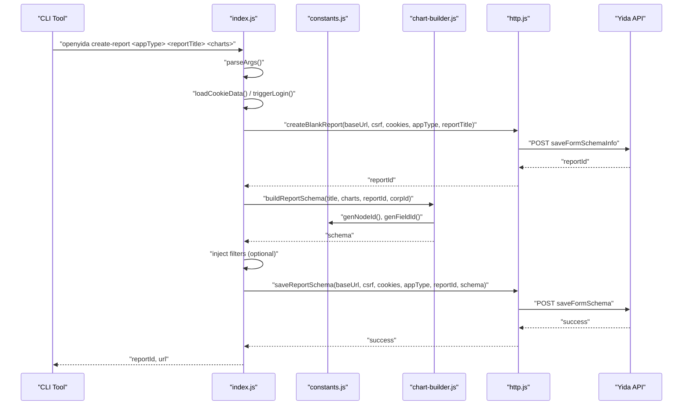
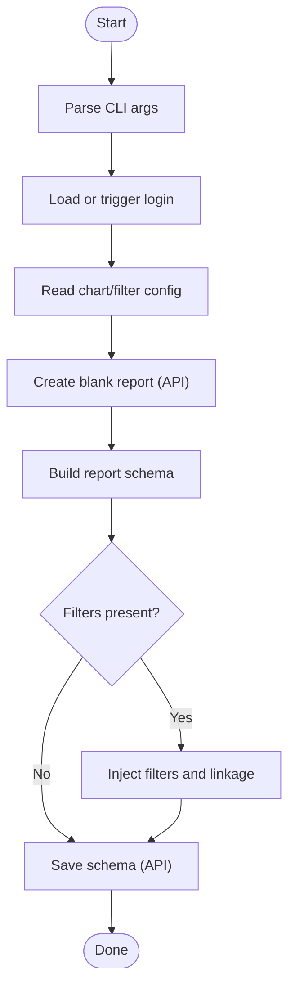
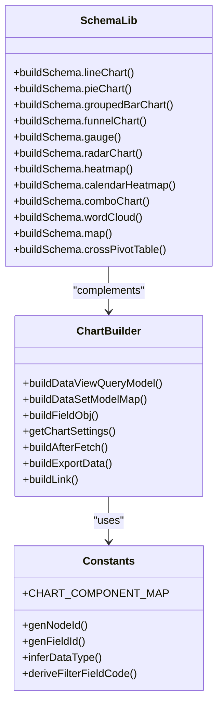
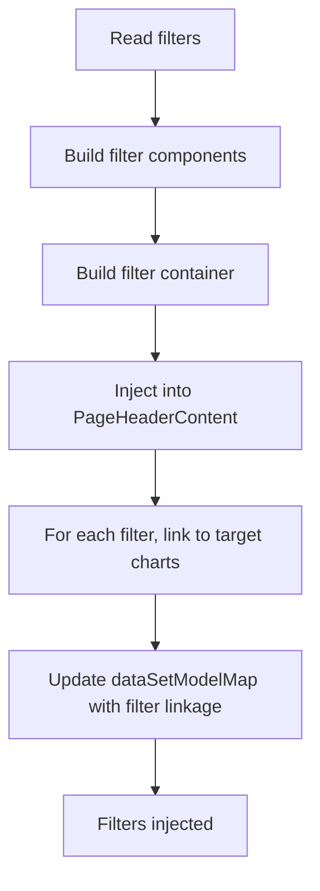
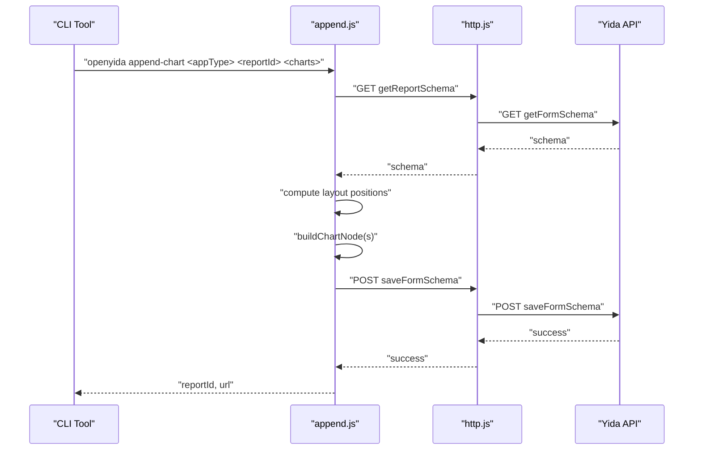
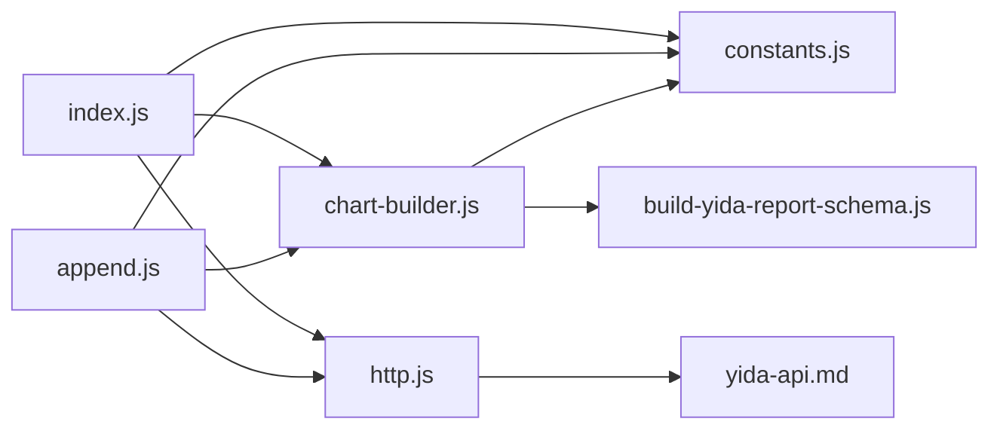

# Report Creation & Management

<cite>
**Referenced Files in This Document**
- [lib/report/index.js](file://lib/report/index.js)
- [lib/report/create-report.js](file://lib/report/create-report.js)
- [lib/report/constants.js](file://lib/report/constants.js)
- [lib/report/chart-builder.js](file://lib/report/chart-builder.js)
- [lib/report/http.js](file://lib/report/http.js)
- [lib/report/append.js](file://lib/report/append.js)
- [yida-skills/skills/yida-report/build-yida-report-schema.js](file://yida-skills/skills/yida-report/build-yida-report-schema.js)
- [yida-skills/reference/yida-api.md](file://yida-skills/reference/yida-api.md)
- [tests/report-constants.test.js](file://tests/report-constants.test.js)
</cite>

## Table of Contents
1. [Introduction](#introduction)
2. [Project Structure](#project-structure)
3. [Core Components](#core-components)
4. [Architecture Overview](#architecture-overview)
5. [Detailed Component Analysis](#detailed-component-analysis)
6. [Dependency Analysis](#dependency-analysis)
7. [Performance Considerations](#performance-considerations)
8. [Troubleshooting Guide](#troubleshooting-guide)
9. [Conclusion](#conclusion)
10. [Appendices](#appendices)

## Introduction
This document explains the complete report creation and management workflows in OpenYida, focusing on how to create, configure, and publish reports integrated with Alibaba Yida platform APIs. It covers:
- Report schema generation from chart definitions
- Configuration options and validation steps
- Lifecycle management (creation, modification, appending charts, saving)
- Integration with Yida APIs for report registration and metadata persistence
- Practical examples for sales reports, operational dashboards, and business intelligence summaries
- Naming conventions, categorization, and organizational structure
- Dependencies, data source connections, and metadata management
- Troubleshooting and performance optimization

## Project Structure
OpenYida’s report tooling resides primarily under lib/report and integrates with Yida skill references and tests:
- lib/report: CLI-driven report creation, schema building, HTTP integration, and chart composition
- yida-skills/skills/yida-report: reusable schema builder utilities for Yida report components
- yida-skills/reference: Yida API reference used by the tooling
- tests: unit tests validating constants and helpers

**Diagram sources**
- [lib/report/create-report.js:1-26](file://lib/report/create-report.js#L1-L26)
- [lib/report/append.js:1-326](file://lib/report/append.js#L1-L326)
- [lib/report/index.js:1-282](file://lib/report/index.js#L1-L282)
- [lib/report/constants.js:1-138](file://lib/report/constants.js#L1-L138)
- [lib/report/chart-builder.js:1-800](file://lib/report/chart-builder.js#L1-L800)
- [lib/report/http.js:1-36](file://lib/report/http.js#L1-L36)
- [yida-skills/skills/yida-report/build-yida-report-schema.js:1-800](file://yida-skills/skills/yida-report/build-yida-report-schema.js#L1-L800)
- [yida-skills/reference/yida-api.md:665-743](file://yida-skills/reference/yida-api.md#L665-L743)

**Section sources**
- [lib/report/index.js:24-33](file://lib/report/index.js#L24-L33)
- [lib/report/create-report.js:14-26](file://lib/report/create-report.js#L14-L26)
- [lib/report/append.js:72-83](file://lib/report/append.js#L72-L83)

## Core Components
- CLI Entrypoints
  - create-report: Creates a blank report and saves a generated schema
  - append: Loads an existing report schema and appends new charts
- Report Builder
  - constants: Chart type mapping, ID generators, data type inference, filter field derivation
  - chart-builder: Builds dataset models, field definitions, settings, and component nodes
  - http: Encapsulates Yida API calls for creating and saving report schemas
- Yida Integration
  - yida-api reference: Defines endpoint paths and payload formats used by the tooling
  - build-yida-report-schema: Utility library for constructing component schemas

Key responsibilities:
- Parse CLI arguments and validate inputs
- Load or refresh login session and resolve base URL
- Read chart definitions (JSON or file) supporting top-level filters and charts
- Build report schema with components, datasets, and optional filters
- Inject filter linkage into chart dataset models
- Persist schema via Yida APIs

**Section sources**
- [lib/report/index.js:96-271](file://lib/report/index.js#L96-L271)
- [lib/report/append.js:165-316](file://lib/report/append.js#L165-L316)
- [lib/report/constants.js:5-137](file://lib/report/constants.js#L5-L137)
- [lib/report/chart-builder.js:116-515](file://lib/report/chart-builder.js#L116-L515)
- [lib/report/http.js:9-30](file://lib/report/http.js#L9-L30)
- [yida-skills/reference/yida-api.md:665-743](file://yida-skills/reference/yida-api.md#L665-L743)

## Architecture Overview
The report creation pipeline follows a deterministic sequence: login resolution, schema construction, optional filter injection, and schema persistence.

**Diagram sources**
- [lib/report/index.js:96-271](file://lib/report/index.js#L96-L271)
- [lib/report/constants.js:34-50](file://lib/report/constants.js#L34-L50)
- [lib/report/chart-builder.js:116-186](file://lib/report/chart-builder.js#L116-L186)
- [lib/report/http.js:9-30](file://lib/report/http.js#L9-L30)
- [yida-skills/reference/yida-api.md:665-743](file://yida-skills/reference/yida-api.md#L665-L743)

## Detailed Component Analysis

### Report Creation Workflow (create-report)
- Parses CLI arguments and validates minimum inputs
- Resolves login state and base URL
- Reads chart definitions (supports arrays or objects with filters)
- Creates a blank report via Yida API
- Builds report schema with dataset models per chart
- Optionally injects filters and linkage into chart dataset models
- Saves schema via Yida API and prints success info

**Diagram sources**
- [lib/report/index.js:96-271](file://lib/report/index.js#L96-L271)
- [lib/report/http.js:9-30](file://lib/report/http.js#L9-L30)

**Section sources**
- [lib/report/index.js:96-153](file://lib/report/index.js#L96-L153)
- [lib/report/index.js:155-236](file://lib/report/index.js#L155-L236)
- [lib/report/index.js:238-271](file://lib/report/index.js#L238-L271)

### Report Schema Generation
- Chart type mapping to Yida components
- Dataset model construction per chart type (bar, line, pie, funnel, gauge, combo, table, indicator, pivot)
- Field definition lists, roles (x/y/group/leftY/rightY/columns/kpi), aggregation, and data types
- Settings factories for each component type
- Node and field ID generation for uniqueness

**Diagram sources**
- [lib/report/constants.js:5-137](file://lib/report/constants.js#L5-L137)
- [lib/report/chart-builder.js:116-515](file://lib/report/chart-builder.js#L116-L515)
- [yida-skills/skills/yida-report/build-yida-report-schema.js:151-800](file://yida-skills/skills/yida-report/build-yida-report-schema.js#L151-L800)

**Section sources**
- [lib/report/constants.js:5-137](file://lib/report/constants.js#L5-L137)
- [lib/report/chart-builder.js:116-515](file://lib/report/chart-builder.js#L116-L515)
- [yida-skills/skills/yida-report/build-yida-report-schema.js:151-800](file://yida-skills/skills/yida-report/build-yida-report-schema.js#L151-L800)

### Filter Injection and Linkage
- Supports top-level filters alongside charts
- Builds filter components and containers
- Injects linkage into chart dataset models so filters drive chart queries
- Derives correct field codes for filter values (e.g., adding _value suffix for array-type fields)

**Diagram sources**
- [lib/report/index.js:160-234](file://lib/report/index.js#L160-L234)
- [lib/report/constants.js:107-126](file://lib/report/constants.js#L107-L126)

**Section sources**
- [lib/report/index.js:160-234](file://lib/report/index.js#L160-L234)
- [lib/report/constants.js:107-126](file://lib/report/constants.js#L107-L126)

### Append Charts to Existing Reports (append)
- Loads existing report schema via Yida API
- Computes layout positions to place new charts
- Adds components to componentsMap if missing
- Appends chart nodes and layout entries
- Saves updated schema

**Diagram sources**
- [lib/report/append.js:165-316](file://lib/report/append.js#L165-L316)
- [lib/report/http.js:42-68](file://lib/report/http.js#L42-L68)
- [yida-skills/reference/yida-api.md:686-716](file://yida-skills/reference/yida-api.md#L686-L716)

**Section sources**
- [lib/report/append.js:165-316](file://lib/report/append.js#L165-L316)
- [lib/report/http.js:42-68](file://lib/report/http.js#L42-L68)

### Report Naming Conventions and Organization
- Report titles are passed as i18n-compatible strings to Yida APIs
- Chart definitions support titles; otherwise defaults are generated
- Organization ID (corpId/cubeTenantId) is inferred from login context and applied to datasets and filters
- Naming patterns:
  - Node IDs: node_oc + random
  - Field IDs: ComponentName_ + random
  - Aliases: field_ + random

**Section sources**
- [lib/report/index.js:103-121](file://lib/report/index.js#L103-L121)
- [lib/report/constants.js:34-50](file://lib/report/constants.js#L34-L50)

### Data Source Connections and Metadata
- cubeCode: Identifies the dataset; normalized from formUuid-like identifiers
- Field definitions specify dataType, aggregateType, timeGranularityType, and expression
- datasetModelMap organizes fields by role (x, y, group, leftY, rightY, columns, kpi)
- Metadata includes titles, aliases, visibility, ordering, and drilldown settings

**Section sources**
- [lib/report/chart-builder.js:116-186](file://lib/report/chart-builder.js#L116-L186)
- [lib/report/chart-builder.js:476-515](file://lib/report/chart-builder.js#L476-L515)
- [lib/report/constants.js:17-50](file://lib/report/constants.js#L17-L50)

### Practical Examples
Below are example scenarios aligned with supported chart types and configurations. Replace placeholders with real dataset identifiers and field definitions.

- Sales report (line trend)
  - Use line chart with date dimension and sales measure
  - Configure orderBy ascending by date
  - Optional: enable smoothing and stack modes
  - Reference: [buildSchema.lineChart:236-262](file://yida-skills/skills/yida-report/build-yida-report-schema.js#L236-L262)

- Operational dashboard (mixed chart)
  - Combo chart combining bar (volume) and line (rate)
  - Define leftY and rightY fields accordingly
  - Reference: [buildSchema.comboChart:643-664](file://yida-skills/skills/yida-report/build-yida-report-schema.js#L643-L664)

- Business intelligence summary (indicator cards)
  - Indicator chart with KPI and helper metrics
  - Reference: [buildSchema.simpleIndicatorCard:180-199](file://yida-skills/skills/yida-report/build-yida-report-schema.js#L180-L199)

- Cross-tabulation (pivot table)
  - Pivot table with row and column dimensions and aggregated measures
  - Reference: [buildSchema.crossPivotTable:786-800](file://yida-skills/skills/yida-report/build-yida-report-schema.js#L786-L800)

**Section sources**
- [yida-skills/skills/yida-report/build-yida-report-schema.js:180-800](file://yida-skills/skills/yida-report/build-yida-report-schema.js#L180-L800)

## Dependency Analysis
- index.js depends on:
  - constants for chart mapping and ID generation
  - chart-builder for schema construction and settings
  - http for Yida API calls
- append.js mirrors similar dependencies and reuses http utilities
- chart-builder relies on constants for IDs and uses build-yida-report-schema for component-level constructs
- HTTP layer encapsulates Yida endpoints defined in yida-api reference

**Diagram sources**
- [lib/report/index.js:12-20](file://lib/report/index.js#L12-L20)
- [lib/report/append.js:27-37](file://lib/report/append.js#L27-L37)
- [lib/report/chart-builder.js:3-10](file://lib/report/chart-builder.js#L3-L10)
- [lib/report/http.js:3-4](file://lib/report/http.js#L3-L4)
- [yida-skills/reference/yida-api.md:665-743](file://yida-skills/reference/yida-api.md#L665-L743)

**Section sources**
- [lib/report/index.js:12-20](file://lib/report/index.js#L12-L20)
- [lib/report/append.js:27-37](file://lib/report/append.js#L27-L37)
- [lib/report/chart-builder.js:3-10](file://lib/report/chart-builder.js#L3-L10)
- [lib/report/http.js:3-4](file://lib/report/http.js#L3-L4)

## Performance Considerations
- Minimize repeated API calls by batching chart definitions and avoiding redundant reads
- Prefer efficient dataset queries by limiting field lists and applying filters early
- Use appropriate chart types for large datasets (e.g., avoid dense scatter plots)
- Cache login cookies and reuse base URL to reduce overhead
- Limit chart counts per report page to maintain responsiveness

## Troubleshooting Guide
Common issues and resolutions:

- Schema validation errors
  - Ensure cubeCode normalization and dataset availability
  - Verify field definitions match dataset schema (dataType, aggregateType)
  - Confirm filter field codes follow expected suffix rules for array-type fields
  - References:
    - [normalizeCubeCode:17-20](file://lib/report/chart-builder.js#L17-L20)
    - [deriveFilterFieldCode:107-126](file://lib/report/constants.js#L107-L126)
    - [buildDataViewQueryModel:116-186](file://lib/report/chart-builder.js#L116-L186)

- API connectivity problems
  - Confirm CSRF token and cookies are present and valid
  - Verify base URL resolution and endpoint paths
  - Retry failed requests with exponential backoff
  - References:
    - [createBlankReport:9-16](file://lib/report/http.js#L9-L16)
    - [saveReportSchema:21-30](file://lib/report/http.js#L21-L30)
    - [yida-api reference:665-743](file://yida-skills/reference/yida-api.md#L665-L743)

- Permission-related failures
  - Ensure login credentials grant access to the target appType and datasets
  - Validate corpId/cubeTenantId alignment with organization context
  - References:
    - [login/session handling:107-122](file://lib/report/index.js#L107-L122)
    - [corpId usage:119-121](file://lib/report/index.js#L119-L121)

- Filter linkage not working
  - Confirm filter definitions include correct fieldCode and cubeCode
  - Ensure target chart indices or titles match configured linkTo targets
  - References:
    - [filter injection:198-228](file://lib/report/index.js#L198-228)
    - [deriveFilterFieldCode:107-126](file://lib/report/constants.js#L107-L126)

- Appending charts fails
  - Validate existing schema structure (RootContent presence)
  - Ensure componentsMap includes required component entries
  - References:
    - [getReportSchema:42-49](file://lib/report/append.js#L42-L49)
    - [saveSchema:54-68](file://lib/report/append.js#L54-L68)
    - [layout computation:229-284](file://lib/report/append.js#L229-L284)

**Section sources**
- [lib/report/chart-builder.js:17-20](file://lib/report/chart-builder.js#L17-L20)
- [lib/report/constants.js:107-126](file://lib/report/constants.js#L107-L126)
- [lib/report/http.js:9-30](file://lib/report/http.js#L9-L30)
- [yida-skills/reference/yida-api.md:665-743](file://yida-skills/reference/yida-api.md#L665-L743)
- [lib/report/index.js:107-122](file://lib/report/index.js#L107-L122)
- [lib/report/index.js:198-228](file://lib/report/index.js#L198-L228)
- [lib/report/append.js:42-68](file://lib/report/append.js#L42-L68)
- [lib/report/append.js:229-284](file://lib/report/append.js#L229-L284)

## Conclusion
OpenYida provides a robust, CLI-driven workflow for creating and managing Yida reports. By leveraging structured chart definitions, automatic schema generation, and Yida API integrations, teams can rapidly assemble dashboards and BI summaries. Adhering to naming conventions, ensuring proper data source connections, and validating filter linkage are essential for reliable deployments. The included tests and utilities further support correctness and maintainability.

## Appendices

### Example Chart Definition Formats
- Pure chart array (backward compatible)
  - [charts]: array of chart objects with type, cubeCode, and field roles
- Full configuration with filters
  - [charts]: array of chart objects
  - [filters]: array of filter definitions with title, placeholder, cubeCode, valueField, labelField, linkTo

References:
- [readReportConfig:58-92](file://lib/report/index.js#L58-L92)

### Test Coverage Highlights
- Chart type mapping validation
- ID generation correctness
- Data type inference and filter field code derivation

References:
- [tests/report-constants.test.js:15-129](file://tests/report-constants.test.js#L15-L129)