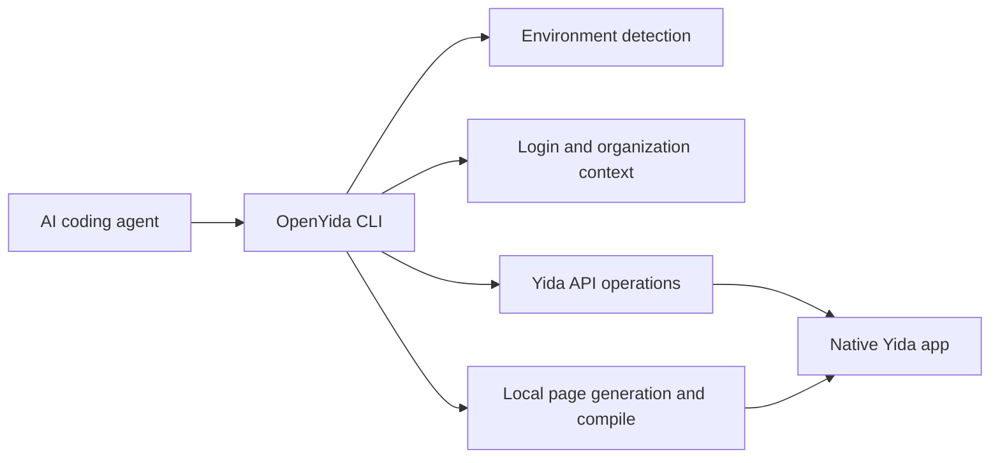

<div align="center">


# OpenYida

**AI-native CLI for building DingTalk Yida low-code applications.**

OpenYida connects AI coding agents with Yida's low-code platform, so developers can create apps, forms, workflows, custom pages, reports, integrations, and deployment configuration from a normal chat-driven development workflow.

[Quick Start](#quick-start) · [Capabilities](#capabilities) · [CLI Reference](#cli-reference) · [Examples](#examples) · [Contributing](./CONTRIBUTING.md) · [Changelog](./CHANGELOG.md)

[](https://www.npmjs.com/package/openyida)
[](https://www.npmjs.com/package/openyida)
[](https://github.com/openyida/openyida/actions/workflows/ci.yml)
[](./LICENSE)
[](https://nodejs.org)

**Documentation:** [English](https://openyida.ai/docs/en) · [简体中文](https://openyida.ai/docs) · [繁體中文](https://openyida.ai/docs/zh-Hant/) · [日本語](https://openyida.ai/docs/ja/) · [한국어](https://openyida.ai/docs/ko/) · [Français](https://openyida.ai/docs/fr/) · [Deutsch](https://openyida.ai/docs/de/) · [Español](https://openyida.ai/docs/es/) · [Português](https://openyida.ai/docs/pt/) · [Tiếng Việt](https://openyida.ai/docs/vi/) · [हिन्दी](https://openyida.ai/docs/hi/) · [العربية](https://openyida.ai/docs/ar/)

</div>

---

## What OpenYida Provides

OpenYida is a bridge between AI coding tools and Yida. It gives agents a stable command-line interface for the full application lifecycle:

| Area | What you can do |
|------|-----------------|
| Application delivery | Create, update, export, and import Yida applications |
| Form modeling | Create forms, update fields, inspect schemas, and manage permissions |
| Custom pages | Generate React-based pages, lint Yida runtime rules, compile, and publish |
| Workflow automation | Create process forms, configure approval flows, preview process instances |
| Data operations | Query form/process/task/subform data and run anomaly checks |
| Integrations | Manage HTTP connectors, connector actions, auth accounts, and automation flows |
| Operations | Diagnose environment issues, manage login state, configure sharing, upload CDN assets |

The result remains a native Yida application: teams can continue editing it in Yida, use existing enterprise security controls, and deploy through the Yida platform.

## Quick Start

### 1. Install

```bash
npm install -g openyida
```

OpenYida requires Node.js 18 or later. The package exposes both `openyida` and `yida` commands.

If Codex is already installed, OpenYida also imports a local Codex plugin during postinstall. Restart Codex after installation, then type `@宜搭` or `@openyida` in the composer to attach the OpenYida context.

### 2. Check Your Environment

Run this from the AI coding workspace where you want OpenYida to operate:

```bash
openyida env
openyida env --json
openyida commands --json
```

OpenYida detects the active agent environment, workspace path, login state, and organization context. Use `--json` when an agent needs a stable machine-readable snapshot.
`openyida commands --json` emits the command manifest used by the CLI help, so agents can inspect available routes without scraping terminal output.

### 3. Log In

```bash
openyida login
```

In Codex, Qoder, Wukong, Claude Code, OpenCode, Cursor, and other detected AI tools, OpenYida first tries local Chrome/Edge/Chromium CDP when no valid cached login exists. If local CDP is unavailable, it falls back to an AI-dialog QR handoff. The agent should render `qr_image_markdown` or paste `agent_response_markdown` directly in the conversation so the QR code is visible, then run `poll_command` after the user scans it with DingTalk. If image rendering is unavailable, fall back to `qr_url`. The explicit `openyida login --browser` command still prefers CDP first and uses Playwright as an optional browser fallback.

The explicit QR polling command remains available:

```bash
openyida login --agent-qr
```

For terminal QR login, use:

```bash
openyida login --qr
openyida login --qr --corp-id dingxxxxxxxx
openyida login --check-only --json
```

OpenYida does not install Playwright by default.

### 4. Build With an AI Agent

Ask your coding agent for a concrete Yida application or workflow:

```text
Create a CRM application in Yida with customer, contact, opportunity, and follow-up forms.
Build an IPD workflow for chip production, including approval nodes and dashboard pages.
Generate a public landing page and publish it to my Yida app.
```

The agent can then call OpenYida commands to create the application, generate source files, publish pages, and return the final Yida URLs. In Codex, Qoder, and Wukong environments, successful creation and publish commands also include a browser handoff so the agent can open the resulting Yida page in the in-app browser. Use `--open` to force this handoff or `--no-open` to suppress it.

## Wukong Installation

Wukong uses manual skill package installation instead of npm:

1. Download the latest `.zip` skill package from [GitHub Releases](https://github.com/openyida/openyida/releases).
2. Open Wukong.
3. Go to **Skill Center** > **Upload Skill** and select the downloaded package.

For Wukong terminal work, make sure its bundled Node.js path is active before running `node`, `npm`, or `npx` commands:

```bash
export PATH="$HOME/.real/.bin/node/bin:$PATH"
```

## Supported AI Coding Tools

| Tool | Support |
|------|---------|
| [Codex](https://openai.com/codex/) | Full support |
| [Claude Code](https://claude.ai/code) | Full support |
| [Aone Copilot](https://copilot.code.alibaba-inc.com) | Full support |
| [OpenCode](https://opencode.ai) | Full support |
| [Cursor](https://cursor.com/) | Full support |
| [Visual Studio Code](https://code.visualstudio.com/) | Full support |
| [Qoder](https://qoder.com) | Full support |
| [Wukong](https://dingtalk.com/wukong) | Full support |

## How It Works



OpenYida keeps platform-specific behavior inside the CLI, while agents interact with predictable commands and project files.

## Project Layout

```text
openyida/
├── bin/yida.js                 # CLI entry and command routing
├── lib/
│   ├── app/                    # Application, form, page, import/export commands
│   ├── auth/                   # Login, QR login, browser handoff, organization switch
│   ├── connector/              # HTTP connector lifecycle and smart creation
│   ├── core/                   # Environment detection, i18n, diagnostics, data commands
│   ├── process/                # Process form creation, configuration, preview
│   ├── report/                 # Yida report and chart generation
│   └── samples/                # Templates emitted by openyida sample
├── project/                    # Default workspace template for generated Yida projects
├── yida-skills/                # Source skill docs and Yida API references
└── scripts/                    # CI, packaging, and installation helpers
```

## Capabilities

### Application and Form Management

```bash
openyida create-app "CRM"
openyida create-app --name "CRM" --desc "Customer management" --theme deepBlue
openyida app-list --size 20
openyida create-form create APP_XXX "Customer" fields.json
openyida create-form update APP_XXX FORM_XXX changes.json
openyida get-schema APP_XXX FORM_XXX
openyida get-schema APP_XXX --all --output-dir .cache/schemas
```

### Custom Page Development

```bash
openyida create-page APP_XXX "Dashboard" --mode dashboard
openyida generate-page product-homepage --spec page.json --output pages/src/home.oyd.jsx --compile
openyida generate-page todo-mvc --output pages/src/todo-mvc.oyd.jsx --compile
openyida check-page pages/src/home.oyd.jsx
openyida compile pages/src/home.oyd.jsx
openyida publish pages/src/home.oyd.jsx APP_XXX FORM_XXX
```

`generate-page` turns a structured spec into a Page IR, renders a curated React 16-compatible template, writes a `.openyida-page.json` manifest, and optionally compiles the result. The manifest makes follow-up AI edits safer because agents can update known blocks instead of rewriting a large JSX file by hand.
Built-in templates currently include `product-homepage` for product/portal pages and `todo-mvc` for a full interaction smoke page covering events, custom state, list rendering, editing, filtering, and localStorage persistence.

### Workflow, Data, and Permissions

```bash
openyida create-process APP_XXX "Purchase Request" fields.json process.json
openyida configure-process APP_XXX FORM_XXX process.json
openyida process preview APP_XXX PROC_INST_XXX --output process.html
openyida data query form APP_XXX FORM_XXX --page 1 --size 20
openyida get-permission APP_XXX FORM_XXX
```

When creating or updating test data with `openyida data`, Yida date fields must use 13-digit millisecond timestamps, for example `"dateField_xxx": 1719705600000`. Do not submit `YYYY-MM-DD` strings for `DateField` or `CascadeDateField` values.

### Real Environment E2E

Most checks should stay offline, but OpenYida also includes an explicit real-environment smoke path for release and nightly validation:

```bash
OPENYIDA_E2E=1 npm run test:e2e:real
OPENYIDA_E2E=1 npm run test:e2e:real:full
npm run test:e2e:real:skills
```

The runner creates a disposable app, form, and custom page with an `OY_E2E_*` prefix, then verifies login, app listing, schema fetch, data query, and page publish. It writes a registry to `project/.cache/e2e-real/` so created resources can be audited later. To inject CI cookies without relying on a local login cache, pass `OPENYIDA_E2E_COOKIES_BASE64` as a base64 encoded cookie array or `{ "cookies": [...] }` object.

`test:e2e:real:full` extends the smoke path into a broad deterministic feature matrix: auth/env, app update, form update and option mutation, page build/compile/generate/publish, data create/get/update/query, permission read, page config and short URL check, report create/append, dashboard skill verification, export/import, batch, task-center, formula/doctor/sample/CDN config, and local connector parsing/template generation. AI-backed commands such as `flash-to-prd` are available as the optional `ai` stage because they depend on remote model availability.

`test:e2e:real:skills` enforces coverage for every directory under `yida-skills/skills/`. Each skill must be classified as real E2E, offline/unit, opt-in, or deprecated with an explicit reason. This prevents new skills from quietly bypassing the real-environment test plan.

Each successful full run leaves a human-inspectable result app in the target organization. The final step publishes a dedicated `Full E2E Dashboard` custom page, renames the app to `OY_E2E_*_PASSED` by default, and prints direct links for the app, form, dashboard page, and report; the same links are saved under `resultApp` in the registry JSON.

Useful options:

| Env var | Purpose |
|---------|---------|
| `OPENYIDA_E2E_PREFIX` | Override the disposable resource name prefix |
| `OPENYIDA_E2E_CORP_ID` | Switch to the dedicated test organization before creating resources |
| `OPENYIDA_E2E_RESULT_APP_NAME` | Override the final app name shown as the full-run result |
| `OPENYIDA_E2E_BASE_URL` | Override the Yida base URL for private deployments |
| `OPENYIDA_E2E_FIELDS_FILE` | Use a custom form fields fixture |
| `OPENYIDA_E2E_PAGE_SOURCE` | Use a custom page source for publish verification |
| `OPENYIDA_E2E_SKIP_PUBLISH=1` | Skip custom page creation and publish |
| `OPENYIDA_E2E_REGISTRY_DIR` | Write registries outside `project/.cache/e2e-real/` |
| `OPENYIDA_E2E_FULL_STAGES` | Comma-separated stage list for `test:e2e:real:full`; use `all` or omit for the default broad matrix |

Use `npm run test:e2e:real:cleanup` to list recorded disposable resources. OpenYida does not yet expose a safe app/form deletion command, so cleanup is intentionally a registry-backed audit step rather than an automatic destructive action.

### Connectors, Integrations, and Reports

```bash
openyida connector smart-create --curl "curl https://api.example.com/users"
openyida connector list
openyida integration create APP_XXX FORM_XXX "Sync customer data"
openyida create-report APP_XXX "Sales Dashboard" charts.json
openyida append-chart APP_XXX REPORT_XXX chart.json
```

## CLI Reference

Run `openyida --help` or `openyida <command> --help` for detailed usage.

### Environment and Authentication

| Command | Description |
|---------|-------------|
| `openyida env [--json]` | Detect the active AI tool environment and login state |
| `openyida env <list\|show\|switch\|add\|remove>` | Manage public/private Yida environment profiles |
| `openyida commands [--json]` | Emit the machine-readable command manifest |
| `openyida login [--qr\|--agent-qr\|--codex\|--browser] [--corp-id <corpId>]` | Log in to Yida |
| `openyida logout` | Log out or switch account |
| `openyida auth <status\|login\|refresh\|logout>` | Manage login status |
| `openyida org list` | List accessible organizations |
| `openyida org switch --corp-id <corpId>` | Switch organization without logging in again |

### Applications

| Command | Description |
|---------|-------------|
| `openyida app-list [--size N]` | List Yida applications |
| `openyida create-app "<name>"\|--name <name> [options] [--open\|--no-open]` | Create an application and output `appType` |
| `openyida update-app <appType> --name "..."` | Update application metadata |
| `openyida export <appType> [output]` | Export an application migration package |
| `openyida import <file> [name]` | Import a migration package into a target environment |

### Forms and Pages

| Command | Description |
|---------|-------------|
| `openyida create-form create <appType> "<name>" <fields.json> [--open\|--no-open]` | Create a form page |
| `openyida create-form update <appType> <formUuid> <changes.json> [--open\|--no-open]` | Update a form page |
| `openyida create-form add-option <appType> <formUuid> <fieldLabel> <option1> [option2] ...` | Append options to a SelectField/RadioField/CheckboxField/MultiSelectField |
| `openyida list-forms <appType> [--keyword <text>]` | List forms in an application |
| `openyida get-schema <appType> <formUuid\|--all> [--field <labelOrFieldId>]` | Fetch one form schema, batch export all, or pick a single field's full props |
| `openyida create-page <appType> "<name>" [--mode dashboard] [--open\|--no-open]` | Create a custom display page; dashboard mode hides top/workbench chrome |
| `openyida generate-page <template> [--spec file]` | Generate custom page source from templates (`product-homepage`, `todo-mvc`) |
| `openyida build-page <sourceFile> [--output file\|--write]` | Build/fix Yida-compatible page source from OpenYida authoring JSX |
| `openyida check-page <sourceFile> [--compat] [--json]` | Check page compatibility; `.oyd.jsx` is compatibility-built before linting |
| `openyida compile <sourceFile> [--compat]` | Compile a custom page locally; `.oyd.jsx` sources are compatibility-built first |
| `openyida publish <sourceFile> <appType> <formUuid> [--compat] [--health-check] [--open\|--no-open]` | Compile and publish a custom page |
| `openyida update-form-config <appType> <formUuid> <isRenderNav> <title>` | Update page/form display configuration |

### Data, Permissions, and Sharing

| Command | Description |
|---------|-------------|
| `openyida data <action> <resource> [args]` | Unified data management for forms, processes, tasks, and subforms |
| `openyida data check <appType> <formUuid> <rules.json>` | Detect anomalous process-form records |
| `openyida task-center <type> [options]` | Query todo, created, processed, CC, or proxy-submitted tasks |
| `openyida get-permission <appType> <formUuid>` | Query form permission configuration |
| `openyida save-permission <appType> <formUuid> [options]` | Save form permission configuration |
| `openyida corp-manager <sub-command>` | Manage platform admins, sub-admins, app admins, and address book visibility |
| `openyida verify-short-url <appType> <formUuid> <url>` | Verify a short URL |
| `openyida save-share-config <appType> <formUuid> <url> <isOpen> [openAuth]` | Save public access or sharing configuration |
| `openyida get-page-config <appType> <formUuid>` | Query public access or sharing configuration |

### Workflow, Reports, and Integrations

| Command | Description |
|---------|-------------|
| `openyida create-process <appType> ...` | Create a process form and configure workflow |
| `openyida configure-process <appType> ...` | Configure and publish process rules |
| `openyida process preview <appType> <processInstanceId> [--output <path>]` | Generate a visual process preview |
| `openyida create-report <appType> "<name>" <charts.json> [--open\|--no-open]` | Create a Yida report |
| `openyida append-chart <appType> <reportId> <charts.json> [--open\|--no-open]` | Append a chart to an existing report |
| `openyida connector <sub-command>` | Manage HTTP connectors, actions, tests, and auth accounts |
| `openyida integration create <appType> <formUuid> <flowName> [options]` | Create an integration automation flow |
| `openyida integration list <appType> [--form-uuid <uuid>] [--status y\|n] [--json]` | List automation flows in an app, optionally filtered by form/status |
| `openyida integration enable <appType> <formUuid> <processCode>` | Enable an automation flow |
| `openyida integration disable <appType> <formUuid> <processCode>` | Disable an automation flow |
| `openyida dws <command> [args]` | Access DingTalk CLI capabilities such as contacts, calendar, todo, and approval |
| `openyida dingtalk-link <url> [--target fullScreen] [--legacy-scheme] [--json]` | Generate DingTalk AppLink URLs for opening pages in DingTalk; use `--legacy-scheme` only when old `dingtalk://` links are required |

### Utilities

| Command | Description |
|---------|-------------|
| `openyida copy [--force]` | Initialize the local `project/` workspace |
| `openyida sample [--list]` | Emit sample templates |
| `openyida doctor [--fix]` | Diagnose and repair environment issues |
| `openyida formula evaluate <formula\|file> [--schema file]` | Static-check formula syntax and field references |
| `openyida update` | Update OpenYida through npm |
| `openyida export-conversation [options]` | Export AI conversation history |
| `openyida flash-to-prd --file <path> --name "<project>"` | Convert flash notes or meeting notes into a PRD prompt |
| `openyida cdn-config` | Configure image upload to Aliyun OSS/CDN |
| `openyida cdn-upload <image-path>` | Upload an image to CDN |
| `openyida cdn-refresh [options]` | Refresh CDN cache |
| `openyida batch <file> [--stop-on-error] [--json]` | Run multiple commands from a file (one login, sequential execution) |
| `openyida batch --commands "cmd1 ; cmd2" [--stop-on-error] [--json]` | Run inline batch commands |

## Agent Skills

The `yida-skills/` directory is the source skill library used by OpenYida during development. Release assets for Wukong are generated by `npm run build:skills`: the expanded package is written to `dist/skills/openyida/`, and the upload-ready zip is written to `openyida-skills.zip`.

| Path | Purpose |
|------|---------|
| `yida-skills/SKILL.md` | Entry point and skill index |
| `yida-skills/skills/` | Self-contained sub-skills for app, form, process, page, data, and integration work |
| `yida-skills/references/` | Shared Yida API, model API, and query-condition references |
| `dist/skills/openyida/` | Generated Wukong upload package root; contains one root `SKILL.md` and reference-only subskill docs |
| `openyida-skills.zip` | Generated Wukong upload package; upload this file in Wukong |

When OpenYida is used inside a supported AI coding environment, these skills help the agent choose the right command sequence and file conventions.

For Wukong manual import, upload the generated `openyida-skills.zip`. The package follows Wukong's custom skill rules: folder name and `frontmatter.name` are both `openyida`, root frontmatter only contains `name` and `description`, and long references live under `references/`.

For Codex, `npm install -g openyida` additionally creates a local plugin marketplace under `~/.openyida/codex-plugin` and enables `openyida@openyida` in `~/.codex/config.toml` when Codex is detected. This makes OpenYida show up in Codex's `@` plugin menu as **宜搭** after Codex reloads.

## Examples

### Business Systems: IPD and CRM

Describe your requirements in one sentence; the agent can create a complete multi-form Yida application.


### Custom Pages and Utilities


### Interactive Campaigns


## Common Prompts

```text
Build a Yida application for [business scenario].
Generate an app from this requirements document.
Create a [name] form page with these fields.
Add a required [field type] field named [field name] to [form name].
Publish this custom page to the Yida app.
Make this page publicly accessible.
Export the application as a migration package.
```

## OpenClaw Integration

Use OpenYida through [yida-app](https://clawhub.ai/nicky1108/yida-app) in OpenClaw:

```bash
npx clawhub@latest install nicky1108/yida-app
```

## Development

```bash
git clone https://github.com/openyida/openyida.git
cd openyida
npm install
npm run check:ci
```

Useful checks:

| Command | Purpose |
|---------|---------|
| `npm test` | Run Jest tests |
| `npm run lint` | Run ESLint |
| `npm run check:syntax` | Validate JavaScript syntax |
| `npm run check:structure` | Validate project structure |
| `npm run check:package` | Validate npm package contents |

When adding new CLI commands, register the route in `bin/yida.js`, add it to `lib/core/command-manifest.js`, update user-facing documentation here, and keep agent skills in `yida-skills/` aligned when the workflow changes.

## Security and Configuration

- Login cookies are cached locally and should never be hard-coded into source files.
- Private deployment environments are managed through `lib/core/env-manager.js`.
- Yida API requests should use the active environment base URL and authenticated cookies.
- For multi-organization accounts, prefer explicit `--corp-id` values in non-interactive automation.

## Community

Scan the QR code to join the OpenYida DingTalk user group for updates and support.


## Contributors

Thanks to everyone who has contributed to OpenYida. Read the [Contributing Guide](./CONTRIBUTING.md) to get involved.

<!-- openyida-contributors:start -->

<p>
  <a href="https://github.com/yize"></a>
  <a href="https://github.com/alex-mm"></a>
  <a href="https://github.com/nicky1108"></a>
  <a href="https://github.com/angelinheys"></a>
  <a href="https://github.com/yipengmu"></a>
  <a href="https://github.com/Waawww"></a>
  <a href="https://github.com/kangjiano"></a>
  <a href="https://github.com/ElZe98"></a>
  <a href="https://github.com/OAHyuhao"></a>
  <a href="https://github.com/xiaofu704"></a>
  <a href="https://github.com/guchenglin111"></a>
  <a href="https://github.com/liug0911"></a>
  <a href="https://github.com/sunliz-xiuli"></a>
  <a href="https://github.com/M12REDX"></a>
  <a href="https://github.com/key-668"></a>
  <a href="https://github.com/dongbeixiaohuo"></a>
  <a href="https://github.com/nandanadileep"></a>
</p>

<!-- openyida-contributors:end -->

## License

[MIT](./LICENSE) © 2026 Alibaba Group Holding Limited
